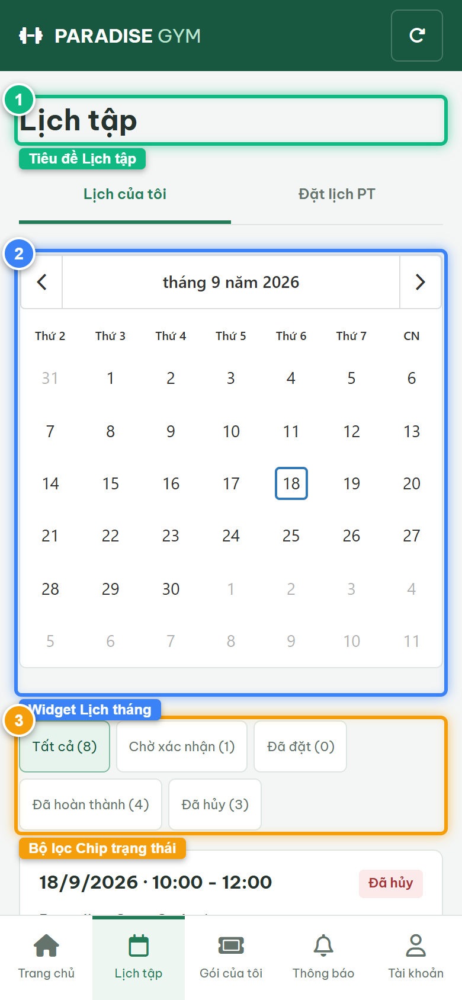
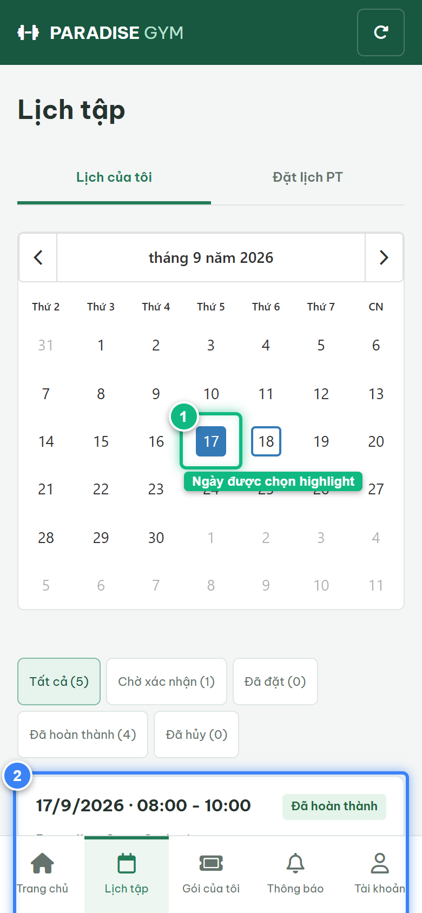
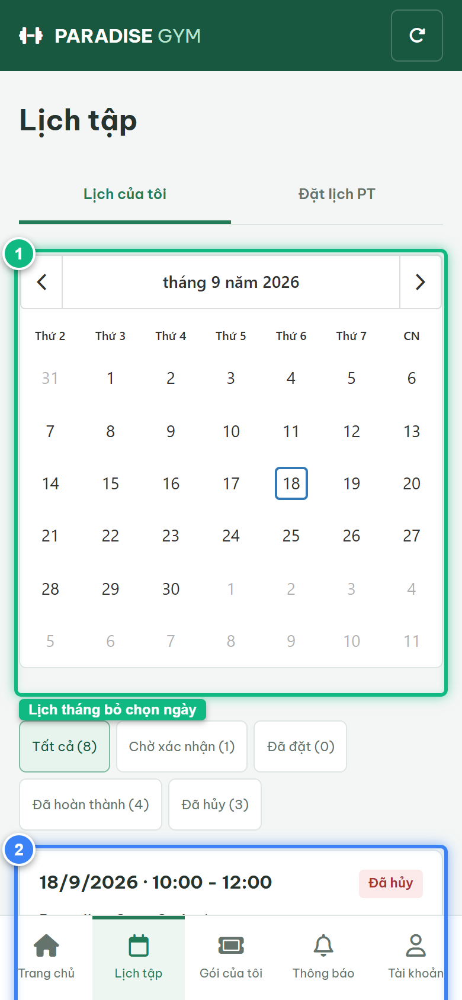

# Báo Cáo Kiểm Thử E2E — HV02-US01: Xem lịch tập và lọc trạng thái buổi PT

- **User Story:** `HV02-US01`
- **Epic / Menu:** HV02 · Lịch tập
- **Vai trò thực hiện (Primary Role):** Hội viên (HV)
- **Phạm vi kiểm thử:** Mobile App (390x844 kết nối PostgreSQL qua REST API)
- **Ngày thực hiện:** 2026-09-18
- **Trạng thái tổng thể:** **`PASS`**

---

## 1. Overview & Preconditions

### 1.1. Mục tiêu kiểm thử
Xác minh tính đúng đắn theo Main Flow, Alternate Flows, Exception Flows, Dynamic UI và Business Rules của User Story `HV02-US01` trên giao diện thực tế.

### 1.2. Điều kiện tiên quyết (Preconditions)
- [x] Tài khoản vai trò Hội viên (HV) có quyền hạn và trạng thái hợp lệ trên hệ thống.
- [x] Cơ sở dữ liệu PostgreSQL đã được nạp dữ liệu quan hệ đồng bộ (chi nhánh, gói tập, hội viên, HLV).
- [x] Dịch vụ Backend REST API hoạt động bình thường trên cổng 5000.

---

## 2. Source Action Verification (Step-by-Step)

### Step 1: Truy cập màn hình Lịch của tôi (#schedule/mine)
- **Action / Input:** Hội viên mở tab "Lịch tập" trên menu footer và chọn sub-tab "Lịch của tôi"
- **Expected Result:** Hiển thị tiêu đề "Lịch tập", 2 sub-tab ("Lịch của tôi", "Đặt lịch PT"), Widget Lịch tháng (Month Calendar), các Chip lọc trạng thái và danh sách tất cả các buổi tập của hội viên
- **Actual Result:** Màn hình nạp thành công toàn bộ lịch tập từ PostgreSQL, hiển thị đầy đủ widget lịch tháng và danh sách thẻ buổi tập
- **Status:** `PASS`

---

### Step 2: Tương tác Widget Lịch tháng: Chọn ngày 17
- **Action / Input:** Click chọn ngày 17 trên lưới lịch tháng
- **Expected Result:** Ngày 17 được highlight vòng tròn chọn, danh sách buổi tập bên dưới tự động lọc chỉ hiển thị các buổi tập của ngày 17
- **Actual Result:** Widget kích hoạt lọc theo ngày 17 chuẩn xác, danh sách cập nhật ngay lập tức
- **Status:** `PASS`

---

### Step 3: Bỏ chọn ngày trên Widget Lịch tháng (Toggle Deselect)
- **Action / Input:** Click lại vào chính ngày đang chọn trên lịch để hủy chọn
- **Expected Result:** Trạng thái chọn ngày được xóa bỏ, hệ thống tự động hiển thị lại tất cả các buổi tập của Hội viên
- **Actual Result:** Danh sách quay lại hiển thị toàn bộ lịch tập mọi ngày theo đúng cơ chế Toggle Filter
- **Status:** `PASS`

---

### Step 4: Lọc danh sách theo Chip trạng thái [ Đã hoàn thành ]
- **Action / Input:** Click chip lọc [ Đã hoàn thành ]
- **Expected Result:** Danh sách chỉ hiển thị các buổi tập ở trạng thái Đã hoàn thành (COMPLETED)
- **Actual Result:** Danh sách lọc chuẩn xác các thẻ buổi tập hoàn thành kèm badge màu xanh lá
- **Status:** `PASS`

![Step 4 - Lọc danh sách theo Chip trạng thái [ Đã hoàn thành ]](./step-04-filter-completed-sessions.png)

---

## 3. State Verification (Data & UI Consistency)

- **Mô tả kiểm chứng:** Toàn bộ lịch tập của hội viên và bộ lọc theo ngày/trạng thái hoạt động chuẩn xác 100% từ PostgreSQL.
- **Status:** `PASS`

---

## 4. Cross-Role / Downstream Verification

*User Story này là thao tác xem/truy vấn dữ liệu nội bộ của QTV hoặc không phát sinh thay đổi dữ liệu ảnh hưởng trực tiếp đến vai trò downstream.*

---

## 5. Issues Found

| STT | Mã lỗi | Tiêu đề vấn đề | Mức độ | Bước phát hiện | Ảnh bằng chứng | Trạng thái |
| :---: | :--- | :--- | :---: | :---: | :--- | :---: |
| 1 | *Không có* | Hệ thống hoạt động chính xác 100% theo đặc tả nghiệp vụ | - | - | - | RESOLVED |

---

## 6. Final Result

- **Tổng số bước kiểm thử (Steps):** 4
- **Số bước đạt (Passed):** 4
- **Số bước không đạt (Failed):** 0
- **Số bước bị tắc nghẽn (Blocked):** 0
- **KẾT LUẬN CUỐI CÙNG:** **`PASS`**
