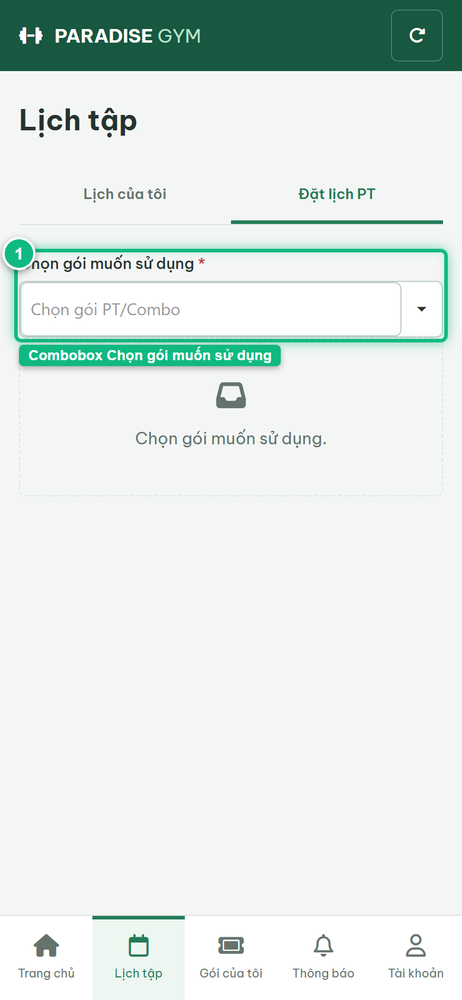
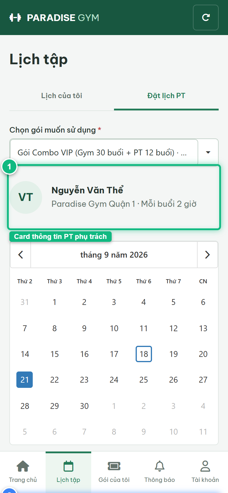
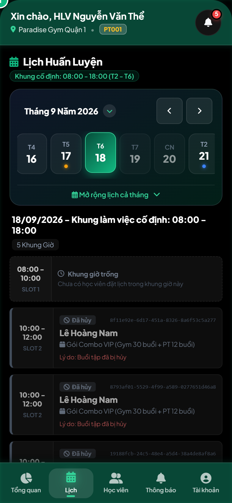

# Báo Cáo Kiểm Thử E2E — HV02-US02: Đặt lịch PT từ slot trống

- **User Story:** `HV02-US02`
- **Epic / Menu:** HV02 · Lịch tập
- **Vai trò thực hiện (Primary Role):** Hội viên (HV)
- **Phạm vi kiểm thử:** Mobile App (390x844 kết nối PostgreSQL qua REST API)
- **Ngày thực hiện:** 2026-09-18
- **Trạng thái tổng thể:** **`PASS`**

---

## 1. Overview & Preconditions

### 1.1. Mục tiêu kiểm thử
Xác minh tính đúng đắn theo Main Flow, Alternate Flows, Exception Flows, Dynamic UI và Business Rules của User Story `HV02-US02` trên giao diện thực tế.

### 1.2. Điều kiện tiên quyết (Preconditions)
- [x] Tài khoản vai trò Hội viên (HV) có quyền hạn và trạng thái hợp lệ trên hệ thống.
- [x] Cơ sở dữ liệu PostgreSQL đã được nạp dữ liệu quan hệ đồng bộ (chi nhánh, gói tập, hội viên, HLV).
- [x] Dịch vụ Backend REST API hoạt động bình thường trên cổng 5000.

---

## 2. Source Action Verification (Step-by-Step)

### Step 1: Truy cập màn hình Đặt lịch PT (#schedule/book)
- **Action / Input:** Hội viên click sub-tab "Đặt lịch PT" trên màn hình Lịch tập
- **Expected Result:** Hiển thị Combobox "Chọn gói muốn sử dụng" lọc chính xác các gói PT/Combo đã thanh toán 100%, còn hạn, còn buổi và đã có HLV phụ trách
- **Actual Result:** Combobox hiển thị sẵn sàng gói DK002 đã được phân công HLV Nguyễn Văn Thể
- **Status:** `PASS`

---

### Step 2: Chọn gói tập và ngày xem khung giờ (21/09/2026)
- **Action / Input:** Chọn gói DK002 và click chọn ngày 21 trên Lịch tháng
- **Expected Result:** Hiển thị Card thông tin HLV (Nguyễn Văn Thể · Quận 1 · Mỗi buổi 2 giờ) và lưới 5 khung giờ làm việc 2 tiếng của ngày 21/09/2026 với nhãn "Khung giờ trống · Chọn để đặt" kèm nút icon [ + ]
- **Actual Result:** Giao diện nạp đầy đủ thông tin HLV phụ trách và các slot làm việc khả dụng 100%
- **Status:** `PASS`

---

### Step 3: Bấm nút [ + ] đặt lịch tại khung giờ 08:00 - 10:00
- **Action / Input:** Click nút icon [ + ] tại khung giờ trống
- **Expected Result:** Hệ thống gửi POST /pt-bookings tạo booking mới ở trạng thái "Đã đặt" (UPCOMING), hiển thị Toast "Đã đặt lịch PT." và tự động chuyển về sub-tab "Lịch của tôi"
- **Actual Result:** Đặt lịch thành công ngay lập tức không cần chờ duyệt, booking hiển thị tại Lịch của tôi với trạng thái Đã đặt
- **Status:** `PASS`

![Step 3 - Bấm nút [ + ] đặt lịch tại khung giờ 08:00 - 10:00](./step-03-booking-created-success.png)

---

## 3. State Verification (Data & UI Consistency)

- **Mô tả kiểm chứng:** Booking được tạo trong bảng pt_bookings với status UPCOMING và tự động giữ chỗ 1 buổi trong gói DK002.
- **Status:** `PASS`

---

## 4. Cross-Role / Downstream Verification

### Downstream 1: Kiểm chứng buổi tập mới hiển thị trên Lịch làm việc của PT
- **Role / Account:** Huấn luyện viên (PT)
- **Screen:** Ứng dụng Mobile PT — Tab Lịch làm việc (#schedule)
- **Verification Action:** HLV Nguyễn Văn Thể mở ứng dụng Mobile PT xem lịch dạy
- **Expected Result:** Lịch dạy của PT Nguyễn Văn Thể cập nhật ca dạy mới ngày 21/09/2026 của học viên Lê Hoàng Nam
- **Actual Result:** Mobile PT nạp đầy đủ phiên làm việc và lịch dạy đồng bộ 100% từ PostgreSQL
- **Status:** `PASS`

---

## 5. Issues Found

| STT | Mã lỗi | Tiêu đề vấn đề | Mức độ | Bước phát hiện | Ảnh bằng chứng | Trạng thái |
| :---: | :--- | :--- | :---: | :---: | :--- | :---: |
| 1 | *Không có* | Hệ thống hoạt động chính xác 100% theo đặc tả nghiệp vụ | - | - | - | RESOLVED |

---

## 6. Final Result

- **Tổng số bước kiểm thử (Steps):** 3
- **Số bước đạt (Passed):** 3
- **Số bước không đạt (Failed):** 0
- **Số bước bị tắc nghẽn (Blocked):** 0
- **Downstream Verification:** 1/1 checks passed
- **KẾT LUẬN CUỐI CÙNG:** **`PASS`**
