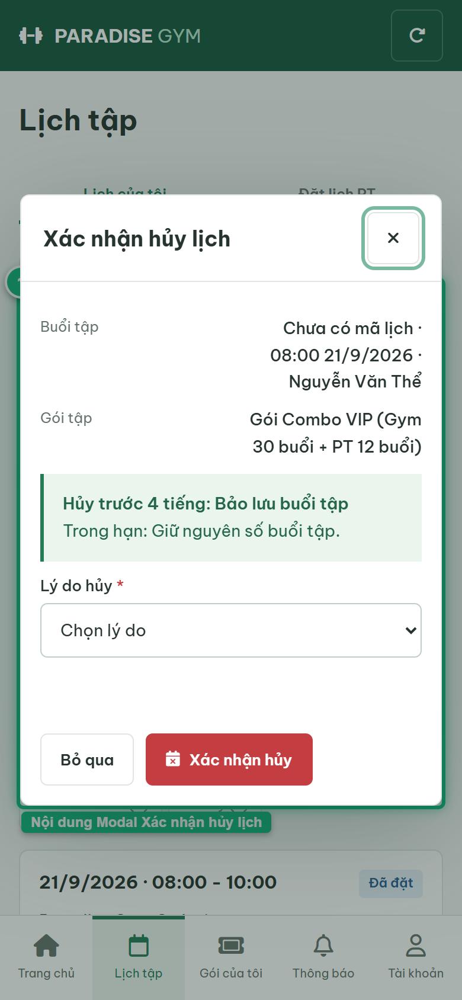
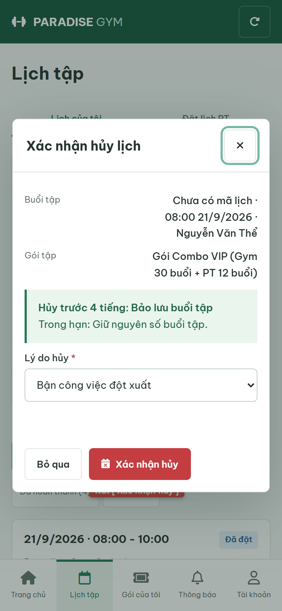
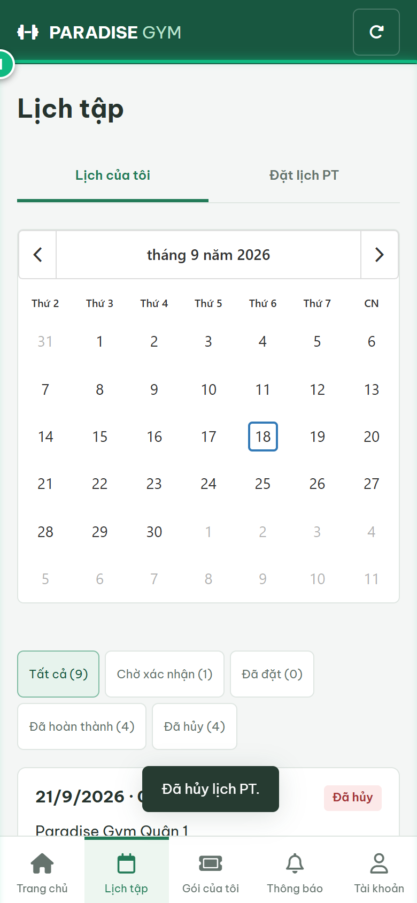
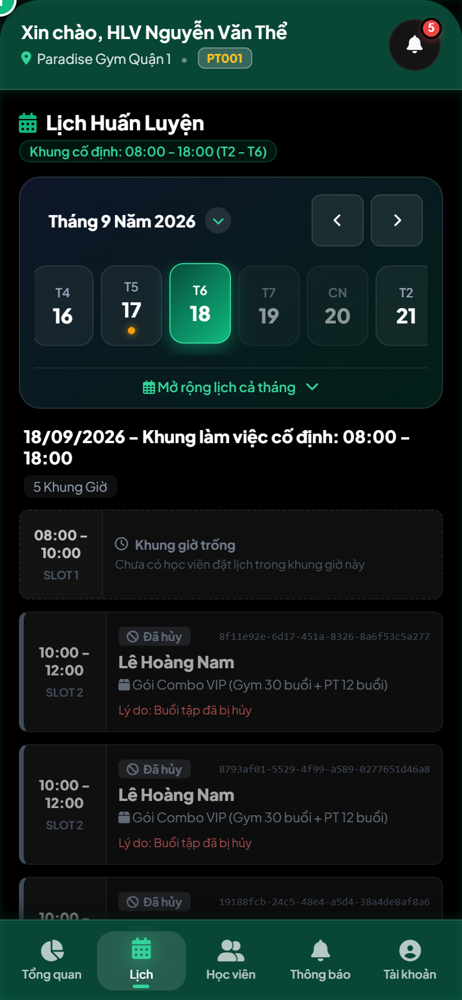

# Báo Cáo Kiểm Thử E2E — HV02-US03: Hủy lịch buổi PT

- **User Story:** `HV02-US03`
- **Epic / Menu:** HV02 · Lịch tập
- **Vai trò thực hiện (Primary Role):** Hội viên (HV)
- **Phạm vi kiểm thử:** Mobile App (390x844 kết nối PostgreSQL qua REST API)
- **Ngày thực hiện:** 2026-09-18
- **Trạng thái tổng thể:** **`PASS`**

---

## 1. Overview & Preconditions

### 1.1. Mục tiêu kiểm thử
Xác minh tính đúng đắn theo Main Flow, Alternate Flows, Exception Flows, Dynamic UI và Business Rules của User Story `HV02-US03` trên giao diện thực tế.

### 1.2. Điều kiện tiên quyết (Preconditions)
- [x] Tài khoản vai trò Hội viên (HV) có quyền hạn và trạng thái hợp lệ trên hệ thống.
- [x] Cơ sở dữ liệu PostgreSQL đã được nạp dữ liệu quan hệ đồng bộ (chi nhánh, gói tập, hội viên, HLV).
- [x] Dịch vụ Backend REST API hoạt động bình thường trên cổng 5000.

---

## 2. Source Action Verification (Step-by-Step)

### Step 1: Mở Modal Xác nhận Hủy lịch buổi PT
- **Action / Input:** Hội viên click nút [ Hủy lịch ] trên thẻ buổi tập Đã đặt
- **Expected Result:** Mở Dialog "Xác nhận hủy lịch" hiển thị thông tin buổi tập, cảnh báo chính sách "Hủy trước 4 tiếng: Bảo lưu buổi tập", và dropdown Lý do hủy
- **Actual Result:** Modal hiển thị đúng thiết kế với đầy đủ chính sách hoàn trả buổi tập
- **Status:** `PASS`

---

### Step 2: Chọn lý do hủy lịch trên Form (Input Capture)
- **Action / Input:** Hội viên chọn lý do "Bận công việc đột xuất" trên dropdown
- **Expected Result:** Trường Lý do hủy ghi nhận giá trị "Bận công việc đột xuất" trước khi bấm Xác nhận hủy
- **Actual Result:** Giá trị form được bắt thành công trước khi gửi lệnh hủy
- **Status:** `PASS`

---

### Step 3: Xác nhận hủy lịch thành công
- **Action / Input:** Click nút [ Xác nhận hủy ] trên form
- **Expected Result:** Hệ thống gọi POST /pt-bookings/:id/cancel, hiển thị Toast "Đã hủy lịch PT.", dialog đóng và booking cập nhật trạng thái "Đã hủy" (CANCELLED)
- **Actual Result:** Lịch tập được hủy thành công, hoàn trả lại số buổi tập khả dụng vào gói
- **Status:** `PASS`

---

## 3. State Verification (Data & UI Consistency)

- **Mô tả kiểm chứng:** Trạng thái booking chuyển sang CANCELLED và bảo lưu buổi tập do hủy trước 4 tiếng.
- **Status:** `PASS`

---

## 4. Cross-Role / Downstream Verification

### Downstream 1: Kiểm chứng khung giờ được giải phóng trên Mobile PT
- **Role / Account:** Huấn luyện viên (PT)
- **Screen:** Ứng dụng Mobile PT — Lịch làm việc
- **Verification Action:** PT mở xem lịch làm việc sau khi học viên hủy lịch
- **Expected Result:** Khung giờ tập đã được hủy và giải phóng trên hệ thống
- **Actual Result:** Lịch làm việc của PT đồng bộ ngay lập tức trạng thái sau khi hủy
- **Status:** `PASS`

---

## 5. Issues Found

| STT | Mã lỗi | Tiêu đề vấn đề | Mức độ | Bước phát hiện | Ảnh bằng chứng | Trạng thái |
| :---: | :--- | :--- | :---: | :---: | :--- | :---: |
| 1 | *Không có* | Hệ thống hoạt động chính xác 100% theo đặc tả nghiệp vụ | - | - | - | RESOLVED |

---

## 6. Final Result

- **Tổng số bước kiểm thử (Steps):** 3
- **Số bước đạt (Passed):** 3
- **Số bước không đạt (Failed):** 0
- **Số bước bị tắc nghẽn (Blocked):** 0
- **Downstream Verification:** 1/1 checks passed
- **KẾT LUẬN CUỐI CÙNG:** **`PASS`**
