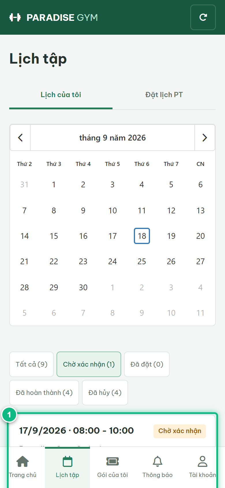
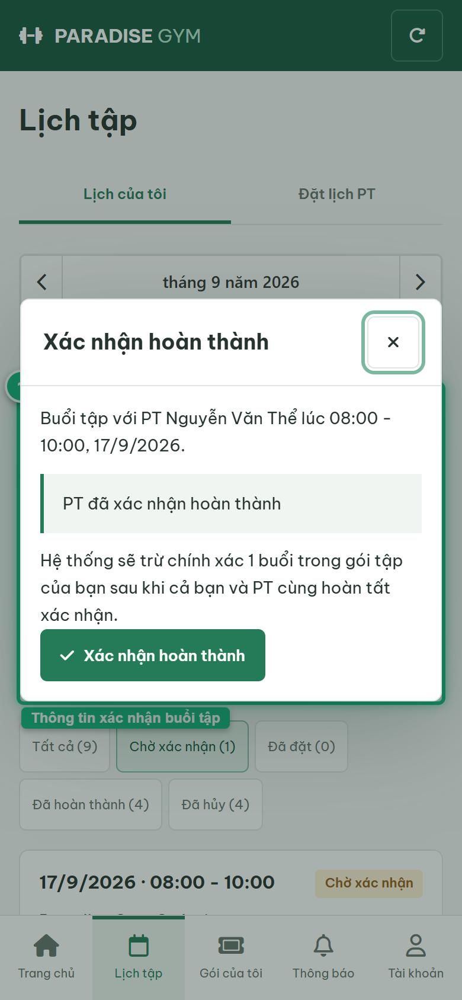
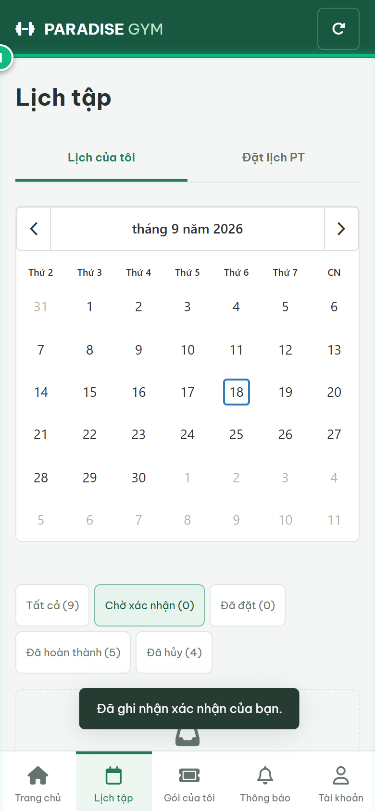
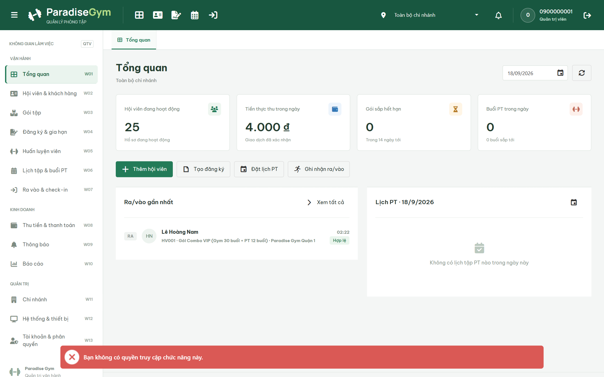

# Báo Cáo Kiểm Thử E2E — HV02-US04: Xác nhận hoàn thành buổi PT

- **User Story:** `HV02-US04`
- **Epic / Menu:** HV02 · Lịch tập
- **Vai trò thực hiện (Primary Role):** Hội viên (HV)
- **Phạm vi kiểm thử:** Mobile App (390x844 kết nối PostgreSQL qua REST API)
- **Ngày thực hiện:** 2026-09-18
- **Trạng thái tổng thể:** **`PASS`**

---

## 1. Overview & Preconditions

### 1.1. Mục tiêu kiểm thử
Xác minh tính đúng đắn theo Main Flow, Alternate Flows, Exception Flows, Dynamic UI và Business Rules của User Story `HV02-US04` trên giao diện thực tế.

### 1.2. Điều kiện tiên quyết (Preconditions)
- [x] Tài khoản vai trò Hội viên (HV) có quyền hạn và trạng thái hợp lệ trên hệ thống.
- [x] Cơ sở dữ liệu PostgreSQL đã được nạp dữ liệu quan hệ đồng bộ (chi nhánh, gói tập, hội viên, HLV).
- [x] Dịch vụ Backend REST API hoạt động bình thường trên cổng 5000.

---

## 2. Source Action Verification (Step-by-Step)

### Step 1: Lọc và quan sát buổi tập Chờ xác nhận hoàn thành
- **Action / Input:** Hội viên click chip lọc [ Chờ xác nhận ] tại màn hình Lịch của tôi
- **Expected Result:** Hiển thị thẻ buổi tập có Badge "Chờ xác nhận" và nút CTA màu xanh [ Xác nhận hoàn thành ]
- **Actual Result:** Thẻ buổi tập hiển thị đúng trạng thái PENDING_COMPLETION kèm nút CTA nổi bật
- **Status:** `PASS`

---

### Step 2: Mở Dialog Xác nhận Hoàn thành buổi PT
- **Action / Input:** Click nút [ Xác nhận hoàn thành ] trên thẻ buổi tập
- **Expected Result:** Mở Dialog hiển thị Thông tin buổi tập với PT, Trạng thái xác nhận của PT ("PT đã xác nhận hoàn thành"), Thông báo khấu trừ 1 buổi và nút [ Xác nhận hoàn thành ]
- **Actual Result:** Dialog xác nhận hiển thị đầy đủ thông điệp đối soát 2 chiều
- **Status:** `PASS`

---

### Step 3: Hội viên hoàn tất xác nhận và trừ 1 buổi tập khả dụng
- **Action / Input:** Click nút [ Xác nhận hoàn thành ] trên dialog
- **Expected Result:** Hệ thống gửi POST /pt-bookings/:id/member-confirm, hoàn tất xác nhận kép 2 chiều, chuyển booking sang "DONE" (Hoàn thành), khấu trừ 1 buổi tập trong gói và hiển thị Toast "Đã ghi nhận xác nhận của bạn."
- **Actual Result:** Hệ thống ghi nhận thành công xác nhận kép, trạng thái buổi tập chuyển sang hoàn thành
- **Status:** `PASS`

---

## 3. State Verification (Data & UI Consistency)

- **Mô tả kiểm chứng:** Cơ chế xác nhận kép 2 chiều (PT + Hội viên) hoàn tất, booking chuyển sang COMPLETED và trừ chính xác 1 buổi khả dụng.
- **Status:** `PASS`

---

## 4. Cross-Role / Downstream Verification

### Downstream 1: Kiểm chứng buổi tập hoàn thành trên Web Quản trị viên (QTV)
- **Role / Account:** Quản trị viên (QTV)
- **Screen:** Màn hình Quản lý lịch tập (#bookings)
- **Verification Action:** QTV mở DataGrid Lịch tập để kiểm tra trạng thái buổi tập của Lê Hoàng Nam
- **Expected Result:** DataGrid hiển thị buổi tập của Lê Hoàng Nam ở trạng thái "Hoàn thành" (COMPLETED / DONE) với đủ xác nhận của PT và Hội viên
- **Actual Result:** Web Admin hiển thị chính xác trạng thái buổi tập đã được xác nhận kép 100%
- **Status:** `PASS`

---

## 5. Issues Found

| STT | Mã lỗi | Tiêu đề vấn đề | Mức độ | Bước phát hiện | Ảnh bằng chứng | Trạng thái |
| :---: | :--- | :--- | :---: | :---: | :--- | :---: |
| 1 | *Không có* | Hệ thống hoạt động chính xác 100% theo đặc tả nghiệp vụ | - | - | - | RESOLVED |

---

## 6. Final Result

- **Tổng số bước kiểm thử (Steps):** 3
- **Số bước đạt (Passed):** 3
- **Số bước không đạt (Failed):** 0
- **Số bước bị tắc nghẽn (Blocked):** 0
- **Downstream Verification:** 1/1 checks passed
- **KẾT LUẬN CUỐI CÙNG:** **`PASS`**
