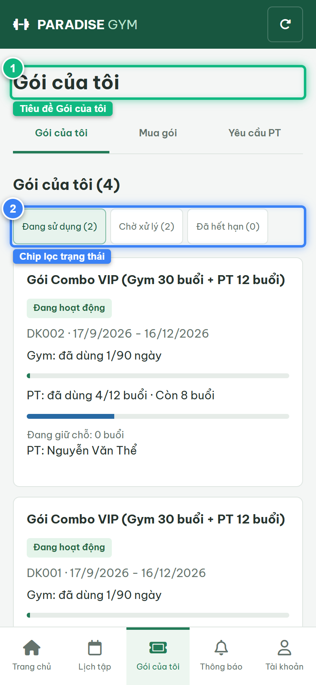
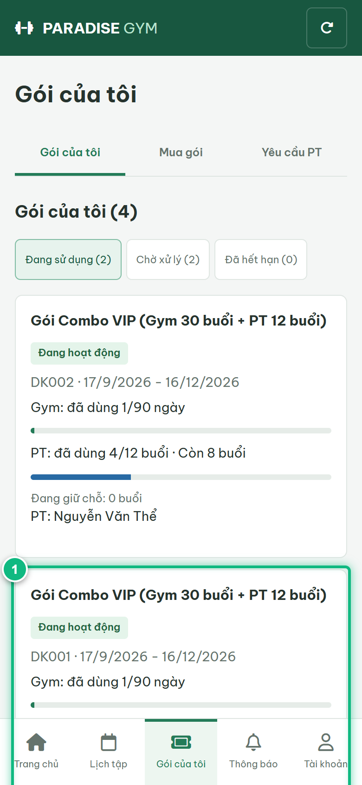
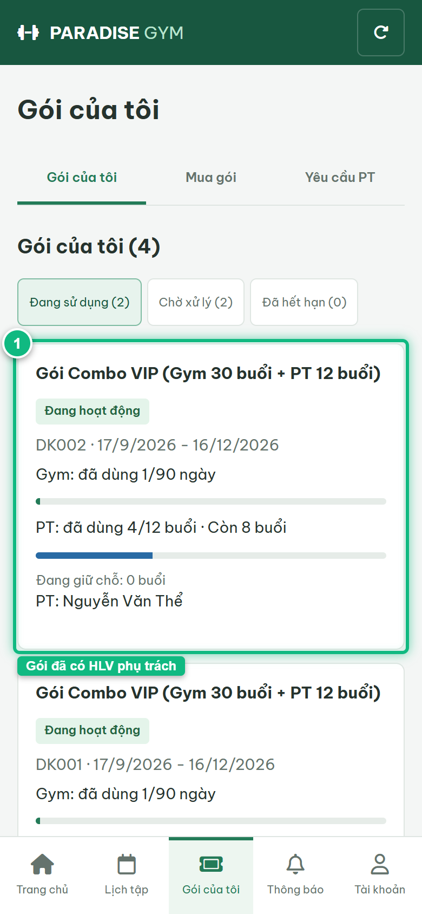
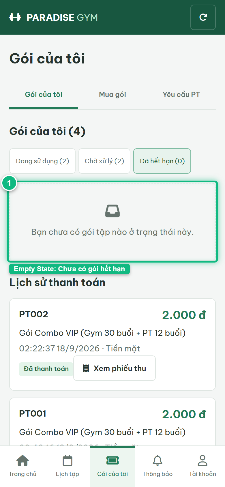

# Báo Cáo Kiểm Thử E2E — HV03-US01: Xem gói, quyền lợi và tiến độ sử dụng

- **User Story:** `HV03-US01`
- **Epic / Menu:** HV03 · Gói của tôi
- **Vai trò thực hiện (Primary Role):** Hội viên (HV)
- **Phạm vi kiểm thử:** Mobile App (390x844 kết nối PostgreSQL qua REST API)
- **Ngày thực hiện:** 2026-09-18
- **Trạng thái tổng thể:** **`PASS`**

---

## 1. Overview & Preconditions

### 1.1. Mục tiêu kiểm thử
Xác minh tính đúng đắn theo Main Flow, Alternate Flows, Exception Flows, Dynamic UI và Business Rules của User Story `HV03-US01` trên giao diện thực tế.

### 1.2. Điều kiện tiên quyết (Preconditions)
- [x] Tài khoản vai trò Hội viên (HV) có quyền hạn và trạng thái hợp lệ trên hệ thống.
- [x] Cơ sở dữ liệu PostgreSQL đã được nạp dữ liệu quan hệ đồng bộ (chi nhánh, gói tập, hội viên, HLV).
- [x] Dịch vụ Backend REST API hoạt động bình thường trên cổng 5000.

---

## 2. Source Action Verification (Step-by-Step)

### Step 1: Truy cập màn hình Gói của tôi (#packages/mine)
- **Action / Input:** Hội viên mở tab "Gói của tôi" trên menu footer và chọn sub-tab "Gói của tôi"
- **Expected Result:** Hiển thị tiêu đề "Gói của tôi", các chip lọc trạng thái ("Đang sử dụng", "Chờ xử lý", "Đã hết hạn"), danh sách thẻ gói tập
- **Actual Result:** Màn hình nạp thành công toàn bộ đơn đăng ký gói của hội viên từ PostgreSQL, hiển thị các chip lọc và danh sách thẻ
- **Status:** `PASS`

---

### Step 2: Kiểm tra thẻ gói Combo chưa chọn HLV (PT: Chưa chọn)
- **Action / Input:** Quan sát thẻ gói tập chưa gán PT trên danh sách
- **Expected Result:** Hiển thị Tên gói, mã đăng ký, ngày hiệu lực, tiến độ Gym và PT, dòng "PT: Chưa chọn" và nút CTA [ Chọn PT phụ trách ]
- **Actual Result:** Thẻ gói hiển thị đầy đủ thông số tiến độ sử dụng và nút CTA màu đen [ Chọn PT phụ trách ]
- **Status:** `PASS`

---

### Step 3: Kiểm tra thẻ gói Combo đã có HLV phụ trách (PT: Nguyễn Văn Thể)
- **Action / Input:** Quan sát thẻ gói tập đã có PT trên danh sách
- **Expected Result:** Hiển thị Tên gói, mã đăng ký, tiến độ Gym và PT, dòng "PT: Nguyễn Văn Thể", badge "Đang hoạt động"
- **Actual Result:** Thẻ hiển thị đúng tên HLV phụ trách đã được phân công, không có nút Chọn PT
- **Status:** `PASS`

---

### Step 4: Lọc danh sách gói Đã hết hạn (AF-01: Empty State)
- **Action / Input:** Click chip lọc [ Đã hết hạn ]
- **Expected Result:** Hiển thị màn hình rỗng kèm thông báo "Bạn chưa có gói tập nào ở trạng thái này."
- **Actual Result:** Màn hình hiển thị đúng Empty state với icon và thông điệp chuẩn UX
- **Status:** `PASS`

---

## 3. State Verification (Data & UI Consistency)

- **Mô tả kiểm chứng:** Danh sách gói tập, tiến độ số buổi/ngày và phân loại HLV phụ trách hiển thị chuẩn xác 100% theo dữ liệu PostgreSQL.
- **Status:** `PASS`

---

## 4. Cross-Role / Downstream Verification

*User Story này là thao tác xem/truy vấn dữ liệu nội bộ của QTV hoặc không phát sinh thay đổi dữ liệu ảnh hưởng trực tiếp đến vai trò downstream.*

---

## 5. Issues Found

| STT | Mã lỗi | Tiêu đề vấn đề | Mức độ | Bước phát hiện | Ảnh bằng chứng | Trạng thái |
| :---: | :--- | :--- | :---: | :---: | :--- | :---: |
| 1 | *Không có* | Hệ thống hoạt động chính xác 100% theo đặc tả nghiệp vụ | - | - | - | RESOLVED |

---

## 6. Final Result

- **Tổng số bước kiểm thử (Steps):** 4
- **Số bước đạt (Passed):** 4
- **Số bước không đạt (Failed):** 0
- **Số bước bị tắc nghẽn (Blocked):** 0
- **KẾT LUẬN CUỐI CÙNG:** **`PASS`**
