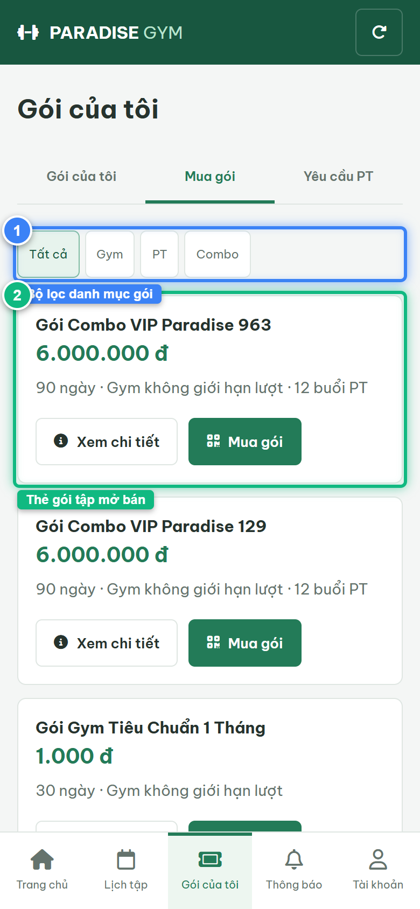
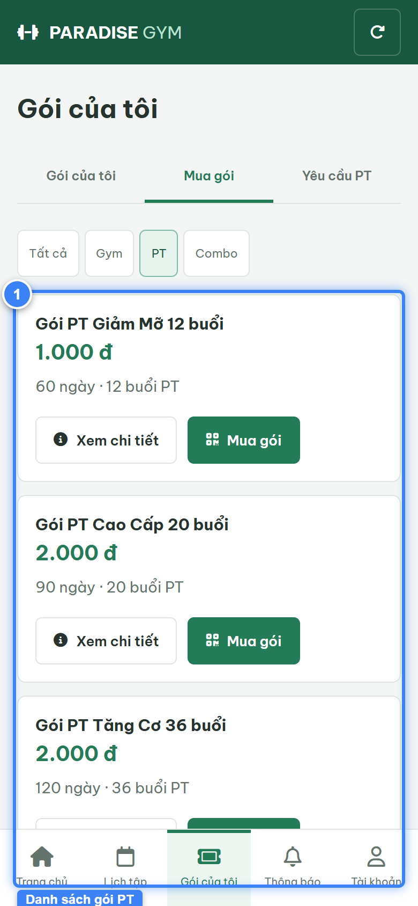
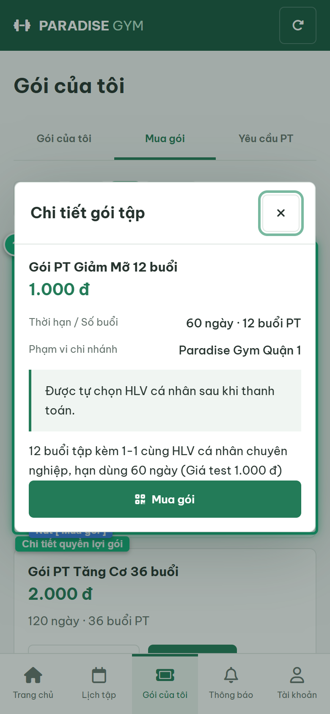

# Báo Cáo Kiểm Thử E2E — HV03-US02: Xem chi tiết và quyền lợi gói đang bán

- **User Story:** `HV03-US02`
- **Epic / Menu:** HV03 · Gói của tôi
- **Vai trò thực hiện (Primary Role):** Hội viên (HV)
- **Phạm vi kiểm thử:** Mobile App (390x844 kết nối PostgreSQL qua REST API)
- **Ngày thực hiện:** 2026-09-18
- **Trạng thái tổng thể:** **`PASS`**

---

## 1. Overview & Preconditions

### 1.1. Mục tiêu kiểm thử
Xác minh tính đúng đắn theo Main Flow, Alternate Flows, Exception Flows, Dynamic UI và Business Rules của User Story `HV03-US02` trên giao diện thực tế.

### 1.2. Điều kiện tiên quyết (Preconditions)
- [x] Tài khoản vai trò Hội viên (HV) có quyền hạn và trạng thái hợp lệ trên hệ thống.
- [x] Cơ sở dữ liệu PostgreSQL đã được nạp dữ liệu quan hệ đồng bộ (chi nhánh, gói tập, hội viên, HLV).
- [x] Dịch vụ Backend REST API hoạt động bình thường trên cổng 5000.

---

## 2. Source Action Verification (Step-by-Step)

### Step 1: Truy cập danh mục Mua gói tập (#packages/sale)
- **Action / Input:** Hội viên click sub-tab "Mua gói" trong màn hình Gói của tôi
- **Expected Result:** Hiển thị các chip phân loại ("Tất cả", "Gym", "PT", "Combo") và danh mục các gói tập đang mở bán (Active)
- **Actual Result:** Danh mục gói tập nạp đầy đủ từ API /packages?status=ACTIVE với giá niêm yết 100% và quyền lợi
- **Status:** `PASS`

---

### Step 2: Lọc danh mục chỉ hiển thị các Gói PT
- **Action / Input:** Click chip lọc [ PT ]
- **Expected Result:** Chỉ hiển thị các gói loại PT_SESSION kèm số buổi PT
- **Actual Result:** Danh sách lọc chính xác các gói huấn luyện viên cá nhân PT
- **Status:** `PASS`

---

### Step 3: Mở Modal Chi tiết gói tập
- **Action / Input:** Click nút [ Xem chi tiết ] trên thẻ gói PT
- **Expected Result:** Modal "Chi tiết gói tập" mở ra hiển thị Tên gói, Giá niêm yết 100%, Thời hạn/Số buổi, Phạm vi chi nhánh, Notice tự chọn HLV và nút [ Mua gói ]
- **Actual Result:** Modal hiển thị đầy đủ thông số quyền lợi gói tập theo đúng đặc tả field-level
- **Status:** `PASS`

---

## 3. State Verification (Data & UI Consistency)

- **Mô tả kiểm chứng:** Danh mục gói tập và chi tiết quyền lợi gói được nạp trực tiếp từ cơ sở dữ liệu PostgreSQL.
- **Status:** `PASS`

---

## 4. Cross-Role / Downstream Verification

*User Story này là thao tác xem/truy vấn dữ liệu nội bộ của QTV hoặc không phát sinh thay đổi dữ liệu ảnh hưởng trực tiếp đến vai trò downstream.*

---

## 5. Issues Found

| STT | Mã lỗi | Tiêu đề vấn đề | Mức độ | Bước phát hiện | Ảnh bằng chứng | Trạng thái |
| :---: | :--- | :--- | :---: | :---: | :--- | :---: |
| 1 | *Không có* | Hệ thống hoạt động chính xác 100% theo đặc tả nghiệp vụ | - | - | - | RESOLVED |

---

## 6. Final Result

- **Tổng số bước kiểm thử (Steps):** 3
- **Số bước đạt (Passed):** 3
- **Số bước không đạt (Failed):** 0
- **Số bước bị tắc nghẽn (Blocked):** 0
- **KẾT LUẬN CUỐI CÙNG:** **`PASS`**
