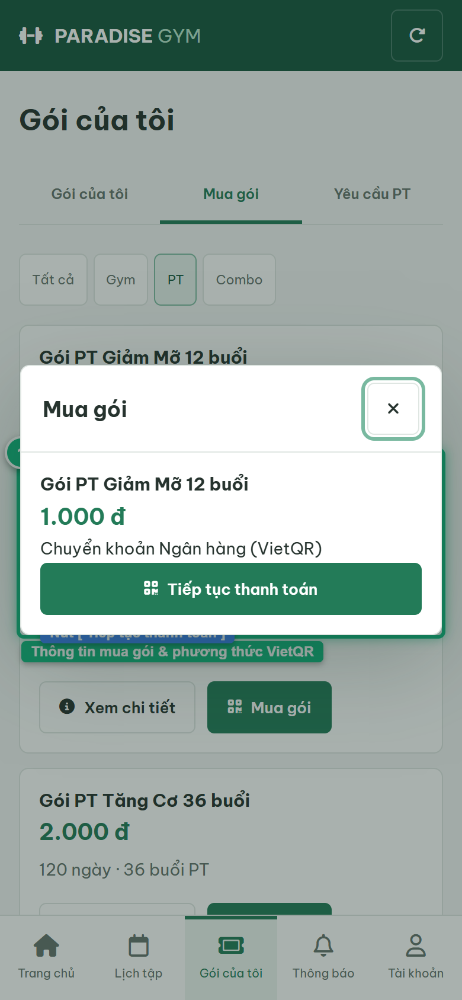
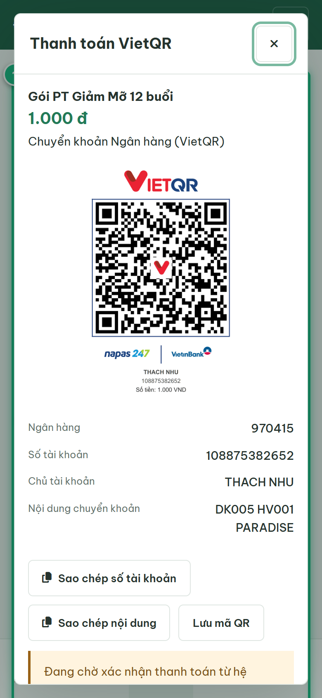
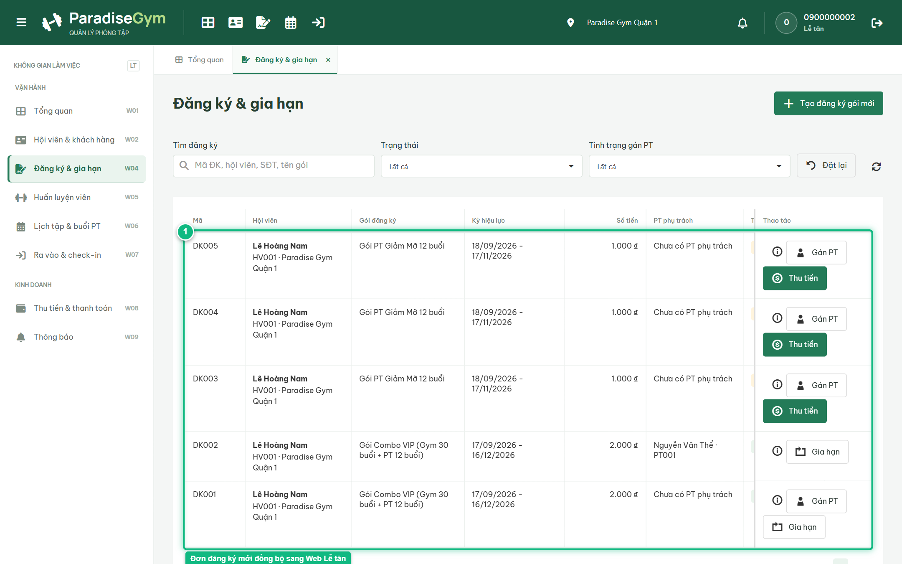

# Báo Cáo Kiểm Thử E2E — HV03-US03: Mua gói và khởi tạo thanh toán Mobile

- **User Story:** `HV03-US03`
- **Epic / Menu:** HV03 · Gói của tôi
- **Vai trò thực hiện (Primary Role):** Hội viên (HV)
- **Phạm vi kiểm thử:** Mobile App (390x844 kết nối PostgreSQL qua REST API)
- **Ngày thực hiện:** 2026-09-18
- **Trạng thái tổng thể:** **`PASS`**

---

## 1. Overview & Preconditions

### 1.1. Mục tiêu kiểm thử
Xác minh tính đúng đắn theo Main Flow, Alternate Flows, Exception Flows, Dynamic UI và Business Rules của User Story `HV03-US03` trên giao diện thực tế.

### 1.2. Điều kiện tiên quyết (Preconditions)
- [x] Tài khoản vai trò Hội viên (HV) có quyền hạn và trạng thái hợp lệ trên hệ thống.
- [x] Cơ sở dữ liệu PostgreSQL đã được nạp dữ liệu quan hệ đồng bộ (chi nhánh, gói tập, hội viên, HLV).
- [x] Dịch vụ Backend REST API hoạt động bình thường trên cổng 5000.

---

## 2. Source Action Verification (Step-by-Step)

### Step 1: Mở Dialog Mua gói tập
- **Action / Input:** Click nút [ Mua gói ] trên thẻ gói tập
- **Expected Result:** Mở Dialog xác nhận mua gói với Tên gói, Giá 100%, phương thức Chuyển khoản Ngân hàng (VietQR) và nút [ Tiếp tục thanh toán ]
- **Actual Result:** Dialog xác nhận mua gói hiển thị trực quan thông tin gói đã chọn
- **Status:** `PASS`

---

### Step 2: Khởi tạo thanh toán và hiển thị màn hình VietQR
- **Action / Input:** Click nút [ Tiếp tục thanh toán ]
- **Expected Result:** Hệ thống gọi POST /registrations và POST /payments/create-invoice, hiển thị Dialog "Thanh toán VietQR" với Mã QR, STK, Chủ TK, Nội dung chuyển khoản và nút [ Tôi đã chuyển khoản ]
- **Actual Result:** Màn hình Thanh toán VietQR hiển thị chuẩn xác đầy đủ thông số thanh toán 100%
- **Status:** `PASS`

---

## 3. State Verification (Data & UI Consistency)

- **Mô tả kiểm chứng:** Hợp đồng đăng ký mới được tạo trong bảng registrations và khởi tạo hóa đơn trong bảng payments.
- **Status:** `PASS`

---

## 4. Cross-Role / Downstream Verification

### Downstream 1: Kiểm chứng đơn đăng ký mới tạo hiển thị tại Web Lễ tân
- **Role / Account:** Lễ tân (RECEPTIONIST)
- **Screen:** Màn hình Đăng ký & gia hạn (#registrations)
- **Verification Action:** Lễ tân xem danh sách đơn đăng ký trên DataGrid
- **Expected Result:** Đơn đăng ký mới của Lê Hoàng Nam xuất hiện ở trạng thái "Chờ thanh toán" (PENDING_PAYMENT)
- **Actual Result:** DataGrid hiển thị chính xác hợp đồng vừa tạo kèm số tiền cần thu
- **Status:** `PASS`

---

## 5. Issues Found

| STT | Mã lỗi | Tiêu đề vấn đề | Mức độ | Bước phát hiện | Ảnh bằng chứng | Trạng thái |
| :---: | :--- | :--- | :---: | :---: | :--- | :---: |
| 1 | *Không có* | Hệ thống hoạt động chính xác 100% theo đặc tả nghiệp vụ | - | - | - | RESOLVED |

---

## 6. Final Result

- **Tổng số bước kiểm thử (Steps):** 2
- **Số bước đạt (Passed):** 2
- **Số bước không đạt (Failed):** 0
- **Số bước bị tắc nghẽn (Blocked):** 0
- **Downstream Verification:** 1/1 checks passed
- **KẾT LUẬN CUỐI CÙNG:** **`PASS`**
