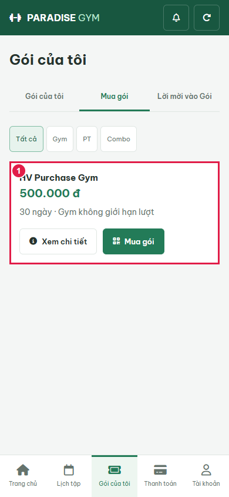
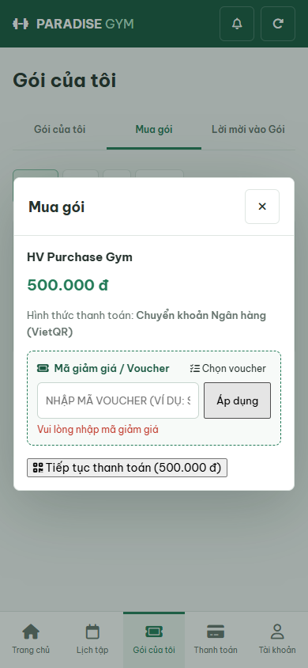
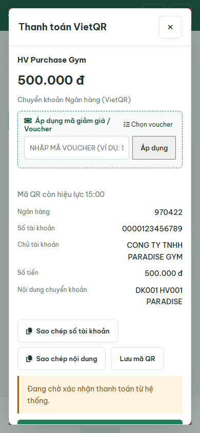
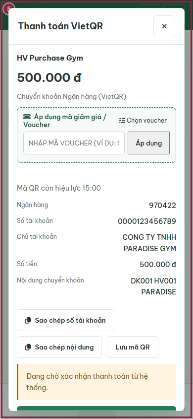

# HV Purchase / Payment Intent E2E

2026-09-21T03:34:16.602Z - BLOCKED. Sources: HV03-US01, HV03-US03 MF1-8/EF01-02, HV03-US06 MF2-4; explicit 2026-09-21 user override authorizes simulation, successful-only statusless ledger, 15min QR, pending cancel and freeze eligibility. Business docs left to main.

## Source Action Verification

### 1. purchase-catalog

- Action/Input: Open Mua goi
- Expected Result: HV03-US03 MF1: real API package name, price and purchase action
- Actual Result: HV Purchase Gym

500.000 đ

30 ngày · Gym không giới hạn lượt

Xem chi tiết
Mua gói
- Status: **PASS**

### 2. purchase-buy-dialog

- Action/Input: Click Mua goi
- Expected Result: MF2: selected package and bank transfer purchase form
- Actual Result: Mua gói
HV Purchase Gym

500.000 đ

Hình thức thanh toán: Chuyển khoản Ngân hàng (VietQR)

 Mã giảm giá / Voucher
 Chọn voucher
Áp dụng
 Tiếp tục thanh toán (500.000 đ)
- Status: **PASS**

### 3. purchase-empty-voucher

- Action/Input: Apply blank voucher
- Expected Result: Empty voucher validation leaves price unchanged
- Actual Result: Vui lòng nhập mã giảm giá
- Status: **PASS**

### 4. purchase-qr

- Action/Input: Continue payment; create registration and intent
- Expected Result: MF5/6 plus user override: pending registration, 15min QR intent; no final payment
- Actual Result: false == true
- Status: **FAIL**

### 5. execution-blocker

- Action/Input: Capture blocked actual DOM
- Expected Result: Dependent steps not claimed
- Actual Result: false == true

'FAIL' !== 'PASS'

- Status: **FAIL**

## State Verification

Disposable PostgreSQL paradise_test_hv_19060_1789961646996; 14 migrations, hashes and API/SQL assertions in results.json. No mocked API responses. Browser-only clock acceleration explicitly identified. Cleanup: {"browser":true,"server":true,"connections":true,"database":true}.

## Cross-Role / Downstream Verification

## Issues Found

- purchase-qr: false == true
- execution-blocker: AssertionError [ERR_ASSERTION]: false == true

'FAIL' !== 'PASS'

    at capture (E:\Desktop\para\tests\e2e\hv\HV03-US03\payment-intents.cjs:106:10)
    at async buy (E:\Desktop\para\tests\e2e\hv\HV03-US03\payment-intents.cjs:131:3)
    at async run (E:\Desktop\para\tests\e2e\hv\HV03-US03\payment-intents.cjs:153:15)
    at async E:\Desktop\para\tests\e2e\hv\HV03-US03\payment-intents.cjs:244:9
- execution-blocker: false == true

'FAIL' !== 'PASS'

## Final Result

BLOCKED; 3 PASS / 2 FAIL. Not full US acceptance or real bank integration certification.
