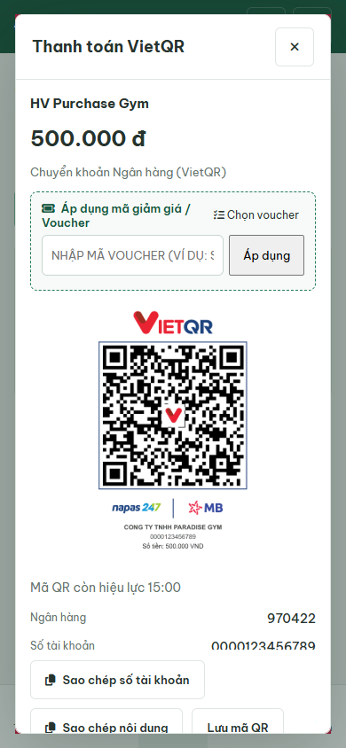
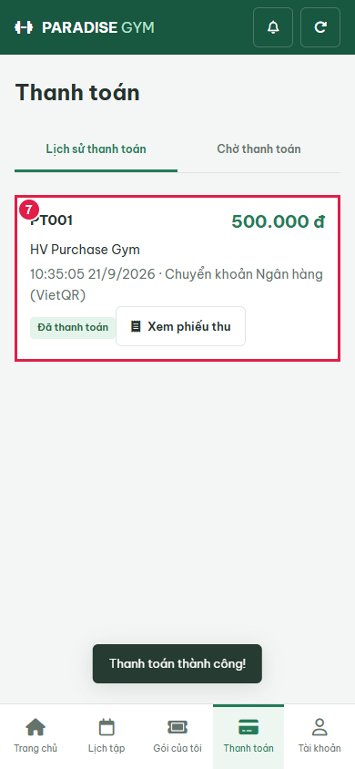
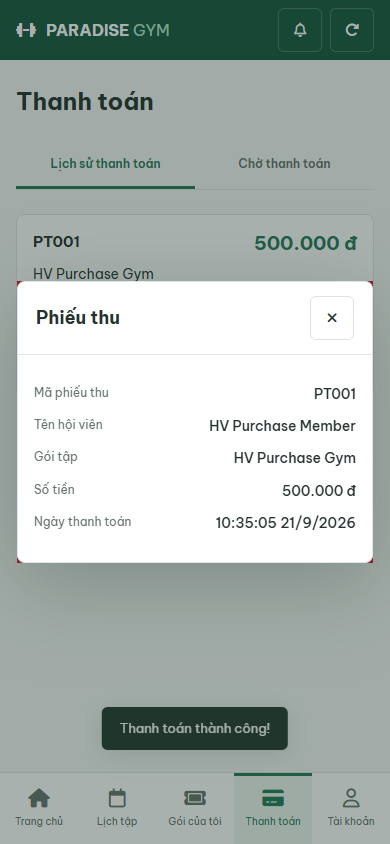
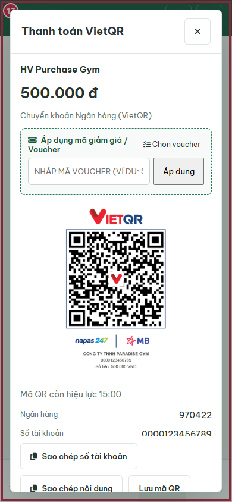
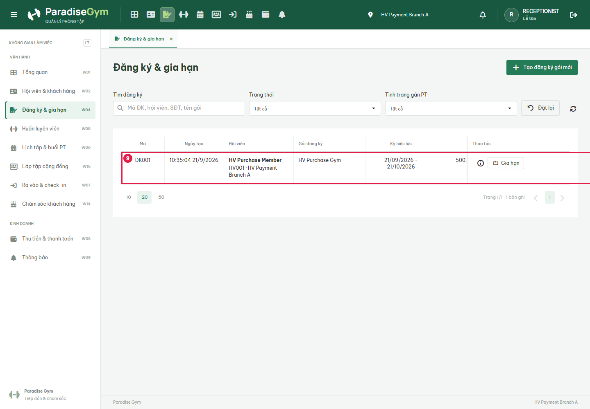

# HV Purchase / Payment Intent E2E

2026-09-21T03:35:13.062Z - BLOCKED. Sources: HV03-US01, HV03-US03 MF1-8/EF01-02, HV03-US06 MF2-4; explicit 2026-09-21 user override authorizes simulation, successful-only statusless ledger, 15min QR, pending cancel and freeze eligibility. Business docs left to main.

## Source Action Verification

### 1. purchase-catalog

- Action/Input: Open Mua goi
- Expected Result: HV03-US03 MF1: real API package name, price and purchase action
- Actual Result: HV Purchase Gym

500.000 đ

30 ngày · Gym không giới hạn lượt

Xem chi tiết
Mua gói
- Status: **PASS**

### 2. purchase-buy-dialog

- Action/Input: Click Mua goi
- Expected Result: MF2: selected package and bank transfer purchase form
- Actual Result: Mua gói
HV Purchase Gym

500.000 đ

Hình thức thanh toán: Chuyển khoản Ngân hàng (VietQR)

 Mã giảm giá / Voucher
 Chọn voucher
Áp dụng
 Tiếp tục thanh toán (500.000 đ)
- Status: **PASS**

### 3. purchase-empty-voucher

- Action/Input: Apply blank voucher
- Expected Result: Empty voucher validation leaves price unchanged
- Actual Result: Vui lòng nhập mã giảm giá
- Status: **PASS**

### 4. purchase-qr

- Action/Input: Continue payment; create registration and intent
- Expected Result: MF5/6 plus user override: pending registration, 15min QR intent; no final payment
- Actual Result: {"registrationId":"f60e0139-db38-43fc-a2c6-2ea82fff8e9a","intentId":"edbc2176-8cd0-422f-bdf6-71c48037053b","expiry":"2026-09-21T03:50:04.629Z"}
- Status: **PASS**

### 5. simulate-transfer-success

- Action/Input: Click Toi da chuyen khoan
- Expected Result: User-approved simulate-transfer creates one final payment and receipt; activates same registration
- Actual Result: Thanh toán thành công!
- Status: **PASS**

### 6. paid-package-active

- Action/Input: Open Goi cua toi after success
- Expected Result: Same paid registration active, freeze available
- Actual Result: HV Purchase Gym
Đang hoạt động

DK001 · 21/9/2026 - 21/10/2026

Gym: đã dùng 0/30 ngày

Chi tiết gói
Đóng băng
- Status: **PASS**

### 7. successful-statusless-history

- Action/Input: Open payment history
- Expected Result: HV03-US06 MF2-4: successful payment renders without status property
- Actual Result: PT001
500.000 đ

HV Purchase Gym

10:35:05 21/9/2026 · Chuyển khoản Ngân hàng (VietQR)

Đã thanh toán
Xem phiếu thu
- Status: **PASS**

### 8. receipt

- Action/Input: Open receipt
- Expected Result: Same member, purchased package and amount
- Actual Result: Phiếu thu
Mã phiếu thu
PT001
Tên hội viên
HV Purchase Member
Gói tập
HV Purchase Gym
Số tiền
500.000 đ
Ngày thanh toán
10:35:05 21/9/2026
- Status: **PASS**

### 10. pending-catalog

- Action/Input: Open Mua goi
- Expected Result: HV03-US03 MF1: real API package name, price and purchase action
- Actual Result: HV Purchase Gym

500.000 đ

30 ngày · Gym không giới hạn lượt

Xem chi tiết
Mua gói
- Status: **PASS**

### 11. pending-buy-dialog

- Action/Input: Click Mua goi
- Expected Result: MF2: selected package and bank transfer purchase form
- Actual Result: Mua gói
HV Purchase Gym

500.000 đ

Hình thức thanh toán: Chuyển khoản Ngân hàng (VietQR)

 Mã giảm giá / Voucher
 Chọn voucher
Áp dụng
 Tiếp tục thanh toán (500.000 đ)
- Status: **PASS**

### 12. pending-empty-voucher

- Action/Input: Apply blank voucher
- Expected Result: Empty voucher validation leaves price unchanged
- Actual Result: Vui lòng nhập mã giảm giá
- Status: **PASS**

### 13. pending-qr

- Action/Input: Continue payment; create registration and intent
- Expected Result: MF5/6 plus user override: pending registration, 15min QR intent; no final payment
- Actual Result: {"registrationId":"e98e6d47-5466-45e3-8487-6946e48888b1","intentId":"295c214b-947f-4b34-aea1-019f98ab68b9","expiry":"2026-09-21T03:50:11.013Z"}
- Status: **PASS**

### 14. pending-older-than-three-days

- Action/Input: Reload order after isolated 4-day age and QR expiry fixture
- Expected Result: User override: QR expiry/age never auto-cancels registration; cancel action available
- Actual Result: HV Purchase Gym
500.000 đ

Mã ĐK: DK002 · Ngày tạo: 17/9/2026

Chờ thanh toán 100%

Thanh toán ngay (VietQR)
Hủy đơn
- Status: **PASS**

### 15. expired-intent-reissued

- Action/Input: Continue payment after QR expiry
- Expected Result: Fresh 15min QR for same pending order; final history still one successful payment
- Actual Result: Mã QR còn hiệu lực 15:00
- Status: **PASS**

### 16. qr-countdown-expired

- Action/Input: Advance browser clock 15min without waiting on real bank
- Expected Result: Expired QR hidden, simulation unavailable, recreate action; order still pending
- Actual Result: false == true
- Status: **FAIL**

### 17. execution-blocker

- Action/Input: Capture blocked actual DOM
- Expected Result: Dependent steps not claimed
- Actual Result: false == true

'FAIL' !== 'PASS'

- Status: **FAIL**

## State Verification

Disposable PostgreSQL paradise_test_hv_20400_1789961697936; 14 migrations, hashes and API/SQL assertions in results.json. No mocked API responses. Browser-only clock acceleration explicitly identified. Cleanup: {"browser":true,"server":true,"connections":true,"database":true}.

## Cross-Role / Downstream Verification

### 9. lt-DK001-Đang

- Action/Input: Open LT registrations for the SAME registration
- Expected Result: Same member/code and expected registration status
- Actual Result: DK001	10:35:04 21/9/2026	HV Purchase Member
HV001 · HV Payment Branch A
	HV Purchase Gym	21/09/2026 - 21/10/2026	500.000 ₫	--	Đang hiệu lực	
- Status: **PASS**

## Issues Found

- qr-countdown-expired: false == true
- execution-blocker: AssertionError [ERR_ASSERTION]: false == true

'FAIL' !== 'PASS'

    at capture (E:\Desktop\para\tests\e2e\hv\HV03-US03\payment-intents.cjs:106:10)
    at async run (E:\Desktop\para\tests\e2e\hv\HV03-US03\payment-intents.cjs:192:3)
    at async E:\Desktop\para\tests\e2e\hv\HV03-US03\payment-intents.cjs:245:9
- execution-blocker: false == true

'FAIL' !== 'PASS'

- source-drift-during-run: backend/src/modules/core/commerce.js

## Final Result

BLOCKED; 15 PASS / 2 FAIL. Not full US acceptance or real bank integration certification.
