# HV Purchase / Payment Intent E2E

2026-09-21T03:37:33.298Z - BLOCKED. Sources: HV03-US01, HV03-US03 MF1-8/EF01-02, HV03-US06 MF2-4; explicit 2026-09-21 user override authorizes simulation, successful-only statusless ledger, 15min QR, pending cancel and freeze eligibility. Business docs left to main.

## Source Action Verification

### 1. purchase-catalog

- Action/Input: Open Mua goi
- Expected Result: HV03-US03 MF1: real API package name, price and purchase action
- Actual Result: HV Purchase Gym

500.000 đ

30 ngày · Gym không giới hạn lượt

Xem chi tiết
Mua gói
- Status: **PASS**

### 2. purchase-buy-dialog

- Action/Input: Click Mua goi
- Expected Result: MF2: selected package and bank transfer purchase form
- Actual Result: Mua gói
HV Purchase Gym

500.000 đ

Hình thức thanh toán: Chuyển khoản Ngân hàng (VietQR)

 Mã giảm giá / Voucher
 Chọn voucher
Áp dụng
 Tiếp tục thanh toán (500.000 đ)
- Status: **PASS**

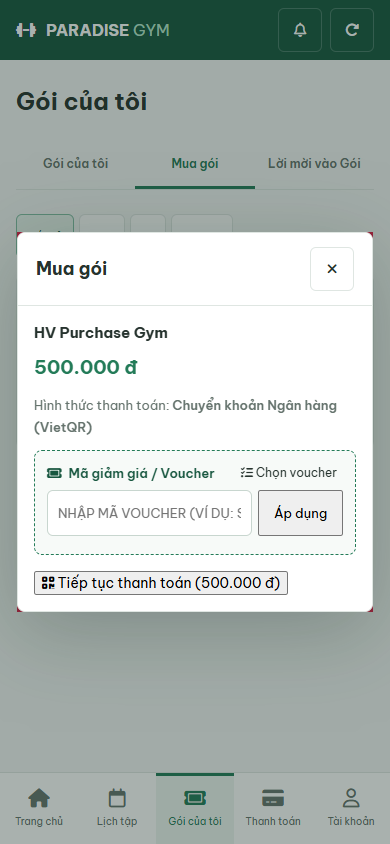

### 3. purchase-empty-voucher

- Action/Input: Apply blank voucher
- Expected Result: Empty voucher validation leaves price unchanged
- Actual Result: Vui lòng nhập mã giảm giá
- Status: **PASS**

### 4. purchase-qr

- Action/Input: Continue payment; create registration and intent
- Expected Result: MF5/6 plus user override: pending registration, 15min QR intent; no final payment
- Actual Result: {"registrationId":"6ed76086-ab76-4455-8a99-42175f68a7c5","intentId":"eba7a3d5-cdbc-49da-b17c-cc6694c1232d","expiry":"2026-09-21T03:52:13.181Z"}
- Status: **PASS**

### 5. simulate-transfer-success

- Action/Input: Click Toi da chuyen khoan
- Expected Result: User-approved simulate-transfer creates one final payment and receipt; activates same registration
- Actual Result: Thanh toán thành công!
- Status: **PASS**

### 6. paid-package-active

- Action/Input: Open Goi cua toi after success
- Expected Result: Same paid registration active, freeze available
- Actual Result: HV Purchase Gym
Đang hoạt động

DK001 · 21/9/2026 - 21/10/2026

Gym: đã dùng 0/30 ngày

Chi tiết gói
Đóng băng
- Status: **PASS**

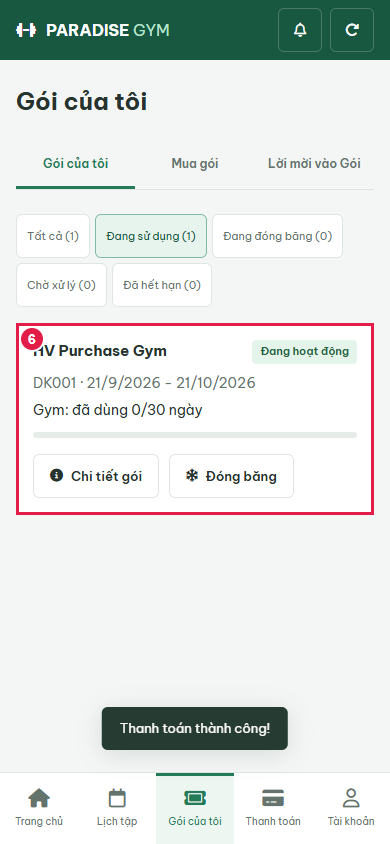

### 7. successful-statusless-history

- Action/Input: Open payment history
- Expected Result: HV03-US06 MF2-4: successful payment renders without status property
- Actual Result: PT001
500.000 đ

HV Purchase Gym

10:37:13 21/9/2026 · Chuyển khoản Ngân hàng (VietQR)

Xem phiếu thu
- Status: **PASS**

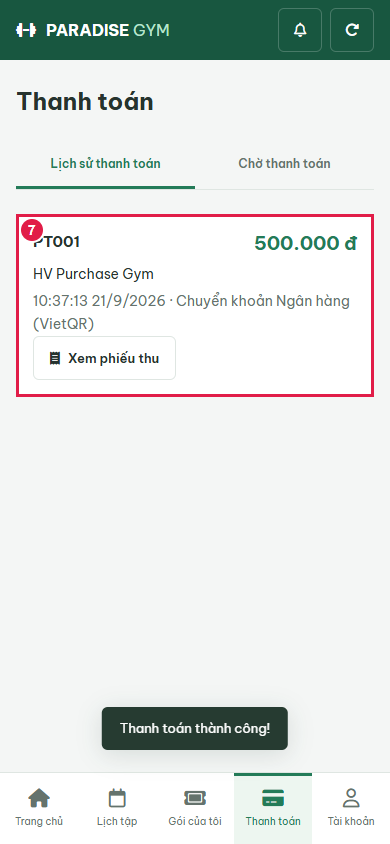

### 8. receipt

- Action/Input: Open receipt
- Expected Result: Same member, purchased package and amount
- Actual Result: Phiếu thu
Mã phiếu thu
PT001
Tên hội viên
HV Purchase Member
Gói tập
HV Purchase Gym
Số tiền
500.000 đ
Ngày thanh toán
10:37:13 21/9/2026
- Status: **PASS**

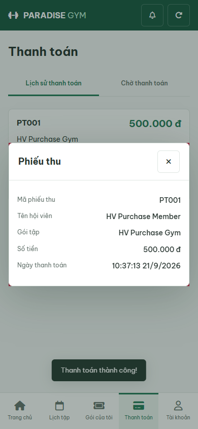

### 10. pending-catalog

- Action/Input: Open Mua goi
- Expected Result: HV03-US03 MF1: real API package name, price and purchase action
- Actual Result: HV Purchase Gym

500.000 đ

30 ngày · Gym không giới hạn lượt

Xem chi tiết
Mua gói
- Status: **PASS**

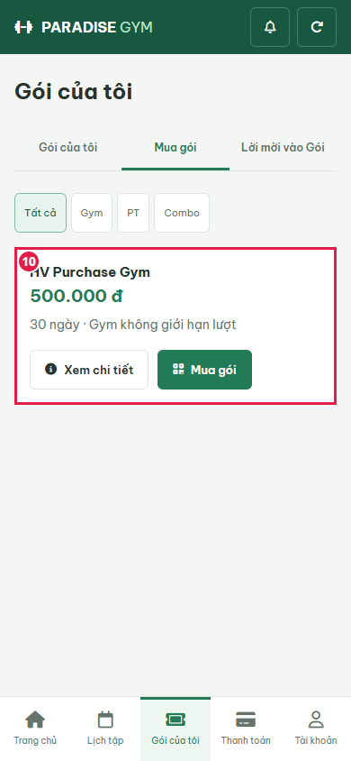

### 11. pending-buy-dialog

- Action/Input: Click Mua goi
- Expected Result: MF2: selected package and bank transfer purchase form
- Actual Result: Mua gói
HV Purchase Gym

500.000 đ

Hình thức thanh toán: Chuyển khoản Ngân hàng (VietQR)

 Mã giảm giá / Voucher
 Chọn voucher
Áp dụng
 Tiếp tục thanh toán (500.000 đ)
- Status: **PASS**

### 12. pending-empty-voucher

- Action/Input: Apply blank voucher
- Expected Result: Empty voucher validation leaves price unchanged
- Actual Result: Vui lòng nhập mã giảm giá
- Status: **PASS**

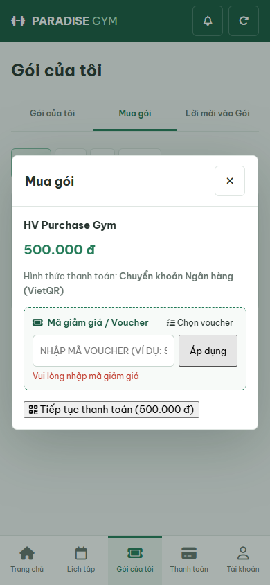

### 13. pending-qr

- Action/Input: Continue payment; create registration and intent
- Expected Result: MF5/6 plus user override: pending registration, 15min QR intent; no final payment
- Actual Result: {"registrationId":"55973d18-70bf-4e3a-a47c-8991da468521","intentId":"acb7c71a-02f4-49d1-9dad-166d2f374e39","expiry":"2026-09-21T03:52:19.275Z"}
- Status: **PASS**

### 14. pending-older-than-three-days

- Action/Input: Reload order after isolated 4-day age and QR expiry fixture
- Expected Result: User override: QR expiry/age never auto-cancels registration; cancel action available
- Actual Result: HV Purchase Gym
500.000 đ

Mã ĐK: DK002 · Ngày tạo: 17/9/2026

Chờ thanh toán 100%

Thanh toán ngay (VietQR)
Hủy đơn
- Status: **PASS**

### 15. expired-intent-reissued

- Action/Input: Continue payment after QR expiry
- Expected Result: Fresh 15min QR for same pending order; final history still one successful payment
- Actual Result: Mã QR còn hiệu lực 15:00
- Status: **PASS**

### 16. qr-countdown-expired

- Action/Input: Advance browser clock 15min without waiting on real bank
- Expected Result: Expired QR hidden, simulation unavailable, recreate action; order still pending
- Actual Result: Mã QR đã hết hạn. Đơn đăng ký vẫn đang chờ thanh toán.
- Status: **PASS**

### 17. recreate-qr-action

- Action/Input: Align isolated server expiry and browser clock; click recreate QR
- Expected Result: Same registration gets a usable fresh QR with no payment
- Actual Result: Mã QR còn hiệu lực 15:00
- Status: **PASS**

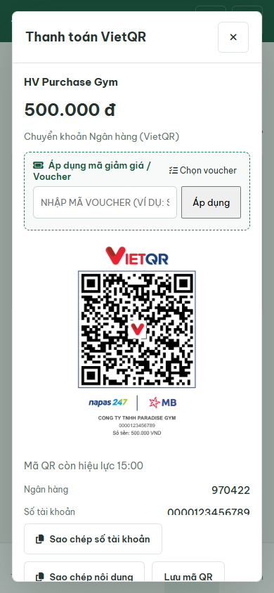

### 18. pending-cancel-confirmation

- Action/Input: Click Huy don
- Expected Result: Explicit confirmation before cancelling same order
- Actual Result: Hủy đơn chờ thanh toán

Hủy đơn DK002 của gói HV Purchase Gym?

Quay lại
Xác nhận hủy đơn
- Status: **PASS**

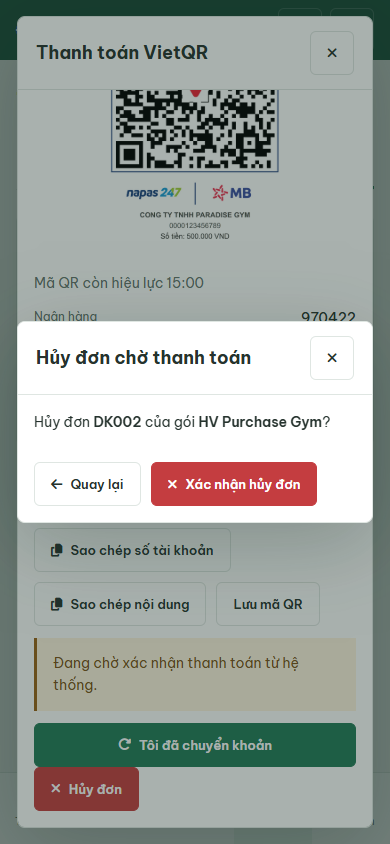

### 19. pending-cancel-success

- Action/Input: Confirm cancellation
- Expected Result: Order disappears from pending; no final payment or receipt generated
- Actual Result: Thanh toán
Lịch sử thanh toán
Chờ thanh toán

Bạn không có đơn đăng ký nào đang chờ thanh toán.
- Status: **PASS**

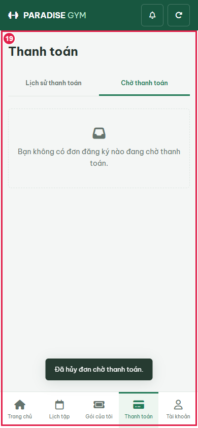

### 21. freeze-form

- Action/Input: Open freeze for paid active package
- Expected Result: Current paid package may freeze
- Actual Result: Đóng băng gói tập

Gói tập: HV Purchase Gym

Mã hợp đồng: DK001 · Hạn cũ: 21/10/2026

Số ngày đóng băng *
7 ngày
14 ngày
30 ngày
60 ngày
Hạn gói tập sẽ được tự động lùi tương ứng với số ngày đóng băng thực tế.
Lý do đóng băng
Hủy
 Xác nhận đóng băng
- Status: **PASS**

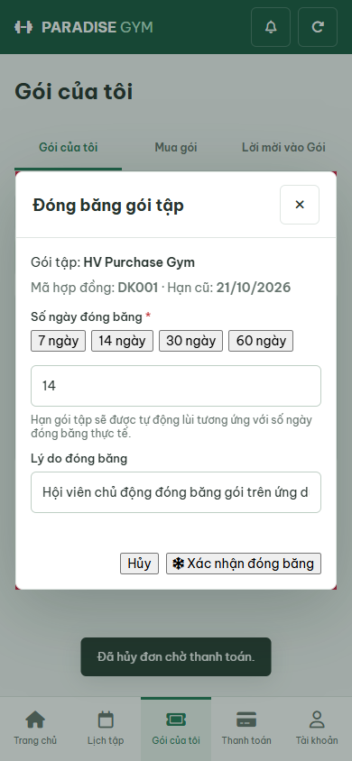

### 22. freeze-invalid-input

- Action/Input: Enter zero freeze days before submit
- Expected Result: Input captured separately from validation submit
- Actual Result: 0
- Status: **PASS**

### 23. freeze-zero-validation

- Action/Input: Submit zero days
- Expected Result: Invalid days blocked; contract remains ACTIVE
- Actual Result: Vui lòng nhập số ngày đóng băng hợp lệ (lớn hơn 0)
- Status: **PASS**

### 24. freeze-valid-input

- Action/Input: Enter two days before submit
- Expected Result: Separate input screenshot
- Actual Result: 2 days
- Status: **PASS**

### 25. freeze-success

- Action/Input: Confirm freeze
- Expected Result: Paid active package becomes frozen
- Actual Result: HV Purchase Gym
❄️ Đang đóng băng

DK001 · 21/9/2026 - 23/10/2026

Gym: đã dùng 0/30 ngày

Chi tiết gói
Mở đóng băng trước hạn
- Status: **PASS**

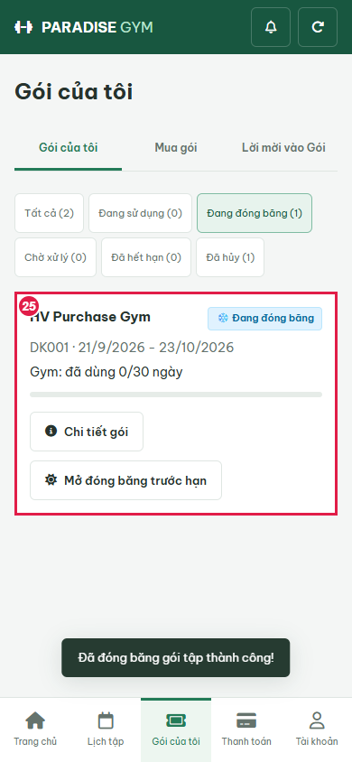

### 27. scheduled-freeze-blocked

- Action/Input: View paid future package fixture
- Expected Result: User override: SCHEDULED package cannot freeze
- Actual Result: HV Purchase Gym
Chưa đến ngày hiệu lực

DK003 · 28/9/2026 - 28/10/2026

Gym: đã dùng 0/30 ngày

Chi tiết gói
- Status: **PASS**

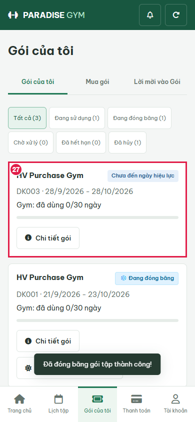

### 28. scheduled-detail-freeze-blocked

- Action/Input: Open scheduled package detail
- Expected Result: No freeze action in detail either
- Actual Result: Chi tiết gói tập
HV Purchase Gym
Chưa đến ngày hiệu lực

Mã hợp đồng: DK003

Hình thức: Gym Tiêu Chuẩn
Hiệu lực: 28/9/2026 - 28/10/2026
Chi nhánh: HV Payment Branch A
Tiến độ sử dụng

Gym: đã dùng 0/30 ngày

Đóng
 Gia hạn gói
- Status: **PASS**

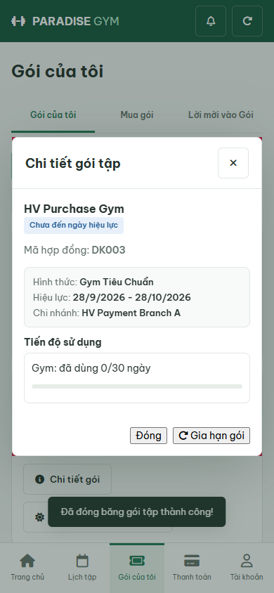

### 29. time-four-days

- Action/Input: Load real paid registration boundary fixture
- Expected Result: Backend canonical is_expiring=true; GYM_TIME, days=4, remaining PT=null, remaining Gym=null
- Actual Result: {"is_expiring":true,"display_status":"EXPIRING","text":"Boundary time-four-days\nSắp hết hạn\n\nDK004 · 21/9/2026 - 25/9/2026\n\nGym: đã dùng 0/30 ngày\n\nChi tiết gói\nĐóng băng"}
- Status: **PASS**

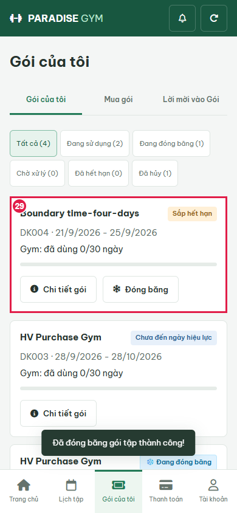

### 30. time-four-days-detail

- Action/Input: Open detail for same boundary registration
- Expected Result: Detail uses exactly the same backend flag as list
- Actual Result: Chi tiết gói tập
Boundary time-four-days
Sắp hết hạn

Mã hợp đồng: DK004

Hình thức: Gym Tiêu Chuẩn
Hiệu lực: 21/9/2026 - 25/9/2026
Chi nhánh: HV Payment Branch A
Tiến độ sử dụng

Gym: đã dùng 0/30 ngày

Đóng
 Đóng băng gói
 Gia hạn gói
- Status: **PASS**

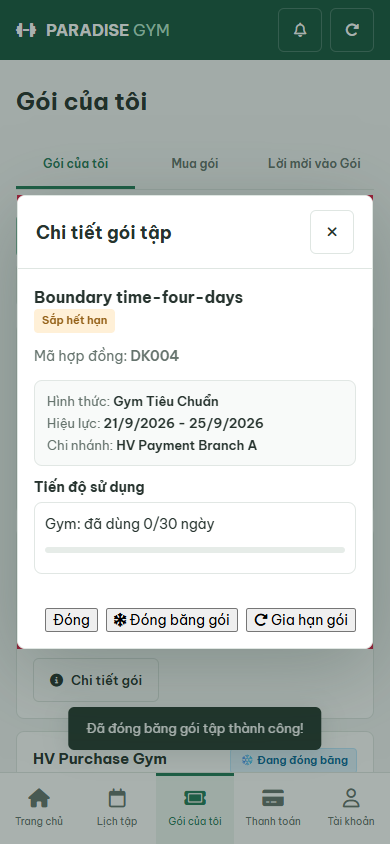

### 31. time-five-days

- Action/Input: Load real paid registration boundary fixture
- Expected Result: Backend canonical is_expiring=false; GYM_TIME, days=5, remaining PT=null, remaining Gym=null
- Actual Result: {"is_expiring":false,"display_status":"ACTIVE","text":"Boundary time-five-days\nĐang hoạt động\n\nDK005 · 21/9/2026 - 26/9/2026\n\nGym: đã dùng 0/30 ngày\n\nChi tiết gói\nĐóng băng"}
- Status: **PASS**

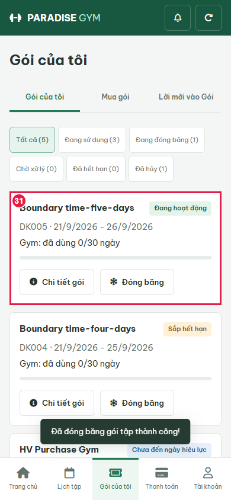

### 32. time-five-days-detail

- Action/Input: Open detail for same boundary registration
- Expected Result: Detail uses exactly the same backend flag as list
- Actual Result: Chi tiết gói tập
Boundary time-five-days
Đang hoạt động

Mã hợp đồng: DK005

Hình thức: Gym Tiêu Chuẩn
Hiệu lực: 21/9/2026 - 26/9/2026
Chi nhánh: HV Payment Branch A
Tiến độ sử dụng

Gym: đã dùng 0/30 ngày

Đóng
 Đóng băng gói
 Gia hạn gói
- Status: **PASS**

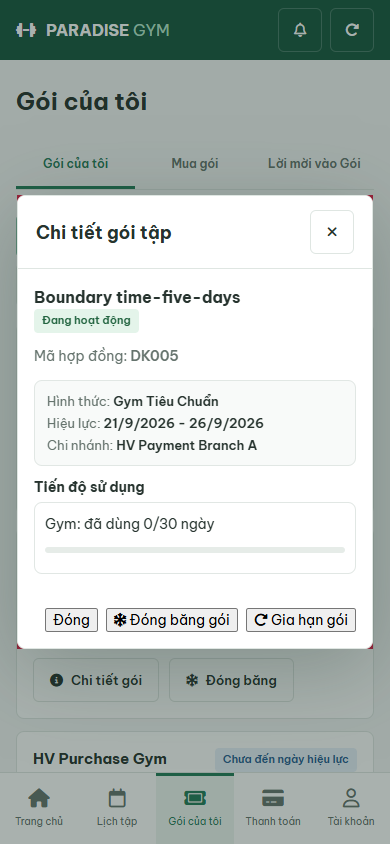

### 33. gym-three-sessions

- Action/Input: Load real paid registration boundary fixture
- Expected Result: Backend canonical is_expiring=true; GYM_SESSION, days=20, remaining PT=null, remaining Gym=3
- Actual Result: {"is_expiring":true,"display_status":"EXPIRING","text":"Boundary gym-three-sessions\nSắp hết hạn\n\nDK006 · 21/9/2026 - 11/10/2026\n\nGym: đã dùng 0/30 ngày\n\nGym: còn 3/3 lượt\n\nChi tiết gói\nĐóng băng"}
- Status: **PASS**

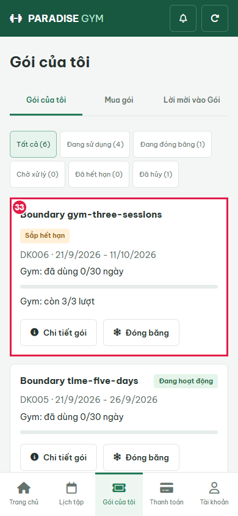

### 34. gym-three-sessions-detail

- Action/Input: Open detail for same boundary registration
- Expected Result: Detail uses exactly the same backend flag as list
- Actual Result: Chi tiết gói tập
Boundary gym-three-sessions
Sắp hết hạn

Mã hợp đồng: DK006

Hình thức: Gym Tiêu Chuẩn
Hiệu lực: 21/9/2026 - 11/10/2026
Chi nhánh: HV Payment Branch A
Tiến độ sử dụng

Gym: đã dùng 0/30 ngày

Gym: còn 3/3 lượt

Đóng
 Đóng băng gói
 Gia hạn gói
- Status: **PASS**

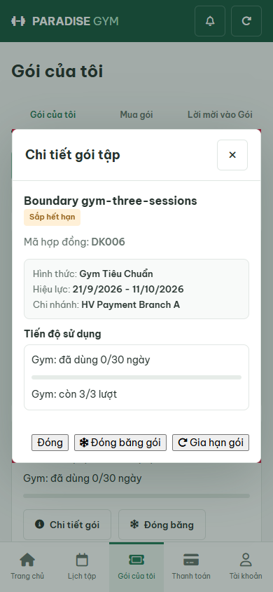

### 35. gym-four-sessions

- Action/Input: Load real paid registration boundary fixture
- Expected Result: Backend canonical is_expiring=false; GYM_SESSION, days=1, remaining PT=null, remaining Gym=4
- Actual Result: {"is_expiring":false,"display_status":"ACTIVE","text":"Boundary gym-four-sessions\nĐang hoạt động\n\nDK007 · 21/9/2026 - 22/9/2026\n\nGym: đã dùng 0/30 ngày\n\nGym: còn 4/4 lượt\n\nChi tiết gói\nĐóng băng"}
- Status: **PASS**

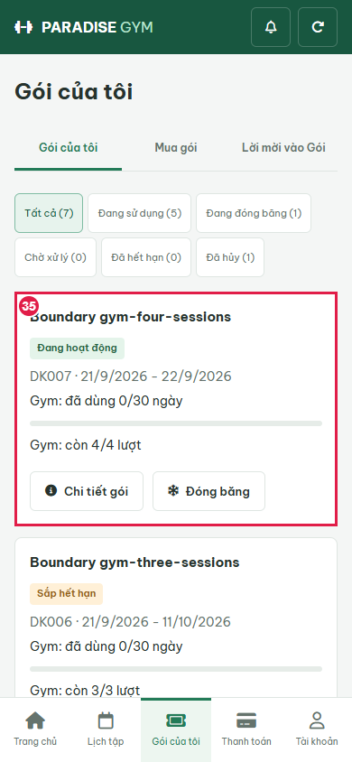

### 36. gym-four-sessions-detail

- Action/Input: Open detail for same boundary registration
- Expected Result: Detail uses exactly the same backend flag as list
- Actual Result: Chi tiết gói tập
Boundary gym-four-sessions
Đang hoạt động

Mã hợp đồng: DK007

Hình thức: Gym Tiêu Chuẩn
Hiệu lực: 21/9/2026 - 22/9/2026
Chi nhánh: HV Payment Branch A
Tiến độ sử dụng

Gym: đã dùng 0/30 ngày

Gym: còn 4/4 lượt

Đóng
 Đóng băng gói
 Gia hạn gói
- Status: **PASS**

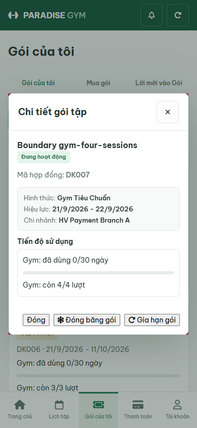

### 37. pt-three-sessions

- Action/Input: Load real paid registration boundary fixture
- Expected Result: Backend canonical is_expiring=true; PT_SESSION, days=20, remaining PT=3, remaining Gym=null
- Actual Result: {"is_expiring":true,"display_status":"EXPIRING","text":"Boundary pt-three-sessions\nSắp hết hạn\n\nDK008 · 21/9/2026 - 11/10/2026\n\nPT: đã dùng 0/3 buổi · Còn 3 buổi\n\nĐang giữ chỗ: 0 buổi\n\nPT: Chưa chọn (Liên hệ Lễ tân)\n\nChi tiết gói\nChọn PT phụ trách\nĐóng băng"}
- Status: **PASS**

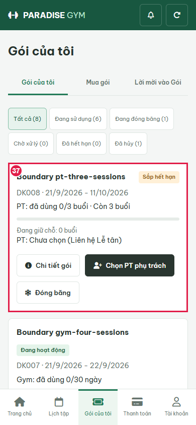

### 38. pt-three-sessions-detail

- Action/Input: Open detail for same boundary registration
- Expected Result: Detail uses exactly the same backend flag as list
- Actual Result: Chi tiết gói tập
Boundary pt-three-sessions
Sắp hết hạn

Mã hợp đồng: DK008

Hình thức: PT Kèm 1-1 Cá nhân
Hiệu lực: 21/9/2026 - 11/10/2026
Chi nhánh: HV Payment Branch A
HLV phụ trách: Chưa chỉ định 
Liên hệ Lễ tân
Tiến độ sử dụng

PT: đã dùng 0/3 buổi · Còn 3 buổi

Đang giữ chỗ: 0 buổi
Đóng
 Đóng băng gói
 Gia hạn gói
- Status: **PASS**

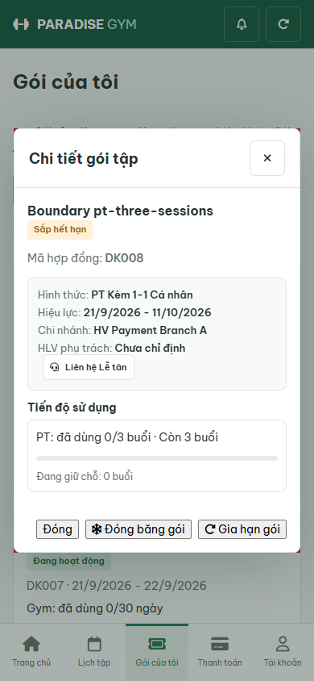

### 39. pt-four-sessions

- Action/Input: Load real paid registration boundary fixture
- Expected Result: Backend canonical is_expiring=false; PT_SESSION, days=1, remaining PT=4, remaining Gym=null
- Actual Result: {"is_expiring":false,"display_status":"ACTIVE","text":"Boundary pt-four-sessions\nĐang hoạt động\n\nDK009 · 21/9/2026 - 22/9/2026\n\nPT: đã dùng 0/4 buổi · Còn 4 buổi\n\nĐang giữ chỗ: 0 buổi\n\nPT: Chưa chọn (Liên hệ Lễ tân)\n\nChi tiết gói\nChọn PT phụ trách\nĐóng băng"}
- Status: **PASS**

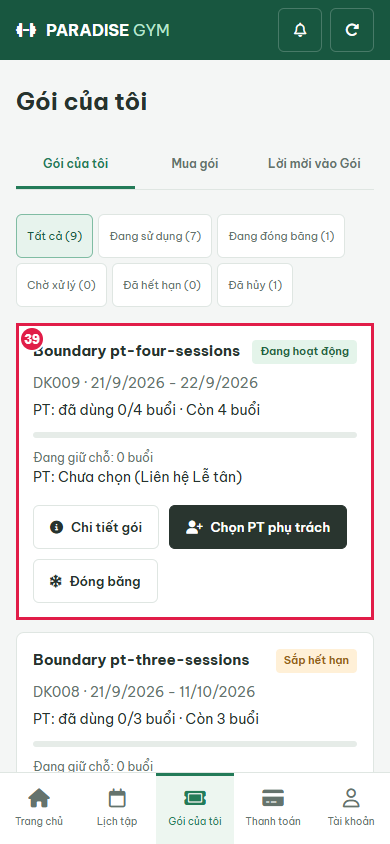

### 40. pt-four-sessions-detail

- Action/Input: Open detail for same boundary registration
- Expected Result: Detail uses exactly the same backend flag as list
- Actual Result: Chi tiết gói tập
Boundary pt-four-sessions
Đang hoạt động

Mã hợp đồng: DK009

Hình thức: PT Kèm 1-1 Cá nhân
Hiệu lực: 21/9/2026 - 22/9/2026
Chi nhánh: HV Payment Branch A
HLV phụ trách: Chưa chỉ định 
Liên hệ Lễ tân
Tiến độ sử dụng

PT: đã dùng 0/4 buổi · Còn 4 buổi

Đang giữ chỗ: 0 buổi
Đóng
 Đóng băng gói
 Gia hạn gói
- Status: **PASS**

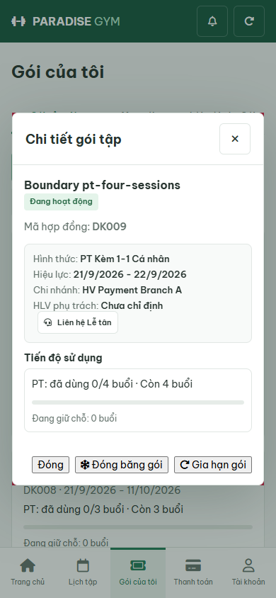

### 41. combo-time-or

- Action/Input: Load real paid registration boundary fixture
- Expected Result: Backend canonical is_expiring=true; COMBO, days=4, remaining PT=4, remaining Gym=null
- Actual Result: {"is_expiring":true,"display_status":"EXPIRING","text":"Boundary combo-time-or\nSắp hết hạn\n\nDK010 · 21/9/2026 - 25/9/2026\n\nGym: đã dùng 0/30 ngày\n\nPT: đã dùng 0/4 buổi · Còn 4 buổi\n\nĐang giữ chỗ: 0 buổi\n\nPT: Chưa chọn (Liên hệ Lễ tân)\n\nChi tiết gói\nChọn PT phụ trách\nĐóng băng"}
- Status: **PASS**

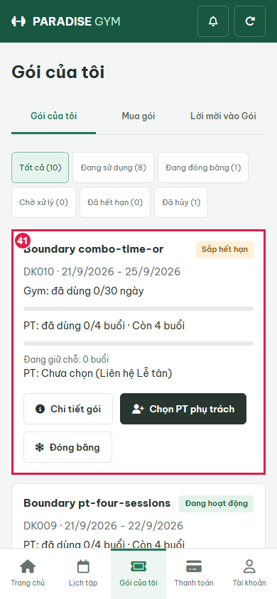

### 42. combo-time-or-detail

- Action/Input: Open detail for same boundary registration
- Expected Result: Detail uses exactly the same backend flag as list
- Actual Result: Chi tiết gói tập
Boundary combo-time-or
Sắp hết hạn

Mã hợp đồng: DK010

Hình thức: Combo Gym + PT
Hiệu lực: 21/9/2026 - 25/9/2026
Chi nhánh: HV Payment Branch A
HLV phụ trách: Chưa chỉ định 
Liên hệ Lễ tân
Tiến độ sử dụng

Gym: đã dùng 0/30 ngày

PT: đã dùng 0/4 buổi · Còn 4 buổi

Đang giữ chỗ: 0 buổi
Đóng
 Đóng băng gói
 Gia hạn gói
- Status: **PASS**

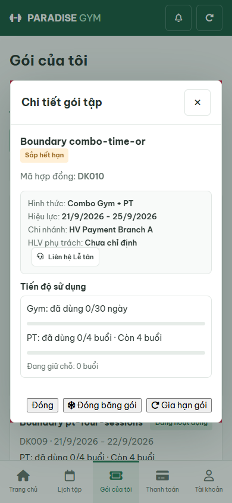

### 43. combo-pt-or

- Action/Input: Load real paid registration boundary fixture
- Expected Result: Backend canonical is_expiring=true; COMBO, days=20, remaining PT=3, remaining Gym=null
- Actual Result: {"is_expiring":true,"display_status":"EXPIRING","text":"Boundary combo-pt-or\nSắp hết hạn\n\nDK011 · 21/9/2026 - 11/10/2026\n\nGym: đã dùng 0/30 ngày\n\nPT: đã dùng 0/3 buổi · Còn 3 buổi\n\nĐang giữ chỗ: 0 buổi\n\nPT: Chưa chọn (Liên hệ Lễ tân)\n\nChi tiết gói\nChọn PT phụ trách\nĐóng băng"}
- Status: **PASS**

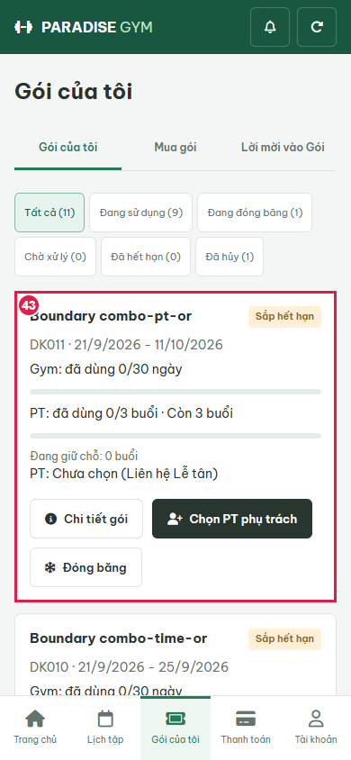

### 44. combo-pt-or-detail

- Action/Input: Open detail for same boundary registration
- Expected Result: Detail uses exactly the same backend flag as list
- Actual Result: Chi tiết gói tập
Boundary combo-pt-or
Sắp hết hạn

Mã hợp đồng: DK011

Hình thức: Combo Gym + PT
Hiệu lực: 21/9/2026 - 11/10/2026
Chi nhánh: HV Payment Branch A
HLV phụ trách: Chưa chỉ định 
Liên hệ Lễ tân
Tiến độ sử dụng

Gym: đã dùng 0/30 ngày

PT: đã dùng 0/3 buổi · Còn 3 buổi

Đang giữ chỗ: 0 buổi
Đóng
 Đóng băng gói
 Gia hạn gói
- Status: **PASS**

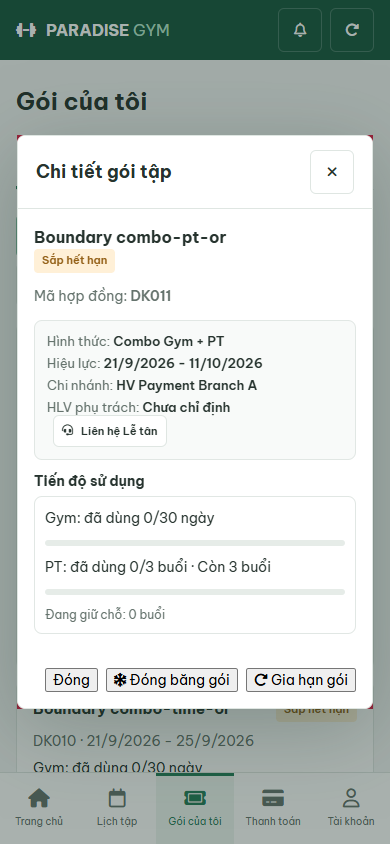

### 45. execution-blocker

- Action/Input: Capture blocked actual DOM
- Expected Result: Dependent steps not claimed
- Actual Result: Backend canonical combo-gym-or

false !== true

- Status: **FAIL**

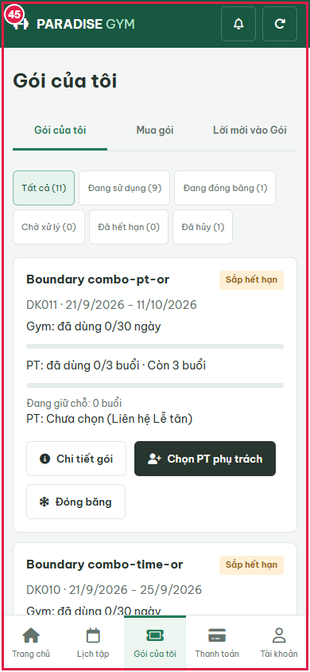

## State Verification

Disposable PostgreSQL paradise_test_hv_26444_1789961827056; 14 migrations, hashes and API/SQL assertions in results.json. No mocked API responses. Browser-only clock acceleration explicitly identified. Cleanup: {"browser":true,"server":true,"connections":true,"database":true}.

## Cross-Role / Downstream Verification

### 9. lt-DK001-Đang

- Action/Input: Open LT registrations for the SAME registration
- Expected Result: Same member/code and expected registration status
- Actual Result: DK001	10:37:13 21/9/2026	HV Purchase Member
HV001 · HV Payment Branch A
	HV Purchase Gym	21/09/2026 - 21/10/2026	500.000 ₫	--	Đang hiệu lực	
- Status: **PASS**

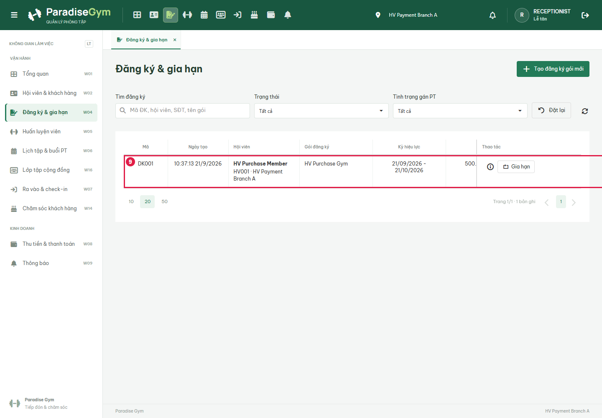

### 20. lt-DK002-Đã hủy

- Action/Input: Open LT registrations for the SAME registration
- Expected Result: Same member/code and expected registration status
- Actual Result: DK002	10:37:19 17/9/2026	HV Purchase Member
HV001 · HV Payment Branch A
	HV Purchase Gym	21/09/2026 - 21/10/2026	500.000 ₫	--	Đã hủy	
- Status: **PASS**

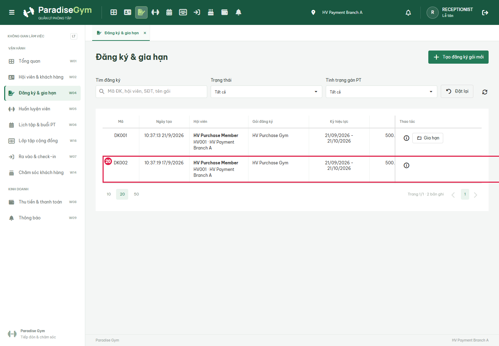

### 26. lt-DK001-Đang đóng băng

- Action/Input: Open LT registrations for the SAME registration
- Expected Result: Same member/code and expected registration status
- Actual Result: DK001	10:37:13 21/9/2026	HV Purchase Member
HV001 · HV Payment Branch A
	HV Purchase Gym	21/09/2026 - 23/10/2026	500.000 ₫	--	❄️ Đang đóng băng	
- Status: **PASS**

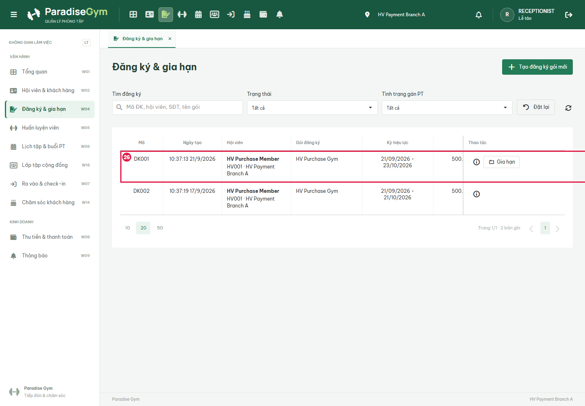

## Issues Found

- execution-blocker: AssertionError [ERR_ASSERTION]: Backend canonical combo-gym-or

false !== true

    at expiryCases (E:\Desktop\para\tests\e2e\hv\HV03-US03\payment-intents.cjs:265:12)
    at process.processTicksAndRejections (node:internal/process/task_queues:105:5)
    at async run (E:\Desktop\para\tests\e2e\hv\HV03-US03\payment-intents.cjs:241:3)
    at async E:\Desktop\para\tests\e2e\hv\HV03-US03\payment-intents.cjs:287:9
- execution-blocker: Backend canonical combo-gym-or

false !== true

## Final Result

BLOCKED; 44 PASS / 1 FAIL. Not full US acceptance or real bank integration certification.
