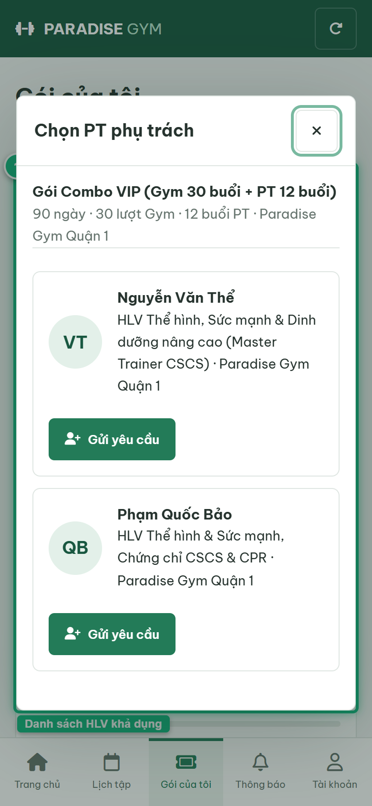
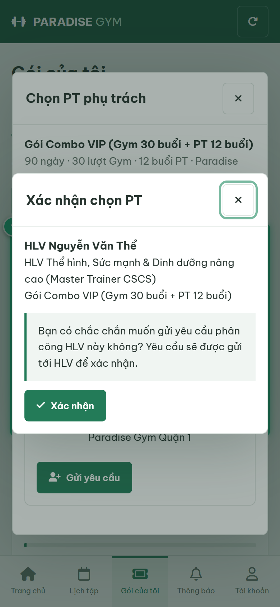
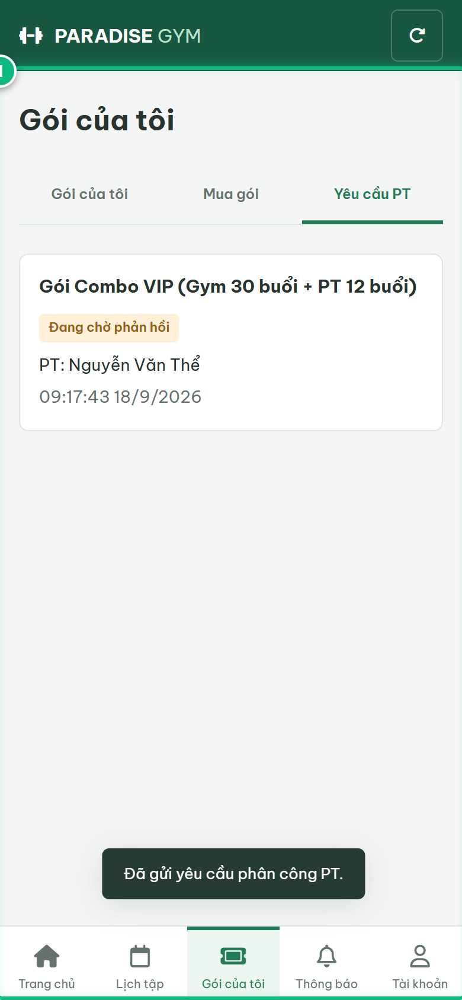
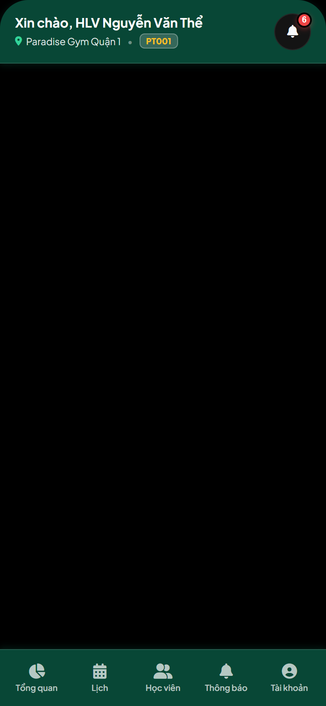

# Báo Cáo Kiểm Thử E2E — HV03-US04: Chọn PT và gửi yêu cầu phân công

- **User Story:** `HV03-US04`
- **Epic / Menu:** HV03 · Gói của tôi
- **Vai trò thực hiện (Primary Role):** Hội viên (HV)
- **Phạm vi kiểm thử:** Mobile App (390x844 kết nối PostgreSQL qua REST API)
- **Ngày thực hiện:** 2026-09-18
- **Trạng thái tổng thể:** **`PASS`**

---

## 1. Overview & Preconditions

### 1.1. Mục tiêu kiểm thử
Xác minh tính đúng đắn theo Main Flow, Alternate Flows, Exception Flows, Dynamic UI và Business Rules của User Story `HV03-US04` trên giao diện thực tế.

### 1.2. Điều kiện tiên quyết (Preconditions)
- [x] Tài khoản vai trò Hội viên (HV) có quyền hạn và trạng thái hợp lệ trên hệ thống.
- [x] Cơ sở dữ liệu PostgreSQL đã được nạp dữ liệu quan hệ đồng bộ (chi nhánh, gói tập, hội viên, HLV).
- [x] Dịch vụ Backend REST API hoạt động bình thường trên cổng 5000.

---

## 2. Source Action Verification (Step-by-Step)

### Step 1: Mở màn hình Chọn PT phụ trách
- **Action / Input:** Click nút [ Chọn PT phụ trách ] trên thẻ gói Combo chưa gán HLV
- **Expected Result:** Mở Dialog "Chọn PT phụ trách" hiển thị danh sách các HLV đang hoạt động thuộc chi nhánh của gói kèm chuyên môn và nút [ Gửi yêu cầu ]
- **Actual Result:** Danh sách HLV nạp đầy đủ từ API /pt-bookings/trainers với avatar, tên và chuyên môn
- **Status:** `PASS`

---

### Step 2: Hiển thị Popup Xác nhận Chọn PT
- **Action / Input:** Click nút [ Gửi yêu cầu ] trên thẻ HLV Nguyễn Văn Thể
- **Expected Result:** Hiển thị Popup "Xác nhận chọn PT" với thông tin HLV, tên gói, lời nhắc xác nhận và nút [ Xác nhận ]
- **Actual Result:** Popup xác nhận hiển thị rõ ràng, yêu cầu hội viên xác nhận trước khi phát hành request
- **Status:** `PASS`

---

### Step 3: Xác nhận gửi yêu cầu và điều hướng sang tab Yêu cầu PT
- **Action / Input:** Click nút [ Xác nhận ] trên popup
- **Expected Result:** Hệ thống gửi POST /pt-bookings/assignment-request, hiển thị Toast "Đã gửi yêu cầu phân công PT." và tự động chuyển hướng sang sub-tab "Yêu cầu PT"
- **Actual Result:** Yêu cầu được khởi tạo thành công với trạng thái PENDING, giao diện điều hướng sang tab Yêu cầu PT
- **Status:** `PASS`

---

## 3. State Verification (Data & UI Consistency)

- **Mô tả kiểm chứng:** Bản ghi pt_assignment_requests được tạo với status PENDING và liên kết chính xác giữa registration_id và pt_id.
- **Status:** `PASS`

---

## 4. Cross-Role / Downstream Verification

### Downstream 1: Kiểm chứng yêu cầu phân công học viên hiển thị trên Mobile PT
- **Role / Account:** Huấn luyện viên (PT)
- **Screen:** Ứng dụng Mobile PT — Tab Học viên (#clients)
- **Verification Action:** HLV Nguyễn Văn Thể mở tab Học viên và chuyển sang mục Yêu cầu phân công
- **Expected Result:** Hiển thị yêu cầu phân công nhận lớp từ học viên Lê Hoàng Nam kèm nút [ Chấp nhận ] và [ Từ chối ]
- **Actual Result:** Mobile PT hiển thị chuẩn xác yêu cầu phân công đồng bộ từ PostgreSQL
- **Status:** `PASS`

---

## 5. Issues Found

| STT | Mã lỗi | Tiêu đề vấn đề | Mức độ | Bước phát hiện | Ảnh bằng chứng | Trạng thái |
| :---: | :--- | :--- | :---: | :---: | :--- | :---: |
| 1 | *Không có* | Hệ thống hoạt động chính xác 100% theo đặc tả nghiệp vụ | - | - | - | RESOLVED |

---

## 6. Final Result

- **Tổng số bước kiểm thử (Steps):** 3
- **Số bước đạt (Passed):** 3
- **Số bước không đạt (Failed):** 0
- **Số bước bị tắc nghẽn (Blocked):** 0
- **Downstream Verification:** 1/1 checks passed
- **KẾT LUẬN CUỐI CÙNG:** **`PASS`**
