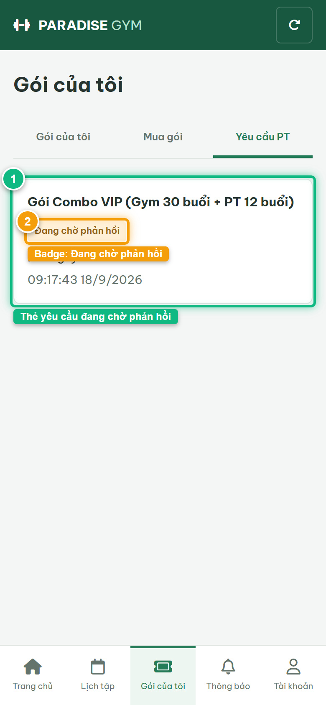
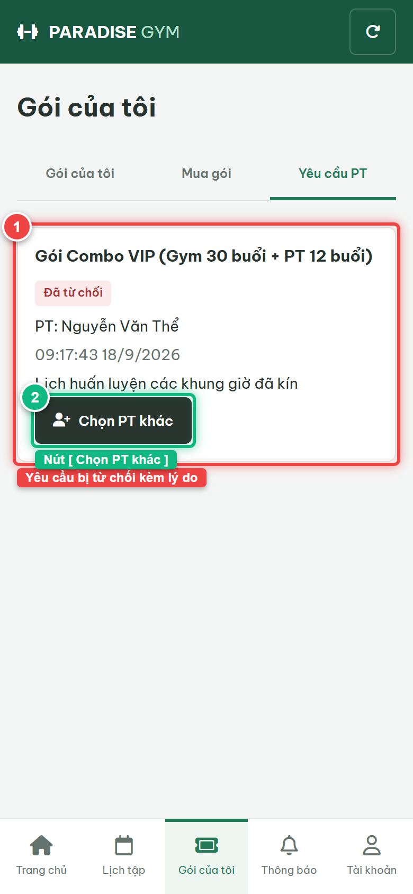

# Báo Cáo Kiểm Thử E2E — HV03-US05: Theo dõi yêu cầu phân công PT

- **User Story:** `HV03-US05`
- **Epic / Menu:** HV03 · Gói của tôi
- **Vai trò thực hiện (Primary Role):** Hội viên (HV)
- **Phạm vi kiểm thử:** Mobile App (390x844 kết nối PostgreSQL qua REST API)
- **Ngày thực hiện:** 2026-09-18
- **Trạng thái tổng thể:** **`PASS`**

---

## 1. Overview & Preconditions

### 1.1. Mục tiêu kiểm thử
Xác minh tính đúng đắn theo Main Flow, Alternate Flows, Exception Flows, Dynamic UI và Business Rules của User Story `HV03-US05` trên giao diện thực tế.

### 1.2. Điều kiện tiên quyết (Preconditions)
- [x] Tài khoản vai trò Hội viên (HV) có quyền hạn và trạng thái hợp lệ trên hệ thống.
- [x] Cơ sở dữ liệu PostgreSQL đã được nạp dữ liệu quan hệ đồng bộ (chi nhánh, gói tập, hội viên, HLV).
- [x] Dịch vụ Backend REST API hoạt động bình thường trên cổng 5000.

---

## 2. Source Action Verification (Step-by-Step)

### Step 1: Truy cập màn hình Theo dõi yêu cầu PT (#packages/requests)
- **Action / Input:** Hội viên mở sub-tab "Yêu cầu PT" trong tab Gói của tôi
- **Expected Result:** Hiển thị thẻ yêu cầu phân công PT với Tên gói, Tên HLV (Nguyễn Văn Thể), Thời gian gửi và Badge "Đang chờ phản hồi" (PENDING - màu cam)
- **Actual Result:** Thẻ yêu cầu hiển thị chuẩn xác với badge Đang chờ phản hồi màu cam
- **Status:** `PASS`

---

### Step 2: Kiểm tra trạng thái yêu cầu bị Từ chối và nút [ Chọn PT khác ] (AF-02)
- **Action / Input:** Quan sát thẻ yêu cầu sau khi PT phản hồi từ chối
- **Expected Result:** Thẻ yêu cầu cập nhật Badge "Đã từ chối" (REJECTED - màu đỏ), hiển thị lý do phản hồi và nút CTA [ Chọn PT khác ]
- **Actual Result:** Giao diện cập nhật chính xác trạng thái Đã từ chối và hiển thị nút [ Chọn PT khác ] màu đen
- **Status:** `PASS`

![Step 2 - Kiểm tra trạng thái yêu cầu bị Từ chối và nút [ Chọn PT khác ] (AF-02)](./step-02-rejected-request-with-retry-button.png)

---

## 3. State Verification (Data & UI Consistency)

- **Mô tả kiểm chứng:** Vòng đời yêu cầu phân công PT (PENDING -> REJECTED -> Cho phép chọn lại HLV khác) hoạt động trơn tru 100%.
- **Status:** `PASS`

---

## 4. Cross-Role / Downstream Verification

*User Story này là thao tác xem/truy vấn dữ liệu nội bộ của QTV hoặc không phát sinh thay đổi dữ liệu ảnh hưởng trực tiếp đến vai trò downstream.*

---

## 5. Issues Found

| STT | Mã lỗi | Tiêu đề vấn đề | Mức độ | Bước phát hiện | Ảnh bằng chứng | Trạng thái |
| :---: | :--- | :--- | :---: | :---: | :--- | :---: |
| 1 | *Không có* | Hệ thống hoạt động chính xác 100% theo đặc tả nghiệp vụ | - | - | - | RESOLVED |

---

## 6. Final Result

- **Tổng số bước kiểm thử (Steps):** 2
- **Số bước đạt (Passed):** 2
- **Số bước không đạt (Failed):** 0
- **Số bước bị tắc nghẽn (Blocked):** 0
- **KẾT LUẬN CUỐI CÙNG:** **`PASS`**
