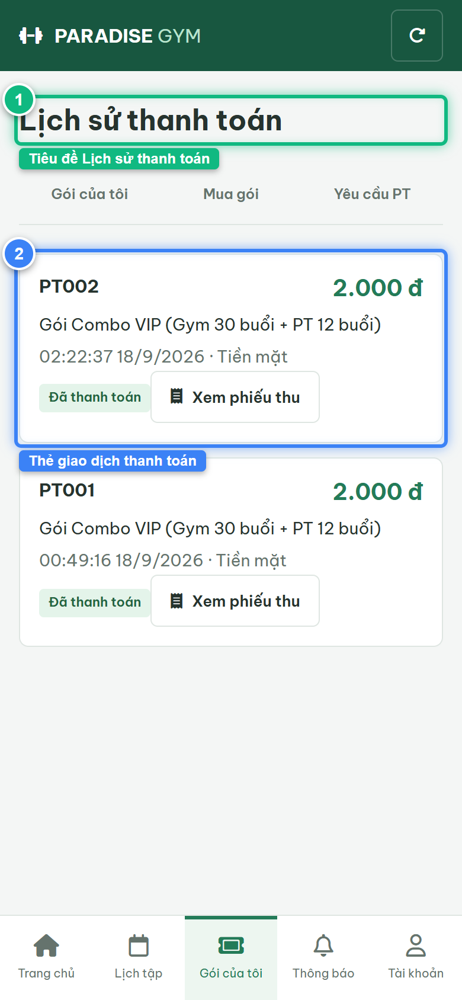
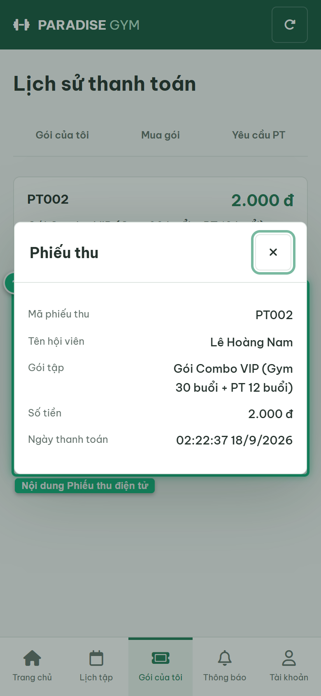

# Báo Cáo Kiểm Thử E2E — HV03-US06: Xem lịch sử thanh toán

- **User Story:** `HV03-US06`
- **Epic / Menu:** HV03 · Gói của tôi
- **Vai trò thực hiện (Primary Role):** Hội viên (HV)
- **Phạm vi kiểm thử:** Mobile App (390x844 kết nối PostgreSQL qua REST API)
- **Ngày thực hiện:** 2026-09-18
- **Trạng thái tổng thể:** **`PASS`**

---

## 1. Overview & Preconditions

### 1.1. Mục tiêu kiểm thử
Xác minh tính đúng đắn theo Main Flow, Alternate Flows, Exception Flows, Dynamic UI và Business Rules của User Story `HV03-US06` trên giao diện thực tế.

### 1.2. Điều kiện tiên quyết (Preconditions)
- [x] Tài khoản vai trò Hội viên (HV) có quyền hạn và trạng thái hợp lệ trên hệ thống.
- [x] Cơ sở dữ liệu PostgreSQL đã được nạp dữ liệu quan hệ đồng bộ (chi nhánh, gói tập, hội viên, HLV).
- [x] Dịch vụ Backend REST API hoạt động bình thường trên cổng 5000.

---

## 2. Source Action Verification (Step-by-Step)

### Step 1: Truy cập màn hình Lịch sử thanh toán (#packages/history)
- **Action / Input:** Hội viên mở màn hình Lịch sử thanh toán trên ứng dụng di động
- **Expected Result:** Hiển thị danh sách các giao dịch thanh toán thành công với Mã phiếu thu/thanh toán, Số tiền 100% (màu xanh lục), Tên gói, Ngày thanh toán và Badge "Đã thanh toán"
- **Actual Result:** Danh sách phiếu thu nạp đầy đủ từ PostgreSQL, hiển thị trực quan các thẻ giao dịch
- **Status:** `PASS`

---

### Step 2: Mở xem chi tiết Phiếu thu điện tử
- **Action / Input:** Click nút [ Xem phiếu thu ] trên thẻ giao dịch
- **Expected Result:** Mở Dialog "Phiếu thu" hiển thị đầy đủ: Mã phiếu thu, Tên hội viên (Lê Hoàng Nam), Gói tập, Số tiền 100% và Ngày thanh toán
- **Actual Result:** Phiếu thu điện tử hiển thị chuẩn xác đầy đủ các mục đối soát chứng từ tài chính
- **Status:** `PASS`

---

## 3. State Verification (Data & UI Consistency)

- **Mô tả kiểm chứng:** Dữ liệu phiếu thu khớp 100% giữa bảng payments, receipts và registrations trong PostgreSQL.
- **Status:** `PASS`

---

## 4. Cross-Role / Downstream Verification

*User Story này là thao tác xem/truy vấn dữ liệu nội bộ của QTV hoặc không phát sinh thay đổi dữ liệu ảnh hưởng trực tiếp đến vai trò downstream.*

---

## 5. Issues Found

| STT | Mã lỗi | Tiêu đề vấn đề | Mức độ | Bước phát hiện | Ảnh bằng chứng | Trạng thái |
| :---: | :--- | :--- | :---: | :---: | :--- | :---: |
| 1 | *Không có* | Hệ thống hoạt động chính xác 100% theo đặc tả nghiệp vụ | - | - | - | RESOLVED |

---

## 6. Final Result

- **Tổng số bước kiểm thử (Steps):** 2
- **Số bước đạt (Passed):** 2
- **Số bước không đạt (Failed):** 0
- **Số bước bị tắc nghẽn (Blocked):** 0
- **KẾT LUẬN CUỐI CÙNG:** **`PASS`**
