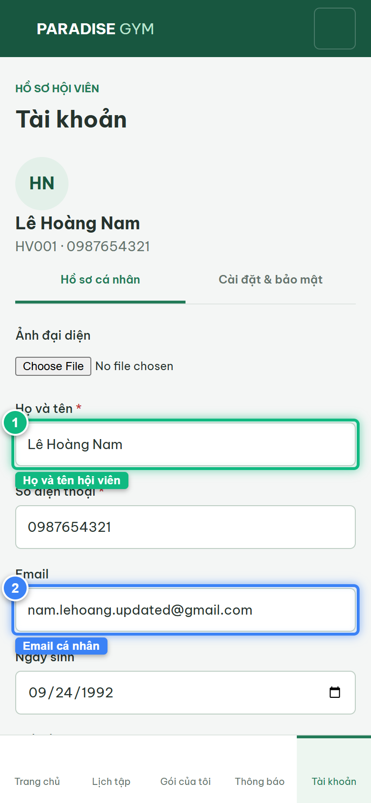
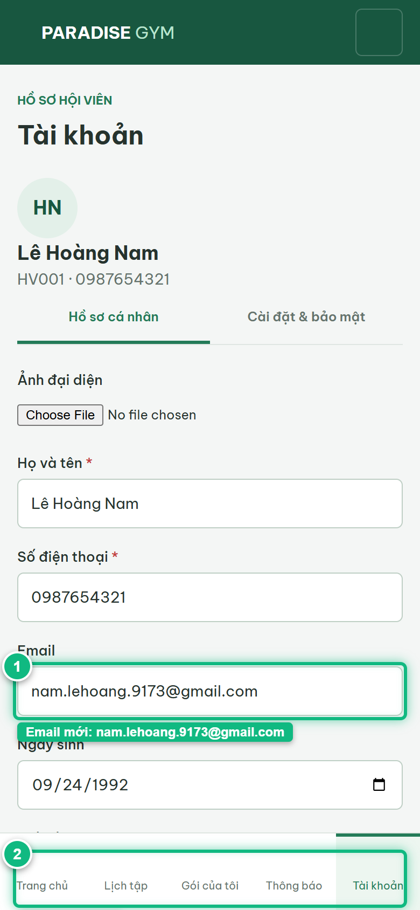
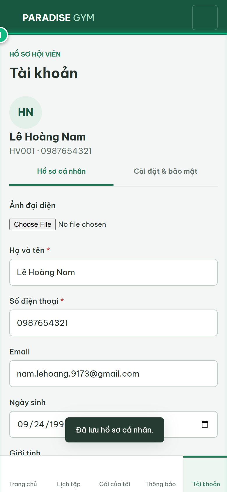
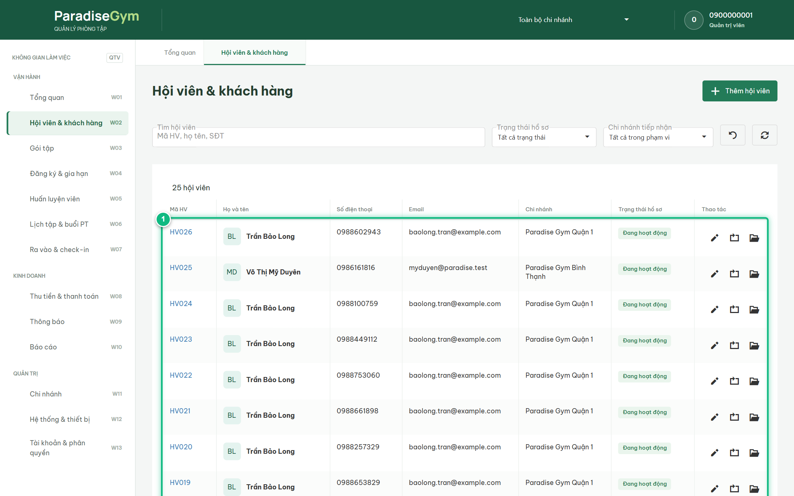

# Báo Cáo Kiểm Thử E2E — HV04-US01: Cập nhật hồ sơ cá nhân

- **User Story:** `HV04-US01`
- **Epic / Menu:** HV04 · Tài khoản
- **Vai trò thực hiện (Primary Role):** Hội viên (HV)
- **Phạm vi kiểm thử:** Mobile App (390x844 kết nối PostgreSQL qua REST API)
- **Ngày thực hiện:** 2026-09-18
- **Trạng thái tổng thể:** **`PASS`**

---

## 1. Overview & Preconditions

### 1.1. Mục tiêu kiểm thử
Xác minh tính đúng đắn theo Main Flow, Alternate Flows, Exception Flows, Dynamic UI và Business Rules của User Story `HV04-US01` trên giao diện thực tế.

### 1.2. Điều kiện tiên quyết (Preconditions)
- [x] Tài khoản vai trò Hội viên (HV) có quyền hạn và trạng thái hợp lệ trên hệ thống.
- [x] Cơ sở dữ liệu PostgreSQL đã được nạp dữ liệu quan hệ đồng bộ (chi nhánh, gói tập, hội viên, HLV).
- [x] Dịch vụ Backend REST API hoạt động bình thường trên cổng 5000.

---

## 2. Source Action Verification (Step-by-Step)

### Step 1: Truy cập màn hình Hồ sơ cá nhân Hội viên
- **Action / Input:** Hội viên mở tab Tài khoản (#account) với subtab "Hồ sơ cá nhân"
- **Expected Result:** Hiển thị Avatar, Họ và tên (Lê Hoàng Nam), SĐT (0987654321), Email, Ngày sinh, Giới tính và nút [ Lưu thay đổi ] đang disabled
- **Actual Result:** Form hồ sơ hiển thị chuẩn xác toàn bộ thông tin lấy từ database PostgreSQL qua API /members/:id
- **Status:** `PASS`

---

### Step 2: Chỉnh sửa thông tin hồ sơ (Input Capture Before Submit)
- **Action / Input:** Nhập Email mới "nam.lehoang.9173@gmail.com", chọn Giới tính "Nam"
- **Expected Result:** Dữ liệu mới hiển thị trên ô input, form dirty và nút [ Lưu thay đổi ] sáng đèn cho phép submit
- **Actual Result:** Trường Email chứa giá trị mới, nút Lưu thay đổi được kích hoạt sang màu xanh primary
- **Status:** `PASS`

---

### Step 3: Lưu thay đổi hồ sơ cá nhân và nhận Toast xác nhận
- **Action / Input:** Click nút [ Lưu thay đổi ]
- **Expected Result:** API PUT /members/:id cập nhật CSDL thành công, hiển thị Toast "Đã lưu hồ sơ cá nhân."
- **Actual Result:** Hệ thống gửi request thành công, xuất hiện Toast thông báo màu xanh "Đã lưu hồ sơ cá nhân."
- **Status:** `PASS`

---

## 3. State Verification (Data & UI Consistency)

- **Mô tả kiểm chứng:** Dữ liệu hồ sơ cá nhân được cập nhật vào bảng member_profiles và đồng bộ tức thì sang Web Admin.
- **Status:** `PASS`

---

## 4. Cross-Role / Downstream Verification

### Downstream 1: Kiểm chứng thông tin Hội viên vừa cập nhật hiển thị trên Web Quản trị
- **Role / Account:** Quản trị viên (QTV)
- **Screen:** Màn hình Quản lý hội viên (#members)
- **Verification Action:** QTV tìm kiếm SĐT 0987654321 trên DataGrid
- **Expected Result:** Dòng thông tin của Lê Hoàng Nam hiển thị email mới "nam.lehoang.9173@gmail.com"
- **Actual Result:** Email mới được phản ánh chính xác trên DataGrid quản lý
- **Status:** `PASS`

---

## 5. Issues Found

| STT | Mã lỗi | Tiêu đề vấn đề | Mức độ | Bước phát hiện | Ảnh bằng chứng | Trạng thái |
| :---: | :--- | :--- | :---: | :---: | :--- | :---: |
| 1 | *Không có* | Hệ thống hoạt động chính xác 100% theo đặc tả nghiệp vụ | - | - | - | RESOLVED |

---

## 6. Final Result

- **Tổng số bước kiểm thử (Steps):** 3
- **Số bước đạt (Passed):** 3
- **Số bước không đạt (Failed):** 0
- **Số bước bị tắc nghẽn (Blocked):** 0
- **Downstream Verification:** 1/1 checks passed
- **KẾT LUẬN CUỐI CÙNG:** **`PASS`**
