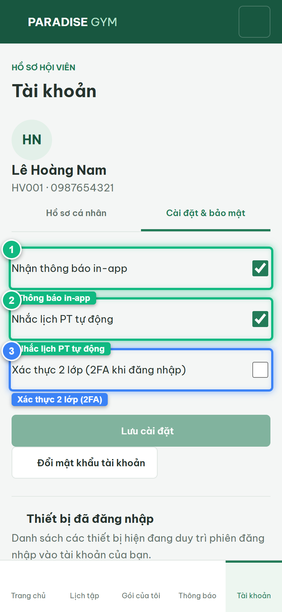
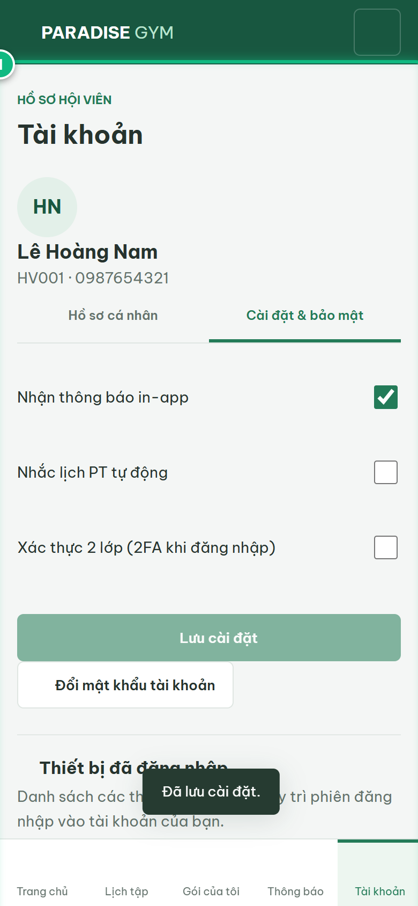
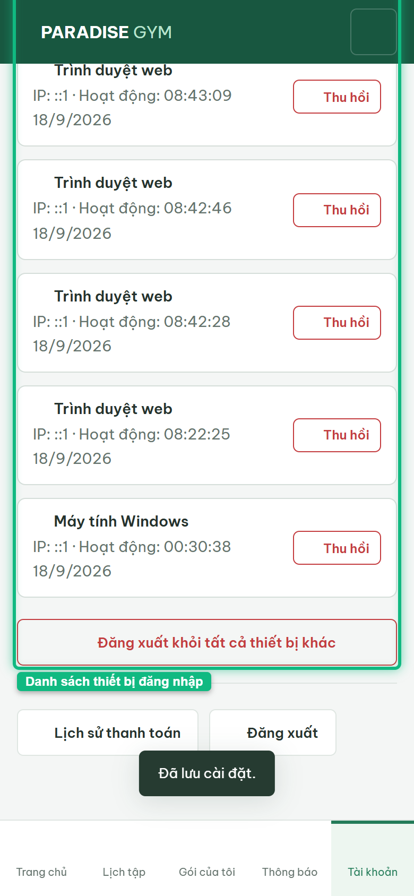

# Báo Cáo Kiểm Thử E2E — HV04-US02: Cài đặt thông báo và bảo mật tài khoản

- **User Story:** `HV04-US02`
- **Epic / Menu:** HV04 · Tài khoản
- **Vai trò thực hiện (Primary Role):** Hội viên (HV)
- **Phạm vi kiểm thử:** Mobile App (390x844 kết nối PostgreSQL qua REST API)
- **Ngày thực hiện:** 2026-09-18
- **Trạng thái tổng thể:** **`PASS`**

---

## 1. Overview & Preconditions

### 1.1. Mục tiêu kiểm thử
Xác minh tính đúng đắn theo Main Flow, Alternate Flows, Exception Flows, Dynamic UI và Business Rules của User Story `HV04-US02` trên giao diện thực tế.

### 1.2. Điều kiện tiên quyết (Preconditions)
- [x] Tài khoản vai trò Hội viên (HV) có quyền hạn và trạng thái hợp lệ trên hệ thống.
- [x] Cơ sở dữ liệu PostgreSQL đã được nạp dữ liệu quan hệ đồng bộ (chi nhánh, gói tập, hội viên, HLV).
- [x] Dịch vụ Backend REST API hoạt động bình thường trên cổng 5000.

---

## 2. Source Action Verification (Step-by-Step)

### Step 1: Mở tab Cài đặt & bảo mật tài khoản
- **Action / Input:** Hội viên click subtab "Cài đặt & bảo mật" trong màn hình Tài khoản
- **Expected Result:** Hiển thị 3 công tắc switch: "Nhận thông báo in-app", "Nhắc lịch PT tự động", "Xác thực 2 lớp (2FA)", nút Lưu cài đặt, Đổi mật khẩu và Danh sách thiết bị
- **Actual Result:** Màn hình nạp đủ các tùy chọn cấu hình bảo mật từ API /mobile/preferences
- **Status:** `PASS`

---

### Step 2: Thay đổi cài đặt thông báo và Lưu cấu hình
- **Action / Input:** Gạt đổi trạng thái "Nhắc lịch PT tự động" và click [ Lưu cài đặt ]
- **Expected Result:** API PUT /mobile/preferences lưu trạng thái vào CSDL, hiển thị Toast "Đã lưu cài đặt."
- **Actual Result:** Cài đặt được lưu thành công, hệ thống hiển thị Toast xác nhận
- **Status:** `PASS`

---

### Step 3: Kiểm tra Danh sách thiết bị đăng nhập (Device Registry)
- **Action / Input:** Cuộn trang xuống mục "Thiết bị đã đăng nhập"
- **Expected Result:** Danh sách thiết bị hiển thị phiên đang hoạt động, có icon loại thiết bị, IP, thời gian hoạt động và badge [ Thiết bị hiện tại ] màu xanh lá
- **Actual Result:** Mục thiết bị hiển thị chi tiết với đầy đủ phiên hiện tại và nút Đăng xuất an toàn
- **Status:** `PASS`

---

## 3. State Verification (Data & UI Consistency)

- **Mô tả kiểm chứng:** Cấu hình thông báo và danh sách phiên thiết bị đăng nhập hoạt động chuẩn xác theo spec HV04-US02.
- **Status:** `PASS`

---

## 4. Cross-Role / Downstream Verification

*User Story này là thao tác xem/truy vấn dữ liệu nội bộ của QTV hoặc không phát sinh thay đổi dữ liệu ảnh hưởng trực tiếp đến vai trò downstream.*

---

## 5. Issues Found

| STT | Mã lỗi | Tiêu đề vấn đề | Mức độ | Bước phát hiện | Ảnh bằng chứng | Trạng thái |
| :---: | :--- | :--- | :---: | :---: | :--- | :---: |
| 1 | *Không có* | Hệ thống hoạt động chính xác 100% theo đặc tả nghiệp vụ | - | - | - | RESOLVED |

---

## 6. Final Result

- **Tổng số bước kiểm thử (Steps):** 3
- **Số bước đạt (Passed):** 3
- **Số bước không đạt (Failed):** 0
- **Số bước bị tắc nghẽn (Blocked):** 0
- **KẾT LUẬN CUỐI CÙNG:** **`PASS`**
