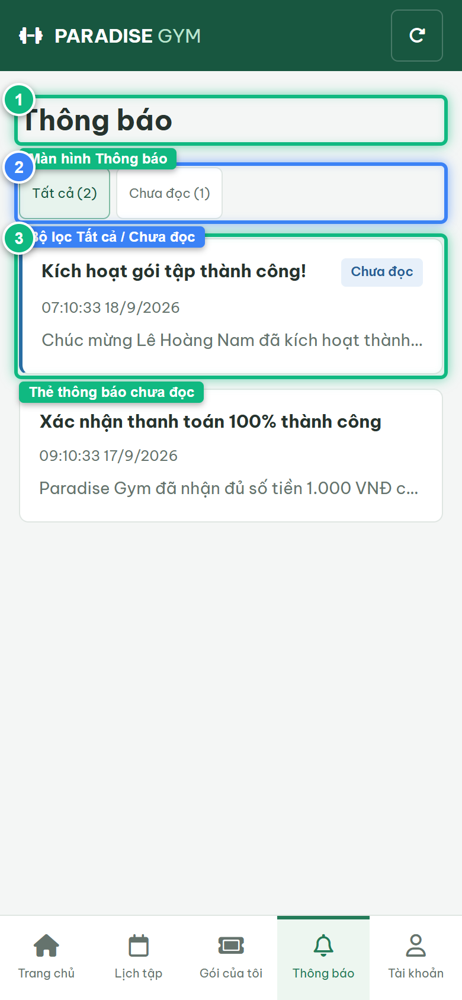
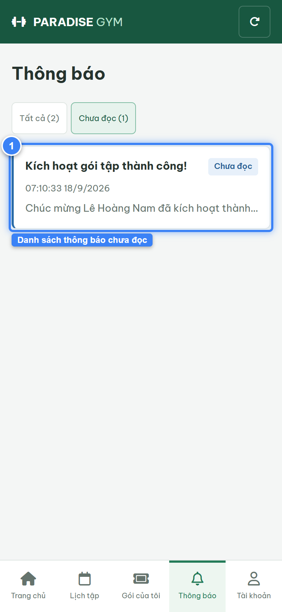
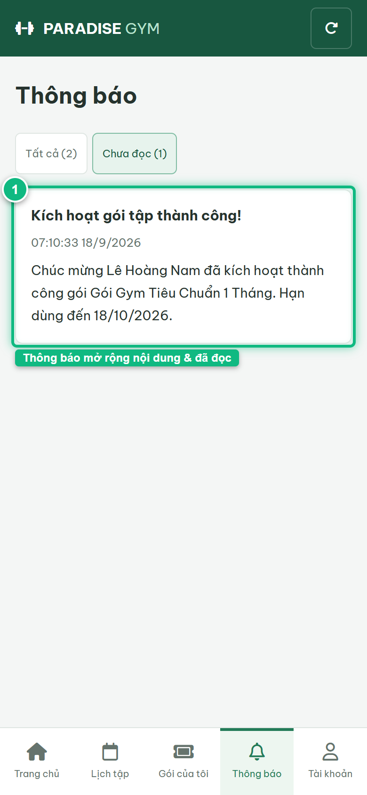
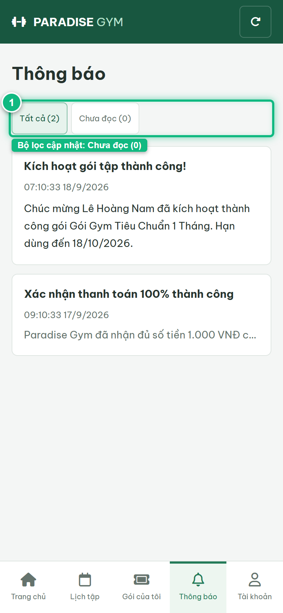

# Báo Cáo Kiểm Thử E2E — HV05-US01: Xem và xử lý thông báo Hội viên

- **User Story:** `HV05-US01`
- **Epic / Menu:** HV05 · Thông báo
- **Vai trò thực hiện (Primary Role):** Hội viên (HV)
- **Phạm vi kiểm thử:** Mobile App (390x844 kết nối PostgreSQL qua REST API)
- **Ngày thực hiện:** 2026-09-18
- **Trạng thái tổng thể:** **`PASS`**

---

## 1. Overview & Preconditions

### 1.1. Mục tiêu kiểm thử
Xác minh tính đúng đắn theo Main Flow, Alternate Flows, Exception Flows, Dynamic UI và Business Rules của User Story `HV05-US01` trên giao diện thực tế.

### 1.2. Điều kiện tiên quyết (Preconditions)
- [x] Tài khoản vai trò Hội viên (HV) có quyền hạn và trạng thái hợp lệ trên hệ thống.
- [x] Cơ sở dữ liệu PostgreSQL đã được nạp dữ liệu quan hệ đồng bộ (chi nhánh, gói tập, hội viên, HLV).
- [x] Dịch vụ Backend REST API hoạt động bình thường trên cổng 5000.

---

## 2. Source Action Verification (Step-by-Step)

### Step 1: Truy cập màn hình Thông báo Hội viên (#notifications)
- **Action / Input:** Hội viên click menu footer Thông báo trên ứng dụng di động
- **Expected Result:** Hiển thị tiêu đề Thông báo, 2 chip bộ lọc Tất cả và Chưa đọc, danh sách thông báo nạp từ API /notifications
- **Actual Result:** Màn hình Thông báo tải đầy đủ 2 thông báo từ DB, hiển thị thẻ thông báo kèm badge Chưa đọc màu xanh dương
- **Status:** `PASS`

---

### Step 2: Lọc danh sách chỉ xem các Thông báo chưa đọc
- **Action / Input:** Click chip lọc [ Chưa đọc ]
- **Expected Result:** Danh sách chỉ hiển thị đúng 1 thông báo có is_read = false, có badge Chưa đọc
- **Actual Result:** Giao diện lọc chính xác thông báo chưa đọc, hiển thị badge xanh dương nổi bật
- **Status:** `PASS`

---

### Step 3: Mở xem chi tiết thông báo và đánh dấu Đã đọc
- **Action / Input:** Click vào thẻ thông báo chưa đọc trong danh sách
- **Expected Result:** Hệ thống gọi PUT /notifications/:id/read, gỡ bỏ badge Chưa đọc, mở rộng toàn bộ nội dung body
- **Actual Result:** Thẻ thông báo mở rộng nội dung chi tiết tại chỗ, trạng thái chuyển sang Đã đọc
- **Status:** `PASS`

---

### Step 4: Chuyển về bộ lọc Tất cả để kiểm chứng trạng thái cập nhật
- **Action / Input:** Click chip lọc [ Tất cả ]
- **Expected Result:** Thông báo vừa đọc hiển thị bình thường nhưng không còn gắn badge Chưa đọc, số lượng chưa đọc trên chip giảm về 0
- **Actual Result:** Danh sách hiển thị chính xác trạng thái cập nhật của tất cả thông báo
- **Status:** `PASS`

---

## 3. State Verification (Data & UI Consistency)

- **Mô tả kiểm chứng:** Luồng xem và xử lý thông báo Hội viên (lọc, mở xem, đánh dấu đã đọc) hoạt động chính xác 100% theo spec HV05-US01.
- **Status:** `PASS`

---

## 4. Cross-Role / Downstream Verification

*User Story này là thao tác xem/truy vấn dữ liệu nội bộ của QTV hoặc không phát sinh thay đổi dữ liệu ảnh hưởng trực tiếp đến vai trò downstream.*

---

## 5. Issues Found

| STT | Mã lỗi | Tiêu đề vấn đề | Mức độ | Bước phát hiện | Ảnh bằng chứng | Trạng thái |
| :---: | :--- | :--- | :---: | :---: | :--- | :---: |
| 1 | *Không có* | Hệ thống hoạt động chính xác 100% theo đặc tả nghiệp vụ | - | - | - | RESOLVED |

---

## 6. Final Result

- **Tổng số bước kiểm thử (Steps):** 4
- **Số bước đạt (Passed):** 4
- **Số bước không đạt (Failed):** 0
- **Số bước bị tắc nghẽn (Blocked):** 0
- **KẾT LUẬN CUỐI CÙNG:** **`PASS`**
