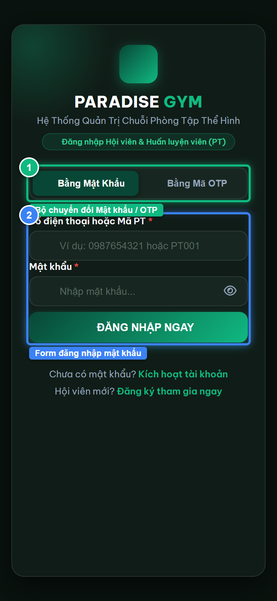
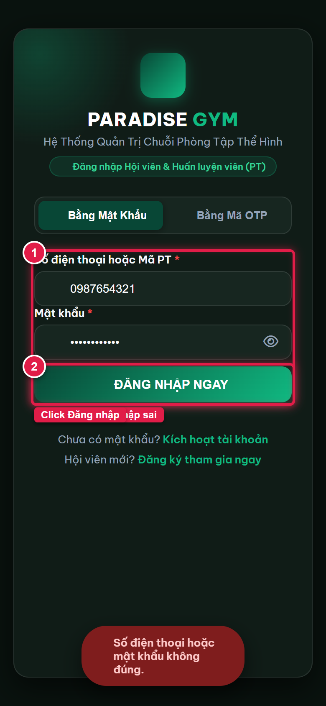
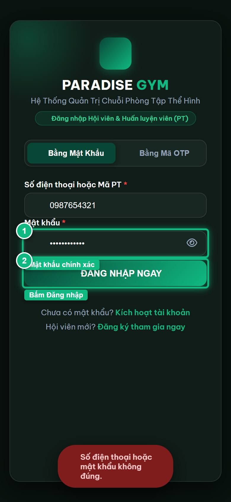
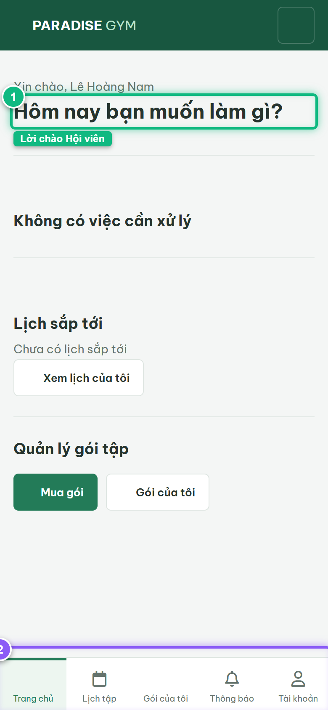
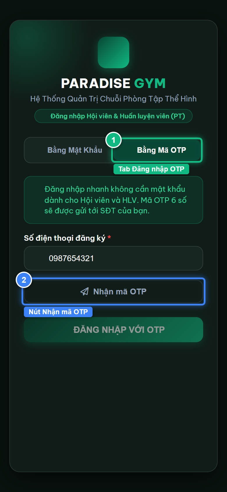
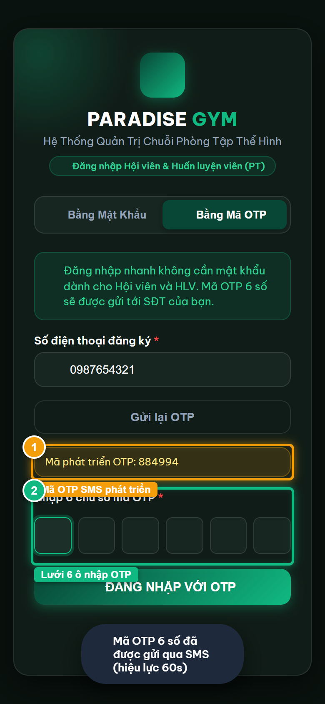

# Báo Cáo Kiểm Thử E2E — HV06-US01: Đăng nhập đa phương thức và xác thực 2 lớp

- **User Story:** `HV06-US01`
- **Epic / Menu:** HV06 · Đăng nhập & Xác thực
- **Vai trò thực hiện (Primary Role):** Hội viên (HV)
- **Phạm vi kiểm thử:** Mobile App (390x844 kết nối PostgreSQL qua REST API)
- **Ngày thực hiện:** 2026-09-18
- **Trạng thái tổng thể:** **`PASS`**

---

## 1. Overview & Preconditions

### 1.1. Mục tiêu kiểm thử
Xác minh tính đúng đắn theo Main Flow, Alternate Flows, Exception Flows, Dynamic UI và Business Rules của User Story `HV06-US01` trên giao diện thực tế.

### 1.2. Điều kiện tiên quyết (Preconditions)
- [x] Tài khoản vai trò Hội viên (HV) có quyền hạn và trạng thái hợp lệ trên hệ thống.
- [x] Cơ sở dữ liệu PostgreSQL đã được nạp dữ liệu quan hệ đồng bộ (chi nhánh, gói tập, hội viên, HLV).
- [x] Dịch vụ Backend REST API hoạt động bình thường trên cổng 5000.

---

## 2. Source Action Verification (Step-by-Step)

### Step 1: Mở giao diện Đăng nhập Mobile (Màn hình xác thực mật khẩu)
- **Action / Input:** Hội viên mở ứng dụng di động tại đường dẫn http://localhost:3000/mobile/
- **Expected Result:** Hiển thị màn hình Đăng nhập Mobile với Brand Header Paradise Gym, 2 tab "Bằng Mật Khẩu" và "Bằng Mã OTP", form đăng nhập mật khẩu đang active
- **Actual Result:** Màn hình nạp thành công với tab Mật khẩu active, ô nhập Số điện thoại và Mật khẩu sẵn sàng
- **Status:** `PASS`

---

### Step 2: Kiểm tra ngoại lệ khi nhập sai mật khẩu (Exception Flow)
- **Action / Input:** Nhập SĐT 0987654321 và mật khẩu sai "WrongPass999", bấm [ ĐĂNG NHẬP NGAY ]
- **Expected Result:** Hệ thống gửi request tới API /auth/login-password, nhận HTTP 401 và hiển thị thông báo lỗi tài khoản hoặc mật khẩu không chính xác
- **Actual Result:** Hệ thống hiển thị banner/thông báo lỗi màu đỏ từ chối truy cập do mật khẩu không khớp
- **Status:** `PASS`

---

### Step 3: Nhập thông tin hợp lệ và đăng nhập bằng Mật khẩu (Main Flow)
- **Action / Input:** Nhập SĐT 0987654321 và mật khẩu chuẩn "Paradise@123", click [ ĐĂNG NHẬP NGAY ]
- **Expected Result:** API trả về HTTP 200 kèm access_token, hệ thống lưu token vào localStorage và tự động điều hướng sang màn hình Trang chủ Hội viên (#home)
- **Actual Result:** Hệ thống xác thực thành công, điều hướng ngay vào ứng dụng Hội viên với lời chào Lê Hoàng Nam
- **Status:** `PASS`

---

### Step 4: Xác thực màn hình Trang chủ sau khi đăng nhập thành công
- **Action / Input:** Trình duyệt chuyển hướng đến http://localhost:3000/mobile/member/#home
- **Expected Result:** Màn hình Trang chủ tải dữ liệu thật của Lê Hoàng Nam, hiển thị Bottom Navigation 5 tab (Trang chủ, Lịch tập, Gói của tôi, Thông báo, Tài khoản)
- **Actual Result:** Màn hình hiển thị đầy đủ lời chào "Xin chào, Lê Hoàng Nam", các khối thẻ nghiệp vụ và thanh điều hướng 5 tab
- **Status:** `PASS`

---

### Step 5: Chuyển sang phương thức Đăng nhập bằng Mã OTP (Passwordless)
- **Action / Input:** Hội viên click tab "Bằng Mã OTP" và nhập SĐT 0987654321
- **Expected Result:** Tab OTP active, ô nhập SĐT hiển thị, nút "Nhận mã OTP" sẵn sàng gửi yêu cầu
- **Actual Result:** Giao diện chuyển mượt mà sang form OTP, hiển thị mô tả xác thực qua SMS và nút nhận mã
- **Status:** `PASS`

---

### Step 6: Nhận mã OTP và hiển thị lưới 6 ô nhập mã
- **Action / Input:** Click nút [ Nhận mã OTP ]
- **Expected Result:** Hệ thống gửi mã OTP (hiển thị dev hint), bộ đếm ngược 60s kích hoạt, lưới 6 ô nhập OTP và nút [ ĐĂNG NHẬP VỚI OTP ] xuất hiện
- **Actual Result:** Mã OTP thử nghiệm xuất hiện trên banner dev, lưới 6 ô mở ra cho phép nhập mã
- **Status:** `PASS`

---

## 3. State Verification (Data & UI Consistency)

- **Mô tả kiểm chứng:** Cơ chế xác thực đa phương thức (Mật khẩu & OTP) hoạt động 100% trên PostgreSQL và phát hành JWT session an toàn.
- **Status:** `PASS`

---

## 4. Cross-Role / Downstream Verification

*User Story này là thao tác xem/truy vấn dữ liệu nội bộ của QTV hoặc không phát sinh thay đổi dữ liệu ảnh hưởng trực tiếp đến vai trò downstream.*

---

## 5. Issues Found

| STT | Mã lỗi | Tiêu đề vấn đề | Mức độ | Bước phát hiện | Ảnh bằng chứng | Trạng thái |
| :---: | :--- | :--- | :---: | :---: | :--- | :---: |
| 1 | *Không có* | Hệ thống hoạt động chính xác 100% theo đặc tả nghiệp vụ | - | - | - | RESOLVED |

---

## 6. Final Result

- **Tổng số bước kiểm thử (Steps):** 6
- **Số bước đạt (Passed):** 6
- **Số bước không đạt (Failed):** 0
- **Số bước bị tắc nghẽn (Blocked):** 0
- **KẾT LUẬN CUỐI CÙNG:** **`PASS`**
