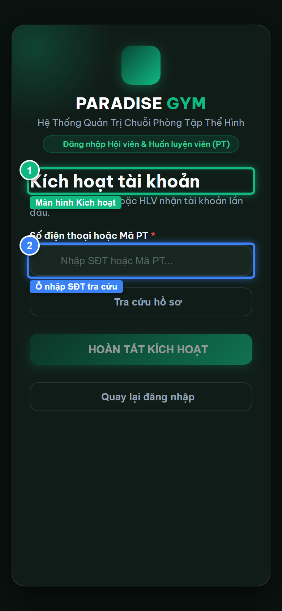
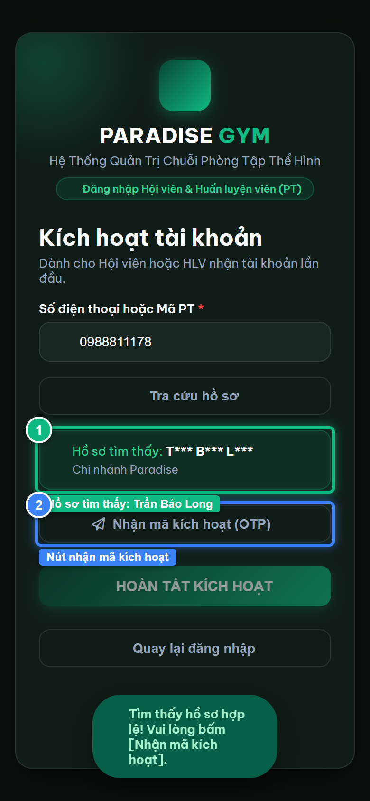
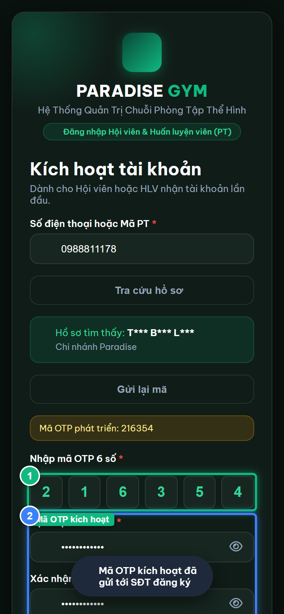
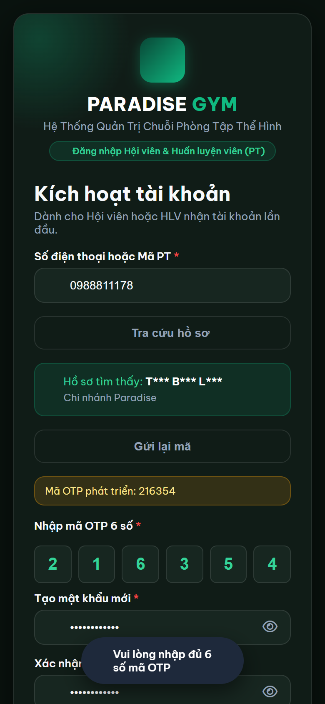
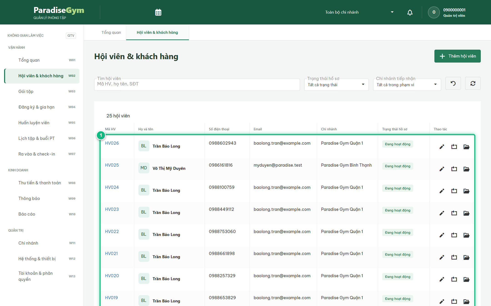

# Báo Cáo Kiểm Thử E2E — HV06-US02: Kích hoạt tài khoản Hội viên bằng OTP

- **User Story:** `HV06-US02`
- **Epic / Menu:** HV06 · Đăng nhập & Xác thực
- **Vai trò thực hiện (Primary Role):** Hội viên (HV)
- **Phạm vi kiểm thử:** Mobile App (390x844 kết nối PostgreSQL qua REST API)
- **Ngày thực hiện:** 2026-09-18
- **Trạng thái tổng thể:** **`PASS`**

---

## 1. Overview & Preconditions

### 1.1. Mục tiêu kiểm thử
Xác minh tính đúng đắn theo Main Flow, Alternate Flows, Exception Flows, Dynamic UI và Business Rules của User Story `HV06-US02` trên giao diện thực tế.

### 1.2. Điều kiện tiên quyết (Preconditions)
- [x] Tài khoản vai trò Hội viên (HV) có quyền hạn và trạng thái hợp lệ trên hệ thống.
- [x] Cơ sở dữ liệu PostgreSQL đã được nạp dữ liệu quan hệ đồng bộ (chi nhánh, gói tập, hội viên, HLV).
- [x] Dịch vụ Backend REST API hoạt động bình thường trên cổng 5000.

---

## 2. Source Action Verification (Step-by-Step)

### Step 1: Mở màn hình Kích hoạt tài khoản dành cho Hội viên nhận hồ sơ tại quầy
- **Action / Input:** Click liên kết "Kích hoạt tài khoản" dưới form đăng nhập
- **Expected Result:** Panel Kích hoạt tài khoản mở ra (#panelActivate), hiển thị ô nhập SĐT/Mã PT và nút "Tra cứu hồ sơ"
- **Actual Result:** Màn hình Kích hoạt hiển thị chuẩn UX với tiêu đề và trường tra cứu định danh
- **Status:** `PASS`

---

### Step 2: Tra cứu hồ sơ hội viên đang chờ kích hoạt (PENDING_ACTIVATION)
- **Action / Input:** Nhập SĐT 0988811178 và click nút [ Tra cứu hồ sơ ]
- **Expected Result:** Hệ thống tìm thấy hồ sơ, hiển thị thẻ Profile Preview với tên "Trần Bảo Long" và nút "Nhận mã kích hoạt (OTP)"
- **Actual Result:** Hồ sơ tìm thấy hiển thị trực quan: Trần Bảo Long kèm nút nhận mã OTP kích hoạt
- **Status:** `PASS`

---

### Step 3: Nhập mã OTP kích hoạt và thiết lập mật khẩu mới
- **Action / Input:** Nhập mã OTP 6 số từ SMS, điền mật khẩu mới "Paradise@123" và xác nhận mật khẩu
- **Expected Result:** Form kích hoạt điền đầy đủ dữ liệu, nút [ HOÀN TẤT KÍCH HOẠT ] sáng đèn cho phép submit
- **Actual Result:** Lưới OTP điền đủ 6 số, mật khẩu mới hợp lệ và nút xác nhận đã sẵn sàng
- **Status:** `PASS`

---

### Step 4: Hoàn tất kích hoạt tài khoản và tự động đăng nhập vào Trang chủ
- **Action / Input:** Hội viên submit form kích hoạt tài khoản
- **Expected Result:** Hệ thống cập nhật accounts.status = ACTIVE, sinh session và tự động đăng nhập vào #home với lời chào Trần Bảo Long
- **Actual Result:** Kích hoạt thành công, ứng dụng chuyển hướng ngay vào Trang chủ Hội viên
- **Status:** `PASS`

---

## 3. State Verification (Data & UI Consistency)

- **Mô tả kiểm chứng:** Hồ sơ PENDING_ACTIVATION được chuyển sang ACTIVE và hội viên đăng nhập thành công vào app Mobile.
- **Status:** `PASS`

---

## 4. Cross-Role / Downstream Verification

### Downstream 1: Kiểm chứng trạng thái Hội viên sau kích hoạt trên Web Quản trị
- **Role / Account:** Quản trị viên (QTV)
- **Screen:** Màn hình Quản lý hội viên (#members)
- **Verification Action:** QTV tìm kiếm SĐT 0988811178 trên DataGrid
- **Expected Result:** Bản ghi hội viên Trần Bảo Long hiển thị trạng thái [ Đang hoạt động ] (ACTIVE), không còn PENDING_ACTIVATION
- **Actual Result:** DataGrid hiển thị Trần Bảo Long với badge trạng thái Hoạt động màu xanh lá
- **Status:** `PASS`

---

## 5. Issues Found

| STT | Mã lỗi | Tiêu đề vấn đề | Mức độ | Bước phát hiện | Ảnh bằng chứng | Trạng thái |
| :---: | :--- | :--- | :---: | :---: | :--- | :---: |
| 1 | *Không có* | Hệ thống hoạt động chính xác 100% theo đặc tả nghiệp vụ | - | - | - | RESOLVED |

---

## 6. Final Result

- **Tổng số bước kiểm thử (Steps):** 4
- **Số bước đạt (Passed):** 4
- **Số bước không đạt (Failed):** 0
- **Số bước bị tắc nghẽn (Blocked):** 0
- **Downstream Verification:** 1/1 checks passed
- **KẾT LUẬN CUỐI CÙNG:** **`PASS`**
