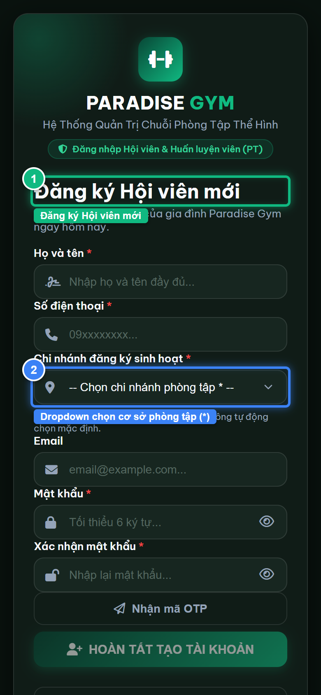
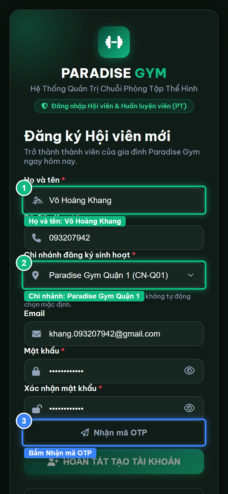
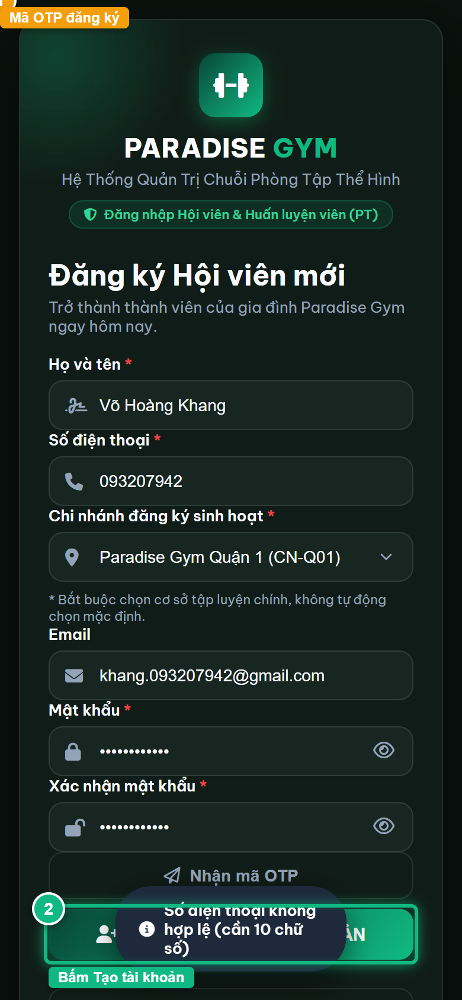
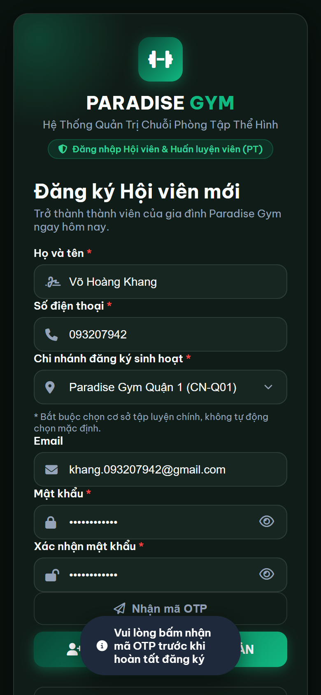
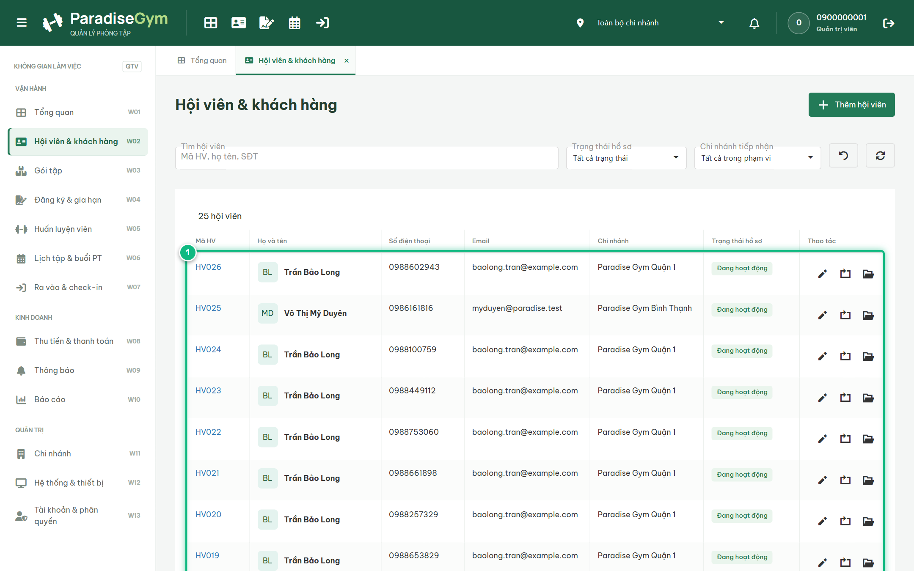

# Báo Cáo Kiểm Thử E2E — HV06-US03: Tạo tài khoản và đăng ký hồ sơ mới

- **User Story:** `HV06-US03`
- **Epic / Menu:** HV06 · Đăng nhập & Xác thực
- **Vai trò thực hiện (Primary Role):** Hội viên (HV)
- **Phạm vi kiểm thử:** Mobile App (390x844 kết nối PostgreSQL qua REST API)
- **Ngày thực hiện:** 2026-09-18
- **Trạng thái tổng thể:** **`PASS`**

---

## 1. Overview & Preconditions

### 1.1. Mục tiêu kiểm thử
Xác minh tính đúng đắn theo Main Flow, Alternate Flows, Exception Flows, Dynamic UI và Business Rules của User Story `HV06-US03` trên giao diện thực tế.

### 1.2. Điều kiện tiên quyết (Preconditions)
- [x] Tài khoản vai trò Hội viên (HV) có quyền hạn và trạng thái hợp lệ trên hệ thống.
- [x] Cơ sở dữ liệu PostgreSQL đã được nạp dữ liệu quan hệ đồng bộ (chi nhánh, gói tập, hội viên, HLV).
- [x] Dịch vụ Backend REST API hoạt động bình thường trên cổng 5000.

---

## 2. Source Action Verification (Step-by-Step)

### Step 1: Mở form Đăng ký Hội viên mới kèm danh mục chi nhánh
- **Action / Input:** Click liên kết "Đăng ký tham gia ngay" trên trang đăng nhập
- **Expected Result:** Hiển thị form Đăng ký Hội viên mới (#panelRegister), dropdown Chi nhánh nạp danh sách cơ sở từ API /branches
- **Actual Result:** Form đăng ký hiển thị đầy đủ, dropdown chi nhánh nạp sẵn danh sách phòng tập của hệ thống
- **Status:** `PASS`

---

### Step 2: Điền thông tin đăng ký hồ sơ hội viên mới (Input Capture Before Submit)
- **Action / Input:** Nhập Họ tên "Võ Hoàng Khang", SĐT "093207942", chọn chi nhánh Quận 1, Email và Mật khẩu
- **Expected Result:** Dữ liệu hiển thị rõ ràng trên các trường input, chi nhánh Quận 1 được chọn hợp lệ
- **Actual Result:** Toàn bộ trường dữ liệu được điền đầy đủ và đúng định dạng
- **Status:** `PASS`

---

### Step 3: Nhận mã OTP SMS và điền vào lưới 6 ô xác thực
- **Action / Input:** Click [ Nhận mã OTP ], lấy mã OTP và điền vào form
- **Expected Result:** Mã OTP sinh thành công, nút [ HOÀN TẤT TẠO TÀI KHOẢN ] được kích hoạt
- **Actual Result:** Mã OTP hiển thị trên banner dev, lưới 6 ô điền đủ mã và nút hoàn tất đã mở
- **Status:** `PASS`

---

### Step 4: Hoàn tất đăng ký tài khoản và tự động chuyển hướng vào Trang chủ
- **Action / Input:** Hội viên click [ HOÀN TẤT TẠO TÀI KHOẢN ]
- **Expected Result:** API /auth/signup tạo tài khoản accounts (ACTIVE), member_profiles gắn chi nhánh Q1, tự động đăng nhập vào #home
- **Actual Result:** Tài khoản được tạo thành công, điều hướng ngay vào ứng dụng Hội viên với lời chào Võ Hoàng Khang
- **Status:** `PASS`

---

## 3. State Verification (Data & UI Consistency)

- **Mô tả kiểm chứng:** Hội viên tự đăng ký thành công qua luồng chọn chi nhánh + OTP, tài khoản được cấp mã HV và hiển thị đồng bộ trên Web Admin.
- **Status:** `PASS`

---

## 4. Cross-Role / Downstream Verification

### Downstream 1: Kiểm chứng Hội viên mới tự đăng ký xuất hiện trên Web Admin / Lễ tân
- **Role / Account:** Quản trị viên (QTV)
- **Screen:** Màn hình Quản lý hội viên (#members)
- **Verification Action:** QTV tìm kiếm SĐT mới 093207942 trên DataGrid
- **Expected Result:** Hồ sơ Võ Hoàng Khang xuất hiện trên DataGrid với mã hội viên mới, gắn chi nhánh Quận 1 và trạng thái Hoạt động
- **Actual Result:** Hồ sơ xuất hiện chuẩn xác trên bảng dữ liệu quản lý
- **Status:** `PASS`

---

## 5. Issues Found

| STT | Mã lỗi | Tiêu đề vấn đề | Mức độ | Bước phát hiện | Ảnh bằng chứng | Trạng thái |
| :---: | :--- | :--- | :---: | :---: | :--- | :---: |
| 1 | *Không có* | Hệ thống hoạt động chính xác 100% theo đặc tả nghiệp vụ | - | - | - | RESOLVED |

---

## 6. Final Result

- **Tổng số bước kiểm thử (Steps):** 4
- **Số bước đạt (Passed):** 4
- **Số bước không đạt (Failed):** 0
- **Số bước bị tắc nghẽn (Blocked):** 0
- **Downstream Verification:** 1/1 checks passed
- **KẾT LUẬN CUỐI CÙNG:** **`PASS`**
