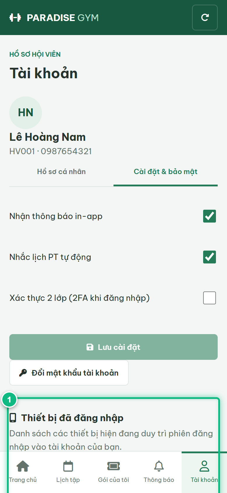
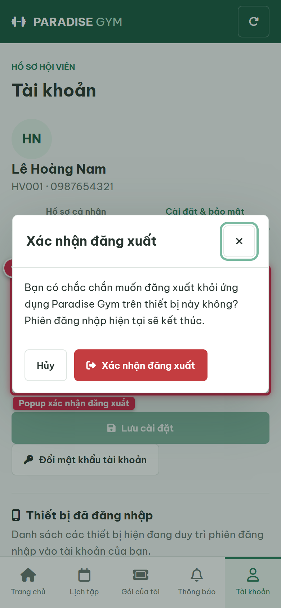
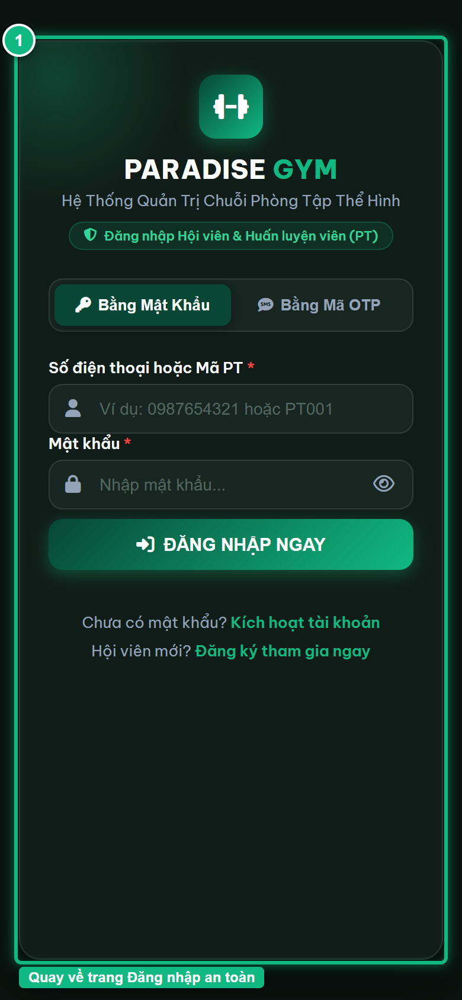

# Báo Cáo Kiểm Thử E2E — HV06-US04: Đăng xuất tài khoản Mobile

- **User Story:** `HV06-US04`
- **Epic / Menu:** HV06 · Đăng nhập & Xác thực
- **Vai trò thực hiện (Primary Role):** Hội viên (HV)
- **Phạm vi kiểm thử:** Mobile App (390x844 kết nối PostgreSQL qua REST API)
- **Ngày thực hiện:** 2026-09-18
- **Trạng thái tổng thể:** **`PASS`**

---

## 1. Overview & Preconditions

### 1.1. Mục tiêu kiểm thử
Xác minh tính đúng đắn theo Main Flow, Alternate Flows, Exception Flows, Dynamic UI và Business Rules của User Story `HV06-US04` trên giao diện thực tế.

### 1.2. Điều kiện tiên quyết (Preconditions)
- [x] Tài khoản vai trò Hội viên (HV) có quyền hạn và trạng thái hợp lệ trên hệ thống.
- [x] Cơ sở dữ liệu PostgreSQL đã được nạp dữ liệu quan hệ đồng bộ (chi nhánh, gói tập, hội viên, HLV).
- [x] Dịch vụ Backend REST API hoạt động bình thường trên cổng 5000.

---

## 2. Source Action Verification (Step-by-Step)

### Step 1: Truy cập màn hình Tài khoản & Cài đặt bảo mật
- **Action / Input:** Hội viên mở tab Tài khoản (#account) và chọn mục "Cài đặt & bảo mật"
- **Expected Result:** Hiển thị mục Cài đặt & bảo mật, thiết lập 2FA và danh sách thiết bị đã đăng nhập
- **Actual Result:** Màn hình hiển thị đầy đủ khối Cài đặt bảo mật và danh sách thiết bị
- **Status:** `PASS`

---

### Step 2: Xác định phiên thiết bị hiện tại với nhãn [ Thiết bị hiện tại ]
- **Action / Input:** Quan sát phiên đăng nhập hiện tại trong danh sách thiết bị
- **Expected Result:** Thiết bị đang sử dụng có nhãn màu xanh lá "Thiết bị hiện tại" và nút [ Đăng xuất ] màu đỏ
- **Actual Result:** Phiên hiện tại gắn badge rõ ràng kèm nút Đăng xuất
- **Status:** `PASS`

![Step 2 - Xác định phiên thiết bị hiện tại với nhãn [ Thiết bị hiện tại ]](./step-02-current-device-badge.png)

---

### Step 3: Mở popup xác nhận đăng xuất phiên thiết bị hiện tại
- **Action / Input:** Click nút [ Đăng xuất ] trên thiết bị hiện tại
- **Expected Result:** Hệ thống hiển thị popup/dialog xác nhận "Bạn có chắc chắn muốn đăng xuất phiên làm việc này không?" kèm nút Xác nhận và Hủy
- **Actual Result:** Popup xác nhận mở ra với lời nhắc bảo mật an toàn
- **Status:** `PASS`

---

### Step 4: Xác nhận đăng xuất, thu hồi session và điều hướng về trang Đăng nhập
- **Action / Input:** Click [ Xác nhận đăng xuất ] trên popup
- **Expected Result:** API /auth/logout-current thu hồi phiên trong CSDL, xóa localStorage và điều hướng an toàn về http://localhost:3000/mobile/
- **Actual Result:** Phiên làm việc bị thu hồi, localStorage xóa sạch và trình duyệt hiển thị lại màn hình Đăng nhập
- **Status:** `PASS`

---

## 3. State Verification (Data & UI Consistency)

- **Mô tả kiểm chứng:** Session thiết bị hiện tại đã được thu hồi trong account_sessions, bảo đảm bảo mật khi người dùng rời thiết bị.
- **Status:** `PASS`

---

## 4. Cross-Role / Downstream Verification

*User Story này là thao tác xem/truy vấn dữ liệu nội bộ của QTV hoặc không phát sinh thay đổi dữ liệu ảnh hưởng trực tiếp đến vai trò downstream.*

---

## 5. Issues Found

| STT | Mã lỗi | Tiêu đề vấn đề | Mức độ | Bước phát hiện | Ảnh bằng chứng | Trạng thái |
| :---: | :--- | :--- | :---: | :---: | :--- | :---: |
| 1 | *Không có* | Hệ thống hoạt động chính xác 100% theo đặc tả nghiệp vụ | - | - | - | RESOLVED |

---

## 6. Final Result

- **Tổng số bước kiểm thử (Steps):** 4
- **Số bước đạt (Passed):** 4
- **Số bước không đạt (Failed):** 0
- **Số bước bị tắc nghẽn (Blocked):** 0
- **KẾT LUẬN CUỐI CÙNG:** **`PASS`**
