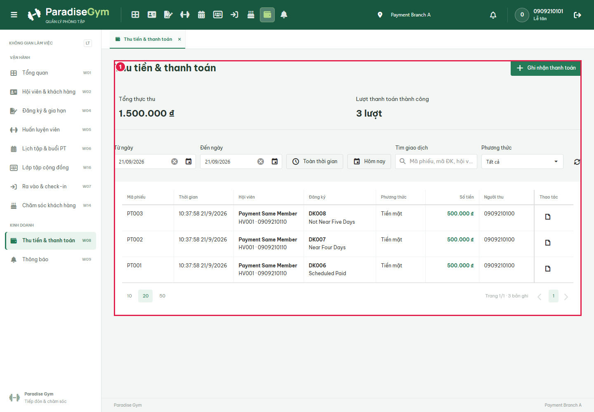
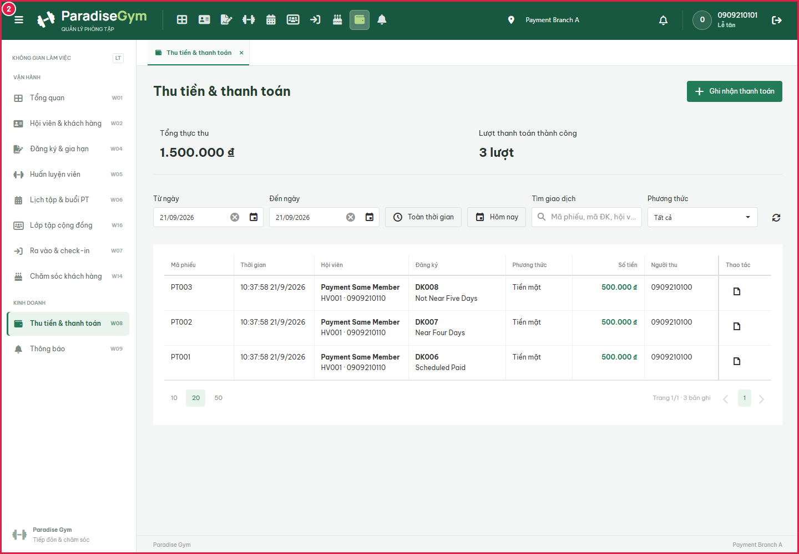
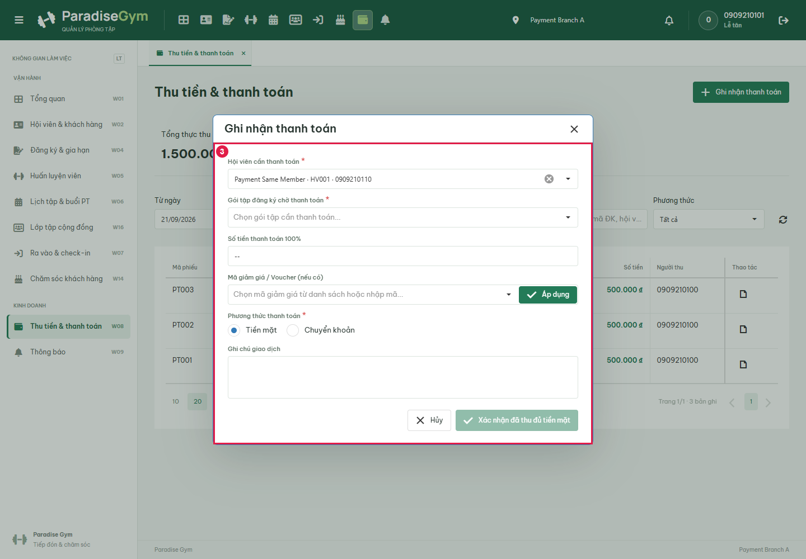
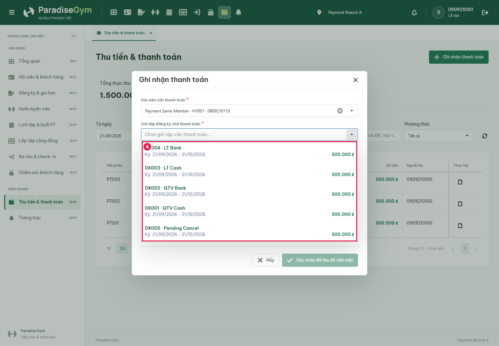
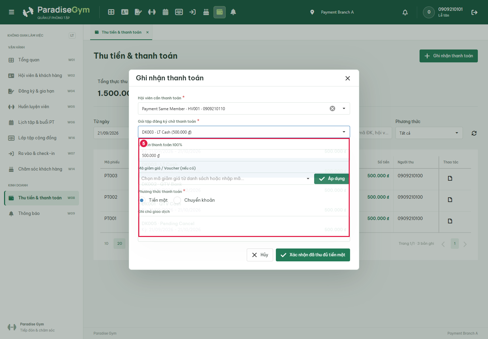
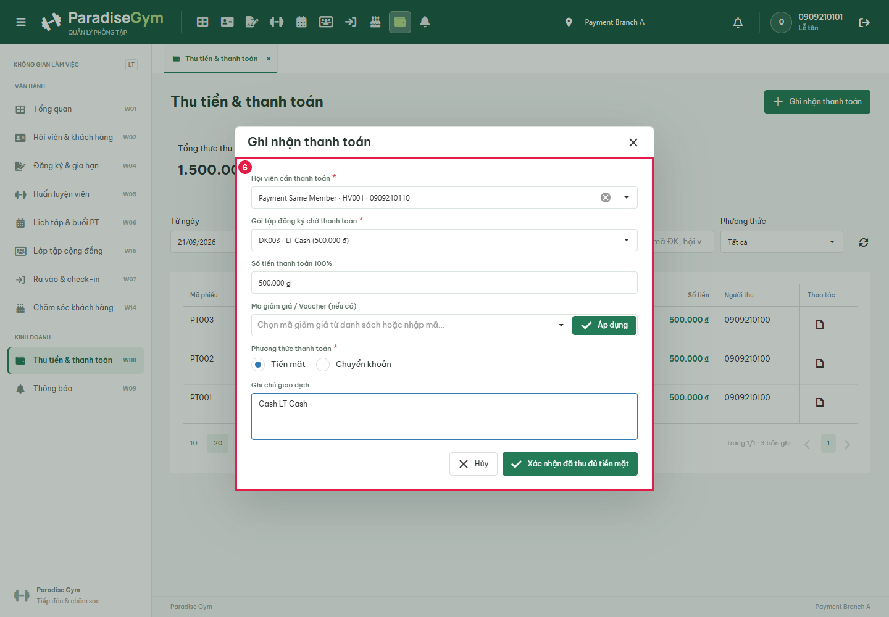
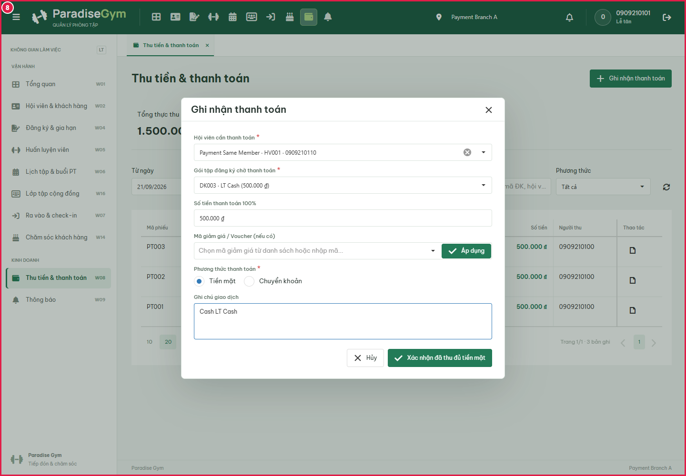
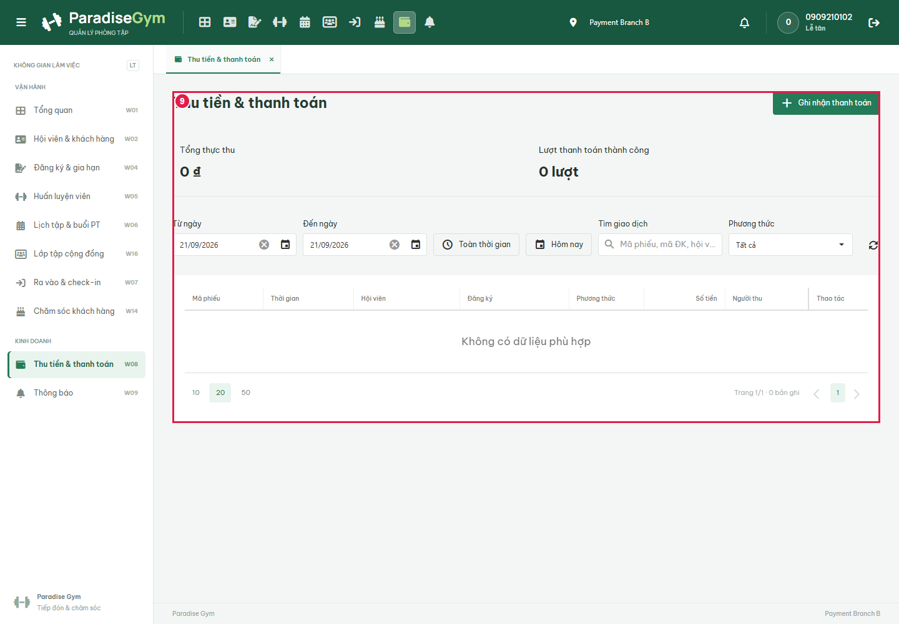

# LT-W08-US02 payment ledger E2E

Result: **BLOCKED**. Real isolated PostgreSQL and private static/API servers. No mock responses. Sources: LT-W08-US02 MF1-12/field-level specification; sibling US01/US03 ledger; user corrections 2026-09-21 override stale payment status text. SQL fixtures only in disposable DB, API-created packages/registrations, activated same member. Migration hashes/provenance in results.json. Bank transfer is manual reconciliation with test reference, not a real bank settlement.

## Source Action Verification

### Open payment ledger

Expected: User correction + US01/US03: two KPIs; no payment-status filter/column or pending KPI

Actual: page.evaluate: Error: E0009 - Component 'dxDataGrid' has not been initialized for an element.

For additional information on this error message, see: https://js.devexpress.com/error/23_2/E0009
    at d (https://cdnjs.cloudflare.com/ajax/libs/devextreme-dist/23.2.5/js/dx.all.js:19:2148739)
    at Object.Error (https://cdnjs.cloudflare.com/ajax/libs/devextreme-dist/23.2.5/js/dx.all.js:19:2148146)
    at HTMLDivElement.<anonymous> (https://cdnjs.cloudflare.com/ajax/libs/devextreme-dist/23.2.5/js/dx.all.js:19:2404237)
    at ce.each (https://cdnjs.cloudflare.com/ajax/libs/jquery/3.7.1/jquery.min.js:2:3129)
    at ce.fn.init.each (https://cdnjs.cloudflare.com/ajax/libs/jquery/3.7.1/jquery.min.js:2:1594)
    at i.default.fn.<computed> [as dxDataGrid] (https://cdnjs.cloudflare.com/ajax/libs/devextreme-dist/23.2.5/js/dx.all.js:19:2404170)
    at eval (eval at evaluate (:311:30), <anonymous>:1:37)
    at UtilityScript.evaluate (<anonymous>:313:16)
    at UtilityScript.<anonymous> (<anonymous>:1:44)

Status: **FAIL**

### LT ledger controls

Expected: Complete scenario

Actual: page.evaluate: Error: E0009 - Component 'dxDataGrid' has not been initialized for an element.

For additional information on this error message, see: https://js.devexpress.com/error/23_2/E0009
    at d (https://cdnjs.cloudflare.com/ajax/libs/devextreme-dist/23.2.5/js/dx.all.js:19:2148739)
    at Object.Error (https://cdnjs.cloudflare.com/ajax/libs/devextreme-dist/23.2.5/js/dx.all.js:19:2148146)
    at HTMLDivElement.<anonymous> (https://cdnjs.cloudflare.com/ajax/libs/devextreme-dist/23.2.5/js/dx.all.js:19:2404237)
    at ce.each (https://cdnjs.cloudflare.com/ajax/libs/jquery/3.7.1/jquery.min.js:2:3129)
    at ce.fn.init.each (https://cdnjs.cloudflare.com/ajax/libs/jquery/3.7.1/jquery.min.js:2:1594)
    at i.default.fn.<computed> [as dxDataGrid] (https://cdnjs.cloudflare.com/ajax/libs/devextreme-dist/23.2.5/js/dx.all.js:19:2404170)
    at eval (eval at evaluate (:311:30), <anonymous>:1:37)
    at UtilityScript.evaluate (<anonymous>:313:16)
    at UtilityScript.<anonymous> (<anonymous>:1:44)

Status: **FAIL**

### Open LT Cash payment form

Expected: US02 MF2: payment form with same active member and pending registrations

Actual: Hội viên cần thanh toán *
Gói tập đăng ký chờ thanh toán *
Số tiền thanh toán 100%
Mã giảm giá / Voucher (nếu có)
Áp dụng
Phương thức thanh toán *
Tiền mặt
Chuyển khoản
Ghi chú giao dịch
Hủy
Xác nhận đã thu đủ tiền mặt

Status: **PASS**

### Open Gói tập đăng ký chờ thanh toán

Expected: US02 field-level searchable options shown

Actual: DK004 · LT Bank
Kỳ: 21/09/2026 - 21/10/2026
500.000 ₫
DK003 · LT Cash
Kỳ: 21/09/2026 - 21/10/2026
500.000 ₫
DK002 · QTV Bank
Kỳ: 21/09/2026 - 21/10/2026
500.000 ₫
DK001 · QTV Cash
Kỳ: 21/09/2026 - 21/10/2026
500.000 ₫
DK005 · Pending Cancel
Kỳ: 21/09/2026 - 21/10/2026
500.000 ₫

Status: **PASS**

### Choose LT Cash

Expected: Selected value shown before submit

Actual: DK004 · LT Bank
Kỳ: 21/09/2026 - 21/10/2026
500.000 ₫
DK003 · LT Cash
Kỳ: 21/09/2026 - 21/10/2026
500.000 ₫
DK002 · QTV Bank
Kỳ: 21/09/2026 - 21/10/2026
500.000 ₫
DK001 · QTV Cash
Kỳ: 21/09/2026 - 21/10/2026
500.000 ₫
DK005 · Pending Cancel
Kỳ: 21/09/2026 - 21/10/2026
500.000 ₫

Status: **PASS**

### Enter note for LT Cash

Expected: Cash selected; no bank-reference field; entered note captured before settlement

Actual: Missing Tiền mặt: DK004 · LT Bank
Kỳ: 21/09/2026 - 21/10/2026
500.000 ₫
DK003 · LT Cash
Kỳ: 21/09/2026 - 21/10/2026
500.000 ₫
DK002 · QTV Bank
Kỳ: 21/09/2026 - 21/10/2026
500.000 ₫
DK001 · QTV Cash
Kỳ: 21/09/2026 - 21/10/2026
500.000 ₫
DK005 · Pending Cancel
Kỳ: 21/09/2026 - 21/10/2026
500.000 ₫

Status: **FAIL**

### LT cash and member downstream

Expected: Complete scenario

Actual: Missing Tiền mặt: DK004 · LT Bank
Kỳ: 21/09/2026 - 21/10/2026
500.000 ₫
DK003 · LT Cash
Kỳ: 21/09/2026 - 21/10/2026
500.000 ₫
DK002 · QTV Bank
Kỳ: 21/09/2026 - 21/10/2026
500.000 ₫
DK001 · QTV Cash
Kỳ: 21/09/2026 - 21/10/2026
500.000 ₫
DK005 · Pending Cancel
Kỳ: 21/09/2026 - 21/10/2026
500.000 ₫

Status: **FAIL**

### LT manual bank and member downstream

Expected: Complete scenario

Actual: locator.click: Timeout 15000ms exceeded.
Call log:
  - waiting for getByRole('button', { name: 'Ghi nhận thanh toán', exact: true })
    - locator resolved to 
…

  - attempting click action
    2 × waiting for element to be visible, enabled and stable
      - element is visible, enabled and stable
      - scrolling into view if needed
      - done scrolling
      - 
…
 intercepts pointer events
    - retrying click action
    - waiting 20ms
    2 × waiting for element to be visible, enabled and stable
      - element is visible, enabled and stable
      - scrolling into view if needed
      - done scrolling
      - 
…
 intercepts pointer events
    - retrying click action
      - waiting 100ms
    29 × waiting for element to be visible, enabled and stable
       - element is visible, enabled and stable
       - scrolling into view if needed
       - done scrolling
       - 
…
 intercepts pointer events
     - retrying click action
       - waiting 500ms

Status: **FAIL**

## State Verification

[]

## Cross-Role / Downstream Verification

### Open receptionist of Branch B

Expected: LT US01 scope: cannot see Branch A member payments

Actual: Thu tiền & thanh toán
Ghi nhận thanh toán
Tổng thực thu
0 ₫
Lượt thanh toán thành công
0 lượt
Từ ngày
Đến ngày
Toàn thời gian
Hôm nay
Tìm giao dịch
Phương thức
Thao tác
Mã phiếu	
Thời gian	
Hội viên	
Đăng ký	Phương thức	
Số tiền	
Người thu	
Chi nhánh	
								
Không có dữ liệu phù hợp
102050
Trang 1/1 · 0 bản ghi1

Status: **PASS**

## Issues Found

ledger-controls: page.evaluate: Error: E0009 - Component 'dxDataGrid' has not been initialized for an element.

For additional information on this error message, see: https://js.devexpress.com/error/23_2/E0009
    at d (https://cdnjs.cloudflare.com/ajax/libs/devextreme-dist/23.2.5/js/dx.all.js:19:2148739)
    at Object.Error (https://cdnjs.cloudflare.com/ajax/libs/devextreme-dist/23.2.5/js/dx.all.js:19:2148146)
    at HTMLDivElement.<anonymous> (https://cdnjs.cloudflare.com/ajax/libs/devextreme-dist/23.2.5/js/dx.all.js:19:2404237)
    at ce.each (https://cdnjs.cloudflare.com/ajax/libs/jquery/3.7.1/jquery.min.js:2:3129)
    at ce.fn.init.each (https://cdnjs.cloudflare.com/ajax/libs/jquery/3.7.1/jquery.min.js:2:1594)
    at i.default.fn.<computed> [as dxDataGrid] (https://cdnjs.cloudflare.com/ajax/libs/devextreme-dist/23.2.5/js/dx.all.js:19:2404170)
    at eval (eval at evaluate (:311:30), <anonymous>:1:37)
    at UtilityScript.evaluate (<anonymous>:313:16)
    at UtilityScript.<anonymous> (<anonymous>:1:44)

LT ledger controls: page.evaluate: Error: E0009 - Component 'dxDataGrid' has not been initialized for an element.

For additional information on this error message, see: https://js.devexpress.com/error/23_2/E0009
    at d (https://cdnjs.cloudflare.com/ajax/libs/devextreme-dist/23.2.5/js/dx.all.js:19:2148739)
    at Object.Error (https://cdnjs.cloudflare.com/ajax/libs/devextreme-dist/23.2.5/js/dx.all.js:19:2148146)
    at HTMLDivElement.<anonymous> (https://cdnjs.cloudflare.com/ajax/libs/devextreme-dist/23.2.5/js/dx.all.js:19:2404237)
    at ce.each (https://cdnjs.cloudflare.com/ajax/libs/jquery/3.7.1/jquery.min.js:2:3129)
    at ce.fn.init.each (https://cdnjs.cloudflare.com/ajax/libs/jquery/3.7.1/jquery.min.js:2:1594)
    at i.default.fn.<computed> [as dxDataGrid] (https://cdnjs.cloudflare.com/ajax/libs/devextreme-dist/23.2.5/js/dx.all.js:19:2404170)
    at eval (eval at evaluate (:311:30), <anonymous>:1:37)
    at UtilityScript.evaluate (<anonymous>:313:16)
    at UtilityScript.<anonymous> (<anonymous>:1:44)

blocked: page.evaluate: Error: E0009 - Component 'dxDataGrid' has not been initialized for an element.

For additional information on this error message, see: https://js.devexpress.com/error/23_2/E0009
    at d (https://cdnjs.cloudflare.com/ajax/libs/devextreme-dist/23.2.5/js/dx.all.js:19:2148739)
    at Object.Error (https://cdnjs.cloudflare.com/ajax/libs/devextreme-dist/23.2.5/js/dx.all.js:19:2148146)
    at HTMLDivElement.<anonymous> (https://cdnjs.cloudflare.com/ajax/libs/devextreme-dist/23.2.5/js/dx.all.js:19:2404237)
    at ce.each (https://cdnjs.cloudflare.com/ajax/libs/jquery/3.7.1/jquery.min.js:2:3129)
    at ce.fn.init.each (https://cdnjs.cloudflare.com/ajax/libs/jquery/3.7.1/jquery.min.js:2:1594)
    at i.default.fn.<computed> [as dxDataGrid] (https://cdnjs.cloudflare.com/ajax/libs/devextreme-dist/23.2.5/js/dx.all.js:19:2404170)
    at eval (eval at evaluate (:311:30), <anonymous>:1:37)
    at UtilityScript.evaluate (<anonymous>:313:16)
    at UtilityScript.<anonymous> (<anonymous>:1:44)

cash-filled-before-submit: Missing Tiền mặt: DK004 · LT Bank
Kỳ: 21/09/2026 - 21/10/2026
500.000 ₫
DK003 · LT Cash
Kỳ: 21/09/2026 - 21/10/2026
500.000 ₫
DK002 · QTV Bank
Kỳ: 21/09/2026 - 21/10/2026
500.000 ₫
DK001 · QTV Cash
Kỳ: 21/09/2026 - 21/10/2026
500.000 ₫
DK005 · Pending Cancel
Kỳ: 21/09/2026 - 21/10/2026
500.000 ₫

LT cash and member downstream: Missing Tiền mặt: DK004 · LT Bank
Kỳ: 21/09/2026 - 21/10/2026
500.000 ₫
DK003 · LT Cash
Kỳ: 21/09/2026 - 21/10/2026
500.000 ₫
DK002 · QTV Bank
Kỳ: 21/09/2026 - 21/10/2026
500.000 ₫
DK001 · QTV Cash
Kỳ: 21/09/2026 - 21/10/2026
500.000 ₫
DK005 · Pending Cancel
Kỳ: 21/09/2026 - 21/10/2026
500.000 ₫

blocked: Missing Tiền mặt: DK004 · LT Bank
Kỳ: 21/09/2026 - 21/10/2026
500.000 ₫
DK003 · LT Cash
Kỳ: 21/09/2026 - 21/10/2026
500.000 ₫
DK002 · QTV Bank
Kỳ: 21/09/2026 - 21/10/2026
500.000 ₫
DK001 · QTV Cash
Kỳ: 21/09/2026 - 21/10/2026
500.000 ₫
DK005 · Pending Cancel
Kỳ: 21/09/2026 - 21/10/2026
500.000 ₫

LT manual bank and member downstream: locator.click: Timeout 15000ms exceeded.
Call log:
  - waiting for getByRole('button', { name: 'Ghi nhận thanh toán', exact: true })
    - locator resolved to 
…

  - attempting click action
    2 × waiting for element to be visible, enabled and stable
      - element is visible, enabled and stable
      - scrolling into view if needed
      - done scrolling
      - 
…
 intercepts pointer events
    - retrying click action
    - waiting 20ms
    2 × waiting for element to be visible, enabled and stable
      - element is visible, enabled and stable
      - scrolling into view if needed
      - done scrolling
      - 
…
 intercepts pointer events
    - retrying click action
      - waiting 100ms
    29 × waiting for element to be visible, enabled and stable
       - element is visible, enabled and stable
       - scrolling into view if needed
       - done scrolling
       - 
…
 intercepts pointer events
     - retrying click action
       - waiting 500ms

blocked: locator.click: Timeout 15000ms exceeded.
Call log:
  - waiting for getByRole('button', { name: 'Ghi nhận thanh toán', exact: true })
    - locator resolved to 
…

  - attempting click action
    2 × waiting for element to be visible, enabled and stable
      - element is visible, enabled and stable
      - scrolling into view if needed
      - done scrolling
      - 
…
 intercepts pointer events
    - retrying click action
    - waiting 20ms
    2 × waiting for element to be visible, enabled and stable
      - element is visible, enabled and stable
      - scrolling into view if needed
      - done scrolling
      - 
…
 intercepts pointer events
    - retrying click action
      - waiting 100ms
    29 × waiting for element to be visible, enabled and stable
       - element is visible, enabled and stable
       - scrolling into view if needed
       - done scrolling
       - 
…
 intercepts pointer events
     - retrying click action
       - waiting 500ms

## Final Result

**BLOCKED**; 4/9 steps passed. Cleanup: {"browserClosed":true,"apiClosed":true,"staticClosed":true,"poolsClosed":true,"databaseDropped":true}.
