# LT-W08-US02 payment ledger E2E

Result: **BLOCKED**. Real isolated PostgreSQL and private static/API servers. No mock responses. Sources: LT-W08-US02 MF1-12/field-level specification; sibling US01/US03 ledger; user corrections 2026-09-21 override stale payment status text. SQL fixtures only in disposable DB, API-created packages/registrations, activated same member. Migration hashes/provenance in results.json. Bank transfer is manual reconciliation with test reference, not a real bank settlement.

## Source Action Verification

### Open payment ledger

Expected: User correction + US01/US03: two KPIs; no payment-status filter/column or pending KPI

Actual: {"labels":["Từ ngày","Đến ngày","Tìm giao dịch","Phương thức"],"columns":[" ","Thao tác","Mã phiếu","Thời gian","Hội viên","Đăng ký","Phương thức","Số tiền","Người thu","Chi nhánh","Thao tác"],"kpis":"Tổng thực thu\n2.500.000 ₫\nLượt thanh toán thành công\n5 lượt"}

Status: **PASS**

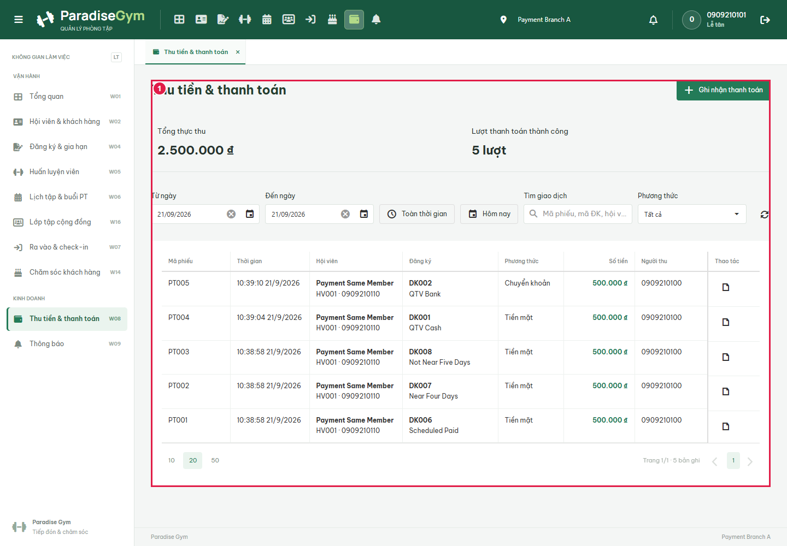

### Clear date restrictions

Expected: US01 date filters allow complete history

Actual: Thu tiền & thanh toán
Ghi nhận thanh toán
Tổng thực thu
2.500.000 ₫
Lượt thanh toán thành công
5 lượt
Từ ngày
Đến ngày
Toàn thời gian
Hôm nay
Tìm giao dịch
Phương thức
Thao tác
Mã phiếu	
Thời gian	
Hội viên	
Đăng ký	Phương thức	
Số tiền	
Người thu	
Chi nhánh	
PT005	10:39:10 21/9/2026	Payment Same Member
HV001 · 0909210110
	DK002
QTV Bank
	Chuyển khoản	500.000 ₫	0909210100	Payment Branch A	
PT004	10:39:04 21/9/2026	Payment Same Member
HV001 · 0909210110
	DK001
QTV Cash
	Tiền mặt	500.000 ₫	0909210100	Payment Branch A	
PT003	10:38:58 21/9/2026	Payment Same Member
HV001 · 0909210110
	DK008
Not Near Five Days
	Tiền mặt	500.000 ₫	0909210100	Payment Branch A	
PT002	10:38:58 21/9/2026	Payment Same Member
HV001 · 0909210110
	DK007
Near Four Days
	Tiền mặt	500.000 ₫	0909210100	Payment Branch A	
PT001	10:38:58 21/9/2026	Payment Same Member
HV001 · 0909210110
	DK006
Scheduled Paid
	Tiền mặt	500.000 ₫	0909210100	Payment Branch A	

102050
Trang 1/1 · 5 bản ghi1
Đang tải...

Status: **PASS**

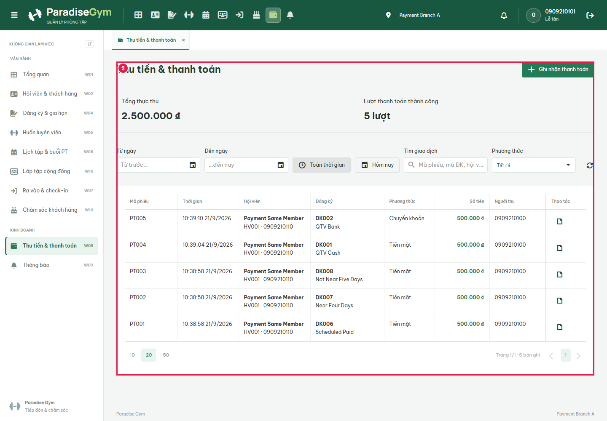

### Open LT Cash payment form

Expected: US02 MF2: payment form with same active member and pending registrations

Actual: Hội viên cần thanh toán *
Gói tập đăng ký chờ thanh toán *
Số tiền thanh toán 100%
Mã giảm giá / Voucher (nếu có)
Áp dụng
Phương thức thanh toán *
Tiền mặt
Chuyển khoản
Ghi chú giao dịch
Hủy
Xác nhận đã thu đủ tiền mặt

Status: **PASS**

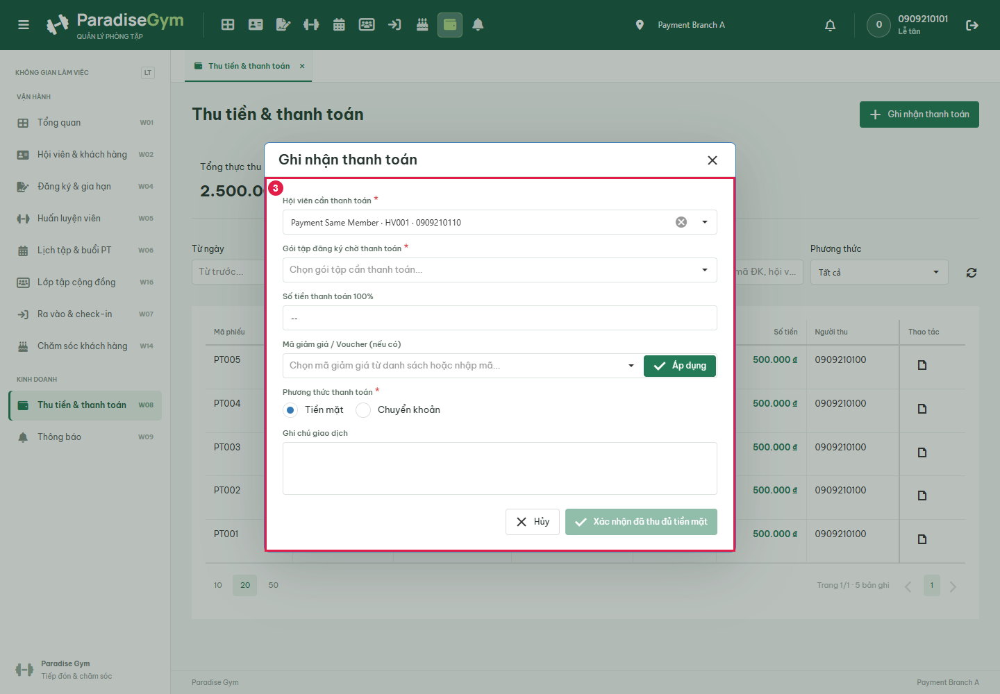

### Open Gói tập đăng ký chờ thanh toán

Expected: US02 field-level searchable options shown

Actual: DK004 · LT Bank
Kỳ: 21/09/2026 - 21/10/2026
500.000 ₫
DK003 · LT Cash
Kỳ: 21/09/2026 - 21/10/2026
500.000 ₫
DK005 · Pending Cancel
Kỳ: 21/09/2026 - 21/10/2026
500.000 ₫

Status: **PASS**

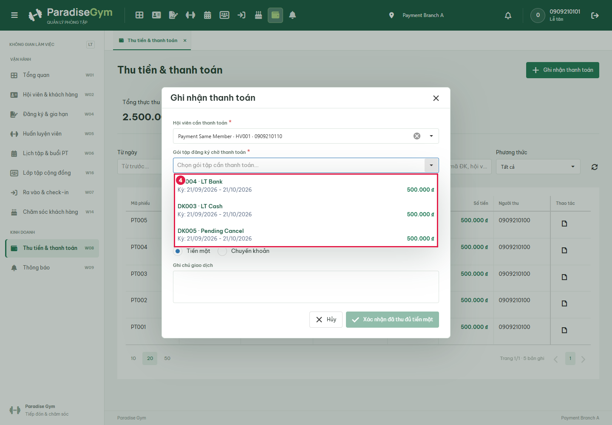

### Choose LT Cash

Expected: Selected value shown before submit

Actual: Hội viên cần thanh toán *
Gói tập đăng ký chờ thanh toán *
Số tiền thanh toán 100%
Mã giảm giá / Voucher (nếu có)
Áp dụng
Phương thức thanh toán *
Tiền mặt
Chuyển khoản
Ghi chú giao dịch
Hủy
Xác nhận đã thu đủ tiền mặt

Status: **PASS**

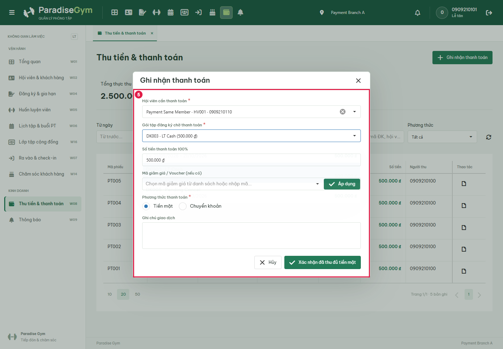

### Enter note for LT Cash

Expected: Cash selected; no bank-reference field; entered note captured before settlement

Actual: Hội viên cần thanh toán *
Gói tập đăng ký chờ thanh toán *
Số tiền thanh toán 100%
Mã giảm giá / Voucher (nếu có)
Áp dụng
Phương thức thanh toán *
Tiền mặt
Chuyển khoản
Ghi chú giao dịch
Hủy
Xác nhận đã thu đủ tiền mặt

Status: **PASS**

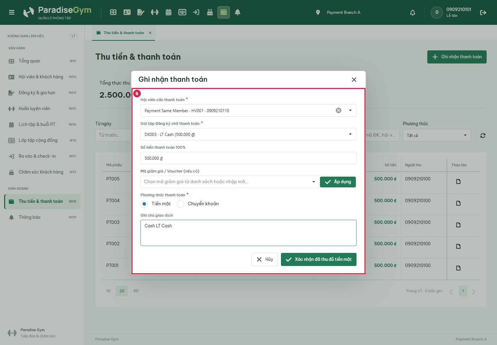

### Confirm LT Cash payment

Expected: US02 MF10-12: exactly one final payment and receipt, same member, correct method, registration active

Actual: PARADISE GYM
PHIẾU THU
Số phiếu
PT006
Thời gian
10:39:35 21/9/2026
Người nộp tiền
Payment Same Member
Số điện thoại
0909210110
Đăng ký
DK003
Gói tập
LT Cash
Kỳ hiệu lực
21/09/2026 - 21/10/2026
Phương thức
Tiền mặt
Mã giao dịch
--
Người thu
0909210101
Chi nhánh
Payment Branch A
Thực thu 100%
500.000 ₫
Ghi chú
Cash LT Cash

Status: **PASS**

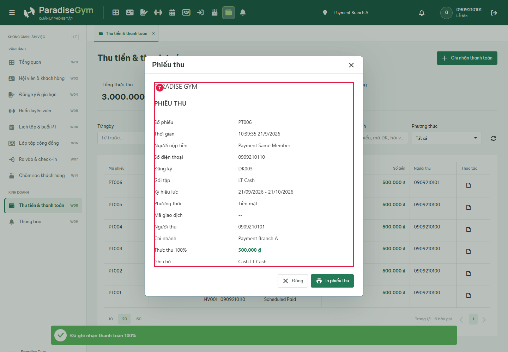

### LT cash and member downstream

Expected: Complete scenario

Actual: locator.click: Error: strict mode violation: getByRole('button', { name: 'Đóng', exact: true }) resolved to 2 elements:
    1) 
…
 aka getByRole('toolbar').getByRole('button', { name: 'Đóng' })
    2) 
…
 aka getByRole('button', { name: 'Đóng', description: 'Đóng', exact: true })

Call log:
  - waiting for getByRole('button', { name: 'Đóng', exact: true })

Status: **FAIL**

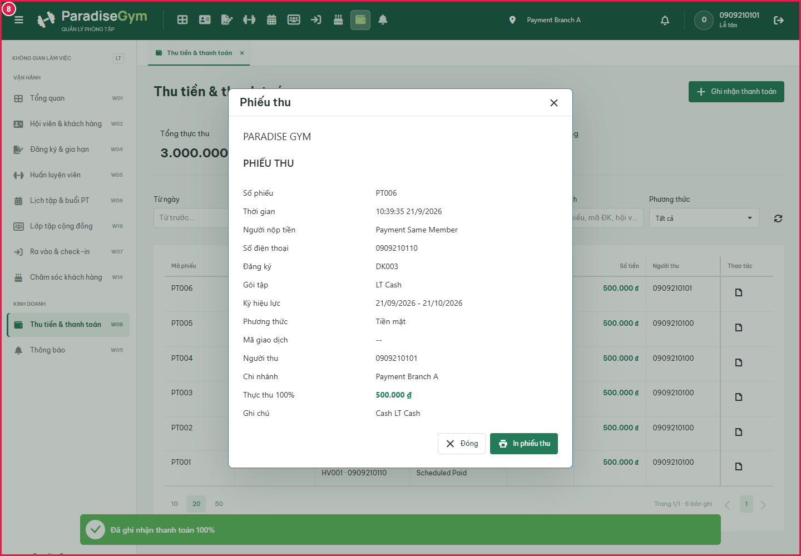

### Open LT Bank payment form

Expected: US02 MF2: payment form with same active member and pending registrations

Actual: Hội viên cần thanh toán *
Gói tập đăng ký chờ thanh toán *
Số tiền thanh toán 100%
Mã giảm giá / Voucher (nếu có)
Áp dụng
Phương thức thanh toán *
Tiền mặt
Chuyển khoản
Ghi chú giao dịch
Hủy
Xác nhận đã thu đủ tiền mặt

Status: **PASS**

### Open Gói tập đăng ký chờ thanh toán

Expected: US02 field-level searchable options shown

Actual: DK004 · LT Bank
Kỳ: 21/09/2026 - 21/10/2026
500.000 ₫
DK005 · Pending Cancel
Kỳ: 21/09/2026 - 21/10/2026
500.000 ₫

Status: **PASS**

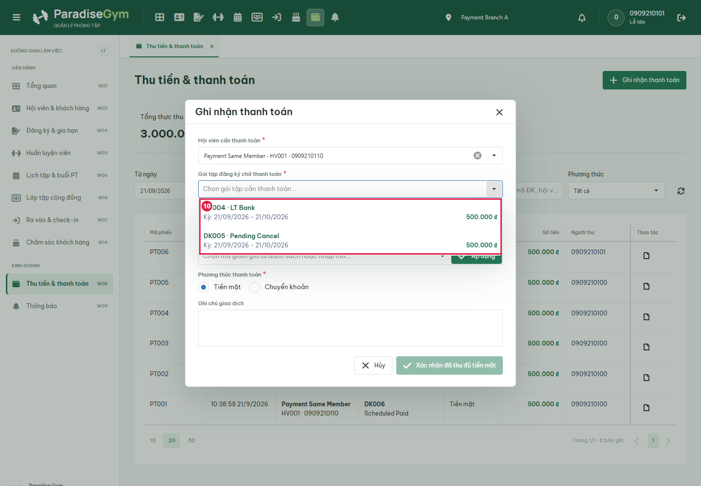

### Choose LT Bank

Expected: Selected value shown before submit

Actual: Hội viên cần thanh toán *
Gói tập đăng ký chờ thanh toán *
Số tiền thanh toán 100%
Mã giảm giá / Voucher (nếu có)
Áp dụng
Phương thức thanh toán *
Tiền mặt
Chuyển khoản
Ghi chú giao dịch
Hủy
Xác nhận đã thu đủ tiền mặt

Status: **PASS**

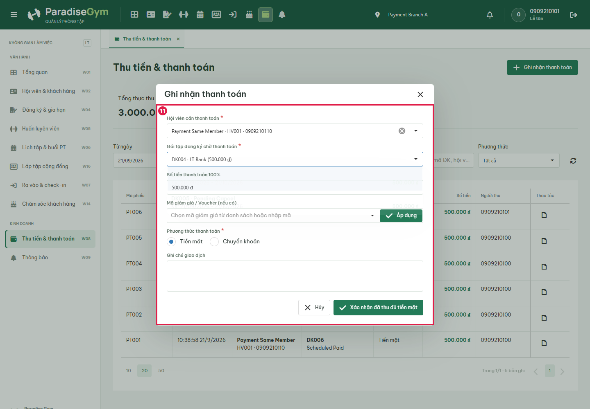

### Select bank transfer

Expected: US02 MF7: QR intent has 15-minute TTL; registration pending and absent from final ledger

Actual: {"registrationId":"8b7a8e3d-6354-404b-8df4-11c2106ab65c","intentId":"d4920061-42c5-4f03-8ab4-799f7c03af78","state":"PENDING","ttlSeconds":900}

Status: **PASS**

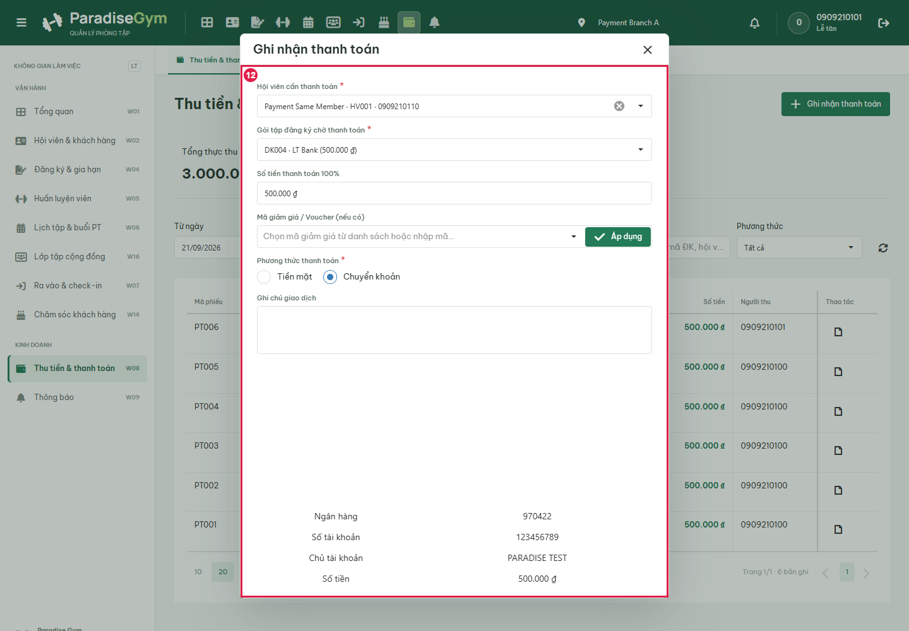

### Open manual reconciliation

Expected: Manual BANK_TRANSFER form requires transaction reference and reconciliation checkbox

Actual: Giao dịch
PAY007
Số tiền
500.000 ₫
Phương thức
Chuyển khoản
Mã giao dịch trên chứng từ ngân hàng *
Ghi chú đối soát
Đối chiếu thực thu
Đã đối chiếu và nhận đủ 500.000 ₫
Hủy
Xác nhận đã nhận đủ tiền

Status: **PASS**

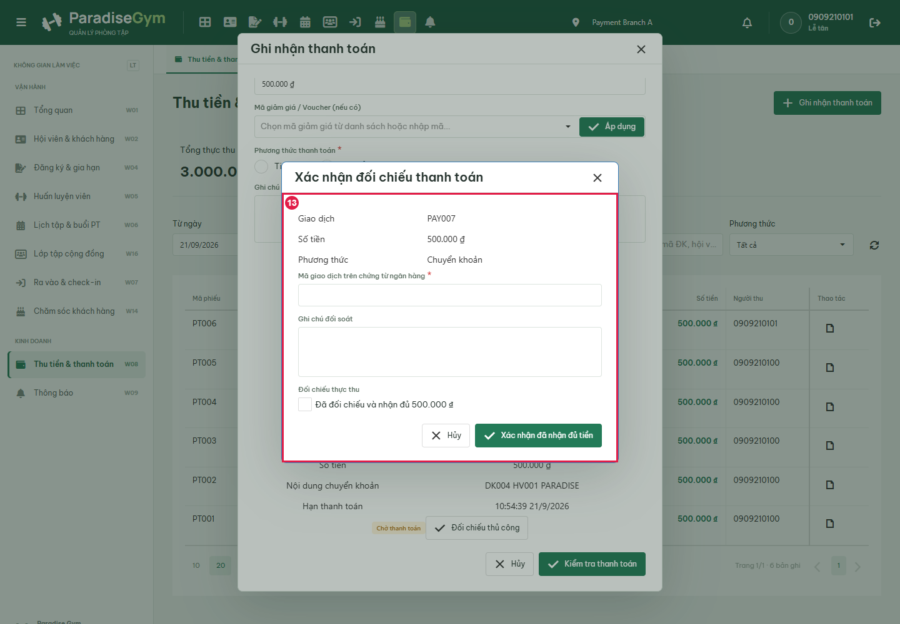

### Submit with empty bank reference

Expected: User requirement: missing transaction reference blocks settlement

Actual: Required-field validation visible; no ledger row

Status: **PASS**

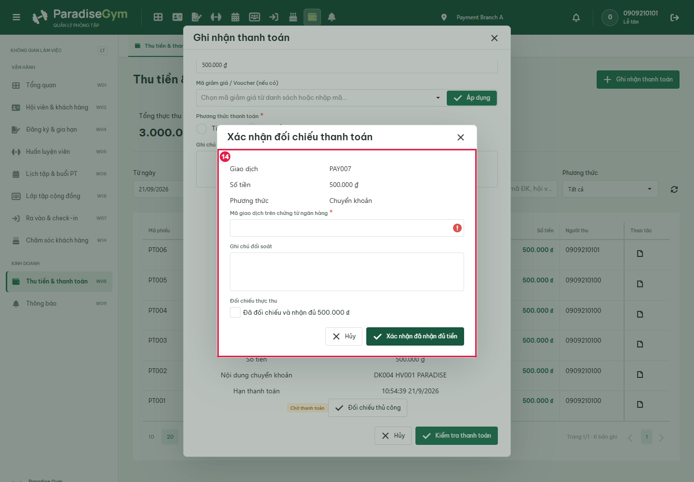

### Enter actual test reference and confirm reconciliation checkbox

Expected: Input Capture Before Submit: bank reference visible, method remains BANK_TRANSFER

Actual: Giao dịch
PAY007
Số tiền
500.000 ₫
Phương thức
Chuyển khoản
Mã giao dịch trên chứng từ ngân hàng *
Ghi chú đối soát
Đối chiếu thực thu
Đã đối chiếu và nhận đủ 500.000 ₫
Hủy
Xác nhận đã nhận đủ tiền

Status: **PASS**

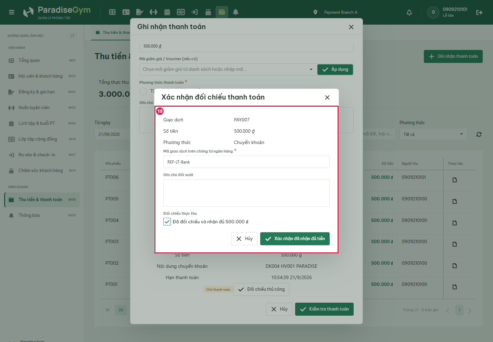

### Confirm LT Bank payment

Expected: US02 MF10-12: exactly one final payment and receipt, same member, correct method, registration active

Actual: PARADISE GYM
PHIẾU THU
Số phiếu
PT007
Thời gian
10:39:41 21/9/2026
Người nộp tiền
Payment Same Member
Số điện thoại
0909210110
Đăng ký
DK004
Gói tập
LT Bank
Kỳ hiệu lực
21/09/2026 - 21/10/2026
Phương thức
Chuyển khoản
Mã giao dịch
REF-LT-Bank
Người thu
0909210101
Chi nhánh
Payment Branch A
Thực thu 100%
500.000 ₫

Status: **PASS**

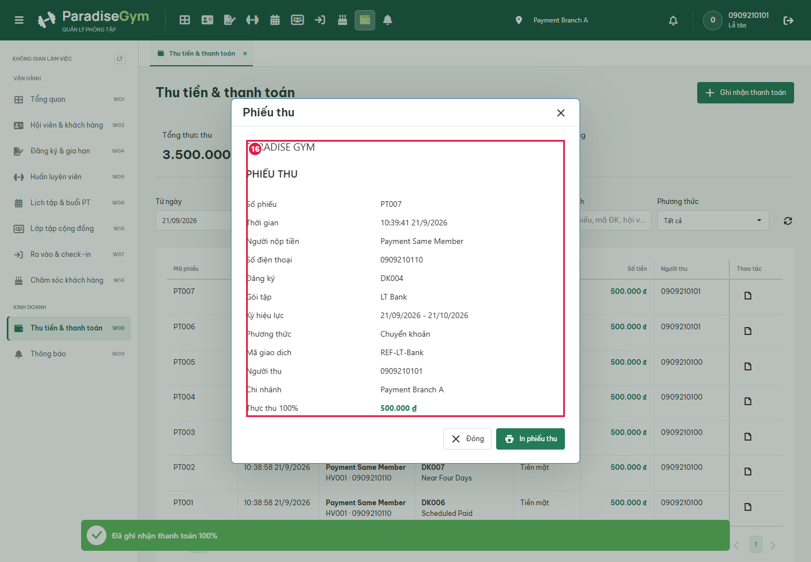

### LT manual bank and member downstream

Expected: Complete scenario

Actual: locator.click: Error: strict mode violation: getByRole('button', { name: 'Đóng', exact: true }) resolved to 2 elements:
    1) 
…
 aka getByRole('toolbar').getByRole('button', { name: 'Đóng' })
    2) 
…
 aka getByRole('button', { name: 'Đóng', description: 'Đóng', exact: true })

Call log:
  - waiting for getByRole('button', { name: 'Đóng', exact: true })

Status: **FAIL**

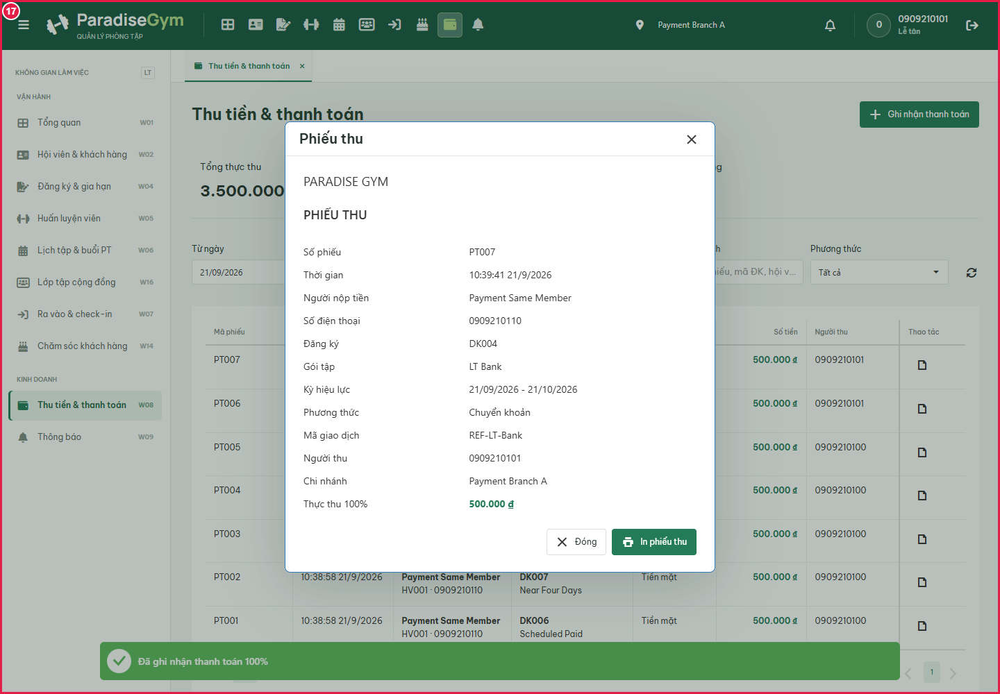

## State Verification

[
  {
    "registrationId": "2f9c382a-cba5-4971-a1f1-b04a44811ecf",
    "paymentId": "64cb86fb-e701-4c8a-b0b8-01d626fa7e79",
    "memberId": "07ba7a83-2be1-41e9-86b6-8e6675d70349",
    "method": "CASH",
    "reference": null,
    "amount": 500000
  },
  {
    "registrationId": "8b7a8e3d-6354-404b-8df4-11c2106ab65c",
    "paymentId": "d4920061-42c5-4f03-8ab4-799f7c03af78",
    "memberId": "07ba7a83-2be1-41e9-86b6-8e6675d70349",
    "method": "BANK_TRANSFER",
    "reference": "REF-LT-Bank",
    "amount": 500000
  }
]

## Cross-Role / Downstream Verification

### Open receptionist of Branch B

Expected: LT US01 scope: cannot see Branch A member payments

Actual: Thu tiền & thanh toán
Ghi nhận thanh toán
Tổng thực thu
0 ₫
Lượt thanh toán thành công
0 lượt
Từ ngày
Đến ngày
Toàn thời gian
Hôm nay
Tìm giao dịch
Phương thức
Thao tác
Mã phiếu	
Thời gian	
Hội viên	
Đăng ký	Phương thức	
Số tiền	
Người thu	
Chi nhánh	
								
Không có dữ liệu phù hợp
102050
Trang 1/1 · 0 bản ghi1

Status: **PASS**

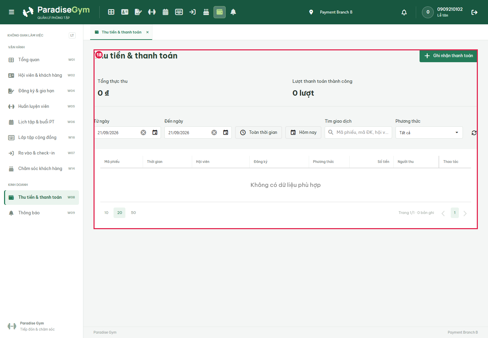

## Issues Found

LT cash and member downstream: locator.click: Error: strict mode violation: getByRole('button', { name: 'Đóng', exact: true }) resolved to 2 elements:
    1) 
…
 aka getByRole('toolbar').getByRole('button', { name: 'Đóng' })
    2) 
…
 aka getByRole('button', { name: 'Đóng', description: 'Đóng', exact: true })

Call log:
  - waiting for getByRole('button', { name: 'Đóng', exact: true })

blocked: locator.click: Error: strict mode violation: getByRole('button', { name: 'Đóng', exact: true }) resolved to 2 elements:
    1) 
…
 aka getByRole('toolbar').getByRole('button', { name: 'Đóng' })
    2) 
…
 aka getByRole('button', { name: 'Đóng', description: 'Đóng', exact: true })

Call log:
  - waiting for getByRole('button', { name: 'Đóng', exact: true })

LT manual bank and member downstream: locator.click: Error: strict mode violation: getByRole('button', { name: 'Đóng', exact: true }) resolved to 2 elements:
    1) 
…
 aka getByRole('toolbar').getByRole('button', { name: 'Đóng' })
    2) 
…
 aka getByRole('button', { name: 'Đóng', description: 'Đóng', exact: true })

Call log:
  - waiting for getByRole('button', { name: 'Đóng', exact: true })

blocked: locator.click: Error: strict mode violation: getByRole('button', { name: 'Đóng', exact: true }) resolved to 2 elements:
    1) 
…
 aka getByRole('toolbar').getByRole('button', { name: 'Đóng' })
    2) 
…
 aka getByRole('button', { name: 'Đóng', description: 'Đóng', exact: true })

Call log:
  - waiting for getByRole('button', { name: 'Đóng', exact: true })

## Final Result

**BLOCKED**; 16/18 steps passed. Cleanup: {"browserClosed":true,"apiClosed":true,"staticClosed":true,"poolsClosed":true,"databaseDropped":true}.
