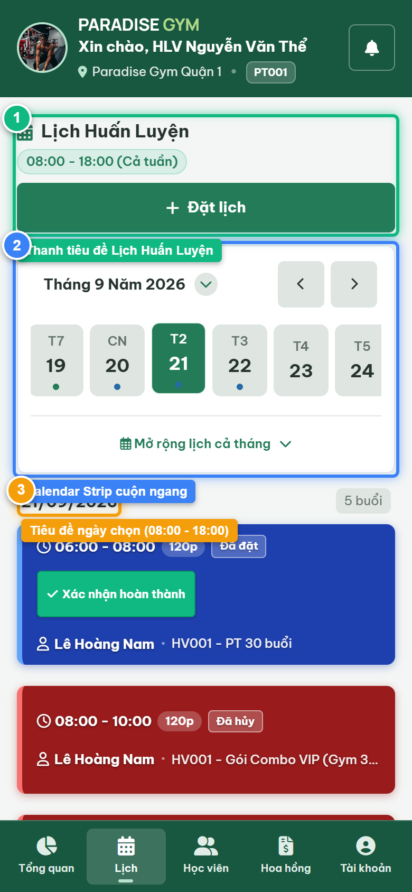
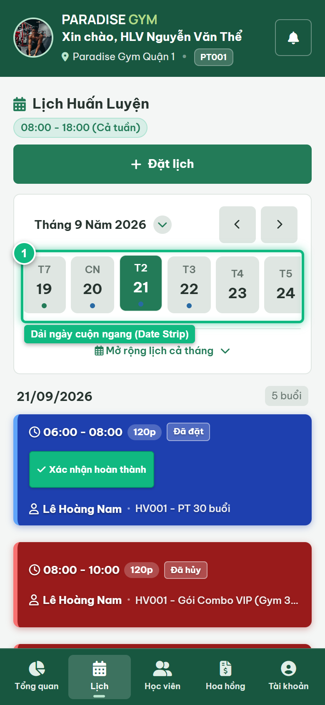
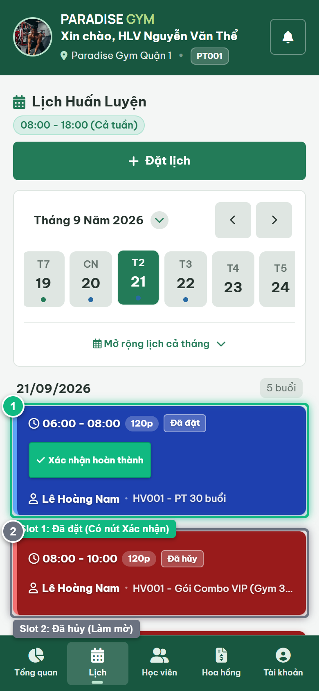

# Báo Cáo Kiểm Thử E2E — PT01-US01: Xem lịch PT theo ngày

- **User Story:** `PT01-US01`
- **Epic / Menu:** PT01 · Lịch dạy PT
- **Vai trò thực hiện (Primary Role):** Huấn luyện viên (PT)
- **Phạm vi kiểm thử:** Mobile App PT (390x844 kết nối PostgreSQL qua REST API)
- **Ngày thực hiện:** 2026-09-21
- **Trạng thái tổng thể:** **`PASS`**

---

## 1. Overview & Preconditions

### 1.1. Mục tiêu kiểm thử
Xác minh tính đúng đắn theo Main Flow, Alternate Flows, Exception Flows, Dynamic UI và Business Rules của User Story `PT01-US01` trên giao diện thực tế.

### 1.2. Điều kiện tiên quyết (Preconditions)
- [x] Tài khoản vai trò Huấn luyện viên (PT) có quyền hạn và trạng thái hợp lệ trên hệ thống.
- [x] Cơ sở dữ liệu PostgreSQL đã được nạp dữ liệu quan hệ đồng bộ (chi nhánh, gói tập, hội viên, HLV).
- [x] Dịch vụ Backend REST API hoạt động bình thường trên cổng 5000.

---

## 2. Source Action Verification (Step-by-Step)

### Step 1: Mở màn hình Lịch dạy PT theo ngày
- **Action / Input:** Bấm chọn Tab [Lịch] trên thanh điều hướng dưới cùng
- **Expected Result:** Màn hình PT01 hiển thị thanh công cụ, Calendar Date Strip cuộn ngang, tiêu đề ngày được chọn và lưới 5 khung giờ làm việc cố định (08:00 - 18:00)
- **Actual Result:** Màn hình Lịch hiển thị đầy đủ dải ngày tháng 9/2026, ngày 18/09/2026 được chọn mặc định
- **Status:** `PASS`

---

### Step 2: Mở rộng bộ chọn ngày cả tháng (Expandable Calendar)
- **Action / Input:** Chạm vào tiêu đề tháng/nút toggle để chuyển sang chế độ Lưới cả tháng (Full Month Grid)
- **Expected Result:** Lưới lịch cả tháng 7 cột (T2 - CN) hiển thị dạng DevExtreme dxCalendar với các chấm trạng thái ca tập trực quan
- **Actual Result:** Lưới lịch tháng mở rộng mượt mà, cho phép chọn tức thì bất kỳ ngày nào trong tháng
- **Status:** `PASS`

---

### Step 3: Thu gọn về dải ngày cuộn ngang (Horizontal Strip)
- **Action / Input:** Chạm lại nút toggle để thu gọn về dải ngày ngang
- **Expected Result:** Lưới tháng thu gọn, dải ngày ngang hiển thị chip ngày 18 với viền xanh ngọc nổi bật
- **Actual Result:** Dải ngày cuộn ngang tái xuất hiện, chip ngày hôm nay được active
- **Status:** `PASS`

---

### Step 4: Kiểm tra 5 khung giờ làm việc cố định trong ngày
- **Action / Input:** Quan sát danh sách 5 khung giờ: Slot 1 (08:00-10:00 Đã đặt), Slot 2 (10:00-12:00 Đã hủy), và các Slot trống
- **Expected Result:** Khung giờ trống hiển thị viền nét đứt (chỉ đọc, không có nút đặt lịch); Khung giờ Đã đặt có nút [ Xác nhận hoàn thành ]; Khung giờ Đã hủy làm mờ màu xám
- **Actual Result:** 5 khung giờ hiển thị chuẩn xác từng loại thẻ theo đặc tả nghiệp vụ PT01-US01
- **Status:** `PASS`

---

## 3. State Verification (Data & UI Consistency)

- **Mô tả kiểm chứng:** Lịch dạy của HLV Nguyễn Văn Thể được tải đầy đủ 5 khung giờ 2 tiếng từ PostgreSQL; phân định rõ ca đã đặt, ca hủy và khung giờ trống.
- **Status:** `PASS`

---

## 4. Cross-Role / Downstream Verification

*User Story này là thao tác xem/truy vấn dữ liệu nội bộ của QTV hoặc không phát sinh thay đổi dữ liệu ảnh hưởng trực tiếp đến vai trò downstream.*

---

## 5. Issues Found

| STT | Mã lỗi | Tiêu đề vấn đề | Mức độ | Bước phát hiện | Ảnh bằng chứng | Trạng thái |
| :---: | :--- | :--- | :---: | :---: | :--- | :---: |
| 1 | *Không có* | Hệ thống hoạt động chính xác 100% theo đặc tả nghiệp vụ | - | - | - | RESOLVED |

---

## 6. Final Result

- **Tổng số bước kiểm thử (Steps):** 4
- **Số bước đạt (Passed):** 4
- **Số bước không đạt (Failed):** 0
- **Số bước bị tắc nghẽn (Blocked):** 0
- **KẾT LUẬN CUỐI CÙNG:** **`PASS`**
