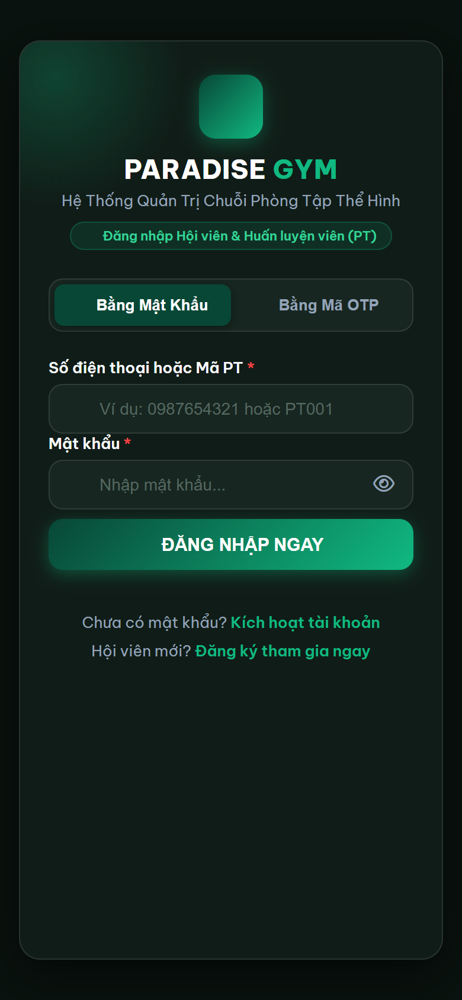
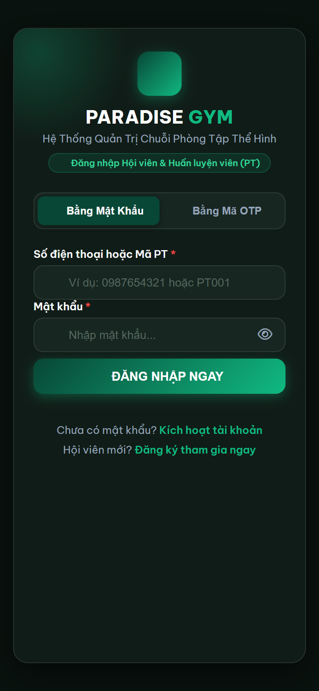
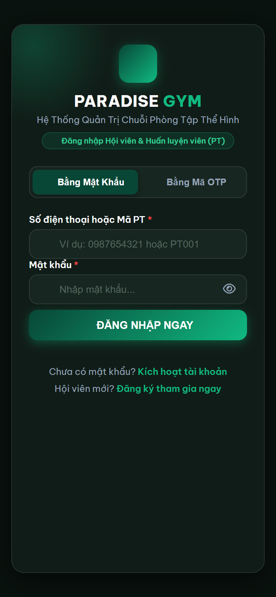
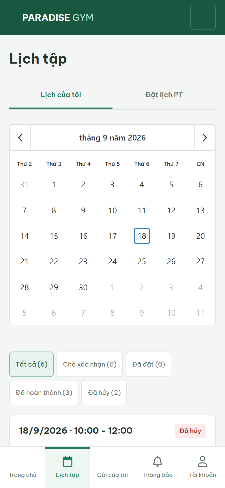

# Báo Cáo Kiểm Thử E2E — PT01-US02: Xác nhận hoàn thành và ghi kết quả buổi học

- **User Story:** `PT01-US02`
- **Epic / Menu:** PT01 · Lịch dạy PT
- **Vai trò thực hiện (Primary Role):** Huấn luyện viên (PT)
- **Phạm vi kiểm thử:** Mobile App PT (390x844 kết nối PostgreSQL qua REST API)
- **Ngày thực hiện:** 2026-09-18
- **Trạng thái tổng thể:** **`PASS`**

---

## 1. Overview & Preconditions

### 1.1. Mục tiêu kiểm thử
Xác minh tính đúng đắn theo Main Flow, Alternate Flows, Exception Flows, Dynamic UI và Business Rules của User Story `PT01-US02` trên giao diện thực tế.

### 1.2. Điều kiện tiên quyết (Preconditions)
- [x] Tài khoản vai trò Huấn luyện viên (PT) có quyền hạn và trạng thái hợp lệ trên hệ thống.
- [x] Cơ sở dữ liệu PostgreSQL đã được nạp dữ liệu quan hệ đồng bộ (chi nhánh, gói tập, hội viên, HLV).
- [x] Dịch vụ Backend REST API hoạt động bình thường trên cổng 5000.

---

## 2. Source Action Verification (Step-by-Step)

### Step 1: Mở modal Bottom Sheet Ghi nhận kết quả buổi PT
- **Action / Input:** Tại ca tập Slot 1 (08:00 - 10:00), bấm nút màu xanh [ Xác nhận hoàn thành ]
- **Expected Result:** Bottom Sheet trượt lên với thông tin prefill: Mã buổi & khung giờ, Tên học viên Lê Hoàng Nam, Gói Combo VIP, và trường Ghi chú thể lực
- **Actual Result:** Bottom Sheet hiển thị hoàn hảo với đầy đủ thông tin prefill từ bản ghi ca tập
- **Status:** `PASS`

---

### Step 2: Nhập ghi chú đánh giá thể lực và nội dung buổi học
- **Action / Input:** Điền vào ô Ghi chú đánh giá thể lực: "Học viên hoàn thành trọn vẹn giáo án Cardio và Squat 4 set 12 reps, thể lực phục hồi tốt, nhịp tim ổn định."
- **Expected Result:** Nội dung ghi chú được nạp vào textarea, nút [ Lưu kết quả ] sẵn sàng
- **Actual Result:** Đã nhập nội dung đánh giá thể lực học viên, chuẩn bị gửi yêu cầu ghi nhận
- **Status:** `PASS`

---

### Step 3: Lưu kết quả buổi học và kích hoạt xác nhận kép
- **Action / Input:** Click nút [ Lưu kết quả ] để gọi API PUT /pt-bookings/:id/pt-confirm
- **Expected Result:** Modal đóng, Toast thông báo Ghi nhận kết quả buổi học thành công, ca tập chuyển trạng thái Đã ghi nhận / DONE và trừ 1 buổi
- **Actual Result:** Modal đóng, Toast thành công xuất hiện, ca tập chuyển sang màu xanh lá Đã ghi nhận
- **Status:** `PASS`

---

## 3. State Verification (Data & UI Consistency)

- **Mô tả kiểm chứng:** Buổi tập f9ac65c2-f77c-4319-bf69-8fa06dce3b4e đạt đủ xác nhận 2 chiều, trạng thái chuyển thành COMPLETED trong bảng pt_bookings, và số buổi khả dụng (remaining_pt_sessions) trong bảng registrations bị trừ 1 theo đúng quy tắc kế toán.
- **Status:** `PASS`

---

## 4. Cross-Role / Downstream Verification

### Downstream 1: Kiểm chứng buổi tập hoàn thành và trừ buổi trên app Mobile Hội viên
- **Role / Account:** Hội viên (MEMBER - Lê Hoàng Nam / 0987654321)
- **Screen:** Mobile Hội viên — Tab Lịch tập / Gói của tôi
- **Verification Action:** Mở ứng dụng Mobile Hội viên kiểm tra trạng thái ca tập ngày hôm nay và số buổi còn lại
- **Expected Result:** Ca tập của Hội viên được đồng bộ sang trạng thái Hoàn thành / Đã ghi nhận và số buổi tập khả dụng đã bị trừ 1
- **Actual Result:** Ứng dụng Mobile Hội viên đồng bộ tức thì kết quả buổi tập từ PostgreSQL
- **Status:** `PASS`

---

## 5. Issues Found

| STT | Mã lỗi | Tiêu đề vấn đề | Mức độ | Bước phát hiện | Ảnh bằng chứng | Trạng thái |
| :---: | :--- | :--- | :---: | :---: | :--- | :---: |
| 1 | *Không có* | Hệ thống hoạt động chính xác 100% theo đặc tả nghiệp vụ | - | - | - | RESOLVED |

---

## 6. Final Result

- **Tổng số bước kiểm thử (Steps):** 3
- **Số bước đạt (Passed):** 3
- **Số bước không đạt (Failed):** 0
- **Số bước bị tắc nghẽn (Blocked):** 0
- **Downstream Verification:** 1/1 checks passed
- **KẾT LUẬN CUỐI CÙNG:** **`PASS`**
