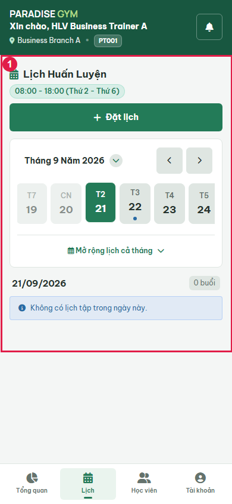
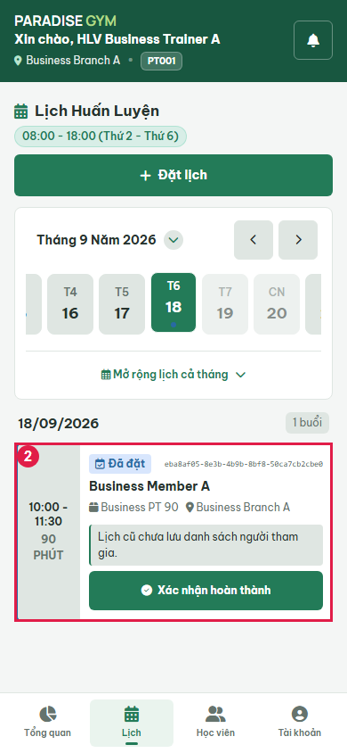
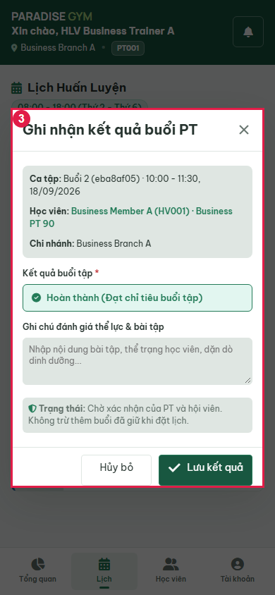
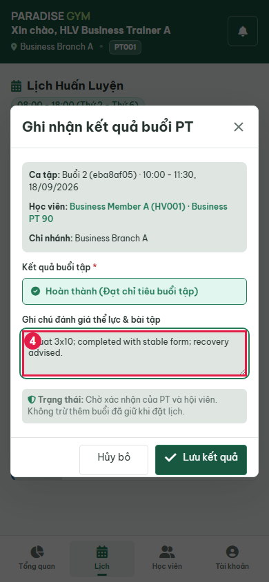
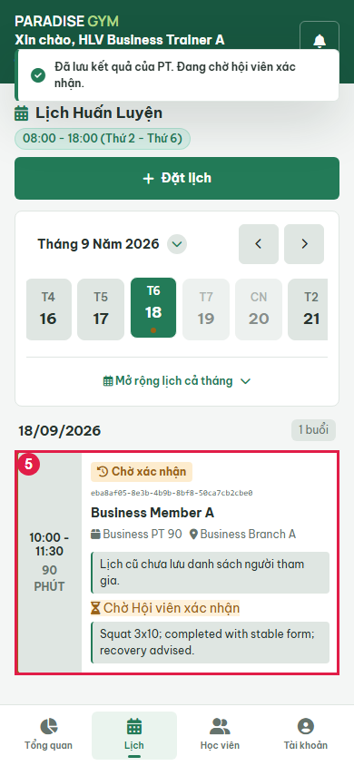
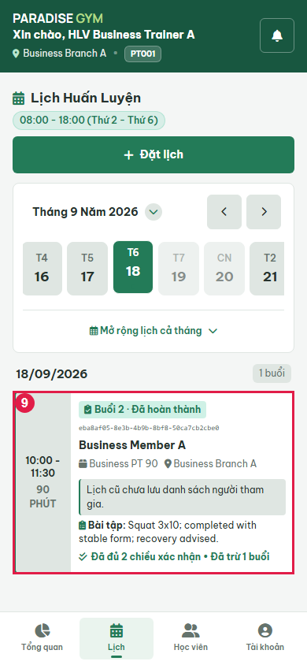
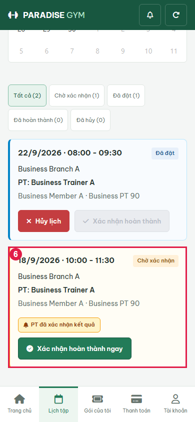
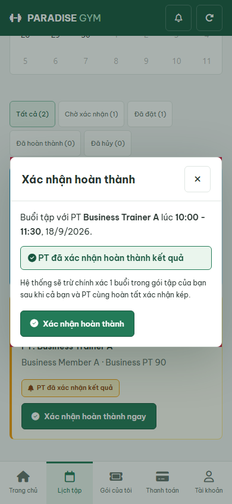
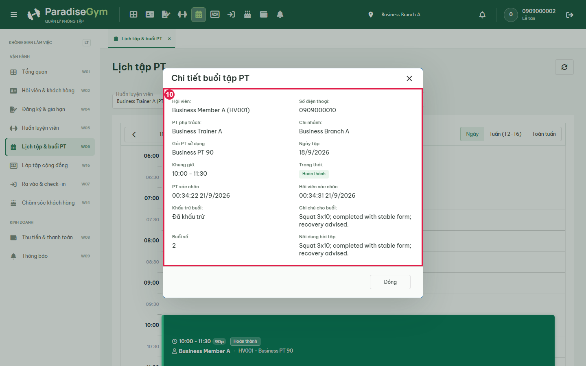

# PT01-US02 - Isolated real UI business E2E

Run: 2026-09-20T17:34:38.714Z

Sources: docs/user-stories/pt/PT01-Lịch/PT01-US02 story (Main Flow, Field specification, Alternate/Exception Flows); docs/product-spec.md sections 4.2-4.6.

Database: paradise_test_12296_1789925617102; frontend: http://localhost:3000; real backend: http://127.0.0.1:57096/api/v1. Browser requests redirected with route.continue, no response mocks. Real API auth sessions. Shared configured DB receives no application writes. Scope: test artifacts only; mailbox/skill/source files unchanged by this runner.

All migrations present at startup applied: 001_create_tables.sql, 002_web_rebuild.sql, 003_mobile_preferences.sql, 004_device_sessions.sql, 005_remove_pt_certificates.sql, 006_boss_feedback_schema_upgrade.sql, 007_commission_configs_uniqueness_and_history.sql, 008_branch_default_commission_rate.sql, 009_pt_commission_payout_details.sql, 010_scheduled_package_freezes.sql, 011_pt_bookings_no_overlap_indexes.sql, 012_pt_commission_session_snapshot.sql, 013_pt_booking_participants.sql. Hashes recorded in results.json. Individual booking fixture.

Fixture: {"b1":"c4acd1ac-f1b8-45f9-8456-9255dab7c242","b2":"57c75e7e-6a10-4638-95a0-92e1be360d39","member":{"id":"fb016771-9cc4-436c-821e-4b709d3b6059","account_id":"6e1ab0bf-999d-493f-9bdd-5db7934810a1","home_branch_id":"c4acd1ac-f1b8-45f9-8456-9255dab7c242","member_code":"HV001","full_name":"Business Member A","phone":"0909000010","email":null,"date_of_birth":null,"gender":null,"avatar_url":null,"status":"ACTIVE","created_by":"b16b313d-2aaa-4375-8e2c-c81820ee7e78","created_at":"2026-09-20T17:33:38.154Z","updated_at":"2026-09-20T17:33:38.154Z","qr_code":"QR-HV001-0909000010","face_enrolled":false},"pt":{"id":"115858ae-2cee-49b4-9726-895e2c5f3f57","account_id":"fc031b63-0d26-429b-83a1-fc0c172801b9","branch_id":"c4acd1ac-f1b8-45f9-8456-9255dab7c242","pt_code":"PT001","full_name":"Business Trainer A","phone":"0909000020","email":null,"gender":null,"bio":null,"specialties":"Strength","status":"ACTIVE","work_start_time":"08:00:00","work_end_time":"18:00:00","work_days":"MON_TO_FRI","created_at":"2026-09-20T17:33:38.184Z","updated_at":"2026-09-20T17:33:38.184Z","show_phone_to_members":false,"avatar_url":null,"face_enrolled":false,"bank_name":null,"bank_account_no":null,"bank_account_name":null},"pt2":{"id":"7f7578c4-c294-4561-a640-07ed78713317","account_id":"36026147-ec85-46bb-9b91-856493bc8b06","branch_id":"57c75e7e-6a10-4638-95a0-92e1be360d39","pt_code":"PT002","full_name":"Business Trainer B","phone":"0909000021","email":null,"gender":null,"bio":null,"specialties":"Strength","status":"ACTIVE","work_start_time":"08:00:00","work_end_time":"18:00:00","work_days":"MON_TO_FRI","created_at":"2026-09-20T17:33:38.204Z","updated_at":"2026-09-20T17:33:38.204Z","show_phone_to_members":false,"avatar_url":null,"face_enrolled":false,"bank_name":null,"bank_account_no":null,"bank_account_name":null},"registration":{"id":"35b407d1-2b62-44c0-b57c-4e4eb9b92930","reg_code":"DK002","member_id":"fb016771-9cc4-436c-821e-4b709d3b6059","package_id":"5cb7e66a-035e-470b-98e3-6c621dbb1147","assigned_pt_id":"115858ae-2cee-49b4-9726-895e2c5f3f57","sold_branch_id":"c4acd1ac-f1b8-45f9-8456-9255dab7c242","previous_registration_id":null,"package_name_snapshot":"Business PT 90","package_type_snapshot":"PT_SESSION","price_snapshot":1000000,"duration_days_snapshot":60,"total_gym_sessions_snapshot":null,"total_pt_sessions_snapshot":5,"start_date":"2026-09-21","end_date":"2026-11-20","remaining_gym_sessions":null,"remaining_pt_sessions":5,"booked_pt_sessions":0,"used_pt_sessions":0,"status":"ACTIVE","created_by":"b16b313d-2aaa-4375-8e2c-c81820ee7e78","created_at":"2026-09-20T17:33:39.266Z","updated_at":"2026-09-20T17:33:39.308Z","gym_price_snapshot":0,"pt_price_snapshot":1000000,"combo_price_snapshot":0,"package_mode":"INDIVIDUAL","max_group_members_snapshot":null,"is_frozen":false,"freeze_days_total":0,"group_leader_member_id":null,"has_scheduled_freeze":false,"registration_code":"DK002","member":{"id":"fb016771-9cc4-436c-821e-4b709d3b6059","account_id":"6e1ab0bf-999d-493f-9bdd-5db7934810a1","home_branch_id":"c4acd1ac-f1b8-45f9-8456-9255dab7c242","member_code":"HV001","full_name":"Business Member A","phone":"0909000010","email":null,"date_of_birth":null,"gender":null,"avatar_url":null,"status":"ACTIVE","created_by":"b16b313d-2aaa-4375-8e2c-c81820ee7e78","created_at":"2026-09-20T17:33:38.154Z","updated_at":"2026-09-20T17:33:38.154Z","qr_code":"QR-HV001-0909000010","face_enrolled":false},"member_name":"Business Member A","member_code":"HV001","member_phone":"0909000010","allowed_branches":[{"id":"c4acd1ac-f1b8-45f9-8456-9255dab7c242","branch_code":"Business Branch A","branch_name":"Business Branch A","phone":"0909999999","address":"Isolated E2E","status":"ACTIVE","open_time":"00:00:00","close_time":"23:59:00","timezone":"Asia/Ho_Chi_Minh","created_at":"2026-09-20T17:33:37.710Z","updated_at":"2026-09-20T17:33:37.710Z","gate_config":{"duplicate_seconds":60,"daily_gym_deduction_limit":1},"default_pt_commission_percentage":20}],"assigned_pt":{"id":"115858ae-2cee-49b4-9726-895e2c5f3f57","account_id":"fc031b63-0d26-429b-83a1-fc0c172801b9","branch_id":"c4acd1ac-f1b8-45f9-8456-9255dab7c242","pt_code":"PT001","full_name":"Business Trainer A","phone":"0909000020","email":null,"gender":null,"bio":null,"specialties":"Strength","status":"ACTIVE","work_start_time":"08:00:00","work_end_time":"18:00:00","work_days":"MON_TO_FRI","created_at":"2026-09-20T17:33:38.184Z","updated_at":"2026-09-20T17:33:38.184Z","show_phone_to_members":false,"avatar_url":null,"face_enrolled":false,"bank_name":null,"bank_account_no":null,"bank_account_name":null},"pt_name":"Business Trainer A","payments":[{"id":"a49599ba-a4a3-4432-a41d-528ac24ac348","registration_id":"35b407d1-2b62-44c0-b57c-4e4eb9b92930","member_id":"fb016771-9cc4-436c-821e-4b709d3b6059","branch_id":"c4acd1ac-f1b8-45f9-8456-9255dab7c242","payment_code":"PAY002","payment_method":"CASH","amount":1000000,"status":"COMPLETED","transaction_ref":null,"collected_by":"b16b313d-2aaa-4375-8e2c-c81820ee7e78","confirmed_at":"2026-09-20T17:33:39.281Z","created_at":"2026-09-20T17:33:39.281Z","updated_at":"2026-09-20T17:33:39.281Z","note":null,"expires_at":null,"discount_id":null,"discount_amount":0}],"created_by_name":"0909000002","freezes":[],"transfers":[],"progress":{"elapsed_days":0,"remaining_days":60,"total_days":60,"checkins":0,"total_pt_sessions":5,"used_pt_sessions":0,"booked_pt_sessions":0,"remaining_pt_sessions":5}},"date":"2026-09-22","groupMode":false,"confirmationFixture":{"bookingId":"eba8af05-8e3b-4b9b-8bf8-50ca7cb2cbe0","pastDate":"2026-09-18","entitlementIds":["51b4a521-8fa3-4e1d-81ae-67929674077e","35b407d1-2b62-44c0-b57c-4e4eb9b92930"],"paidAt":"2026-09-18T07:00:00+07:00","setup":"Second booking created through real PT API. Isolated SQL moves booking date to previous working day; shifts linked PT and every snapshot participant Gym validity window together, preserving duration; aligns completed payment created/confirmed timestamps and receipt issued_at to 07:00 before the 10:00 session. Booking owner, registration, transaction marker and all participant snapshot rows remain byte-for-byte equivalent as asserted. No fabricated confirmation/counters or UI clock override; actual UI confirmation remains under test. Original PT01-US03 booking stays future.","paymentGuard":"Only completed_payment_immutable temporarily disabled inside isolated fixture transaction for timestamp adjustment, then re-enabled and asserted before UI confirmation. All other constraints and all participant snapshot guards remain active."}}

## Source Action Verification

### Open PT schedule from overview

- Action / Input: Open PT schedule from overview
- Expected Result: PT01-US02 Trigger: authenticated PT selects schedule before finding a session
- Actual Result: Own PT calendar visible
- Status: **PASS**

### Select past working-day session

- Action / Input: Select past working-day session
- Expected Result: PT01-US02 Preconditions: assigned session has ended and neither party confirmed
- Actual Result: booking_id=eba8af05-8e3b-4b9b-8bf8-50ca7cb2cbe0; 10:00 - 11:30
90 PHÚT
Đã đặt
eba8af05-8e3b-4b9b-8bf8-50ca7cb2cbe0
Business Member A
 Business PT 90
 Business Branch A
Lịch cũ chưa lưu danh sách người tham gia.
Xác nhận hoàn thành
- Status: **PASS**

### Open PT confirmation modal

- Action / Input: Open PT confirmation modal
- Expected Result: Main Flow 2-3: session/member/package prefill and completion result
- Actual Result: Ghi nhận kết quả buổi PT
Ca tập: Buổi 2 (eba8af05) · 10:00 - 11:30, 18/09/2026
Học viên: Business Member A (HV001) · Business PT 90
Chi nhánh: Business Branch A
Kết quả buổi tập *
Hoàn thành (Đạt chỉ tiêu buổi tập)
Ghi chú đánh giá thể lực & bài tập
 Trạng thái: Chờ xác nhận của PT và hội viên. Không trừ thêm buổi đã giữ khi đặt lịch.
Hủy bỏ
	
Lưu kết quả
- Status: **PASS**

### Enter workout assessment before saving

- Action / Input: Enter workout assessment before saving
- Expected Result: Main Flow 4: optional PT notes retained in input before submit
- Actual Result: Squat 3x10; completed with stable form; recovery advised.
- Status: **PASS**

### Save PT result and view pending member state

- Action / Input: Save PT result and view pending member state
- Expected Result: Main Flow 6-8: PT-only confirmation waits for member and does not consume another session
- Actual Result: 10:00 - 11:30
90 PHÚT
Chờ xác nhận
eba8af05-8e3b-4b9b-8bf8-50ca7cb2cbe0
Business Member A
 Business PT 90
 Business Branch A
Lịch cũ chưa lưu danh sách người tham gia.
 Chờ Hội viên xác nhận
Squat 3x10; completed with stable form; recovery advised.
- Status: **PASS**

## State Verification

- **PASS** Historical entitlement/payment consistency and unchanged participant snapshot: {"entitlements":[{"id":"51b4a521-8fa3-4e1d-81ae-67929674077e","member_id":"fb016771-9cc4-436c-821e-4b709d3b6059","package_type_snapshot":"GYM_SESSION","start_date":"2026-09-18","end_date":"2026-11-17"},{"id":"35b407d1-2b62-44c0-b57c-4e4eb9b92930","member_id":"fb016771-9cc4-436c-821e-4b709d3b6059","package_type_snapshot":"PT_SESSION","start_date":"2026-09-18","end_date":"2026-11-17"}],"payments":[{"id":"bcb2e27f-d93c-4cf1-bb9f-fb61f149cfaa","registration_id":"51b4a521-8fa3-4e1d-81ae-67929674077e","created_at":"2026-09-18T00:00:00.000Z","confirmed_at":"2026-09-18T00:00:00.000Z","issued_at":"2026-09-18T00:00:00.000Z"},{"id":"a49599ba-a4a3-4432-a41d-528ac24ac348","registration_id":"35b407d1-2b62-44c0-b57c-4e4eb9b92930","created_at":"2026-09-18T00:00:00.000Z","confirmed_at":"2026-09-18T00:00:00.000Z","issued_at":"2026-09-18T00:00:00.000Z"}],"identity":{"member_id":"fb016771-9cc4-436c-821e-4b709d3b6059","registration_id":"35b407d1-2b62-44c0-b57c-4e4eb9b92930","participants_snapshot_xid":null},"snapshot":[]}
- **PASS** Documented past fixture baseline: {"remaining_pt_sessions":3,"booked_pt_sessions":2,"used_pt_sessions":0,"total_pt_sessions_snapshot":5}
- **PASS** After PT-only confirmation: {"status":"PENDING_COMPLETION","notes":"Squat 3x10; completed with stable form; recovery advised.","counters":{"remaining_pt_sessions":3,"booked_pt_sessions":2,"used_pt_sessions":0,"total_pt_sessions_snapshot":5}}
- **PASS** After both confirmations: no second remaining deduction: {"remaining_pt_sessions":3,"booked_pt_sessions":1,"used_pt_sessions":1,"total_pt_sessions_snapshot":5}
- **PASS** AF-03 retry pt-confirm: {"status":200,"payload":{"success":true,"data":{"booking":{"id":"eba8af05-8e3b-4b9b-8bf8-50ca7cb2cbe0","registration_id":"35b407d1-2b62-44c0-b57c-4e4eb9b92930","member_id":"fb016771-9cc4-436c-821e-4b709d3b6059","pt_id":"115858ae-2cee-49b4-9726-895e2c5f3f57","branch_id":"c4acd1ac-f1b8-45f9-8456-9255dab7c242","session_number":2,"booking_date":"2026-09-18","start_time":"10:00:00","end_time":"11:30:00","status":"COMPLETED","workout_notes":"Squat 3x10; completed with stable form; recovery advised.","fitness_assessment":null,"cancelled_by":null,"cancel_reason":null,"cancelled_at":null,"pt_confirmed_at":"2026-09-20T17:34:22.722Z","member_confirmed_at":"2026-09-20T17:34:31.693Z","is_deducted":true,"created_by":"fc031b63-0d26-429b-83a1-fc0c172801b9","created_at":"2026-09-20T17:34:14.549Z","updated_at":"2026-09-20T17:34:31.692Z","session_duration_minutes":90,"substitute_pt_id":null},"is_completed":true},"message":"Success"},"counters":{"remaining_pt_sessions":3,"booked_pt_sessions":1,"used_pt_sessions":1,"total_pt_sessions_snapshot":5}}
- **PASS** AF-03 retry member-confirm: {"status":200,"payload":{"success":true,"data":{"booking":{"id":"eba8af05-8e3b-4b9b-8bf8-50ca7cb2cbe0","registration_id":"35b407d1-2b62-44c0-b57c-4e4eb9b92930","member_id":"fb016771-9cc4-436c-821e-4b709d3b6059","pt_id":"115858ae-2cee-49b4-9726-895e2c5f3f57","branch_id":"c4acd1ac-f1b8-45f9-8456-9255dab7c242","session_number":2,"booking_date":"2026-09-18","start_time":"10:00:00","end_time":"11:30:00","status":"COMPLETED","workout_notes":"Squat 3x10; completed with stable form; recovery advised.","fitness_assessment":null,"cancelled_by":null,"cancel_reason":null,"cancelled_at":null,"pt_confirmed_at":"2026-09-20T17:34:22.722Z","member_confirmed_at":"2026-09-20T17:34:31.693Z","is_deducted":true,"created_by":"fc031b63-0d26-429b-83a1-fc0c172801b9","created_at":"2026-09-20T17:34:14.549Z","updated_at":"2026-09-20T17:34:31.692Z","session_duration_minutes":90,"substitute_pt_id":null},"is_completed":true},"message":"Success"},"counters":{"remaining_pt_sessions":3,"booked_pt_sessions":1,"used_pt_sessions":1,"total_pt_sessions_snapshot":5}}
- **PASS** Repeated confirmations do not deduct twice: {"remaining_pt_sessions":3,"booked_pt_sessions":1,"used_pt_sessions":1,"total_pt_sessions_snapshot":5}

### Refresh PT calendar after member confirms

- Action / Input: Refresh PT calendar after member confirms
- Expected Result: Main Flow 8: completed card readonly and persisted PT notes visible
- Actual Result: 10:00 - 11:30
90 PHÚT
Buổi 2 · Đã hoàn thành
eba8af05-8e3b-4b9b-8bf8-50ca7cb2cbe0
Business Member A
 Business PT 90
 Business Branch A
Lịch cũ chưa lưu danh sách người tham gia.
 Bài tập: Squat 3x10; completed with stable form; recovery advised.
Đã đủ 2 chiều xác nhận • Đã trừ 1 buổi
- Status: **PASS**

## Cross-Role / Downstream Verification

### Open same member session after PT confirms

- Action / Input: Open same member session after PT confirms
- Expected Result: Main Flow 7: same booking awaits member confirmation
- Actual Result: booking_id=eba8af05-8e3b-4b9b-8bf8-50ca7cb2cbe0; 18/9/2026 · 10:00 - 11:30
Chờ xác nhận

Business Branch A

PT: Business Trainer A

Business Member A · Business PT 90

PT đã xác nhận kết quả
Xác nhận hoàn thành ngay
- Status: **PASS**

### Open member confirmation dialog

- Action / Input: Open member confirmation dialog
- Expected Result: Main Flow 7: same member confirms their completed session
- Actual Result: Xác nhận hoàn thành

Buổi tập với PT Business Trainer A lúc 10:00 - 11:30, 18/9/2026.

 PT đã xác nhận hoàn thành kết quả

Hệ thống sẽ trừ chính xác 1 buổi trong gói tập của bạn sau khi cả bạn và PT cùng hoàn tất xác nhận kép.

Xác nhận hoàn thành
- Status: **PASS**

### Submit member confirmation

- Action / Input: Submit member confirmation
- Expected Result: Main Flow 7: dual confirmation completes exactly the same booking
- Actual Result: 18/9/2026 · 10:00 - 11:30
Đã hoàn thành

Business Branch A

PT: Business Trainer A

Business Member A · Business PT 90

Đã hoàn tất xác nhận kép
- Status: **PASS**

### Open completed booking in receptionist UI

- Action / Input: Open completed booking in receptionist UI
- Expected Result: Cross-role synchronization: same session completed and notes retained
- Actual Result: booking_id=eba8af05-8e3b-4b9b-8bf8-50ca7cb2cbe0; Hội viên:
Business Member A (HV001)
Số điện thoại:
0909000010
PT phụ trách:
Business Trainer A
Chi nhánh:
Business Branch A
Gói PT sử dụng:
Business PT 90
Ngày tập:
18/9/2026
Khung giờ:
10:00 - 11:30
Trạng thái:
Hoàn thành
PT xác nhận:
00:34:22 21/9/2026
Hội viên xác nhận:
00:34:31 21/9/2026
Khấu trừ buổi:
Đã khấu trừ
Ghi chú cho buổi:
Squat 3x10; completed with stable form; recovery advised.
Buổi số:
2
Nội dung bài tập:
Squat 3x10; completed with stable form; recovery advised.
- Status: **PASS**

## Issues Found

None detected in executed checks.

## Final Result

**PASS**. 10/10 UI steps passed. Last phase: AF-03 repeated confirmation API checks. Scope is the recorded scenarios, not complete acceptance of every exception flow.

Run: node tests/e2e/pt/business-20260920.cjs

Browser page errors: []

Prior run evidence (retained before rerun):
- [2026-09-20T17-15-58-025Z](./history/2026-09-20T17-15-58-025Z/PT01-US02-test.md)
- [2026-09-20T17-18-59-629Z](./history/2026-09-20T17-18-59-629Z/PT01-US02-test.md)
- [2026-09-20T17-20-43-945Z](./history/2026-09-20T17-20-43-945Z/PT01-US02-test.md)
- [2026-09-20T17-32-43-511Z](./history/2026-09-20T17-32-43-511Z/PT01-US02-test.md)
- [2026-09-20T17-34-14-530Z](./history/2026-09-20T17-34-14-530Z/PT01-US02-test.md)

Group mode: false. Run with PT_E2E_GROUP=1 for group coverage.
