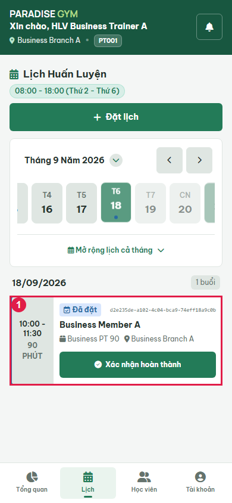
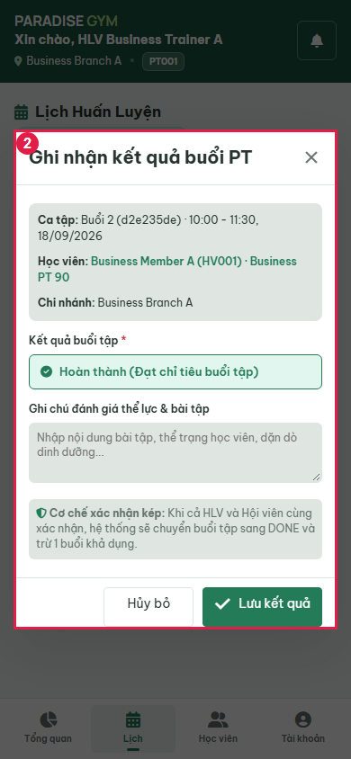
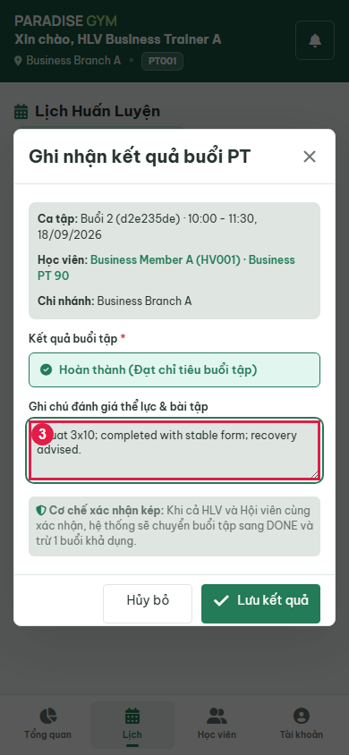
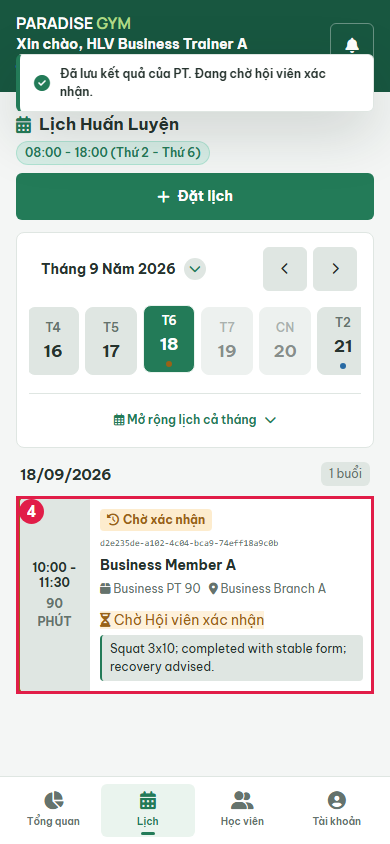
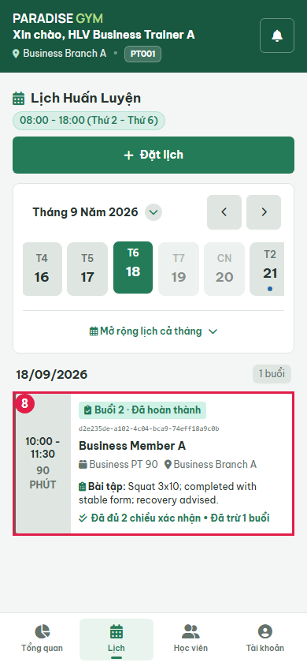
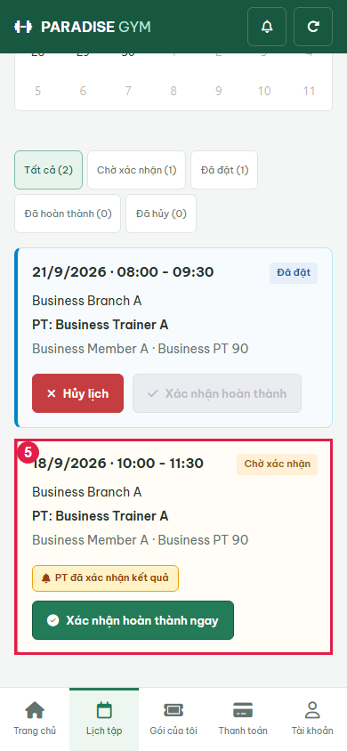
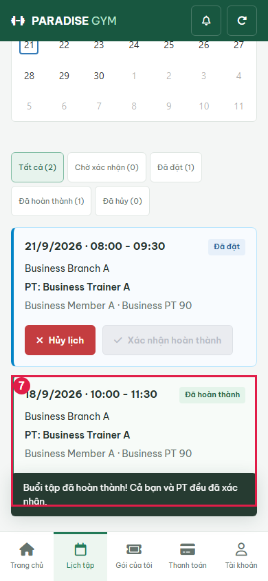
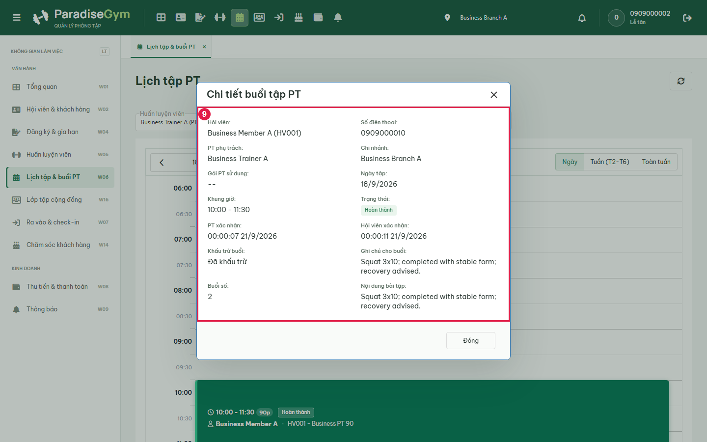

# PT01-US02 - Isolated real UI business E2E

Run: 2026-09-20T17:00:15.675Z

Sources: docs/user-stories/pt/PT01-Lịch/PT01-US02 story (Main Flow, Field specification, Alternate/Exception Flows); docs/product-spec.md sections 4.2-4.6.

Database: paradise_test_16340_1789923583241; frontend: http://localhost:3000; real backend: http://127.0.0.1:56778/api/v1. Browser requests redirected with route.continue, no response mocks. Real API auth sessions. Shared configured DB receives no application writes. Scope: test artifacts only; mailbox/skill/source files unchanged by this runner.

All migrations present at startup applied: 001_create_tables.sql, 002_web_rebuild.sql, 003_mobile_preferences.sql, 004_device_sessions.sql, 005_remove_pt_certificates.sql, 006_boss_feedback_schema_upgrade.sql, 007_commission_configs_uniqueness_and_history.sql, 008_branch_default_commission_rate.sql, 009_pt_commission_payout_details.sql, 010_scheduled_package_freezes.sql, 011_pt_bookings_no_overlap_indexes.sql, 012_pt_commission_session_snapshot.sql. Hashes recorded in results.json. No group booking fixture.

Fixture: {"b1":"92c0b8e1-dcd2-437b-849d-d83528c6e259","b2":"fdec4163-f261-4ad6-9518-61db9a040daa","member":{"id":"863de6b9-c05e-4c51-9c80-64ae852c2d44","account_id":"0468c8cf-8959-4fba-a2a5-1a17d0a735a2","home_branch_id":"92c0b8e1-dcd2-437b-849d-d83528c6e259","member_code":"HV001","full_name":"Business Member A","phone":"0909000010","email":null,"date_of_birth":null,"gender":null,"avatar_url":null,"status":"ACTIVE","created_by":"6392cfc1-1b4d-4134-908e-67789bffc1bd","created_at":"2026-09-20T16:59:44.679Z","updated_at":"2026-09-20T16:59:44.679Z","qr_code":"QR-HV001-0909000010","face_enrolled":false},"pt":{"id":"a9dfd926-256f-4f30-9577-d69d74520e5c","account_id":"98c2bd87-6688-4d6b-b625-6a8270b0dc5c","branch_id":"92c0b8e1-dcd2-437b-849d-d83528c6e259","pt_code":"PT001","full_name":"Business Trainer A","phone":"0909000020","email":null,"gender":null,"bio":null,"specialties":"Strength","status":"ACTIVE","work_start_time":"08:00:00","work_end_time":"18:00:00","work_days":"MON_TO_FRI","created_at":"2026-09-20T16:59:44.713Z","updated_at":"2026-09-20T16:59:44.713Z","show_phone_to_members":false,"avatar_url":null,"face_enrolled":false,"bank_name":null,"bank_account_no":null,"bank_account_name":null},"pt2":{"id":"41139077-1f45-49ef-9704-c7f34810f28e","account_id":"ab9f22c5-828d-46e5-9504-626d1103ab6d","branch_id":"fdec4163-f261-4ad6-9518-61db9a040daa","pt_code":"PT002","full_name":"Business Trainer B","phone":"0909000021","email":null,"gender":null,"bio":null,"specialties":"Strength","status":"ACTIVE","work_start_time":"08:00:00","work_end_time":"18:00:00","work_days":"MON_TO_FRI","created_at":"2026-09-20T16:59:44.733Z","updated_at":"2026-09-20T16:59:44.733Z","show_phone_to_members":false,"avatar_url":null,"face_enrolled":false,"bank_name":null,"bank_account_no":null,"bank_account_name":null},"registration":{"id":"6080920c-3f77-4f53-b09a-981a5a2f5548","reg_code":"DK002","member_id":"863de6b9-c05e-4c51-9c80-64ae852c2d44","package_id":"eeb74039-cab9-4d4b-a03f-0befea0a21ce","assigned_pt_id":"a9dfd926-256f-4f30-9577-d69d74520e5c","sold_branch_id":"92c0b8e1-dcd2-437b-849d-d83528c6e259","previous_registration_id":null,"package_name_snapshot":"Business PT 90","package_type_snapshot":"PT_SESSION","price_snapshot":1000000,"duration_days_snapshot":60,"total_gym_sessions_snapshot":null,"total_pt_sessions_snapshot":5,"start_date":"2026-09-20","end_date":"2026-11-19","remaining_gym_sessions":null,"remaining_pt_sessions":5,"booked_pt_sessions":0,"used_pt_sessions":0,"status":"ACTIVE","created_by":"6392cfc1-1b4d-4134-908e-67789bffc1bd","created_at":"2026-09-20T16:59:45.959Z","updated_at":"2026-09-20T16:59:46.015Z","gym_price_snapshot":0,"pt_price_snapshot":1000000,"combo_price_snapshot":0,"package_mode":"INDIVIDUAL","max_group_members_snapshot":null,"is_frozen":false,"freeze_days_total":0,"group_leader_member_id":null,"has_scheduled_freeze":false,"registration_code":"DK002","member":{"id":"863de6b9-c05e-4c51-9c80-64ae852c2d44","account_id":"0468c8cf-8959-4fba-a2a5-1a17d0a735a2","home_branch_id":"92c0b8e1-dcd2-437b-849d-d83528c6e259","member_code":"HV001","full_name":"Business Member A","phone":"0909000010","email":null,"date_of_birth":null,"gender":null,"avatar_url":null,"status":"ACTIVE","created_by":"6392cfc1-1b4d-4134-908e-67789bffc1bd","created_at":"2026-09-20T16:59:44.679Z","updated_at":"2026-09-20T16:59:44.679Z","qr_code":"QR-HV001-0909000010","face_enrolled":false},"member_name":"Business Member A","member_code":"HV001","member_phone":"0909000010","allowed_branches":[{"id":"92c0b8e1-dcd2-437b-849d-d83528c6e259","branch_code":"Business Branch A","branch_name":"Business Branch A","phone":"0909999999","address":"Isolated E2E","status":"ACTIVE","open_time":"00:00:00","close_time":"23:59:00","timezone":"Asia/Ho_Chi_Minh","created_at":"2026-09-20T16:59:44.104Z","updated_at":"2026-09-20T16:59:44.104Z","gate_config":{"duplicate_seconds":60,"daily_gym_deduction_limit":1},"default_pt_commission_percentage":20}],"assigned_pt":{"id":"a9dfd926-256f-4f30-9577-d69d74520e5c","account_id":"98c2bd87-6688-4d6b-b625-6a8270b0dc5c","branch_id":"92c0b8e1-dcd2-437b-849d-d83528c6e259","pt_code":"PT001","full_name":"Business Trainer A","phone":"0909000020","email":null,"gender":null,"bio":null,"specialties":"Strength","status":"ACTIVE","work_start_time":"08:00:00","work_end_time":"18:00:00","work_days":"MON_TO_FRI","created_at":"2026-09-20T16:59:44.713Z","updated_at":"2026-09-20T16:59:44.713Z","show_phone_to_members":false,"avatar_url":null,"face_enrolled":false,"bank_name":null,"bank_account_no":null,"bank_account_name":null},"pt_name":"Business Trainer A","payments":[{"id":"6eee0351-f1b4-4be7-8ddc-2cdddd43b408","registration_id":"6080920c-3f77-4f53-b09a-981a5a2f5548","member_id":"863de6b9-c05e-4c51-9c80-64ae852c2d44","branch_id":"92c0b8e1-dcd2-437b-849d-d83528c6e259","payment_code":"PAY002","payment_method":"CASH","amount":1000000,"status":"COMPLETED","transaction_ref":null,"collected_by":"6392cfc1-1b4d-4134-908e-67789bffc1bd","confirmed_at":"2026-09-20T16:59:45.978Z","created_at":"2026-09-20T16:59:45.978Z","updated_at":"2026-09-20T16:59:45.978Z","note":null,"expires_at":null,"discount_id":null,"discount_amount":0}],"created_by_name":"0909000002","freezes":[],"transfers":[],"progress":{"elapsed_days":0,"remaining_days":60,"total_days":60,"checkins":0,"total_pt_sessions":5,"used_pt_sessions":0,"booked_pt_sessions":0,"remaining_pt_sessions":5}},"date":"2026-09-21","confirmationFixture":{"bookingId":"d2e235de-a102-4c04-bca9-74eff18a9c0b","pastDate":"2026-09-18","setup":"Created a second booking through real PT API; isolated SQL moves its date to previous working day and registration starts to that date. No source/UI clock override, no fabricated confirmation or counters. Original PT01-US03 booking stays future."}}

## Source Action Verification

### Select past working-day session

- Action / Input: Select past working-day session
- Expected Result: PT01-US02 Preconditions: assigned session has ended and neither party confirmed
- Actual Result: booking_id=d2e235de-a102-4c04-bca9-74eff18a9c0b; 10:00 - 11:30
90 PHÚT
Đã đặt
d2e235de-a102-4c04-bca9-74eff18a9c0b
Business Member A
 Business PT 90
 Business Branch A
Xác nhận hoàn thành
- Status: **PASS**

### Open PT confirmation modal

- Action / Input: Open PT confirmation modal
- Expected Result: Main Flow 2-3: session/member/package prefill and completion result
- Actual Result: Ghi nhận kết quả buổi PT
Ca tập: Buổi 2 (d2e235de) · 10:00 - 11:30, 18/09/2026
Học viên: Business Member A (HV001) · Business PT 90
Chi nhánh: Business Branch A
Kết quả buổi tập *
Hoàn thành (Đạt chỉ tiêu buổi tập)
Ghi chú đánh giá thể lực & bài tập
 Cơ chế xác nhận kép: Khi cả HLV và Hội viên cùng xác nhận, hệ thống sẽ chuyển buổi tập sang DONE và trừ 1 buổi khả dụng.
Hủy bỏ
	
Lưu kết quả
- Status: **PASS**

### Enter workout assessment before saving

- Action / Input: Enter workout assessment before saving
- Expected Result: Main Flow 4: optional PT notes retained in input before submit
- Actual Result: Squat 3x10; completed with stable form; recovery advised.
- Status: **PASS**

### Save PT result and view pending member state

- Action / Input: Save PT result and view pending member state
- Expected Result: Main Flow 6-8: PT-only confirmation waits for member and does not consume another session
- Actual Result: 10:00 - 11:30
90 PHÚT
Chờ xác nhận
d2e235de-a102-4c04-bca9-74eff18a9c0b
Business Member A
 Business PT 90
 Business Branch A
 Chờ Hội viên xác nhận
Squat 3x10; completed with stable form; recovery advised.
- Status: **PASS**

## State Verification

- **PASS** Documented past fixture baseline: {"remaining_pt_sessions":3,"booked_pt_sessions":2,"used_pt_sessions":0,"total_pt_sessions_snapshot":5}
- **PASS** After PT-only confirmation: {"status":"PENDING_COMPLETION","notes":"Squat 3x10; completed with stable form; recovery advised.","counters":{"remaining_pt_sessions":3,"booked_pt_sessions":2,"used_pt_sessions":0,"total_pt_sessions_snapshot":5}}
- **PASS** After both confirmations: no second remaining deduction: {"remaining_pt_sessions":3,"booked_pt_sessions":1,"used_pt_sessions":1,"total_pt_sessions_snapshot":5}
- **FAIL** AF-03 retry pt-confirm: {"status":409,"payload":{"success":false,"message":"Lịch tập không còn ở trạng thái được phép thao tác.","code":"VALIDATION_ERROR"},"counters":{"remaining_pt_sessions":3,"booked_pt_sessions":1,"used_pt_sessions":1,"total_pt_sessions_snapshot":5}}
- **FAIL** AF-03 retry member-confirm: {"status":409,"payload":{"success":false,"message":"Lịch tập không còn ở trạng thái được phép thao tác.","code":"VALIDATION_ERROR"},"counters":{"remaining_pt_sessions":3,"booked_pt_sessions":1,"used_pt_sessions":1,"total_pt_sessions_snapshot":5}}
- **PASS** Repeated confirmations do not deduct twice: {"remaining_pt_sessions":3,"booked_pt_sessions":1,"used_pt_sessions":1,"total_pt_sessions_snapshot":5}
- **OBSERVATION** Out-of-scope LT display observation: "Booking detail package value is --; calendar has Business PT 90. Same booking, notes, completion and timestamps verified."

### Refresh PT calendar after member confirms

- Action / Input: Refresh PT calendar after member confirms
- Expected Result: Main Flow 8: completed card readonly and persisted PT notes visible
- Actual Result: 10:00 - 11:30
90 PHÚT
Buổi 2 · Đã hoàn thành
d2e235de-a102-4c04-bca9-74eff18a9c0b
Business Member A
 Business PT 90
 Business Branch A
 Bài tập: Squat 3x10; completed with stable form; recovery advised.
Đã đủ 2 chiều xác nhận • Đã trừ 1 buổi
- Status: **PASS**

## Cross-Role / Downstream Verification

### Open same member session after PT confirms

- Action / Input: Open same member session after PT confirms
- Expected Result: Main Flow 7: same booking awaits member confirmation
- Actual Result: booking_id=d2e235de-a102-4c04-bca9-74eff18a9c0b; 18/9/2026 · 10:00 - 11:30
Chờ xác nhận

Business Branch A

PT: Business Trainer A

Business Member A · Business PT 90

PT đã xác nhận kết quả
Xác nhận hoàn thành ngay
- Status: **PASS**

### Open member confirmation dialog

- Action / Input: Open member confirmation dialog
- Expected Result: Main Flow 7: same member confirms their completed session
- Actual Result: Xác nhận hoàn thành

Buổi tập với PT Business Trainer A lúc 10:00 - 11:30, 18/9/2026.

 PT đã xác nhận hoàn thành kết quả

Hệ thống sẽ trừ chính xác 1 buổi trong gói tập của bạn sau khi cả bạn và PT cùng hoàn tất xác nhận kép.

Xác nhận hoàn thành
- Status: **PASS**

### Submit member confirmation

- Action / Input: Submit member confirmation
- Expected Result: Main Flow 7: dual confirmation completes exactly the same booking
- Actual Result: 18/9/2026 · 10:00 - 11:30
Đã hoàn thành

Business Branch A

PT: Business Trainer A

Business Member A · Business PT 90

Đã hoàn tất xác nhận kép
- Status: **PASS**

### Open completed booking in receptionist UI

- Action / Input: Open completed booking in receptionist UI
- Expected Result: Cross-role synchronization: same session completed and notes retained
- Actual Result: booking_id=d2e235de-a102-4c04-bca9-74eff18a9c0b; Hội viên:
Business Member A (HV001)
Số điện thoại:
0909000010
PT phụ trách:
Business Trainer A
Chi nhánh:
Business Branch A
Gói PT sử dụng:
--
Ngày tập:
18/9/2026
Khung giờ:
10:00 - 11:30
Trạng thái:
Hoàn thành
PT xác nhận:
00:00:07 21/9/2026
Hội viên xác nhận:
00:00:11 21/9/2026
Khấu trừ buổi:
Đã khấu trừ
Ghi chú cho buổi:
Squat 3x10; completed with stable form; recovery advised.
Buổi số:
2
Nội dung bài tập:
Squat 3x10; completed with stable form; recovery advised.
- Status: **PASS**

## Issues Found

- AF-03 pt-confirm: expected 200 with current state; actual HTTP 409. Counters remain correct, so no duplicate deduction. Main PT/member confirmation UI flow passed. Backend source left unchanged.
- AF-03 member-confirm: expected 200 with current state; actual HTTP 409. Counters remain correct, so no duplicate deduction. Main PT/member confirmation UI flow passed. Backend source left unchanged.

## Final Result

**FAIL**. 9/9 UI steps passed. Last phase: AF-03 repeated confirmation API checks. Scope is the recorded scenarios, not complete acceptance of every exception flow.

Run: node tests/e2e/pt/business-20260920.cjs
