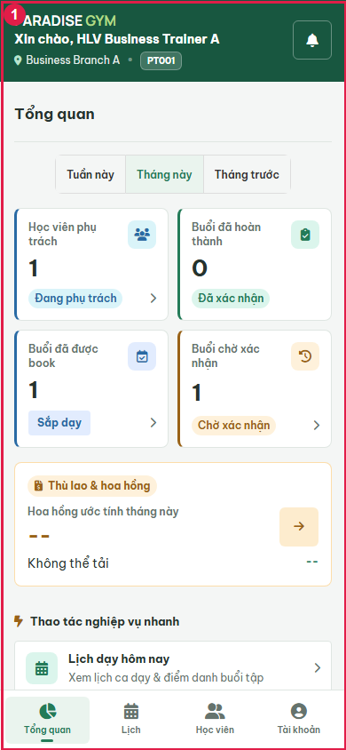

# PT01-US02 - Isolated real UI business E2E

Run: 2026-09-20T17:33:05.152Z

Sources: docs/user-stories/pt/PT01-Lịch/PT01-US02 story (Main Flow, Field specification, Alternate/Exception Flows); docs/product-spec.md sections 4.2-4.6.

Database: paradise_test_30740_1789925525858; frontend: http://localhost:3000; real backend: http://127.0.0.1:59829/api/v1. Browser requests redirected with route.continue, no response mocks. Real API auth sessions. Shared configured DB receives no application writes. Scope: test artifacts only; mailbox/skill/source files unchanged by this runner.

All migrations present at startup applied: 001_create_tables.sql, 002_web_rebuild.sql, 003_mobile_preferences.sql, 004_device_sessions.sql, 005_remove_pt_certificates.sql, 006_boss_feedback_schema_upgrade.sql, 007_commission_configs_uniqueness_and_history.sql, 008_branch_default_commission_rate.sql, 009_pt_commission_payout_details.sql, 010_scheduled_package_freezes.sql, 011_pt_bookings_no_overlap_indexes.sql, 012_pt_commission_session_snapshot.sql, 013_pt_booking_participants.sql. Hashes recorded in results.json. Individual booking fixture.

Fixture: {"b1":"0ee84995-0472-4b84-999e-a9007e137118","b2":"f3148f2f-a7d1-4e72-9385-c526bf1ebc40","member":{"id":"7a7a0c78-7d61-4125-8c37-bc75e56d7e02","account_id":"ff2dfc16-b2df-447d-b71a-242337c790c3","home_branch_id":"0ee84995-0472-4b84-999e-a9007e137118","member_code":"HV001","full_name":"Business Member A","phone":"0909000010","email":null,"date_of_birth":null,"gender":null,"avatar_url":null,"status":"ACTIVE","created_by":"defe4827-1f10-4ce4-a011-09516ec3971c","created_at":"2026-09-20T17:32:07.198Z","updated_at":"2026-09-20T17:32:07.198Z","qr_code":"QR-HV001-0909000010","face_enrolled":false},"pt":{"id":"65118f2b-dfd0-413f-89af-c67404148142","account_id":"f786890f-e3a6-4f38-864e-c4aff17ebfe2","branch_id":"0ee84995-0472-4b84-999e-a9007e137118","pt_code":"PT001","full_name":"Business Trainer A","phone":"0909000020","email":null,"gender":null,"bio":null,"specialties":"Strength","status":"ACTIVE","work_start_time":"08:00:00","work_end_time":"18:00:00","work_days":"MON_TO_FRI","created_at":"2026-09-20T17:32:07.229Z","updated_at":"2026-09-20T17:32:07.229Z","show_phone_to_members":false,"avatar_url":null,"face_enrolled":false,"bank_name":null,"bank_account_no":null,"bank_account_name":null},"pt2":{"id":"b95e3898-d17a-4a3d-83b8-cda2f0ee2d43","account_id":"f4fde08e-c185-49f9-9845-fa231efff740","branch_id":"f3148f2f-a7d1-4e72-9385-c526bf1ebc40","pt_code":"PT002","full_name":"Business Trainer B","phone":"0909000021","email":null,"gender":null,"bio":null,"specialties":"Strength","status":"ACTIVE","work_start_time":"08:00:00","work_end_time":"18:00:00","work_days":"MON_TO_FRI","created_at":"2026-09-20T17:32:07.252Z","updated_at":"2026-09-20T17:32:07.252Z","show_phone_to_members":false,"avatar_url":null,"face_enrolled":false,"bank_name":null,"bank_account_no":null,"bank_account_name":null},"registration":{"id":"3c1be56b-b9fc-432a-a3b8-012c136a9fcd","reg_code":"DK002","member_id":"7a7a0c78-7d61-4125-8c37-bc75e56d7e02","package_id":"3c90ae9e-ad4f-4244-a1e6-e9e9c672c997","assigned_pt_id":"65118f2b-dfd0-413f-89af-c67404148142","sold_branch_id":"0ee84995-0472-4b84-999e-a9007e137118","previous_registration_id":null,"package_name_snapshot":"Business PT 90","package_type_snapshot":"PT_SESSION","price_snapshot":1000000,"duration_days_snapshot":60,"total_gym_sessions_snapshot":null,"total_pt_sessions_snapshot":5,"start_date":"2026-09-21","end_date":"2026-11-20","remaining_gym_sessions":null,"remaining_pt_sessions":5,"booked_pt_sessions":0,"used_pt_sessions":0,"status":"ACTIVE","created_by":"defe4827-1f10-4ce4-a011-09516ec3971c","created_at":"2026-09-20T17:32:08.263Z","updated_at":"2026-09-20T17:32:08.311Z","gym_price_snapshot":0,"pt_price_snapshot":1000000,"combo_price_snapshot":0,"package_mode":"INDIVIDUAL","max_group_members_snapshot":null,"is_frozen":false,"freeze_days_total":0,"group_leader_member_id":null,"has_scheduled_freeze":false,"registration_code":"DK002","member":{"id":"7a7a0c78-7d61-4125-8c37-bc75e56d7e02","account_id":"ff2dfc16-b2df-447d-b71a-242337c790c3","home_branch_id":"0ee84995-0472-4b84-999e-a9007e137118","member_code":"HV001","full_name":"Business Member A","phone":"0909000010","email":null,"date_of_birth":null,"gender":null,"avatar_url":null,"status":"ACTIVE","created_by":"defe4827-1f10-4ce4-a011-09516ec3971c","created_at":"2026-09-20T17:32:07.198Z","updated_at":"2026-09-20T17:32:07.198Z","qr_code":"QR-HV001-0909000010","face_enrolled":false},"member_name":"Business Member A","member_code":"HV001","member_phone":"0909000010","allowed_branches":[{"id":"0ee84995-0472-4b84-999e-a9007e137118","branch_code":"Business Branch A","branch_name":"Business Branch A","phone":"0909999999","address":"Isolated E2E","status":"ACTIVE","open_time":"00:00:00","close_time":"23:59:00","timezone":"Asia/Ho_Chi_Minh","created_at":"2026-09-20T17:32:06.637Z","updated_at":"2026-09-20T17:32:06.637Z","gate_config":{"duplicate_seconds":60,"daily_gym_deduction_limit":1},"default_pt_commission_percentage":20}],"assigned_pt":{"id":"65118f2b-dfd0-413f-89af-c67404148142","account_id":"f786890f-e3a6-4f38-864e-c4aff17ebfe2","branch_id":"0ee84995-0472-4b84-999e-a9007e137118","pt_code":"PT001","full_name":"Business Trainer A","phone":"0909000020","email":null,"gender":null,"bio":null,"specialties":"Strength","status":"ACTIVE","work_start_time":"08:00:00","work_end_time":"18:00:00","work_days":"MON_TO_FRI","created_at":"2026-09-20T17:32:07.229Z","updated_at":"2026-09-20T17:32:07.229Z","show_phone_to_members":false,"avatar_url":null,"face_enrolled":false,"bank_name":null,"bank_account_no":null,"bank_account_name":null},"pt_name":"Business Trainer A","payments":[{"id":"8cdc3b1b-d7b1-4398-acd4-050e0eda8b2d","registration_id":"3c1be56b-b9fc-432a-a3b8-012c136a9fcd","member_id":"7a7a0c78-7d61-4125-8c37-bc75e56d7e02","branch_id":"0ee84995-0472-4b84-999e-a9007e137118","payment_code":"PAY002","payment_method":"CASH","amount":1000000,"status":"COMPLETED","transaction_ref":null,"collected_by":"defe4827-1f10-4ce4-a011-09516ec3971c","confirmed_at":"2026-09-20T17:32:08.280Z","created_at":"2026-09-20T17:32:08.280Z","updated_at":"2026-09-20T17:32:08.280Z","note":null,"expires_at":null,"discount_id":null,"discount_amount":0}],"created_by_name":"0909000002","freezes":[],"transfers":[],"progress":{"elapsed_days":0,"remaining_days":60,"total_days":60,"checkins":0,"total_pt_sessions":5,"used_pt_sessions":0,"booked_pt_sessions":0,"remaining_pt_sessions":5}},"date":"2026-09-22","groupMode":false,"confirmationFixture":{"bookingId":"1c5149fe-f1ed-44fc-a861-d66167c5e029","pastDate":"2026-09-18","entitlementIds":["f98fd769-7468-4961-88ca-d0383c5cee1f","3c1be56b-b9fc-432a-a3b8-012c136a9fcd"],"paidAt":"2026-09-18T07:00:00+07:00","setup":"Second booking created through real PT API. Isolated SQL moves booking date to previous working day; shifts linked PT and every snapshot participant Gym validity window together, preserving duration; aligns completed payment created/confirmed timestamps and receipt issued_at to 07:00 before the 10:00 session. Booking owner, registration, transaction marker and all participant snapshot rows remain byte-for-byte equivalent as asserted. No fabricated confirmation/counters or UI clock override; actual UI confirmation remains under test. Original PT01-US03 booking stays future.","paymentGuard":"Only completed_payment_immutable temporarily disabled inside isolated fixture transaction for timestamp adjustment, then re-enabled and asserted before UI confirmation. All other constraints and all participant snapshot guards remain active."}}

## Source Action Verification

### Blocked at PT confirmation UI

- Action / Input: Blocked at PT confirmation UI
- Expected Result: Complete the requested real UI flow
- Actual Result: locator.waitFor: Timeout 15000ms exceeded.
Call log:
  - waiting for locator('#ptCreateBooking') to be visible
    33 × locator resolved to hidden <button type="button" id="ptCreateBooking" class="btn btn-primary" aria-label="Đặt lịch PT">…</button>

- Status: **FAIL**

## State Verification

- **PASS** Historical entitlement/payment consistency and unchanged participant snapshot: {"entitlements":[{"id":"f98fd769-7468-4961-88ca-d0383c5cee1f","member_id":"7a7a0c78-7d61-4125-8c37-bc75e56d7e02","package_type_snapshot":"GYM_SESSION","start_date":"2026-09-18","end_date":"2026-11-17"},{"id":"3c1be56b-b9fc-432a-a3b8-012c136a9fcd","member_id":"7a7a0c78-7d61-4125-8c37-bc75e56d7e02","package_type_snapshot":"PT_SESSION","start_date":"2026-09-18","end_date":"2026-11-17"}],"payments":[{"id":"4e9c227d-daaa-4b89-93d9-a0cb0ca1da82","registration_id":"f98fd769-7468-4961-88ca-d0383c5cee1f","created_at":"2026-09-18T00:00:00.000Z","confirmed_at":"2026-09-18T00:00:00.000Z","issued_at":"2026-09-18T00:00:00.000Z"},{"id":"8cdc3b1b-d7b1-4398-acd4-050e0eda8b2d","registration_id":"3c1be56b-b9fc-432a-a3b8-012c136a9fcd","created_at":"2026-09-18T00:00:00.000Z","confirmed_at":"2026-09-18T00:00:00.000Z","issued_at":"2026-09-18T00:00:00.000Z"}],"identity":{"member_id":"7a7a0c78-7d61-4125-8c37-bc75e56d7e02","registration_id":"3c1be56b-b9fc-432a-a3b8-012c136a9fcd","participants_snapshot_xid":null},"snapshot":[]}
- **PASS** Documented past fixture baseline: {"remaining_pt_sessions":3,"booked_pt_sessions":2,"used_pt_sessions":0,"total_pt_sessions_snapshot":5}

## Cross-Role / Downstream Verification

BLOCKED: source/setup did not reach downstream checks.

## Issues Found

- PT confirmation UI: locator.waitFor: Timeout 15000ms exceeded.
Call log:
  - waiting for locator('#ptCreateBooking') to be visible
    33 × locator resolved to hidden <button type="button" id="ptCreateBooking" class="btn btn-primary" aria-label="Đặt lịch PT">…</button>

    at confirmFlow (E:\Desktop\para\tests\e2e\pt\business-20260920.cjs:371:44)
    at async main (E:\Desktop\para\tests\e2e\pt\business-20260920.cjs:299:3)
- Blocked at PT confirmation UI: locator.waitFor: Timeout 15000ms exceeded.
Call log:
  - waiting for locator('#ptCreateBooking') to be visible
    33 × locator resolved to hidden <button type="button" id="ptCreateBooking" class="btn btn-primary" aria-label="Đặt lịch PT">…</button>

## Final Result

**BLOCKED**. 0/1 UI steps passed. Last phase: PT confirmation UI. Scope is the recorded scenarios, not complete acceptance of every exception flow.

Run: node tests/e2e/pt/business-20260920.cjs

Browser page errors: []

Prior run evidence (retained before rerun):
- [2026-09-20T17-15-58-025Z](./history/2026-09-20T17-15-58-025Z/PT01-US02-test.md)
- [2026-09-20T17-18-59-629Z](./history/2026-09-20T17-18-59-629Z/PT01-US02-test.md)
- [2026-09-20T17-20-43-945Z](./history/2026-09-20T17-20-43-945Z/PT01-US02-test.md)
- [2026-09-20T17-32-43-511Z](./history/2026-09-20T17-32-43-511Z/PT01-US02-test.md)

Group mode: false. Run with PT_E2E_GROUP=1 for group coverage.
