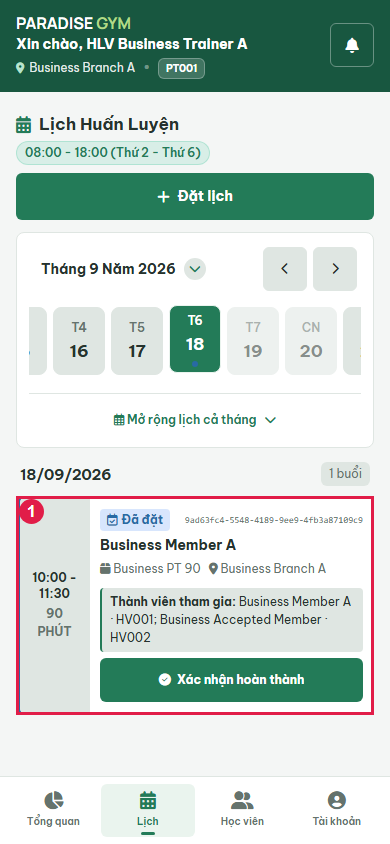
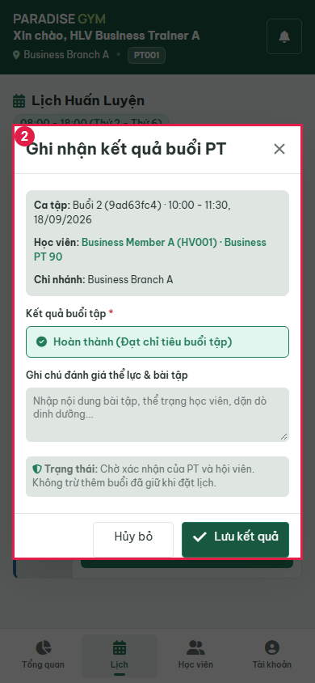
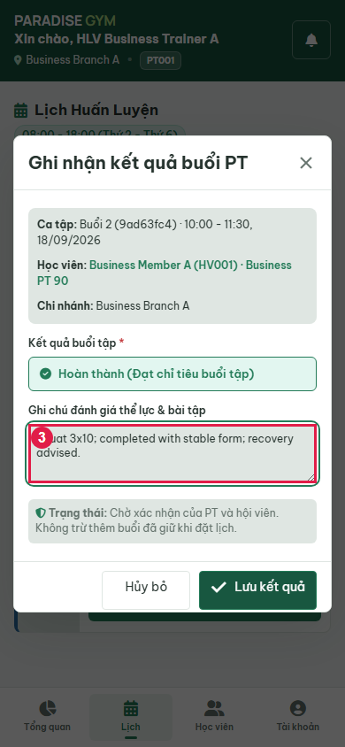
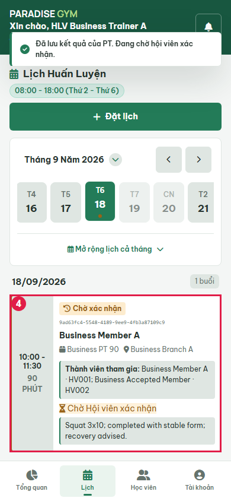
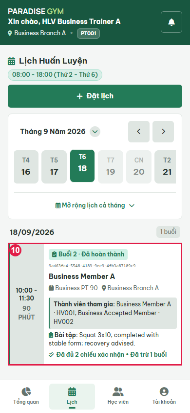
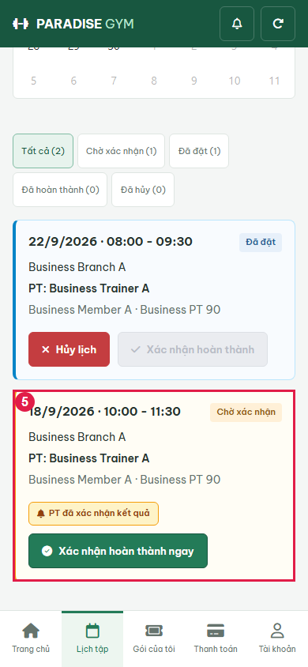
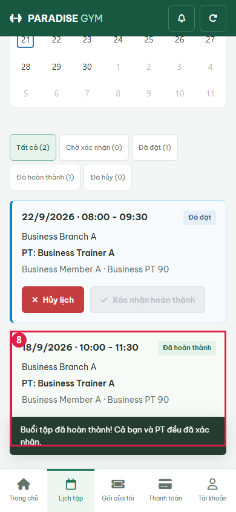
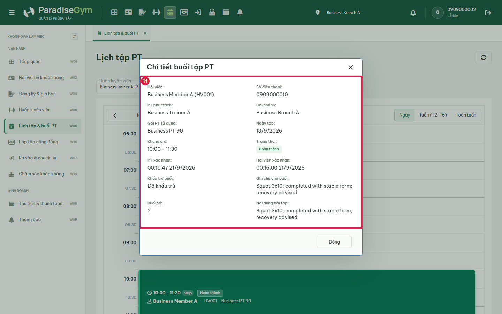

# PT01-US02 - Isolated real UI business E2E

Run: 2026-09-20T17:16:12.684Z

Sources: docs/user-stories/pt/PT01-Lịch/PT01-US02 story (Main Flow, Field specification, Alternate/Exception Flows); docs/product-spec.md sections 4.2-4.6.

Database: paradise_test_32492_1789924490183; frontend: http://localhost:3000; real backend: http://127.0.0.1:63424/api/v1. Browser requests redirected with route.continue, no response mocks. Real API auth sessions. Shared configured DB receives no application writes. Scope: test artifacts only; mailbox/skill/source files unchanged by this runner.

All migrations present at startup applied: 001_create_tables.sql, 002_web_rebuild.sql, 003_mobile_preferences.sql, 004_device_sessions.sql, 005_remove_pt_certificates.sql, 006_boss_feedback_schema_upgrade.sql, 007_commission_configs_uniqueness_and_history.sql, 008_branch_default_commission_rate.sql, 009_pt_commission_payout_details.sql, 010_scheduled_package_freezes.sql, 011_pt_bookings_no_overlap_indexes.sql, 012_pt_commission_session_snapshot.sql, 013_pt_booking_participants.sql. Hashes recorded in results.json. Group fixture: leader + ACCEPTED member; PENDING member excluded. SQL fixture setup is confined to the new isolated database. Participant Gym expiry is temporarily changed only for EF-02.

Fixture: {"b1":"44c38833-320a-4b90-a39f-faa75e7ce4c5","b2":"d7e2f78d-666a-4467-bcb2-282b01ac661e","member":{"id":"5b3351c2-8f57-4178-9e19-cb729958e07a","account_id":"0295f84c-8676-4603-8fa7-0b517a2e315e","home_branch_id":"44c38833-320a-4b90-a39f-faa75e7ce4c5","member_code":"HV001","full_name":"Business Member A","phone":"0909000010","email":null,"date_of_birth":null,"gender":null,"avatar_url":null,"status":"ACTIVE","created_by":"9b7d1c81-0691-45ba-8c66-d742dcbe3f73","created_at":"2026-09-20T17:14:51.810Z","updated_at":"2026-09-20T17:14:51.810Z","qr_code":"QR-HV001-0909000010","face_enrolled":false},"pt":{"id":"9e91579c-529e-4771-915a-dba941ff7534","account_id":"bac1deec-c5fa-4f93-b86a-92e866cf18c8","branch_id":"44c38833-320a-4b90-a39f-faa75e7ce4c5","pt_code":"PT001","full_name":"Business Trainer A","phone":"0909000020","email":null,"gender":null,"bio":null,"specialties":"Strength","status":"ACTIVE","work_start_time":"08:00:00","work_end_time":"18:00:00","work_days":"MON_TO_FRI","created_at":"2026-09-20T17:14:51.857Z","updated_at":"2026-09-20T17:14:51.857Z","show_phone_to_members":false,"avatar_url":null,"face_enrolled":false,"bank_name":null,"bank_account_no":null,"bank_account_name":null},"pt2":{"id":"30b30852-6e59-4bf5-8ab8-009d213e4ce3","account_id":"c6a23770-dd16-450e-8f54-706d180b3d86","branch_id":"d7e2f78d-666a-4467-bcb2-282b01ac661e","pt_code":"PT002","full_name":"Business Trainer B","phone":"0909000021","email":null,"gender":null,"bio":null,"specialties":"Strength","status":"ACTIVE","work_start_time":"08:00:00","work_end_time":"18:00:00","work_days":"MON_TO_FRI","created_at":"2026-09-20T17:14:51.886Z","updated_at":"2026-09-20T17:14:51.886Z","show_phone_to_members":false,"avatar_url":null,"face_enrolled":false,"bank_name":null,"bank_account_no":null,"bank_account_name":null},"registration":{"id":"20f0138a-4c44-4def-b6f4-41e8f23e2da8","reg_code":"DK002","member_id":"5b3351c2-8f57-4178-9e19-cb729958e07a","package_id":"b7923b72-a5db-4ba0-abf9-1aa06f3dd9e9","assigned_pt_id":"9e91579c-529e-4771-915a-dba941ff7534","sold_branch_id":"44c38833-320a-4b90-a39f-faa75e7ce4c5","previous_registration_id":null,"package_name_snapshot":"Business PT 90","package_type_snapshot":"PT_SESSION","price_snapshot":1000000,"duration_days_snapshot":60,"total_gym_sessions_snapshot":null,"total_pt_sessions_snapshot":5,"start_date":"2026-09-21","end_date":"2026-11-20","remaining_gym_sessions":null,"remaining_pt_sessions":5,"booked_pt_sessions":0,"used_pt_sessions":0,"status":"ACTIVE","created_by":"9b7d1c81-0691-45ba-8c66-d742dcbe3f73","created_at":"2026-09-20T17:14:53.304Z","updated_at":"2026-09-20T17:14:53.427Z","gym_price_snapshot":0,"pt_price_snapshot":1000000,"combo_price_snapshot":0,"package_mode":"GROUP_1_N","max_group_members_snapshot":3,"is_frozen":false,"freeze_days_total":0,"group_leader_member_id":"5b3351c2-8f57-4178-9e19-cb729958e07a","has_scheduled_freeze":false,"registration_code":"DK002","member":{"id":"5b3351c2-8f57-4178-9e19-cb729958e07a","account_id":"0295f84c-8676-4603-8fa7-0b517a2e315e","home_branch_id":"44c38833-320a-4b90-a39f-faa75e7ce4c5","member_code":"HV001","full_name":"Business Member A","phone":"0909000010","email":null,"date_of_birth":null,"gender":null,"avatar_url":null,"status":"ACTIVE","created_by":"9b7d1c81-0691-45ba-8c66-d742dcbe3f73","created_at":"2026-09-20T17:14:51.810Z","updated_at":"2026-09-20T17:14:51.810Z","qr_code":"QR-HV001-0909000010","face_enrolled":false},"member_name":"Business Member A","member_code":"HV001","member_phone":"0909000010","allowed_branches":[{"id":"44c38833-320a-4b90-a39f-faa75e7ce4c5","branch_code":"Business Branch A","branch_name":"Business Branch A","phone":"0909999999","address":"Isolated E2E","status":"ACTIVE","open_time":"00:00:00","close_time":"23:59:00","timezone":"Asia/Ho_Chi_Minh","created_at":"2026-09-20T17:14:51.192Z","updated_at":"2026-09-20T17:14:51.192Z","gate_config":{"duplicate_seconds":60,"daily_gym_deduction_limit":1},"default_pt_commission_percentage":20}],"assigned_pt":{"id":"9e91579c-529e-4771-915a-dba941ff7534","account_id":"bac1deec-c5fa-4f93-b86a-92e866cf18c8","branch_id":"44c38833-320a-4b90-a39f-faa75e7ce4c5","pt_code":"PT001","full_name":"Business Trainer A","phone":"0909000020","email":null,"gender":null,"bio":null,"specialties":"Strength","status":"ACTIVE","work_start_time":"08:00:00","work_end_time":"18:00:00","work_days":"MON_TO_FRI","created_at":"2026-09-20T17:14:51.857Z","updated_at":"2026-09-20T17:14:51.857Z","show_phone_to_members":false,"avatar_url":null,"face_enrolled":false,"bank_name":null,"bank_account_no":null,"bank_account_name":null},"pt_name":"Business Trainer A","payments":[{"id":"38e44418-cad8-4b54-9e93-6b4dcd30241a","registration_id":"20f0138a-4c44-4def-b6f4-41e8f23e2da8","member_id":"5b3351c2-8f57-4178-9e19-cb729958e07a","branch_id":"44c38833-320a-4b90-a39f-faa75e7ce4c5","payment_code":"PAY002","payment_method":"CASH","amount":1000000,"status":"COMPLETED","transaction_ref":null,"collected_by":"9b7d1c81-0691-45ba-8c66-d742dcbe3f73","confirmed_at":"2026-09-20T17:14:53.362Z","created_at":"2026-09-20T17:14:53.362Z","updated_at":"2026-09-20T17:14:53.362Z","note":null,"expires_at":null,"discount_id":null,"discount_amount":0}],"created_by_name":"0909000002","freezes":[],"transfers":[],"progress":{"elapsed_days":0,"remaining_days":60,"total_days":60,"checkins":0,"total_pt_sessions":5,"used_pt_sessions":0,"booked_pt_sessions":0,"remaining_pt_sessions":5}},"date":"2026-09-22","groupMode":true,"accepted":{"id":"1bc8fcf9-d251-4e90-8191-4a47e288a5cd","account_id":"f07e3848-ef41-4111-a990-0ed09657a0ec","home_branch_id":"44c38833-320a-4b90-a39f-faa75e7ce4c5","member_code":"HV002","full_name":"Business Accepted Member","phone":"0909000011","email":null,"date_of_birth":null,"gender":null,"avatar_url":null,"status":"ACTIVE","created_by":"9b7d1c81-0691-45ba-8c66-d742dcbe3f73","created_at":"2026-09-20T17:14:53.529Z","updated_at":"2026-09-20T17:14:53.529Z","qr_code":"QR-HV002-0909000011","face_enrolled":false},"pending":{"id":"165b5643-ca27-4736-8a07-d9458c80278c","account_id":"7682c3c8-cfdb-42c1-956e-e8217bc70ab2","home_branch_id":"44c38833-320a-4b90-a39f-faa75e7ce4c5","member_code":"HV003","full_name":"Business Pending Member","phone":"0909000012","email":null,"date_of_birth":null,"gender":null,"avatar_url":null,"status":"ACTIVE","created_by":"9b7d1c81-0691-45ba-8c66-d742dcbe3f73","created_at":"2026-09-20T17:14:53.553Z","updated_at":"2026-09-20T17:14:53.553Z","qr_code":"QR-HV003-0909000012","face_enrolled":false},"acceptedGym":{"id":"7173a4c5-7285-4686-a110-aae2d04e3e7c","reg_code":"DK003","member_id":"1bc8fcf9-d251-4e90-8191-4a47e288a5cd","package_id":"f53c2544-1e92-448e-aa9c-2a6695f8bfa8","assigned_pt_id":null,"sold_branch_id":"44c38833-320a-4b90-a39f-faa75e7ce4c5","previous_registration_id":null,"package_name_snapshot":"Business Gym","package_type_snapshot":"GYM_SESSION","price_snapshot":500000,"duration_days_snapshot":60,"total_gym_sessions_snapshot":20,"total_pt_sessions_snapshot":null,"start_date":"2026-09-21","end_date":"2026-11-20","remaining_gym_sessions":20,"remaining_pt_sessions":null,"booked_pt_sessions":0,"used_pt_sessions":0,"status":"PENDING_PAYMENT","created_by":"9b7d1c81-0691-45ba-8c66-d742dcbe3f73","created_at":"2026-09-20T17:14:53.936Z","updated_at":"2026-09-20T17:14:53.936Z","gym_price_snapshot":500000,"pt_price_snapshot":0,"combo_price_snapshot":0,"package_mode":"INDIVIDUAL","max_group_members_snapshot":null,"is_frozen":false,"freeze_days_total":0,"group_leader_member_id":null},"confirmationFixture":{"bookingId":"9ad63fc4-5548-4189-9ee9-4fb3a87109c9","pastDate":"2026-09-18","setup":"Created a second booking through real PT API; isolated SQL moves its date to previous working day and registration starts to that date. No source/UI clock override, no fabricated confirmation or counters. Original PT01-US03 booking stays future."}}

## Source Action Verification

### Select past working-day session

- Action / Input: Select past working-day session
- Expected Result: PT01-US02 Preconditions: assigned session has ended and neither party confirmed
- Actual Result: booking_id=9ad63fc4-5548-4189-9ee9-4fb3a87109c9; 10:00 - 11:30
90 PHÚT
Đã đặt
9ad63fc4-5548-4189-9ee9-4fb3a87109c9
Business Member A
 Business PT 90
 Business Branch A
Thành viên tham gia: Business Member A · HV001; Business Accepted Member · HV002
Xác nhận hoàn thành
- Status: **PASS**

### Open PT confirmation modal

- Action / Input: Open PT confirmation modal
- Expected Result: Main Flow 2-3: session/member/package prefill and completion result
- Actual Result: Ghi nhận kết quả buổi PT
Ca tập: Buổi 2 (9ad63fc4) · 10:00 - 11:30, 18/09/2026
Học viên: Business Member A (HV001) · Business PT 90
Chi nhánh: Business Branch A
Kết quả buổi tập *
Hoàn thành (Đạt chỉ tiêu buổi tập)
Ghi chú đánh giá thể lực & bài tập
 Trạng thái: Chờ xác nhận của PT và hội viên. Không trừ thêm buổi đã giữ khi đặt lịch.
Hủy bỏ
	
Lưu kết quả
- Status: **PASS**

### Enter workout assessment before saving

- Action / Input: Enter workout assessment before saving
- Expected Result: Main Flow 4: optional PT notes retained in input before submit
- Actual Result: Squat 3x10; completed with stable form; recovery advised.
- Status: **PASS**

### Save PT result and view pending member state

- Action / Input: Save PT result and view pending member state
- Expected Result: Main Flow 6-8: PT-only confirmation waits for member and does not consume another session
- Actual Result: 10:00 - 11:30
90 PHÚT
Chờ xác nhận
9ad63fc4-5548-4189-9ee9-4fb3a87109c9
Business Member A
 Business PT 90
 Business Branch A
Thành viên tham gia: Business Member A · HV001; Business Accepted Member · HV002
 Chờ Hội viên xác nhận
Squat 3x10; completed with stable form; recovery advised.
- Status: **PASS**

## State Verification

- **PASS** Documented past fixture baseline: {"remaining_pt_sessions":3,"booked_pt_sessions":2,"used_pt_sessions":0,"total_pt_sessions_snapshot":5}
- **PASS** After PT-only confirmation: {"status":"PENDING_COMPLETION","notes":"Squat 3x10; completed with stable form; recovery advised.","counters":{"remaining_pt_sessions":3,"booked_pt_sessions":2,"used_pt_sessions":0,"total_pt_sessions_snapshot":5}}
- **PASS** Nonleader member-confirm denied: {"bookingId":"9ad63fc4-5548-4189-9ee9-4fb3a87109c9","memberId":"1bc8fcf9-d251-4e90-8191-4a47e288a5cd","status":403,"payload":{"success":false,"message":"Bạn không có quyền thực hiện thao tác này hoặc dữ liệu nằm ngoài phạm vi chi nhánh.","code":"FORBIDDEN"}}
- **PASS** Nonleader cancel denied: {"bookingId":"9ad63fc4-5548-4189-9ee9-4fb3a87109c9","memberId":"1bc8fcf9-d251-4e90-8191-4a47e288a5cd","status":403,"payload":{"success":false,"message":"Bạn không có quyền thực hiện thao tác này hoặc dữ liệu nằm ngoài phạm vi chi nhánh.","code":"FORBIDDEN"}}
- **PASS** After both confirmations: no second remaining deduction: {"remaining_pt_sessions":3,"booked_pt_sessions":1,"used_pt_sessions":1,"total_pt_sessions_snapshot":5}
- **PASS** Nonleader member-confirm denied: {"bookingId":"9ad63fc4-5548-4189-9ee9-4fb3a87109c9","memberId":"1bc8fcf9-d251-4e90-8191-4a47e288a5cd","status":403,"payload":{"success":false,"message":"Bạn không có quyền thực hiện thao tác này hoặc dữ liệu nằm ngoài phạm vi chi nhánh.","code":"FORBIDDEN"}}
- **PASS** Nonleader cancel denied: {"bookingId":"9ad63fc4-5548-4189-9ee9-4fb3a87109c9","memberId":"1bc8fcf9-d251-4e90-8191-4a47e288a5cd","status":403,"payload":{"success":false,"message":"Bạn không có quyền thực hiện thao tác này hoặc dữ liệu nằm ngoài phạm vi chi nhánh.","code":"FORBIDDEN"}}
- **PASS** AF-03 retry pt-confirm: {"status":200,"payload":{"success":true,"data":{"booking":{"id":"9ad63fc4-5548-4189-9ee9-4fb3a87109c9","registration_id":"20f0138a-4c44-4def-b6f4-41e8f23e2da8","member_id":"5b3351c2-8f57-4178-9e19-cb729958e07a","pt_id":"9e91579c-529e-4771-915a-dba941ff7534","branch_id":"44c38833-320a-4b90-a39f-faa75e7ce4c5","session_number":2,"booking_date":"2026-09-18","start_time":"10:00:00","end_time":"11:30:00","status":"COMPLETED","workout_notes":"Squat 3x10; completed with stable form; recovery advised.","fitness_assessment":null,"cancelled_by":null,"cancel_reason":null,"cancelled_at":null,"pt_confirmed_at":"2026-09-20T17:15:47.853Z","member_confirmed_at":"2026-09-20T17:16:00.367Z","is_deducted":true,"created_by":"bac1deec-c5fa-4f93-b86a-92e866cf18c8","created_at":"2026-09-20T17:15:41.370Z","updated_at":"2026-09-20T17:16:00.362Z","session_duration_minutes":90,"substitute_pt_id":null},"is_completed":true},"message":"Success"},"counters":{"remaining_pt_sessions":3,"booked_pt_sessions":1,"used_pt_sessions":1,"total_pt_sessions_snapshot":5}}
- **PASS** AF-03 retry member-confirm: {"status":200,"payload":{"success":true,"data":{"booking":{"id":"9ad63fc4-5548-4189-9ee9-4fb3a87109c9","registration_id":"20f0138a-4c44-4def-b6f4-41e8f23e2da8","member_id":"5b3351c2-8f57-4178-9e19-cb729958e07a","pt_id":"9e91579c-529e-4771-915a-dba941ff7534","branch_id":"44c38833-320a-4b90-a39f-faa75e7ce4c5","session_number":2,"booking_date":"2026-09-18","start_time":"10:00:00","end_time":"11:30:00","status":"COMPLETED","workout_notes":"Squat 3x10; completed with stable form; recovery advised.","fitness_assessment":null,"cancelled_by":null,"cancel_reason":null,"cancelled_at":null,"pt_confirmed_at":"2026-09-20T17:15:47.853Z","member_confirmed_at":"2026-09-20T17:16:00.367Z","is_deducted":true,"created_by":"bac1deec-c5fa-4f93-b86a-92e866cf18c8","created_at":"2026-09-20T17:15:41.370Z","updated_at":"2026-09-20T17:16:00.362Z","session_duration_minutes":90,"substitute_pt_id":null},"is_completed":true},"message":"Success"},"counters":{"remaining_pt_sessions":3,"booked_pt_sessions":1,"used_pt_sessions":1,"total_pt_sessions_snapshot":5}}
- **PASS** Repeated confirmations do not deduct twice: {"remaining_pt_sessions":3,"booked_pt_sessions":1,"used_pt_sessions":1,"total_pt_sessions_snapshot":5}

### Refresh PT calendar after member confirms

- Action / Input: Refresh PT calendar after member confirms
- Expected Result: Main Flow 8: completed card readonly and persisted PT notes visible
- Actual Result: 10:00 - 11:30
90 PHÚT
Buổi 2 · Đã hoàn thành
9ad63fc4-5548-4189-9ee9-4fb3a87109c9
Business Member A
 Business PT 90
 Business Branch A
Thành viên tham gia: Business Member A · HV001; Business Accepted Member · HV002
 Bài tập: Squat 3x10; completed with stable form; recovery advised.
Đã đủ 2 chiều xác nhận • Đã trừ 1 buổi
- Status: **PASS**

## Cross-Role / Downstream Verification

### Open same member session after PT confirms

- Action / Input: Open same member session after PT confirms
- Expected Result: Main Flow 7: same booking awaits member confirmation
- Actual Result: booking_id=9ad63fc4-5548-4189-9ee9-4fb3a87109c9; 18/9/2026 · 10:00 - 11:30
Chờ xác nhận

Business Branch A

PT: Business Trainer A

Business Member A · Business PT 90

PT đã xác nhận kết quả
Xác nhận hoàn thành ngay
- Status: **PASS**

### Open accepted nonleader schedule for same booking

- Action / Input: Open accepted nonleader schedule for same booking
- Expected Result: PT01-US01/03: snapshot participant can view same booking, only leader may confirm or cancel
- Actual Result: Expected values to be strictly equal:

1 !== 0

- Status: **FAIL**

### Open member confirmation dialog

- Action / Input: Open member confirmation dialog
- Expected Result: Main Flow 7: same member confirms their completed session
- Actual Result: Xác nhận hoàn thành

Buổi tập với PT Business Trainer A lúc 10:00 - 11:30, 18/9/2026.

 PT đã xác nhận hoàn thành kết quả

Hệ thống sẽ trừ chính xác 1 buổi trong gói tập của bạn sau khi cả bạn và PT cùng hoàn tất xác nhận kép.

Xác nhận hoàn thành
- Status: **PASS**

### Submit member confirmation

- Action / Input: Submit member confirmation
- Expected Result: Main Flow 7: dual confirmation completes exactly the same booking
- Actual Result: 18/9/2026 · 10:00 - 11:30
Đã hoàn thành

Business Branch A

PT: Business Trainer A

Business Member A · Business PT 90

Đã hoàn tất xác nhận kép
- Status: **PASS**

### Open accepted nonleader schedule for same booking

- Action / Input: Open accepted nonleader schedule for same booking
- Expected Result: PT01-US01/03: snapshot participant can view same booking, only leader may confirm or cancel
- Actual Result: {"bookingId":"9ad63fc4-5548-4189-9ee9-4fb3a87109c9","viewer":"1bc8fcf9-d251-4e90-8191-4a47e288a5cd","text":"18/9/2026 · 10:00 - 11:30\nĐã hoàn thành\n\nBusiness Branch A\n\nPT: Business Trainer A\n\nBusiness Member A · Business PT 90\n\nĐã hoàn tất xác nhận kép"}
- Status: **PASS**

### Open completed booking in receptionist UI

- Action / Input: Open completed booking in receptionist UI
- Expected Result: Cross-role synchronization: same session completed and notes retained
- Actual Result: booking_id=9ad63fc4-5548-4189-9ee9-4fb3a87109c9; Hội viên:
Business Member A (HV001)
Số điện thoại:
0909000010
PT phụ trách:
Business Trainer A
Chi nhánh:
Business Branch A
Gói PT sử dụng:
Business PT 90
Ngày tập:
18/9/2026
Khung giờ:
10:00 - 11:30
Trạng thái:
Hoàn thành
PT xác nhận:
00:15:47 21/9/2026
Hội viên xác nhận:
00:16:00 21/9/2026
Khấu trừ buổi:
Đã khấu trừ
Ghi chú cho buổi:
Squat 3x10; completed with stable form; recovery advised.
Buổi số:
2
Nội dung bài tập:
Squat 3x10; completed with stable form; recovery advised.
- Status: **PASS**

## Issues Found

- Open accepted nonleader schedule for same booking: Expected values to be strictly equal:

1 !== 0

## Final Result

**FAIL**. 10/11 UI steps passed. Last phase: AF-03 repeated confirmation API checks. Scope is the recorded scenarios, not complete acceptance of every exception flow.

Run: node tests/e2e/pt/business-20260920.cjs

Browser page errors: []

Prior run evidence (retained before rerun):
No prior run in this folder.

Group mode: true. Run with PT_E2E_GROUP=1 for group coverage.
