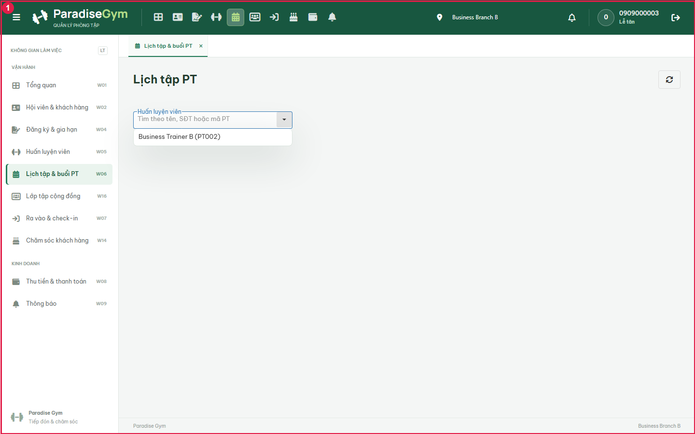

# PT01-US02 - Isolated real UI business E2E

Run: 2026-09-20T17:19:11.905Z

Sources: docs/user-stories/pt/PT01-Lịch/PT01-US02 story (Main Flow, Field specification, Alternate/Exception Flows); docs/product-spec.md sections 4.2-4.6.

Database: paradise_test_34672_1789924698602; frontend: http://localhost:3000; real backend: http://127.0.0.1:49681/api/v1. Browser requests redirected with route.continue, no response mocks. Real API auth sessions. Shared configured DB receives no application writes. Scope: test artifacts only; mailbox/skill/source files unchanged by this runner.

All migrations present at startup applied: 001_create_tables.sql, 002_web_rebuild.sql, 003_mobile_preferences.sql, 004_device_sessions.sql, 005_remove_pt_certificates.sql, 006_boss_feedback_schema_upgrade.sql, 007_commission_configs_uniqueness_and_history.sql, 008_branch_default_commission_rate.sql, 009_pt_commission_payout_details.sql, 010_scheduled_package_freezes.sql, 011_pt_bookings_no_overlap_indexes.sql, 012_pt_commission_session_snapshot.sql, 013_pt_booking_participants.sql. Hashes recorded in results.json. Group fixture: leader + ACCEPTED member; PENDING member excluded. SQL fixture setup is confined to the new isolated database. Participant Gym expiry is temporarily changed only for EF-02.

Fixture: {"b1":"ebaa85d3-ef87-4a90-82c7-be326b39c2d3","b2":"4dab22e3-ac09-4f6d-b377-d4593f1fc6dc","member":{"id":"31714491-7133-445e-be5f-0cbf181df785","account_id":"67cb4232-2df9-4f5b-84c8-491654cf53c4","home_branch_id":"ebaa85d3-ef87-4a90-82c7-be326b39c2d3","member_code":"HV001","full_name":"Business Member A","phone":"0909000010","email":null,"date_of_birth":null,"gender":null,"avatar_url":null,"status":"ACTIVE","created_by":"b8755d60-4528-4c53-bf8d-9f6d1a888642","created_at":"2026-09-20T17:18:19.941Z","updated_at":"2026-09-20T17:18:19.941Z","qr_code":"QR-HV001-0909000010","face_enrolled":false},"pt":{"id":"27a10cd2-9362-43fa-a770-efeeac5df1e4","account_id":"47776fc8-0f33-434d-8edf-4637906e4019","branch_id":"ebaa85d3-ef87-4a90-82c7-be326b39c2d3","pt_code":"PT001","full_name":"Business Trainer A","phone":"0909000020","email":null,"gender":null,"bio":null,"specialties":"Strength","status":"ACTIVE","work_start_time":"08:00:00","work_end_time":"18:00:00","work_days":"MON_TO_FRI","created_at":"2026-09-20T17:18:19.982Z","updated_at":"2026-09-20T17:18:19.982Z","show_phone_to_members":false,"avatar_url":null,"face_enrolled":false,"bank_name":null,"bank_account_no":null,"bank_account_name":null},"pt2":{"id":"d11c4490-5e8c-4008-936b-d1b4fde432aa","account_id":"62f454d7-212d-4cd7-bbb8-b6d447cfc54e","branch_id":"4dab22e3-ac09-4f6d-b377-d4593f1fc6dc","pt_code":"PT002","full_name":"Business Trainer B","phone":"0909000021","email":null,"gender":null,"bio":null,"specialties":"Strength","status":"ACTIVE","work_start_time":"08:00:00","work_end_time":"18:00:00","work_days":"MON_TO_FRI","created_at":"2026-09-20T17:18:20.009Z","updated_at":"2026-09-20T17:18:20.009Z","show_phone_to_members":false,"avatar_url":null,"face_enrolled":false,"bank_name":null,"bank_account_no":null,"bank_account_name":null},"registration":{"id":"124074b3-3f3e-4a92-8097-f406554e0880","reg_code":"DK002","member_id":"31714491-7133-445e-be5f-0cbf181df785","package_id":"70e76712-1415-4421-a20f-a1dde10055de","assigned_pt_id":"27a10cd2-9362-43fa-a770-efeeac5df1e4","sold_branch_id":"ebaa85d3-ef87-4a90-82c7-be326b39c2d3","previous_registration_id":null,"package_name_snapshot":"Business PT 90","package_type_snapshot":"PT_SESSION","price_snapshot":1000000,"duration_days_snapshot":60,"total_gym_sessions_snapshot":null,"total_pt_sessions_snapshot":5,"start_date":"2026-09-21","end_date":"2026-11-20","remaining_gym_sessions":null,"remaining_pt_sessions":5,"booked_pt_sessions":0,"used_pt_sessions":0,"status":"ACTIVE","created_by":"b8755d60-4528-4c53-bf8d-9f6d1a888642","created_at":"2026-09-20T17:18:21.146Z","updated_at":"2026-09-20T17:18:21.198Z","gym_price_snapshot":0,"pt_price_snapshot":1000000,"combo_price_snapshot":0,"package_mode":"GROUP_1_N","max_group_members_snapshot":3,"is_frozen":false,"freeze_days_total":0,"group_leader_member_id":"31714491-7133-445e-be5f-0cbf181df785","has_scheduled_freeze":false,"registration_code":"DK002","member":{"id":"31714491-7133-445e-be5f-0cbf181df785","account_id":"67cb4232-2df9-4f5b-84c8-491654cf53c4","home_branch_id":"ebaa85d3-ef87-4a90-82c7-be326b39c2d3","member_code":"HV001","full_name":"Business Member A","phone":"0909000010","email":null,"date_of_birth":null,"gender":null,"avatar_url":null,"status":"ACTIVE","created_by":"b8755d60-4528-4c53-bf8d-9f6d1a888642","created_at":"2026-09-20T17:18:19.941Z","updated_at":"2026-09-20T17:18:19.941Z","qr_code":"QR-HV001-0909000010","face_enrolled":false},"member_name":"Business Member A","member_code":"HV001","member_phone":"0909000010","allowed_branches":[{"id":"ebaa85d3-ef87-4a90-82c7-be326b39c2d3","branch_code":"Business Branch A","branch_name":"Business Branch A","phone":"0909999999","address":"Isolated E2E","status":"ACTIVE","open_time":"00:00:00","close_time":"23:59:00","timezone":"Asia/Ho_Chi_Minh","created_at":"2026-09-20T17:18:19.445Z","updated_at":"2026-09-20T17:18:19.445Z","gate_config":{"duplicate_seconds":60,"daily_gym_deduction_limit":1},"default_pt_commission_percentage":20}],"assigned_pt":{"id":"27a10cd2-9362-43fa-a770-efeeac5df1e4","account_id":"47776fc8-0f33-434d-8edf-4637906e4019","branch_id":"ebaa85d3-ef87-4a90-82c7-be326b39c2d3","pt_code":"PT001","full_name":"Business Trainer A","phone":"0909000020","email":null,"gender":null,"bio":null,"specialties":"Strength","status":"ACTIVE","work_start_time":"08:00:00","work_end_time":"18:00:00","work_days":"MON_TO_FRI","created_at":"2026-09-20T17:18:19.982Z","updated_at":"2026-09-20T17:18:19.982Z","show_phone_to_members":false,"avatar_url":null,"face_enrolled":false,"bank_name":null,"bank_account_no":null,"bank_account_name":null},"pt_name":"Business Trainer A","payments":[{"id":"b3480bff-070c-4356-be42-44672f83c581","registration_id":"124074b3-3f3e-4a92-8097-f406554e0880","member_id":"31714491-7133-445e-be5f-0cbf181df785","branch_id":"ebaa85d3-ef87-4a90-82c7-be326b39c2d3","payment_code":"PAY002","payment_method":"CASH","amount":1000000,"status":"COMPLETED","transaction_ref":null,"collected_by":"b8755d60-4528-4c53-bf8d-9f6d1a888642","confirmed_at":"2026-09-20T17:18:21.166Z","created_at":"2026-09-20T17:18:21.166Z","updated_at":"2026-09-20T17:18:21.166Z","note":null,"expires_at":null,"discount_id":null,"discount_amount":0}],"created_by_name":"0909000002","freezes":[],"transfers":[],"progress":{"elapsed_days":0,"remaining_days":60,"total_days":60,"checkins":0,"total_pt_sessions":5,"used_pt_sessions":0,"booked_pt_sessions":0,"remaining_pt_sessions":5}},"date":"2026-09-22","groupMode":true,"accepted":{"id":"b94e30cd-63a2-4548-8462-17004bed6e25","account_id":"dffc0a65-cbf4-4ba3-9323-90236b49bbe0","home_branch_id":"ebaa85d3-ef87-4a90-82c7-be326b39c2d3","member_code":"HV002","full_name":"Business Accepted Member","phone":"0909000011","email":null,"date_of_birth":null,"gender":null,"avatar_url":null,"status":"ACTIVE","created_by":"b8755d60-4528-4c53-bf8d-9f6d1a888642","created_at":"2026-09-20T17:18:21.239Z","updated_at":"2026-09-20T17:18:21.239Z","qr_code":"QR-HV002-0909000011","face_enrolled":false},"pending":{"id":"884b7571-e8cb-41d1-a2b6-501831ea2a3e","account_id":"4dd29a59-870d-4d8e-bfaa-905ba78a611c","home_branch_id":"ebaa85d3-ef87-4a90-82c7-be326b39c2d3","member_code":"HV003","full_name":"Business Pending Member","phone":"0909000012","email":null,"date_of_birth":null,"gender":null,"avatar_url":null,"status":"ACTIVE","created_by":"b8755d60-4528-4c53-bf8d-9f6d1a888642","created_at":"2026-09-20T17:18:21.254Z","updated_at":"2026-09-20T17:18:21.254Z","qr_code":"QR-HV003-0909000012","face_enrolled":false},"acceptedGym":{"id":"95672efc-878c-469f-a50c-ee067195a3f6","reg_code":"DK003","member_id":"b94e30cd-63a2-4548-8462-17004bed6e25","package_id":"3c612dd1-b15b-40ad-8c1b-bcd8e089a182","assigned_pt_id":null,"sold_branch_id":"ebaa85d3-ef87-4a90-82c7-be326b39c2d3","previous_registration_id":null,"package_name_snapshot":"Business Gym","package_type_snapshot":"GYM_SESSION","price_snapshot":500000,"duration_days_snapshot":60,"total_gym_sessions_snapshot":20,"total_pt_sessions_snapshot":null,"start_date":"2026-09-21","end_date":"2026-11-20","remaining_gym_sessions":20,"remaining_pt_sessions":null,"booked_pt_sessions":0,"used_pt_sessions":0,"status":"PENDING_PAYMENT","created_by":"b8755d60-4528-4c53-bf8d-9f6d1a888642","created_at":"2026-09-20T17:18:21.645Z","updated_at":"2026-09-20T17:18:21.645Z","gym_price_snapshot":500000,"pt_price_snapshot":0,"combo_price_snapshot":0,"package_mode":"INDIVIDUAL","max_group_members_snapshot":null,"is_frozen":false,"freeze_days_total":0,"group_leader_member_id":null}}

## Source Action Verification

### Blocked at Confirmation fixture

- Action / Input: Blocked at Confirmation fixture
- Expected Result: Complete the requested real UI flow
- Actual Result: Completed payments are immutable
- Status: **FAIL**

## State Verification

## Cross-Role / Downstream Verification

BLOCKED: source/setup did not reach downstream checks.

## Issues Found

- Confirmation fixture: error: Completed payments are immutable
    at E:\Desktop\para\backend\node_modules\pg\lib\client.js:694:17
    at process.processTicksAndRejections (node:internal/process/task_queues:105:5)
    at async confirmFlow (E:\Desktop\para\tests\e2e\pt\business-20260920.cjs:343:5)
    at async main (E:\Desktop\para\tests\e2e\pt\business-20260920.cjs:296:3)
- Blocked at Confirmation fixture: Completed payments are immutable

## Final Result

**BLOCKED**. 0/1 UI steps passed. Last phase: Confirmation fixture. Scope is the recorded scenarios, not complete acceptance of every exception flow.

Run: node tests/e2e/pt/business-20260920.cjs

Browser page errors: []

Prior run evidence (retained before rerun):
- [2026-09-20T17-19-10-136Z](./history/2026-09-20T17-19-10-136Z/PT01-US02-test.md)

Group mode: true. Run with PT_E2E_GROUP=1 for group coverage.
