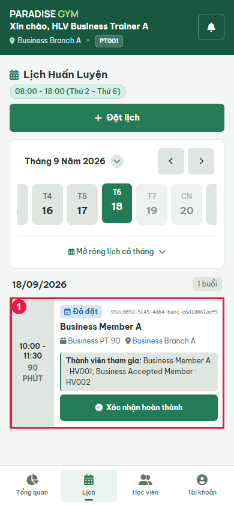
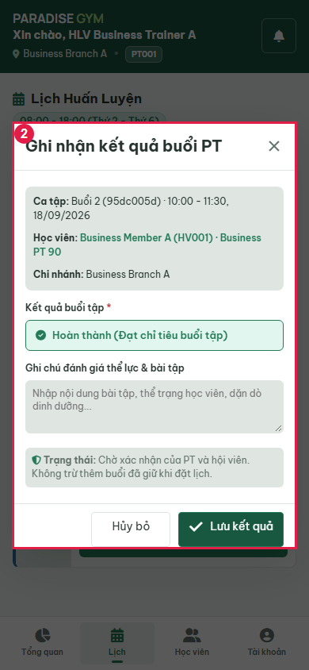
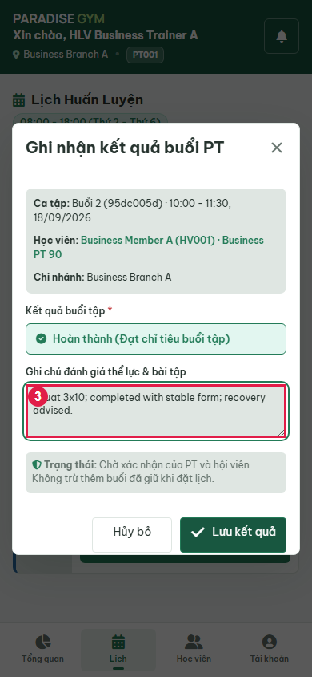
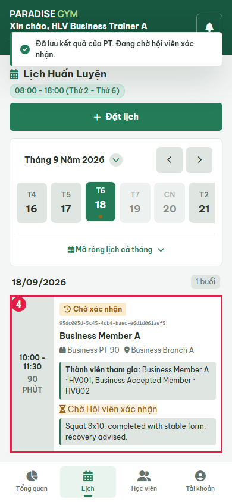
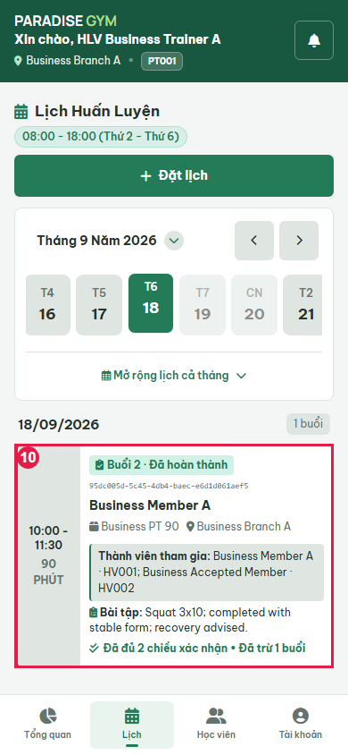
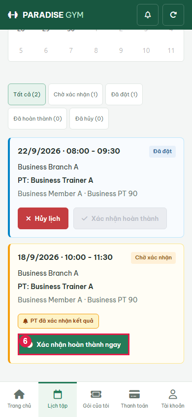
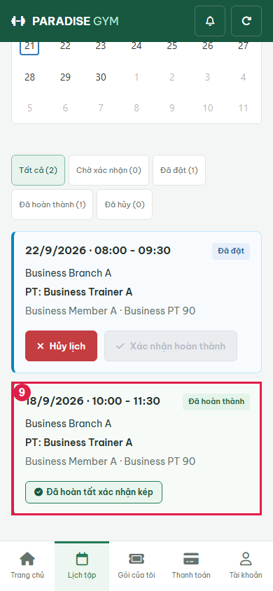
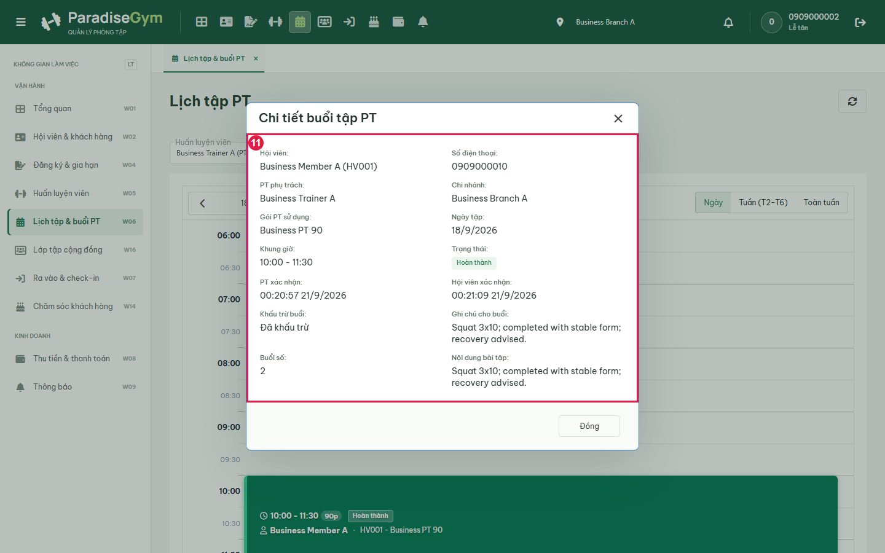

# PT01-US02 - Isolated real UI business E2E

Run: 2026-09-20T17:21:21.423Z

Sources: docs/user-stories/pt/PT01-Lịch/PT01-US02 story (Main Flow, Field specification, Alternate/Exception Flows); docs/product-spec.md sections 4.2-4.6.

Database: paradise_test_9832_1789924805662; frontend: http://localhost:3000; real backend: http://127.0.0.1:56328/api/v1. Browser requests redirected with route.continue, no response mocks. Real API auth sessions. Shared configured DB receives no application writes. Scope: test artifacts only; mailbox/skill/source files unchanged by this runner.

All migrations present at startup applied: 001_create_tables.sql, 002_web_rebuild.sql, 003_mobile_preferences.sql, 004_device_sessions.sql, 005_remove_pt_certificates.sql, 006_boss_feedback_schema_upgrade.sql, 007_commission_configs_uniqueness_and_history.sql, 008_branch_default_commission_rate.sql, 009_pt_commission_payout_details.sql, 010_scheduled_package_freezes.sql, 011_pt_bookings_no_overlap_indexes.sql, 012_pt_commission_session_snapshot.sql, 013_pt_booking_participants.sql. Hashes recorded in results.json. Group fixture: leader + ACCEPTED member; PENDING member excluded. SQL fixture setup is confined to the new isolated database. Participant Gym expiry is temporarily changed only for EF-02.

Fixture: {"b1":"556a9cdb-642c-4c0c-8136-018f0c282300","b2":"29b69e7e-78ce-45fd-a86b-27fd81d14a10","member":{"id":"e0250b68-9834-4b21-bce3-feaf9a2f499c","account_id":"8458c5ff-25e1-4fe6-b4c8-777d1c1e3f0a","home_branch_id":"556a9cdb-642c-4c0c-8136-018f0c282300","member_code":"HV001","full_name":"Business Member A","phone":"0909000010","email":null,"date_of_birth":null,"gender":null,"avatar_url":null,"status":"ACTIVE","created_by":"28f6a731-6645-4637-82c8-e309a1ee3bb1","created_at":"2026-09-20T17:20:07.222Z","updated_at":"2026-09-20T17:20:07.222Z","qr_code":"QR-HV001-0909000010","face_enrolled":false},"pt":{"id":"5dc456d6-1abd-4135-9309-093aafddf034","account_id":"429d81dc-3ba2-4e6d-ae16-528a0626145d","branch_id":"556a9cdb-642c-4c0c-8136-018f0c282300","pt_code":"PT001","full_name":"Business Trainer A","phone":"0909000020","email":null,"gender":null,"bio":null,"specialties":"Strength","status":"ACTIVE","work_start_time":"08:00:00","work_end_time":"18:00:00","work_days":"MON_TO_FRI","created_at":"2026-09-20T17:20:07.263Z","updated_at":"2026-09-20T17:20:07.263Z","show_phone_to_members":false,"avatar_url":null,"face_enrolled":false,"bank_name":null,"bank_account_no":null,"bank_account_name":null},"pt2":{"id":"9a54fe45-faa5-41e2-81bd-a9412329c7c9","account_id":"16888e21-f2fe-47ed-a3c9-ff9aab17b39c","branch_id":"29b69e7e-78ce-45fd-a86b-27fd81d14a10","pt_code":"PT002","full_name":"Business Trainer B","phone":"0909000021","email":null,"gender":null,"bio":null,"specialties":"Strength","status":"ACTIVE","work_start_time":"08:00:00","work_end_time":"18:00:00","work_days":"MON_TO_FRI","created_at":"2026-09-20T17:20:07.290Z","updated_at":"2026-09-20T17:20:07.290Z","show_phone_to_members":false,"avatar_url":null,"face_enrolled":false,"bank_name":null,"bank_account_no":null,"bank_account_name":null},"registration":{"id":"43ecb628-68d6-46b7-a69d-4e1375e032e7","reg_code":"DK002","member_id":"e0250b68-9834-4b21-bce3-feaf9a2f499c","package_id":"cb722148-a634-4436-84d8-72111a6ba571","assigned_pt_id":"5dc456d6-1abd-4135-9309-093aafddf034","sold_branch_id":"556a9cdb-642c-4c0c-8136-018f0c282300","previous_registration_id":null,"package_name_snapshot":"Business PT 90","package_type_snapshot":"PT_SESSION","price_snapshot":1000000,"duration_days_snapshot":60,"total_gym_sessions_snapshot":null,"total_pt_sessions_snapshot":5,"start_date":"2026-09-21","end_date":"2026-11-20","remaining_gym_sessions":null,"remaining_pt_sessions":5,"booked_pt_sessions":0,"used_pt_sessions":0,"status":"ACTIVE","created_by":"28f6a731-6645-4637-82c8-e309a1ee3bb1","created_at":"2026-09-20T17:20:08.805Z","updated_at":"2026-09-20T17:20:08.863Z","gym_price_snapshot":0,"pt_price_snapshot":1000000,"combo_price_snapshot":0,"package_mode":"GROUP_1_N","max_group_members_snapshot":3,"is_frozen":false,"freeze_days_total":0,"group_leader_member_id":"e0250b68-9834-4b21-bce3-feaf9a2f499c","has_scheduled_freeze":false,"registration_code":"DK002","member":{"id":"e0250b68-9834-4b21-bce3-feaf9a2f499c","account_id":"8458c5ff-25e1-4fe6-b4c8-777d1c1e3f0a","home_branch_id":"556a9cdb-642c-4c0c-8136-018f0c282300","member_code":"HV001","full_name":"Business Member A","phone":"0909000010","email":null,"date_of_birth":null,"gender":null,"avatar_url":null,"status":"ACTIVE","created_by":"28f6a731-6645-4637-82c8-e309a1ee3bb1","created_at":"2026-09-20T17:20:07.222Z","updated_at":"2026-09-20T17:20:07.222Z","qr_code":"QR-HV001-0909000010","face_enrolled":false},"member_name":"Business Member A","member_code":"HV001","member_phone":"0909000010","allowed_branches":[{"id":"556a9cdb-642c-4c0c-8136-018f0c282300","branch_code":"Business Branch A","branch_name":"Business Branch A","phone":"0909999999","address":"Isolated E2E","status":"ACTIVE","open_time":"00:00:00","close_time":"23:59:00","timezone":"Asia/Ho_Chi_Minh","created_at":"2026-09-20T17:20:06.626Z","updated_at":"2026-09-20T17:20:06.626Z","gate_config":{"duplicate_seconds":60,"daily_gym_deduction_limit":1},"default_pt_commission_percentage":20}],"assigned_pt":{"id":"5dc456d6-1abd-4135-9309-093aafddf034","account_id":"429d81dc-3ba2-4e6d-ae16-528a0626145d","branch_id":"556a9cdb-642c-4c0c-8136-018f0c282300","pt_code":"PT001","full_name":"Business Trainer A","phone":"0909000020","email":null,"gender":null,"bio":null,"specialties":"Strength","status":"ACTIVE","work_start_time":"08:00:00","work_end_time":"18:00:00","work_days":"MON_TO_FRI","created_at":"2026-09-20T17:20:07.263Z","updated_at":"2026-09-20T17:20:07.263Z","show_phone_to_members":false,"avatar_url":null,"face_enrolled":false,"bank_name":null,"bank_account_no":null,"bank_account_name":null},"pt_name":"Business Trainer A","payments":[{"id":"bf45633a-6daa-4bdf-9e71-8dee0e2582a4","registration_id":"43ecb628-68d6-46b7-a69d-4e1375e032e7","member_id":"e0250b68-9834-4b21-bce3-feaf9a2f499c","branch_id":"556a9cdb-642c-4c0c-8136-018f0c282300","payment_code":"PAY002","payment_method":"CASH","amount":1000000,"status":"COMPLETED","transaction_ref":null,"collected_by":"28f6a731-6645-4637-82c8-e309a1ee3bb1","confirmed_at":"2026-09-20T17:20:08.827Z","created_at":"2026-09-20T17:20:08.827Z","updated_at":"2026-09-20T17:20:08.827Z","note":null,"expires_at":null,"discount_id":null,"discount_amount":0}],"created_by_name":"0909000002","freezes":[],"transfers":[],"progress":{"elapsed_days":0,"remaining_days":60,"total_days":60,"checkins":0,"total_pt_sessions":5,"used_pt_sessions":0,"booked_pt_sessions":0,"remaining_pt_sessions":5}},"date":"2026-09-22","groupMode":true,"accepted":{"id":"4fcf74ad-be8d-4c8f-9690-57dc6a3e2bbd","account_id":"84c18d28-e16a-4529-bff5-f03585192002","home_branch_id":"556a9cdb-642c-4c0c-8136-018f0c282300","member_code":"HV002","full_name":"Business Accepted Member","phone":"0909000011","email":null,"date_of_birth":null,"gender":null,"avatar_url":null,"status":"ACTIVE","created_by":"28f6a731-6645-4637-82c8-e309a1ee3bb1","created_at":"2026-09-20T17:20:08.904Z","updated_at":"2026-09-20T17:20:08.904Z","qr_code":"QR-HV002-0909000011","face_enrolled":false},"pending":{"id":"7cf034c7-d24a-4f14-a609-bbbe6bc7b417","account_id":"7cd9aa20-c7c9-411e-a509-c2dbefbd2234","home_branch_id":"556a9cdb-642c-4c0c-8136-018f0c282300","member_code":"HV003","full_name":"Business Pending Member","phone":"0909000012","email":null,"date_of_birth":null,"gender":null,"avatar_url":null,"status":"ACTIVE","created_by":"28f6a731-6645-4637-82c8-e309a1ee3bb1","created_at":"2026-09-20T17:20:08.919Z","updated_at":"2026-09-20T17:20:08.919Z","qr_code":"QR-HV003-0909000012","face_enrolled":false},"acceptedGym":{"id":"e2302b87-00e1-4aa9-816a-932f96cd5217","reg_code":"DK003","member_id":"4fcf74ad-be8d-4c8f-9690-57dc6a3e2bbd","package_id":"65d8e5a6-036d-4a90-b1ba-4eff20c26121","assigned_pt_id":null,"sold_branch_id":"556a9cdb-642c-4c0c-8136-018f0c282300","previous_registration_id":null,"package_name_snapshot":"Business Gym","package_type_snapshot":"GYM_SESSION","price_snapshot":500000,"duration_days_snapshot":60,"total_gym_sessions_snapshot":20,"total_pt_sessions_snapshot":null,"start_date":"2026-09-21","end_date":"2026-11-20","remaining_gym_sessions":20,"remaining_pt_sessions":null,"booked_pt_sessions":0,"used_pt_sessions":0,"status":"PENDING_PAYMENT","created_by":"28f6a731-6645-4637-82c8-e309a1ee3bb1","created_at":"2026-09-20T17:20:09.267Z","updated_at":"2026-09-20T17:20:09.267Z","gym_price_snapshot":500000,"pt_price_snapshot":0,"combo_price_snapshot":0,"package_mode":"INDIVIDUAL","max_group_members_snapshot":null,"is_frozen":false,"freeze_days_total":0,"group_leader_member_id":null},"confirmationFixture":{"bookingId":"95dc005d-5c45-4db4-baec-e6d1d061aef5","pastDate":"2026-09-18","entitlementIds":["ef48af46-5f32-4b9e-b23d-b87ab4fd260a","e2302b87-00e1-4aa9-816a-932f96cd5217","43ecb628-68d6-46b7-a69d-4e1375e032e7"],"paidAt":"2026-09-18T07:00:00+07:00","setup":"Second booking created through real PT API. Isolated SQL moves booking date to previous working day; shifts linked PT and every snapshot participant Gym validity window together, preserving duration; aligns completed payment created/confirmed timestamps and receipt issued_at to 07:00 before the 10:00 session. Booking owner, registration, transaction marker and all participant snapshot rows remain byte-for-byte equivalent as asserted. No fabricated confirmation/counters or UI clock override; actual UI confirmation remains under test. Original PT01-US03 booking stays future.","paymentGuard":"Only completed_payment_immutable temporarily disabled inside isolated fixture transaction for timestamp adjustment, then re-enabled and asserted before UI confirmation. All other constraints and all participant snapshot guards remain active."}}

## Source Action Verification

### Select past working-day session

- Action / Input: Select past working-day session
- Expected Result: PT01-US02 Preconditions: assigned session has ended and neither party confirmed
- Actual Result: booking_id=95dc005d-5c45-4db4-baec-e6d1d061aef5; 10:00 - 11:30
90 PHÚT
Đã đặt
95dc005d-5c45-4db4-baec-e6d1d061aef5
Business Member A
 Business PT 90
 Business Branch A
Thành viên tham gia: Business Member A · HV001; Business Accepted Member · HV002
Xác nhận hoàn thành
- Status: **PASS**

### Open PT confirmation modal

- Action / Input: Open PT confirmation modal
- Expected Result: Main Flow 2-3: session/member/package prefill and completion result
- Actual Result: Ghi nhận kết quả buổi PT
Ca tập: Buổi 2 (95dc005d) · 10:00 - 11:30, 18/09/2026
Học viên: Business Member A (HV001) · Business PT 90
Chi nhánh: Business Branch A
Kết quả buổi tập *
Hoàn thành (Đạt chỉ tiêu buổi tập)
Ghi chú đánh giá thể lực & bài tập
 Trạng thái: Chờ xác nhận của PT và hội viên. Không trừ thêm buổi đã giữ khi đặt lịch.
Hủy bỏ
	
Lưu kết quả
- Status: **PASS**

### Enter workout assessment before saving

- Action / Input: Enter workout assessment before saving
- Expected Result: Main Flow 4: optional PT notes retained in input before submit
- Actual Result: Squat 3x10; completed with stable form; recovery advised.
- Status: **PASS**

### Save PT result and view pending member state

- Action / Input: Save PT result and view pending member state
- Expected Result: Main Flow 6-8: PT-only confirmation waits for member and does not consume another session
- Actual Result: 10:00 - 11:30
90 PHÚT
Chờ xác nhận
95dc005d-5c45-4db4-baec-e6d1d061aef5
Business Member A
 Business PT 90
 Business Branch A
Thành viên tham gia: Business Member A · HV001; Business Accepted Member · HV002
 Chờ Hội viên xác nhận
Squat 3x10; completed with stable form; recovery advised.
- Status: **PASS**

## State Verification

- **PASS** Historical entitlement/payment consistency and unchanged participant snapshot: {"entitlements":[{"id":"ef48af46-5f32-4b9e-b23d-b87ab4fd260a","member_id":"e0250b68-9834-4b21-bce3-feaf9a2f499c","package_type_snapshot":"GYM_SESSION","start_date":"2026-09-18","end_date":"2026-11-17"},{"id":"e2302b87-00e1-4aa9-816a-932f96cd5217","member_id":"4fcf74ad-be8d-4c8f-9690-57dc6a3e2bbd","package_type_snapshot":"GYM_SESSION","start_date":"2026-09-18","end_date":"2026-11-17"},{"id":"43ecb628-68d6-46b7-a69d-4e1375e032e7","member_id":"e0250b68-9834-4b21-bce3-feaf9a2f499c","package_type_snapshot":"PT_SESSION","start_date":"2026-09-18","end_date":"2026-11-17"}],"payments":[{"id":"e884b8d8-ea00-4591-a684-37fbb8c0e79c","registration_id":"ef48af46-5f32-4b9e-b23d-b87ab4fd260a","created_at":"2026-09-18T00:00:00.000Z","confirmed_at":"2026-09-18T00:00:00.000Z","issued_at":"2026-09-18T00:00:00.000Z"},{"id":"bf45633a-6daa-4bdf-9e71-8dee0e2582a4","registration_id":"43ecb628-68d6-46b7-a69d-4e1375e032e7","created_at":"2026-09-18T00:00:00.000Z","confirmed_at":"2026-09-18T00:00:00.000Z","issued_at":"2026-09-18T00:00:00.000Z"},{"id":"b3af08fe-3140-4ef1-b24f-b183c61700cd","registration_id":"e2302b87-00e1-4aa9-816a-932f96cd5217","created_at":"2026-09-18T00:00:00.000Z","confirmed_at":"2026-09-18T00:00:00.000Z","issued_at":"2026-09-18T00:00:00.000Z"}],"identity":{"member_id":"e0250b68-9834-4b21-bce3-feaf9a2f499c","registration_id":"43ecb628-68d6-46b7-a69d-4e1375e032e7","participants_snapshot_xid":"148928"},"snapshot":[{"booking_id":"95dc005d-5c45-4db4-baec-e6d1d061aef5","member_id":"4fcf74ad-be8d-4c8f-9690-57dc6a3e2bbd","is_leader":false,"created_at":"2026-09-20T17:20:51.733Z"},{"booking_id":"95dc005d-5c45-4db4-baec-e6d1d061aef5","member_id":"e0250b68-9834-4b21-bce3-feaf9a2f499c","is_leader":true,"created_at":"2026-09-20T17:20:51.733Z"}]}
- **PASS** Documented past fixture baseline: {"remaining_pt_sessions":3,"booked_pt_sessions":2,"used_pt_sessions":0,"total_pt_sessions_snapshot":5}
- **PASS** After PT-only confirmation: {"status":"PENDING_COMPLETION","notes":"Squat 3x10; completed with stable form; recovery advised.","counters":{"remaining_pt_sessions":3,"booked_pt_sessions":2,"used_pt_sessions":0,"total_pt_sessions_snapshot":5}}
- **PASS** Nonleader member-confirm denied: {"bookingId":"95dc005d-5c45-4db4-baec-e6d1d061aef5","memberId":"4fcf74ad-be8d-4c8f-9690-57dc6a3e2bbd","status":403,"payload":{"success":false,"message":"Bạn không có quyền thực hiện thao tác này hoặc dữ liệu nằm ngoài phạm vi chi nhánh.","code":"FORBIDDEN"}}
- **PASS** Nonleader cancel denied: {"bookingId":"95dc005d-5c45-4db4-baec-e6d1d061aef5","memberId":"4fcf74ad-be8d-4c8f-9690-57dc6a3e2bbd","status":403,"payload":{"success":false,"message":"Bạn không có quyền thực hiện thao tác này hoặc dữ liệu nằm ngoài phạm vi chi nhánh.","code":"FORBIDDEN"}}
- **PASS** After both confirmations: no second remaining deduction: {"remaining_pt_sessions":3,"booked_pt_sessions":1,"used_pt_sessions":1,"total_pt_sessions_snapshot":5}
- **PASS** Nonleader member-confirm denied: {"bookingId":"95dc005d-5c45-4db4-baec-e6d1d061aef5","memberId":"4fcf74ad-be8d-4c8f-9690-57dc6a3e2bbd","status":403,"payload":{"success":false,"message":"Bạn không có quyền thực hiện thao tác này hoặc dữ liệu nằm ngoài phạm vi chi nhánh.","code":"FORBIDDEN"}}
- **PASS** Nonleader cancel denied: {"bookingId":"95dc005d-5c45-4db4-baec-e6d1d061aef5","memberId":"4fcf74ad-be8d-4c8f-9690-57dc6a3e2bbd","status":403,"payload":{"success":false,"message":"Bạn không có quyền thực hiện thao tác này hoặc dữ liệu nằm ngoài phạm vi chi nhánh.","code":"FORBIDDEN"}}
- **PASS** AF-03 retry pt-confirm: {"status":200,"payload":{"success":true,"data":{"booking":{"id":"95dc005d-5c45-4db4-baec-e6d1d061aef5","registration_id":"43ecb628-68d6-46b7-a69d-4e1375e032e7","member_id":"e0250b68-9834-4b21-bce3-feaf9a2f499c","pt_id":"5dc456d6-1abd-4135-9309-093aafddf034","branch_id":"556a9cdb-642c-4c0c-8136-018f0c282300","session_number":2,"booking_date":"2026-09-18","start_time":"10:00:00","end_time":"11:30:00","status":"COMPLETED","workout_notes":"Squat 3x10; completed with stable form; recovery advised.","fitness_assessment":null,"cancelled_by":null,"cancel_reason":null,"cancelled_at":null,"pt_confirmed_at":"2026-09-20T17:20:57.872Z","member_confirmed_at":"2026-09-20T17:21:09.751Z","is_deducted":true,"created_by":"429d81dc-3ba2-4e6d-ae16-528a0626145d","created_at":"2026-09-20T17:20:51.733Z","updated_at":"2026-09-20T17:21:09.746Z","session_duration_minutes":90,"substitute_pt_id":null},"is_completed":true},"message":"Success"},"counters":{"remaining_pt_sessions":3,"booked_pt_sessions":1,"used_pt_sessions":1,"total_pt_sessions_snapshot":5}}
- **PASS** AF-03 retry member-confirm: {"status":200,"payload":{"success":true,"data":{"booking":{"id":"95dc005d-5c45-4db4-baec-e6d1d061aef5","registration_id":"43ecb628-68d6-46b7-a69d-4e1375e032e7","member_id":"e0250b68-9834-4b21-bce3-feaf9a2f499c","pt_id":"5dc456d6-1abd-4135-9309-093aafddf034","branch_id":"556a9cdb-642c-4c0c-8136-018f0c282300","session_number":2,"booking_date":"2026-09-18","start_time":"10:00:00","end_time":"11:30:00","status":"COMPLETED","workout_notes":"Squat 3x10; completed with stable form; recovery advised.","fitness_assessment":null,"cancelled_by":null,"cancel_reason":null,"cancelled_at":null,"pt_confirmed_at":"2026-09-20T17:20:57.872Z","member_confirmed_at":"2026-09-20T17:21:09.751Z","is_deducted":true,"created_by":"429d81dc-3ba2-4e6d-ae16-528a0626145d","created_at":"2026-09-20T17:20:51.733Z","updated_at":"2026-09-20T17:21:09.746Z","session_duration_minutes":90,"substitute_pt_id":null},"is_completed":true},"message":"Success"},"counters":{"remaining_pt_sessions":3,"booked_pt_sessions":1,"used_pt_sessions":1,"total_pt_sessions_snapshot":5}}
- **PASS** Repeated confirmations do not deduct twice: {"remaining_pt_sessions":3,"booked_pt_sessions":1,"used_pt_sessions":1,"total_pt_sessions_snapshot":5}

### Refresh PT calendar after member confirms

- Action / Input: Refresh PT calendar after member confirms
- Expected Result: Main Flow 8: completed card readonly and persisted PT notes visible
- Actual Result: 10:00 - 11:30
90 PHÚT
Buổi 2 · Đã hoàn thành
95dc005d-5c45-4db4-baec-e6d1d061aef5
Business Member A
 Business PT 90
 Business Branch A
Thành viên tham gia: Business Member A · HV001; Business Accepted Member · HV002
 Bài tập: Squat 3x10; completed with stable form; recovery advised.
Đã đủ 2 chiều xác nhận • Đã trừ 1 buổi
- Status: **PASS**

## Cross-Role / Downstream Verification

### Open same member session after PT confirms

- Action / Input: Open same member session after PT confirms
- Expected Result: Main Flow 7: same booking awaits member confirmation
- Actual Result: booking_id=95dc005d-5c45-4db4-baec-e6d1d061aef5; 18/9/2026 · 10:00 - 11:30
Chờ xác nhận

Business Branch A

PT: Business Trainer A

Business Member A · Business PT 90

PT đã xác nhận kết quả
Xác nhận hoàn thành ngay
- Status: **PASS**

### Open accepted nonleader schedule for same booking

- Action / Input: Open accepted nonleader schedule for same booking
- Expected Result: PT01-US01/03: snapshot participant can view same booking, only leader may confirm or cancel
- Actual Result: Nonleader 4fcf74ad-be8d-4c8f-9690-57dc6a3e2bbd viewing booking 95dc005d-5c45-4db4-baec-e6d1d061aef5 has enabled actions: [{"text":"Xác nhận hoàn thành ngay","disabled":false}]; card: 18/9/2026 · 10:00 - 11:30
Chờ xác nhận

Business Branch A

PT: Business Trainer A

Business Member A · Business PT 90

PT đã xác nhận kết quả
Xác nhận hoàn thành ngay
- Status: **FAIL**

### Open member confirmation dialog

- Action / Input: Open member confirmation dialog
- Expected Result: Main Flow 7: same member confirms their completed session
- Actual Result: Xác nhận hoàn thành

Buổi tập với PT Business Trainer A lúc 10:00 - 11:30, 18/9/2026.

 PT đã xác nhận hoàn thành kết quả

Hệ thống sẽ trừ chính xác 1 buổi trong gói tập của bạn sau khi cả bạn và PT cùng hoàn tất xác nhận kép.

Xác nhận hoàn thành
- Status: **PASS**

### Submit member confirmation

- Action / Input: Submit member confirmation
- Expected Result: Main Flow 7: dual confirmation completes exactly the same booking
- Actual Result: 18/9/2026 · 10:00 - 11:30
Đã hoàn thành

Business Branch A

PT: Business Trainer A

Business Member A · Business PT 90

Đã hoàn tất xác nhận kép
- Status: **PASS**

### Open accepted nonleader schedule for same booking

- Action / Input: Open accepted nonleader schedule for same booking
- Expected Result: PT01-US01/03: snapshot participant can view same booking, only leader may confirm or cancel
- Actual Result: {"bookingId":"95dc005d-5c45-4db4-baec-e6d1d061aef5","viewer":"4fcf74ad-be8d-4c8f-9690-57dc6a3e2bbd","text":"18/9/2026 · 10:00 - 11:30\nĐã hoàn thành\n\nBusiness Branch A\n\nPT: Business Trainer A\n\nBusiness Member A · Business PT 90\n\nĐã hoàn tất xác nhận kép"}
- Status: **PASS**

### Open completed booking in receptionist UI

- Action / Input: Open completed booking in receptionist UI
- Expected Result: Cross-role synchronization: same session completed and notes retained
- Actual Result: booking_id=95dc005d-5c45-4db4-baec-e6d1d061aef5; Hội viên:
Business Member A (HV001)
Số điện thoại:
0909000010
PT phụ trách:
Business Trainer A
Chi nhánh:
Business Branch A
Gói PT sử dụng:
Business PT 90
Ngày tập:
18/9/2026
Khung giờ:
10:00 - 11:30
Trạng thái:
Hoàn thành
PT xác nhận:
00:20:57 21/9/2026
Hội viên xác nhận:
00:21:09 21/9/2026
Khấu trừ buổi:
Đã khấu trừ
Ghi chú cho buổi:
Squat 3x10; completed with stable form; recovery advised.
Buổi số:
2
Nội dung bài tập:
Squat 3x10; completed with stable form; recovery advised.
- Status: **PASS**

## Issues Found

- Open accepted nonleader schedule for same booking: Nonleader 4fcf74ad-be8d-4c8f-9690-57dc6a3e2bbd viewing booking 95dc005d-5c45-4db4-baec-e6d1d061aef5 has enabled actions: [{"text":"Xác nhận hoàn thành ngay","disabled":false}]; card: 18/9/2026 · 10:00 - 11:30
Chờ xác nhận

Business Branch A

PT: Business Trainer A

Business Member A · Business PT 90

PT đã xác nhận kết quả
Xác nhận hoàn thành ngay

## Final Result

**FAIL**. 10/11 UI steps passed. Last phase: AF-03 repeated confirmation API checks. Scope is the recorded scenarios, not complete acceptance of every exception flow.

Run: node tests/e2e/pt/business-20260920.cjs

Browser page errors: []

Prior run evidence (retained before rerun):
- [2026-09-20T17-19-10-136Z](./history/2026-09-20T17-19-10-136Z/PT01-US02-test.md)
- [2026-09-20T17-20-51-713Z](./history/2026-09-20T17-20-51-713Z/PT01-US02-test.md)

Group mode: true. Run with PT_E2E_GROUP=1 for group coverage.
