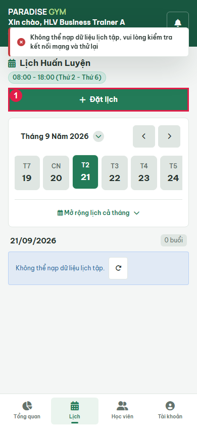
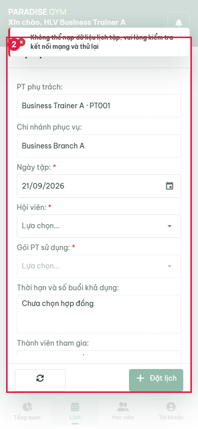
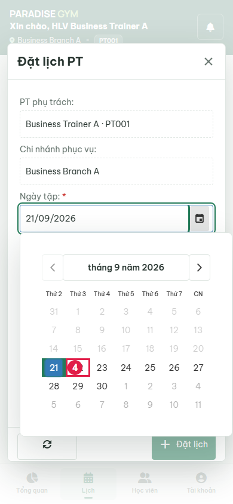
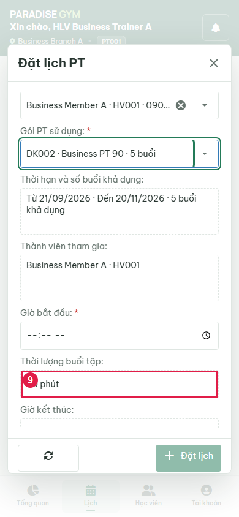
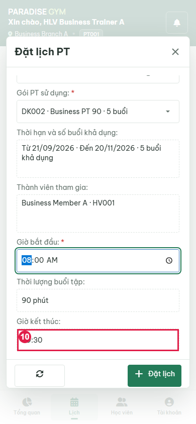
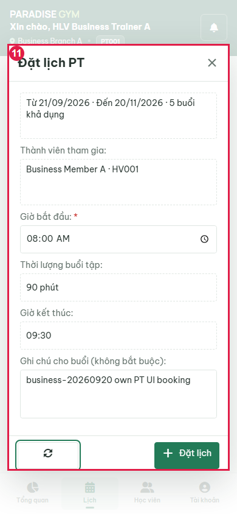
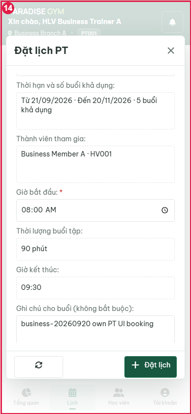
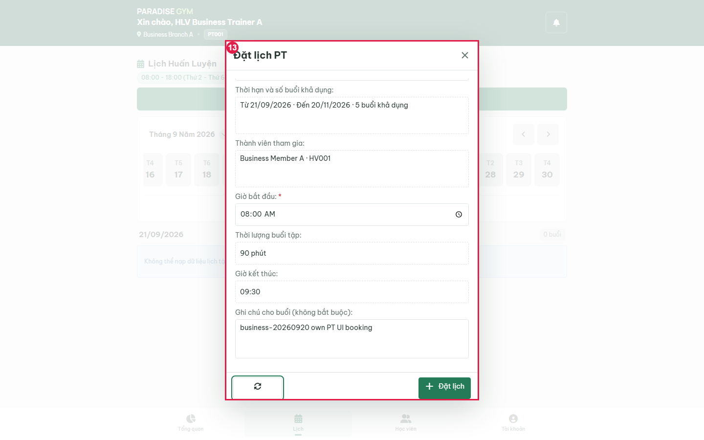

# PT01-US03 - Isolated real UI business E2E

Run: 2026-09-20T17:00:54.433Z

Sources: docs/user-stories/pt/PT01-Lịch/PT01-US03 story (Main Flow, Field specification, Alternate/Exception Flows); docs/product-spec.md sections 4.2-4.6.

Database: paradise_test_29220_1789923632108; frontend: http://localhost:3000; real backend: http://127.0.0.1:63694/api/v1. Browser requests redirected with route.continue, no response mocks. Real API auth sessions. Shared configured DB receives no application writes. Scope: test artifacts only; mailbox/skill/source files unchanged by this runner.

All migrations present at startup applied: 001_create_tables.sql, 002_web_rebuild.sql, 003_mobile_preferences.sql, 004_device_sessions.sql, 005_remove_pt_certificates.sql, 006_boss_feedback_schema_upgrade.sql, 007_commission_configs_uniqueness_and_history.sql, 008_branch_default_commission_rate.sql, 009_pt_commission_payout_details.sql, 010_scheduled_package_freezes.sql, 011_pt_bookings_no_overlap_indexes.sql, 012_pt_commission_session_snapshot.sql. Hashes recorded in results.json. No group booking fixture.

Fixture: {"b1":"5549f3b5-35c2-4947-99bb-6296cce4ee12","b2":"39a6154b-bec4-49f2-ae24-4db85f8737c3","member":{"id":"1c6fb235-9d91-488c-af7e-46a409e9362a","account_id":"d15fa0ee-f787-4858-95ac-eb00f83e49fc","home_branch_id":"5549f3b5-35c2-4947-99bb-6296cce4ee12","member_code":"HV001","full_name":"Business Member A","phone":"0909000010","email":null,"date_of_birth":null,"gender":null,"avatar_url":null,"status":"ACTIVE","created_by":"e98168ee-322f-4f57-9d34-5d361b2e3df4","created_at":"2026-09-20T17:00:33.134Z","updated_at":"2026-09-20T17:00:33.134Z","qr_code":"QR-HV001-0909000010","face_enrolled":false},"pt":{"id":"640677ca-d999-4fa1-9167-e15cbab9402a","account_id":"6864f363-0f63-4200-8c88-1a5c156a4977","branch_id":"5549f3b5-35c2-4947-99bb-6296cce4ee12","pt_code":"PT001","full_name":"Business Trainer A","phone":"0909000020","email":null,"gender":null,"bio":null,"specialties":"Strength","status":"ACTIVE","work_start_time":"08:00:00","work_end_time":"18:00:00","work_days":"MON_TO_FRI","created_at":"2026-09-20T17:00:33.162Z","updated_at":"2026-09-20T17:00:33.162Z","show_phone_to_members":false,"avatar_url":null,"face_enrolled":false,"bank_name":null,"bank_account_no":null,"bank_account_name":null},"pt2":{"id":"17e2faa4-d970-44d3-8851-591d2e4c7de2","account_id":"b7484a53-fb01-4cdd-97e1-e2594f7c0036","branch_id":"39a6154b-bec4-49f2-ae24-4db85f8737c3","pt_code":"PT002","full_name":"Business Trainer B","phone":"0909000021","email":null,"gender":null,"bio":null,"specialties":"Strength","status":"ACTIVE","work_start_time":"08:00:00","work_end_time":"18:00:00","work_days":"MON_TO_FRI","created_at":"2026-09-20T17:00:33.180Z","updated_at":"2026-09-20T17:00:33.180Z","show_phone_to_members":false,"avatar_url":null,"face_enrolled":false,"bank_name":null,"bank_account_no":null,"bank_account_name":null},"registration":{"id":"d159c70e-087e-47ff-a0f5-08dc2a6f8cec","reg_code":"DK002","member_id":"1c6fb235-9d91-488c-af7e-46a409e9362a","package_id":"c64ebc9f-5987-4f9b-b65b-49d3f44d03f3","assigned_pt_id":"640677ca-d999-4fa1-9167-e15cbab9402a","sold_branch_id":"5549f3b5-35c2-4947-99bb-6296cce4ee12","previous_registration_id":null,"package_name_snapshot":"Business PT 90","package_type_snapshot":"PT_SESSION","price_snapshot":1000000,"duration_days_snapshot":60,"total_gym_sessions_snapshot":null,"total_pt_sessions_snapshot":5,"start_date":"2026-09-21","end_date":"2026-11-20","remaining_gym_sessions":null,"remaining_pt_sessions":5,"booked_pt_sessions":0,"used_pt_sessions":0,"status":"ACTIVE","created_by":"e98168ee-322f-4f57-9d34-5d361b2e3df4","created_at":"2026-09-20T17:00:34.156Z","updated_at":"2026-09-20T17:00:34.200Z","gym_price_snapshot":0,"pt_price_snapshot":1000000,"combo_price_snapshot":0,"package_mode":"INDIVIDUAL","max_group_members_snapshot":null,"is_frozen":false,"freeze_days_total":0,"group_leader_member_id":null,"has_scheduled_freeze":false,"registration_code":"DK002","member":{"id":"1c6fb235-9d91-488c-af7e-46a409e9362a","account_id":"d15fa0ee-f787-4858-95ac-eb00f83e49fc","home_branch_id":"5549f3b5-35c2-4947-99bb-6296cce4ee12","member_code":"HV001","full_name":"Business Member A","phone":"0909000010","email":null,"date_of_birth":null,"gender":null,"avatar_url":null,"status":"ACTIVE","created_by":"e98168ee-322f-4f57-9d34-5d361b2e3df4","created_at":"2026-09-20T17:00:33.134Z","updated_at":"2026-09-20T17:00:33.134Z","qr_code":"QR-HV001-0909000010","face_enrolled":false},"member_name":"Business Member A","member_code":"HV001","member_phone":"0909000010","allowed_branches":[{"id":"5549f3b5-35c2-4947-99bb-6296cce4ee12","branch_code":"Business Branch A","branch_name":"Business Branch A","phone":"0909999999","address":"Isolated E2E","status":"ACTIVE","open_time":"00:00:00","close_time":"23:59:00","timezone":"Asia/Ho_Chi_Minh","created_at":"2026-09-20T17:00:32.688Z","updated_at":"2026-09-20T17:00:32.688Z","gate_config":{"duplicate_seconds":60,"daily_gym_deduction_limit":1},"default_pt_commission_percentage":20}],"assigned_pt":{"id":"640677ca-d999-4fa1-9167-e15cbab9402a","account_id":"6864f363-0f63-4200-8c88-1a5c156a4977","branch_id":"5549f3b5-35c2-4947-99bb-6296cce4ee12","pt_code":"PT001","full_name":"Business Trainer A","phone":"0909000020","email":null,"gender":null,"bio":null,"specialties":"Strength","status":"ACTIVE","work_start_time":"08:00:00","work_end_time":"18:00:00","work_days":"MON_TO_FRI","created_at":"2026-09-20T17:00:33.162Z","updated_at":"2026-09-20T17:00:33.162Z","show_phone_to_members":false,"avatar_url":null,"face_enrolled":false,"bank_name":null,"bank_account_no":null,"bank_account_name":null},"pt_name":"Business Trainer A","payments":[{"id":"e3d8763e-331d-47b2-981a-2716d3842f81","registration_id":"d159c70e-087e-47ff-a0f5-08dc2a6f8cec","member_id":"1c6fb235-9d91-488c-af7e-46a409e9362a","branch_id":"5549f3b5-35c2-4947-99bb-6296cce4ee12","payment_code":"PAY002","payment_method":"CASH","amount":1000000,"status":"COMPLETED","transaction_ref":null,"collected_by":"e98168ee-322f-4f57-9d34-5d361b2e3df4","confirmed_at":"2026-09-20T17:00:34.172Z","created_at":"2026-09-20T17:00:34.172Z","updated_at":"2026-09-20T17:00:34.172Z","note":null,"expires_at":null,"discount_id":null,"discount_amount":0}],"created_by_name":"0909000002","freezes":[],"transfers":[],"progress":{"elapsed_days":0,"remaining_days":60,"total_days":60,"checkins":0,"total_pt_sessions":5,"used_pt_sessions":0,"booked_pt_sessions":0,"remaining_pt_sessions":5}},"date":"2026-09-22"}

## Source Action Verification

### Open authenticated PT calendar

- Action / Input: Open authenticated PT calendar
- Expected Result: PT01-US03 Trigger: own PT can open booking from PT01
- Actual Result: Own PT calendar and booking action visible
- Status: **PASS**

### Open booking modal

- Action / Input: Open booking modal
- Expected Result: Main Flow 1: real PT/branch readonly; form opens without choices
- Actual Result: Visible popup with own trainer and branch from isolated API
- Status: **PASS**

### Attempt empty-form submission

- Action / Input: Attempt empty-form submission
- Expected Result: Field specification: save disabled while required inputs missing
- Actual Result: Save disabled; zero bookings. No forced validation or synthetic click.
- Status: **PASS**

### Open date picker

- Action / Input: Open date picker
- Expected Result: Main Flow 4: choose future working date from calendar
- Actual Result: 22
- Status: **PASS**

### Select future working date

- Action / Input: Select future working date
- Expected Result: Main Flow 4: date picker accepts future working date
- Actual Result: 2026-09-22
- Status: **PASS**

### Open assigned-member dropdown

- Action / Input: Open assigned-member dropdown
- Expected Result: Main Flow 2: assigned members from API
- Actual Result: Business Member A · HV001 · 0909000010
- Status: **PASS**

### Select assigned member

- Action / Input: Select assigned member
- Expected Result: Main Flow 3: contract choices enabled for selected member
- Actual Result: Business Member A · HV001 · 0909000010
- Status: **PASS**

### Open contract dropdown

- Action / Input: Open contract dropdown
- Expected Result: Main Flow 3: paid assigned contract has remaining sessions
- Actual Result: DK002 · Business PT 90 · 5 buổi
- Status: **PASS**

### Select paid assigned contract

- Action / Input: Select paid assigned contract
- Expected Result: Main Flow 4: duration comes from API contract and is readonly
- Actual Result: 90 minutes; contract selected
- Status: **PASS**

### Enter 08:00 start time

- Action / Input: Enter 08:00 start time
- Expected Result: Main Flow 4: 90 minutes produces readonly 09:30 end
- Actual Result: 08:00 - 09:30
- Status: **PASS**

### Review filled form before submit

- Action / Input: Review filled form before submit
- Expected Result: Main Flow 5: chosen member, contract, date/time and note visible before save
- Actual Result: {"pt_name":"Business Trainer A · PT001","branch_name":"Business Branch A","member_id":"1c6fb235-9d91-488c-af7e-46a409e9362a","registration_id":"d159c70e-087e-47ff-a0f5-08dc2a6f8cec","date":"2026-09-22","start_time":"08:00","duration_display":"90 phút","end_time":"09:30","contract_rights":"Từ 21/09/2026 · Đến 20/11/2026 · 5 buổi khả dụng","participants":"Business Member A · HV001","note":"business-20260920 own PT UI booking"}
- Status: **PASS**

### Blocked at PT source UI

- Action / Input: Blocked at PT source UI
- Expected Result: Complete the requested real UI flow
- Actual Result: {"success":false,"message":"Không thể xử lý yêu cầu. Vui lòng thử lại sau.","code":"REQUEST_FAILED"}

500 !== 200

- Status: **FAIL**

## State Verification

### Inspect filled booking modal at 360px

- Action / Input: Inspect filled booking modal at 360px
- Expected Result: Requested responsive nonoverlap: modal in viewport, content stays above action toolbar
- Actual Result: {"box":{"x":12,"y":72,"width":336,"height":700.59375},"content":{"x":13,"y":134,"width":334,"height":580.59375},"toolbar":{"x":13,"y":714.59375,"width":334,"height":57}}
- Status: **PASS**

### Inspect filled booking modal at 1440px

- Action / Input: Inspect filled booking modal at 1440px
- Expected Result: Requested responsive nonoverlap: modal in viewport, content stays above action toolbar
- Actual Result: {"box":{"x":460,"y":82,"width":520,"height":737},"content":{"x":461,"y":144,"width":518,"height":617},"toolbar":{"x":461,"y":761,"width":518,"height":57}}
- Status: **PASS**

## Cross-Role / Downstream Verification

BLOCKED: source/setup did not reach downstream checks.

## Issues Found

- PT source UI: AssertionError [ERR_ASSERTION]: {"success":false,"message":"Không thể xử lý yêu cầu. Vui lòng thử lại sau.","code":"REQUEST_FAILED"}

500 !== 200

    at main (E:\Desktop\para\tests\e2e\pt\business-20260920.cjs:185:10)
- Blocked at PT source UI: {"success":false,"message":"Không thể xử lý yêu cầu. Vui lòng thử lại sau.","code":"REQUEST_FAILED"}

500 !== 200

## Final Result

**BLOCKED**. 13/14 UI steps passed. Last phase: PT source UI. Scope is the recorded scenarios, not complete acceptance of every exception flow.

Run: node tests/e2e/pt/business-20260920.cjs
