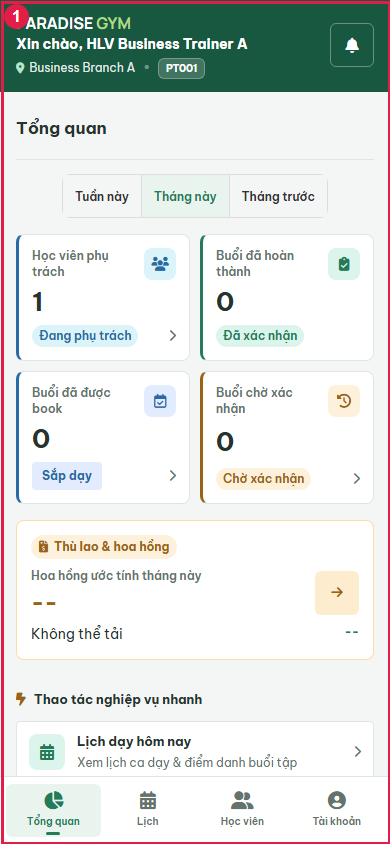

# PT01-US03 - Isolated real UI business E2E

Run: 2026-09-20T17:31:33.301Z

Sources: docs/user-stories/pt/PT01-Lịch/PT01-US03 story (Main Flow, Field specification, Alternate/Exception Flows); docs/product-spec.md sections 4.2-4.6.

Database: paradise_test_27896_1789925466520; frontend: http://localhost:3000; real backend: http://127.0.0.1:63063/api/v1. Browser requests redirected with route.continue, no response mocks. Real API auth sessions. Shared configured DB receives no application writes. Scope: test artifacts only; mailbox/skill/source files unchanged by this runner.

All migrations present at startup applied: 001_create_tables.sql, 002_web_rebuild.sql, 003_mobile_preferences.sql, 004_device_sessions.sql, 005_remove_pt_certificates.sql, 006_boss_feedback_schema_upgrade.sql, 007_commission_configs_uniqueness_and_history.sql, 008_branch_default_commission_rate.sql, 009_pt_commission_payout_details.sql, 010_scheduled_package_freezes.sql, 011_pt_bookings_no_overlap_indexes.sql, 012_pt_commission_session_snapshot.sql, 013_pt_booking_participants.sql. Hashes recorded in results.json. Individual booking fixture.

Fixture: {"b1":"231ac2b5-e9d3-4aef-a2ab-28565e01c12f","b2":"1fcbeae7-2a4d-4337-8fc7-82fd88847024","member":{"id":"3534ced7-cbb6-42e5-8871-5f1b699cf2cd","account_id":"33d8941a-4e9e-48e5-9d64-bd2a5282c17c","home_branch_id":"231ac2b5-e9d3-4aef-a2ab-28565e01c12f","member_code":"HV001","full_name":"Business Member A","phone":"0909000010","email":null,"date_of_birth":null,"gender":null,"avatar_url":null,"status":"ACTIVE","created_by":"3f047942-8bbb-4ceb-9e91-c1bbbec1c24f","created_at":"2026-09-20T17:31:07.540Z","updated_at":"2026-09-20T17:31:07.540Z","qr_code":"QR-HV001-0909000010","face_enrolled":false},"pt":{"id":"e6475e06-baa7-41da-be49-712a8b45326a","account_id":"4ff6a2d4-a966-4916-a9a0-b3bc9655cd1c","branch_id":"231ac2b5-e9d3-4aef-a2ab-28565e01c12f","pt_code":"PT001","full_name":"Business Trainer A","phone":"0909000020","email":null,"gender":null,"bio":null,"specialties":"Strength","status":"ACTIVE","work_start_time":"08:00:00","work_end_time":"18:00:00","work_days":"MON_TO_FRI","created_at":"2026-09-20T17:31:07.569Z","updated_at":"2026-09-20T17:31:07.569Z","show_phone_to_members":false,"avatar_url":null,"face_enrolled":false,"bank_name":null,"bank_account_no":null,"bank_account_name":null},"pt2":{"id":"400737d3-3fff-4466-b090-2f8ee67396b8","account_id":"b87dd0a4-99ce-4b1f-a3e6-e7f81250c95e","branch_id":"1fcbeae7-2a4d-4337-8fc7-82fd88847024","pt_code":"PT002","full_name":"Business Trainer B","phone":"0909000021","email":null,"gender":null,"bio":null,"specialties":"Strength","status":"ACTIVE","work_start_time":"08:00:00","work_end_time":"18:00:00","work_days":"MON_TO_FRI","created_at":"2026-09-20T17:31:07.590Z","updated_at":"2026-09-20T17:31:07.590Z","show_phone_to_members":false,"avatar_url":null,"face_enrolled":false,"bank_name":null,"bank_account_no":null,"bank_account_name":null},"registration":{"id":"f33b9a7f-900a-49d5-b4f0-4bed605867e0","reg_code":"DK002","member_id":"3534ced7-cbb6-42e5-8871-5f1b699cf2cd","package_id":"abee313e-7c0f-4e78-835b-80dc67f2432b","assigned_pt_id":"e6475e06-baa7-41da-be49-712a8b45326a","sold_branch_id":"231ac2b5-e9d3-4aef-a2ab-28565e01c12f","previous_registration_id":null,"package_name_snapshot":"Business PT 90","package_type_snapshot":"PT_SESSION","price_snapshot":1000000,"duration_days_snapshot":60,"total_gym_sessions_snapshot":null,"total_pt_sessions_snapshot":5,"start_date":"2026-09-21","end_date":"2026-11-20","remaining_gym_sessions":null,"remaining_pt_sessions":5,"booked_pt_sessions":0,"used_pt_sessions":0,"status":"ACTIVE","created_by":"3f047942-8bbb-4ceb-9e91-c1bbbec1c24f","created_at":"2026-09-20T17:31:08.696Z","updated_at":"2026-09-20T17:31:08.763Z","gym_price_snapshot":0,"pt_price_snapshot":1000000,"combo_price_snapshot":0,"package_mode":"INDIVIDUAL","max_group_members_snapshot":null,"is_frozen":false,"freeze_days_total":0,"group_leader_member_id":null,"has_scheduled_freeze":false,"registration_code":"DK002","member":{"id":"3534ced7-cbb6-42e5-8871-5f1b699cf2cd","account_id":"33d8941a-4e9e-48e5-9d64-bd2a5282c17c","home_branch_id":"231ac2b5-e9d3-4aef-a2ab-28565e01c12f","member_code":"HV001","full_name":"Business Member A","phone":"0909000010","email":null,"date_of_birth":null,"gender":null,"avatar_url":null,"status":"ACTIVE","created_by":"3f047942-8bbb-4ceb-9e91-c1bbbec1c24f","created_at":"2026-09-20T17:31:07.540Z","updated_at":"2026-09-20T17:31:07.540Z","qr_code":"QR-HV001-0909000010","face_enrolled":false},"member_name":"Business Member A","member_code":"HV001","member_phone":"0909000010","allowed_branches":[{"id":"231ac2b5-e9d3-4aef-a2ab-28565e01c12f","branch_code":"Business Branch A","branch_name":"Business Branch A","phone":"0909999999","address":"Isolated E2E","status":"ACTIVE","open_time":"00:00:00","close_time":"23:59:00","timezone":"Asia/Ho_Chi_Minh","created_at":"2026-09-20T17:31:07.101Z","updated_at":"2026-09-20T17:31:07.101Z","gate_config":{"duplicate_seconds":60,"daily_gym_deduction_limit":1},"default_pt_commission_percentage":20}],"assigned_pt":{"id":"e6475e06-baa7-41da-be49-712a8b45326a","account_id":"4ff6a2d4-a966-4916-a9a0-b3bc9655cd1c","branch_id":"231ac2b5-e9d3-4aef-a2ab-28565e01c12f","pt_code":"PT001","full_name":"Business Trainer A","phone":"0909000020","email":null,"gender":null,"bio":null,"specialties":"Strength","status":"ACTIVE","work_start_time":"08:00:00","work_end_time":"18:00:00","work_days":"MON_TO_FRI","created_at":"2026-09-20T17:31:07.569Z","updated_at":"2026-09-20T17:31:07.569Z","show_phone_to_members":false,"avatar_url":null,"face_enrolled":false,"bank_name":null,"bank_account_no":null,"bank_account_name":null},"pt_name":"Business Trainer A","payments":[{"id":"0ef51d84-12d5-46a8-9428-9e689b992c9b","registration_id":"f33b9a7f-900a-49d5-b4f0-4bed605867e0","member_id":"3534ced7-cbb6-42e5-8871-5f1b699cf2cd","branch_id":"231ac2b5-e9d3-4aef-a2ab-28565e01c12f","payment_code":"PAY002","payment_method":"CASH","amount":1000000,"status":"COMPLETED","transaction_ref":null,"collected_by":"3f047942-8bbb-4ceb-9e91-c1bbbec1c24f","confirmed_at":"2026-09-20T17:31:08.720Z","created_at":"2026-09-20T17:31:08.720Z","updated_at":"2026-09-20T17:31:08.720Z","note":null,"expires_at":null,"discount_id":null,"discount_amount":0}],"created_by_name":"0909000002","freezes":[],"transfers":[],"progress":{"elapsed_days":0,"remaining_days":60,"total_days":60,"checkins":0,"total_pt_sessions":5,"used_pt_sessions":0,"booked_pt_sessions":0,"remaining_pt_sessions":5}},"date":"2026-09-22","groupMode":false}

## Source Action Verification

### Blocked at PT source UI

- Action / Input: Blocked at PT source UI
- Expected Result: Complete the requested real UI flow
- Actual Result: locator.waitFor: Timeout 15000ms exceeded.
Call log:
  - waiting for locator('#ptCreateBooking') to be visible
    33 × locator resolved to hidden <button type="button" id="ptCreateBooking" class="btn btn-primary" aria-label="Đặt lịch PT">…</button>

- Status: **FAIL**

## State Verification

## Cross-Role / Downstream Verification

BLOCKED: source/setup did not reach downstream checks.

## Issues Found

- PT source UI: locator.waitFor: Timeout 15000ms exceeded.
Call log:
  - waiting for locator('#ptCreateBooking') to be visible
    33 × locator resolved to hidden <button type="button" id="ptCreateBooking" class="btn btn-primary" aria-label="Đặt lịch PT">…</button>

    at record (E:\Desktop\para\tests\e2e\pt\business-20260920.cjs:74:17)
    at main (E:\Desktop\para\tests\e2e\pt\business-20260920.cjs:162:9)
- Blocked at PT source UI: locator.waitFor: Timeout 15000ms exceeded.
Call log:
  - waiting for locator('#ptCreateBooking') to be visible
    33 × locator resolved to hidden <button type="button" id="ptCreateBooking" class="btn btn-primary" aria-label="Đặt lịch PT">…</button>

## Final Result

**BLOCKED**. 0/1 UI steps passed. Last phase: PT source UI. Scope is the recorded scenarios, not complete acceptance of every exception flow.

Run: node tests/e2e/pt/business-20260920.cjs

Browser page errors: []

Prior run evidence (retained before rerun):
- [2026-09-20T17-14-43-339Z](./history/2026-09-20T17-14-43-339Z/PT01-US03-test.md)
- [2026-09-20T17-15-20-193Z](./history/2026-09-20T17-15-20-193Z/PT01-US03-test.md)
- [2026-09-20T17-18-18-600Z](./history/2026-09-20T17-18-18-600Z/PT01-US03-test.md)
- [2026-09-20T17-20-05-653Z](./history/2026-09-20T17-20-05-653Z/PT01-US03-test.md)
- [2026-09-20T17-31-06-520Z](./history/2026-09-20T17-31-06-520Z/PT01-US03-test.md)

Group mode: false. Run with PT_E2E_GROUP=1 for group coverage.
