# PT01-US03 - Isolated real UI business E2E

Run: 2026-09-20T17:19:10.121Z

Sources: docs/user-stories/pt/PT01-Lịch/PT01-US03 story (Main Flow, Field specification, Alternate/Exception Flows); docs/product-spec.md sections 4.2-4.6.

Database: paradise_test_34672_1789924698602; frontend: http://localhost:3000; real backend: http://127.0.0.1:49681/api/v1. Browser requests redirected with route.continue, no response mocks. Real API auth sessions. Shared configured DB receives no application writes. Scope: test artifacts only; mailbox/skill/source files unchanged by this runner.

All migrations present at startup applied: 001_create_tables.sql, 002_web_rebuild.sql, 003_mobile_preferences.sql, 004_device_sessions.sql, 005_remove_pt_certificates.sql, 006_boss_feedback_schema_upgrade.sql, 007_commission_configs_uniqueness_and_history.sql, 008_branch_default_commission_rate.sql, 009_pt_commission_payout_details.sql, 010_scheduled_package_freezes.sql, 011_pt_bookings_no_overlap_indexes.sql, 012_pt_commission_session_snapshot.sql, 013_pt_booking_participants.sql. Hashes recorded in results.json. Group fixture: leader + ACCEPTED member; PENDING member excluded. SQL fixture setup is confined to the new isolated database. Participant Gym expiry is temporarily changed only for EF-02.

Fixture: {"b1":"ebaa85d3-ef87-4a90-82c7-be326b39c2d3","b2":"4dab22e3-ac09-4f6d-b377-d4593f1fc6dc","member":{"id":"31714491-7133-445e-be5f-0cbf181df785","account_id":"67cb4232-2df9-4f5b-84c8-491654cf53c4","home_branch_id":"ebaa85d3-ef87-4a90-82c7-be326b39c2d3","member_code":"HV001","full_name":"Business Member A","phone":"0909000010","email":null,"date_of_birth":null,"gender":null,"avatar_url":null,"status":"ACTIVE","created_by":"b8755d60-4528-4c53-bf8d-9f6d1a888642","created_at":"2026-09-20T17:18:19.941Z","updated_at":"2026-09-20T17:18:19.941Z","qr_code":"QR-HV001-0909000010","face_enrolled":false},"pt":{"id":"27a10cd2-9362-43fa-a770-efeeac5df1e4","account_id":"47776fc8-0f33-434d-8edf-4637906e4019","branch_id":"ebaa85d3-ef87-4a90-82c7-be326b39c2d3","pt_code":"PT001","full_name":"Business Trainer A","phone":"0909000020","email":null,"gender":null,"bio":null,"specialties":"Strength","status":"ACTIVE","work_start_time":"08:00:00","work_end_time":"18:00:00","work_days":"MON_TO_FRI","created_at":"2026-09-20T17:18:19.982Z","updated_at":"2026-09-20T17:18:19.982Z","show_phone_to_members":false,"avatar_url":null,"face_enrolled":false,"bank_name":null,"bank_account_no":null,"bank_account_name":null},"pt2":{"id":"d11c4490-5e8c-4008-936b-d1b4fde432aa","account_id":"62f454d7-212d-4cd7-bbb8-b6d447cfc54e","branch_id":"4dab22e3-ac09-4f6d-b377-d4593f1fc6dc","pt_code":"PT002","full_name":"Business Trainer B","phone":"0909000021","email":null,"gender":null,"bio":null,"specialties":"Strength","status":"ACTIVE","work_start_time":"08:00:00","work_end_time":"18:00:00","work_days":"MON_TO_FRI","created_at":"2026-09-20T17:18:20.009Z","updated_at":"2026-09-20T17:18:20.009Z","show_phone_to_members":false,"avatar_url":null,"face_enrolled":false,"bank_name":null,"bank_account_no":null,"bank_account_name":null},"registration":{"id":"124074b3-3f3e-4a92-8097-f406554e0880","reg_code":"DK002","member_id":"31714491-7133-445e-be5f-0cbf181df785","package_id":"70e76712-1415-4421-a20f-a1dde10055de","assigned_pt_id":"27a10cd2-9362-43fa-a770-efeeac5df1e4","sold_branch_id":"ebaa85d3-ef87-4a90-82c7-be326b39c2d3","previous_registration_id":null,"package_name_snapshot":"Business PT 90","package_type_snapshot":"PT_SESSION","price_snapshot":1000000,"duration_days_snapshot":60,"total_gym_sessions_snapshot":null,"total_pt_sessions_snapshot":5,"start_date":"2026-09-21","end_date":"2026-11-20","remaining_gym_sessions":null,"remaining_pt_sessions":5,"booked_pt_sessions":0,"used_pt_sessions":0,"status":"ACTIVE","created_by":"b8755d60-4528-4c53-bf8d-9f6d1a888642","created_at":"2026-09-20T17:18:21.146Z","updated_at":"2026-09-20T17:18:21.198Z","gym_price_snapshot":0,"pt_price_snapshot":1000000,"combo_price_snapshot":0,"package_mode":"GROUP_1_N","max_group_members_snapshot":3,"is_frozen":false,"freeze_days_total":0,"group_leader_member_id":"31714491-7133-445e-be5f-0cbf181df785","has_scheduled_freeze":false,"registration_code":"DK002","member":{"id":"31714491-7133-445e-be5f-0cbf181df785","account_id":"67cb4232-2df9-4f5b-84c8-491654cf53c4","home_branch_id":"ebaa85d3-ef87-4a90-82c7-be326b39c2d3","member_code":"HV001","full_name":"Business Member A","phone":"0909000010","email":null,"date_of_birth":null,"gender":null,"avatar_url":null,"status":"ACTIVE","created_by":"b8755d60-4528-4c53-bf8d-9f6d1a888642","created_at":"2026-09-20T17:18:19.941Z","updated_at":"2026-09-20T17:18:19.941Z","qr_code":"QR-HV001-0909000010","face_enrolled":false},"member_name":"Business Member A","member_code":"HV001","member_phone":"0909000010","allowed_branches":[{"id":"ebaa85d3-ef87-4a90-82c7-be326b39c2d3","branch_code":"Business Branch A","branch_name":"Business Branch A","phone":"0909999999","address":"Isolated E2E","status":"ACTIVE","open_time":"00:00:00","close_time":"23:59:00","timezone":"Asia/Ho_Chi_Minh","created_at":"2026-09-20T17:18:19.445Z","updated_at":"2026-09-20T17:18:19.445Z","gate_config":{"duplicate_seconds":60,"daily_gym_deduction_limit":1},"default_pt_commission_percentage":20}],"assigned_pt":{"id":"27a10cd2-9362-43fa-a770-efeeac5df1e4","account_id":"47776fc8-0f33-434d-8edf-4637906e4019","branch_id":"ebaa85d3-ef87-4a90-82c7-be326b39c2d3","pt_code":"PT001","full_name":"Business Trainer A","phone":"0909000020","email":null,"gender":null,"bio":null,"specialties":"Strength","status":"ACTIVE","work_start_time":"08:00:00","work_end_time":"18:00:00","work_days":"MON_TO_FRI","created_at":"2026-09-20T17:18:19.982Z","updated_at":"2026-09-20T17:18:19.982Z","show_phone_to_members":false,"avatar_url":null,"face_enrolled":false,"bank_name":null,"bank_account_no":null,"bank_account_name":null},"pt_name":"Business Trainer A","payments":[{"id":"b3480bff-070c-4356-be42-44672f83c581","registration_id":"124074b3-3f3e-4a92-8097-f406554e0880","member_id":"31714491-7133-445e-be5f-0cbf181df785","branch_id":"ebaa85d3-ef87-4a90-82c7-be326b39c2d3","payment_code":"PAY002","payment_method":"CASH","amount":1000000,"status":"COMPLETED","transaction_ref":null,"collected_by":"b8755d60-4528-4c53-bf8d-9f6d1a888642","confirmed_at":"2026-09-20T17:18:21.166Z","created_at":"2026-09-20T17:18:21.166Z","updated_at":"2026-09-20T17:18:21.166Z","note":null,"expires_at":null,"discount_id":null,"discount_amount":0}],"created_by_name":"0909000002","freezes":[],"transfers":[],"progress":{"elapsed_days":0,"remaining_days":60,"total_days":60,"checkins":0,"total_pt_sessions":5,"used_pt_sessions":0,"booked_pt_sessions":0,"remaining_pt_sessions":5}},"date":"2026-09-22","groupMode":true,"accepted":{"id":"b94e30cd-63a2-4548-8462-17004bed6e25","account_id":"dffc0a65-cbf4-4ba3-9323-90236b49bbe0","home_branch_id":"ebaa85d3-ef87-4a90-82c7-be326b39c2d3","member_code":"HV002","full_name":"Business Accepted Member","phone":"0909000011","email":null,"date_of_birth":null,"gender":null,"avatar_url":null,"status":"ACTIVE","created_by":"b8755d60-4528-4c53-bf8d-9f6d1a888642","created_at":"2026-09-20T17:18:21.239Z","updated_at":"2026-09-20T17:18:21.239Z","qr_code":"QR-HV002-0909000011","face_enrolled":false},"pending":{"id":"884b7571-e8cb-41d1-a2b6-501831ea2a3e","account_id":"4dd29a59-870d-4d8e-bfaa-905ba78a611c","home_branch_id":"ebaa85d3-ef87-4a90-82c7-be326b39c2d3","member_code":"HV003","full_name":"Business Pending Member","phone":"0909000012","email":null,"date_of_birth":null,"gender":null,"avatar_url":null,"status":"ACTIVE","created_by":"b8755d60-4528-4c53-bf8d-9f6d1a888642","created_at":"2026-09-20T17:18:21.254Z","updated_at":"2026-09-20T17:18:21.254Z","qr_code":"QR-HV003-0909000012","face_enrolled":false},"acceptedGym":{"id":"95672efc-878c-469f-a50c-ee067195a3f6","reg_code":"DK003","member_id":"b94e30cd-63a2-4548-8462-17004bed6e25","package_id":"3c612dd1-b15b-40ad-8c1b-bcd8e089a182","assigned_pt_id":null,"sold_branch_id":"ebaa85d3-ef87-4a90-82c7-be326b39c2d3","previous_registration_id":null,"package_name_snapshot":"Business Gym","package_type_snapshot":"GYM_SESSION","price_snapshot":500000,"duration_days_snapshot":60,"total_gym_sessions_snapshot":20,"total_pt_sessions_snapshot":null,"start_date":"2026-09-21","end_date":"2026-11-20","remaining_gym_sessions":20,"remaining_pt_sessions":null,"booked_pt_sessions":0,"used_pt_sessions":0,"status":"PENDING_PAYMENT","created_by":"b8755d60-4528-4c53-bf8d-9f6d1a888642","created_at":"2026-09-20T17:18:21.645Z","updated_at":"2026-09-20T17:18:21.645Z","gym_price_snapshot":500000,"pt_price_snapshot":0,"combo_price_snapshot":0,"package_mode":"INDIVIDUAL","max_group_members_snapshot":null,"is_frozen":false,"freeze_days_total":0,"group_leader_member_id":null}}

## Source Action Verification

### Open authenticated PT calendar

- Action / Input: Open authenticated PT calendar
- Expected Result: PT01-US03 Trigger: own PT can open booking from PT01
- Actual Result: Own PT calendar and booking action visible
- Status: **PASS**

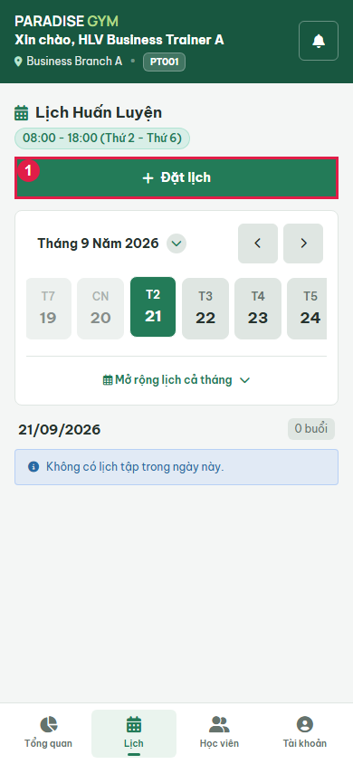

### Open booking modal

- Action / Input: Open booking modal
- Expected Result: Main Flow 1: real PT/branch readonly; form opens without choices
- Actual Result: Visible popup with own trainer and branch from isolated API
- Status: **PASS**

### Attempt empty-form submission

- Action / Input: Attempt empty-form submission
- Expected Result: Field specification: save disabled while required inputs missing
- Actual Result: Save disabled; zero bookings. No forced validation or synthetic click.
- Status: **PASS**

### Open date picker

- Action / Input: Open date picker
- Expected Result: Main Flow 4: choose future working date from calendar
- Actual Result: 22
- Status: **PASS**

### Select future working date

- Action / Input: Select future working date
- Expected Result: Main Flow 4: date picker accepts future working date
- Actual Result: 2026-09-22
- Status: **PASS**

### Open assigned-member dropdown

- Action / Input: Open assigned-member dropdown
- Expected Result: Main Flow 2: assigned members from API
- Actual Result: Business Member A · HV001 · 0909000010
- Status: **PASS**

### Select assigned member

- Action / Input: Select assigned member
- Expected Result: Main Flow 3: contract choices enabled for selected member
- Actual Result: Business Member A · HV001 · 0909000010
- Status: **PASS**

### Open contract dropdown

- Action / Input: Open contract dropdown
- Expected Result: Main Flow 3: paid assigned contract has remaining sessions
- Actual Result: DK002 · Business PT 90 · 5 buổi
- Status: **PASS**

### Inspect accepted participants after contract selection

- Action / Input: Inspect accepted participants after contract selection
- Expected Result: PT01-US03 Main Flow 3: leader plus all ACCEPTED; PENDING excluded; no individual selection
- Actual Result: Business Member A · HV001 · Trưởng nhóm
Business Accepted Member · HV002
- Status: **PASS**

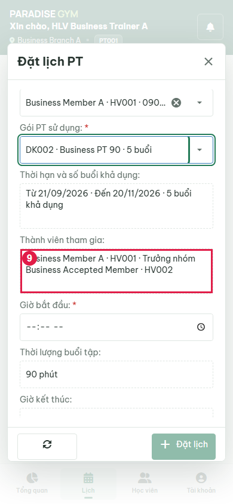

### Select paid assigned contract

- Action / Input: Select paid assigned contract
- Expected Result: Main Flow 4: duration comes from API contract and is readonly
- Actual Result: 90 minutes; contract selected
- Status: **PASS**

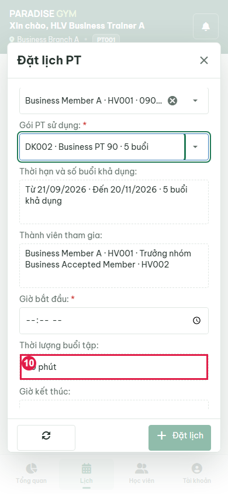

### Enter 08:00 start time

- Action / Input: Enter 08:00 start time
- Expected Result: Main Flow 4: 90 minutes produces readonly 09:30 end
- Actual Result: 08:00 - 09:30
- Status: **PASS**

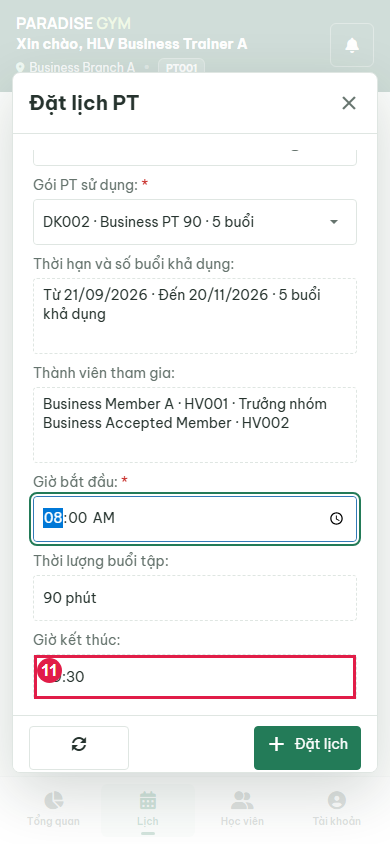

### Review filled form before submit

- Action / Input: Review filled form before submit
- Expected Result: Main Flow 5: chosen member, contract, date/time and note visible before save
- Actual Result: {"pt_name":"Business Trainer A · PT001","branch_name":"Business Branch A","member_id":"31714491-7133-445e-be5f-0cbf181df785","registration_id":"124074b3-3f3e-4a92-8097-f406554e0880","date":"2026-09-22","start_time":"08:00","duration_display":"90 phút","end_time":"09:30","contract_rights":"Từ 21/09/2026 · Đến 20/11/2026 · 5 buổi khả dụng","participants":"Business Member A · HV001 · Trưởng nhóm\nBusiness Accepted Member · HV002","note":"business-20260920 own PT UI booking"}
- Status: **PASS**

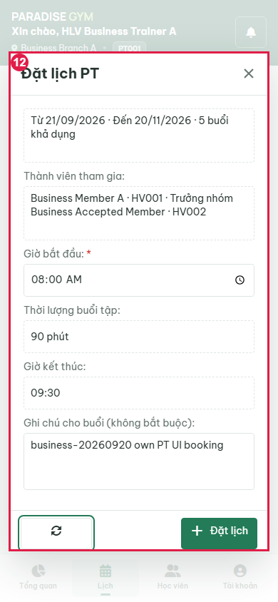

### Submit while accepted participant Gym expires before booking date

- Action / Input: Submit while accepted participant Gym expires before booking date
- Expected Result: PT01-US03 EF-02: reject whole group, retain input, no booking or session deduction
- Actual Result: false == true
- Status: **FAIL**

### Restore isolated participant entitlement and review retained form

- Action / Input: Restore isolated participant entitlement and review retained form
- Expected Result: EF-02 adjustment: unchanged form is ready to retry with valid Gym
- Actual Result: Gym expiry restored in isolated fixture; form retains 08:00 start and selected contract
- Status: **PASS**

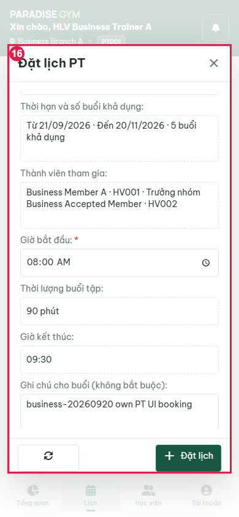

### Submit booking and view own calendar

- Action / Input: Submit booking and view own calendar
- Expected Result: Main Flow 8-9: real POST creates booking, closes modal, selects date and refreshes calendar
- Actual Result: booking_id=69ea9699-b3e9-4a6a-941d-a6b4461618a3; 08:00 - 09:30
90 PHÚT
Đã đặt
69ea9699-b3e9-4a6a-941d-a6b4461618a3
Business Member A
 Business PT 90
 Business Branch A
Thành viên tham gia: Business Member A · HV001; Business Accepted Member · HV002
Chưa đến giờ tập
business-20260920 own PT UI booking
- Status: **PASS**

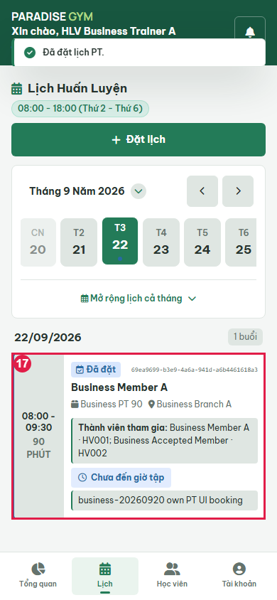

## State Verification

- **PASS** Actual browser booking POST: {"status":200,"body":{"registration_id":"124074b3-3f3e-4a92-8097-f406554e0880","member_id":"31714491-7133-445e-be5f-0cbf181df785","pt_id":"27a10cd2-9362-43fa-a770-efeeac5df1e4","branch_id":"ebaa85d3-ef87-4a90-82c7-be326b39c2d3","booking_date":"2026-09-22","start_time":"08:00","end_time":"09:30","session_duration_minutes":90,"workout_notes":"business-20260920 own PT UI booking"},"bookingId":"69ea9699-b3e9-4a6a-941d-a6b4461618a3"}
- **PASS** Immutable participants from actual booking POST/detail: {"bookingId":"69ea9699-b3e9-4a6a-941d-a6b4461618a3","participants":[{"member_id":"31714491-7133-445e-be5f-0cbf181df785","member_code":"HV001","member_name":"Business Member A","is_leader":true},{"member_id":"b94e30cd-63a2-4548-8462-17004bed6e25","member_code":"HV002","member_name":"Business Accepted Member","is_leader":false}],"post":{"registration_id":"124074b3-3f3e-4a92-8097-f406554e0880","member_id":"31714491-7133-445e-be5f-0cbf181df785","pt_id":"27a10cd2-9362-43fa-a770-efeeac5df1e4","branch_id":"ebaa85d3-ef87-4a90-82c7-be326b39c2d3","booking_date":"2026-09-22","start_time":"08:00","end_time":"09:30","session_duration_minutes":90,"workout_notes":"business-20260920 own PT UI booking"}}
- **PASS** Atomic reservation counters: "remaining=4, booked=1, used=0; total=5"
- **PASS** PT2 attempts PT1 contract: {"status":403,"body":{"success":false,"message":"Bạn không có quyền thực hiện thao tác này hoặc dữ liệu nằm ngoài phạm vi chi nhánh.","code":"FORBIDDEN"},"before":1,"after":1}
- **PASS** PT1 forges PT2 id: {"status":403,"body":{"success":false,"message":"Bạn không có quyền thực hiện thao tác này hoặc dữ liệu nằm ngoài phạm vi chi nhánh.","code":"FORBIDDEN"},"before":1,"after":1}
- **PASS** PT1 forges foreign branch: {"status":403,"body":{"success":false,"message":"Bạn không có quyền thực hiện thao tác này hoặc dữ liệu nằm ngoài phạm vi chi nhánh.","code":"FORBIDDEN"},"before":1,"after":1}
- **PASS** Nonleader member-confirm denied: {"bookingId":"69ea9699-b3e9-4a6a-941d-a6b4461618a3","memberId":"b94e30cd-63a2-4548-8462-17004bed6e25","status":403,"payload":{"success":false,"message":"Bạn không có quyền thực hiện thao tác này hoặc dữ liệu nằm ngoài phạm vi chi nhánh.","code":"FORBIDDEN"}}
- **PASS** Nonleader cancel denied: {"bookingId":"69ea9699-b3e9-4a6a-941d-a6b4461618a3","memberId":"b94e30cd-63a2-4548-8462-17004bed6e25","status":403,"payload":{"success":false,"message":"Bạn không có quyền thực hiện thao tác này hoặc dữ liệu nằm ngoài phạm vi chi nhánh.","code":"FORBIDDEN"}}

### Inspect filled booking modal at 360px

- Action / Input: Inspect filled booking modal at 360px
- Expected Result: Requested responsive nonoverlap: modal in viewport, content stays above action toolbar
- Actual Result: {"box":{"x":12,"y":72,"width":336,"height":700.59375},"content":{"x":13,"y":134,"width":334,"height":580.59375},"toolbar":{"x":13,"y":714.59375,"width":334,"height":57}}
- Status: **PASS**

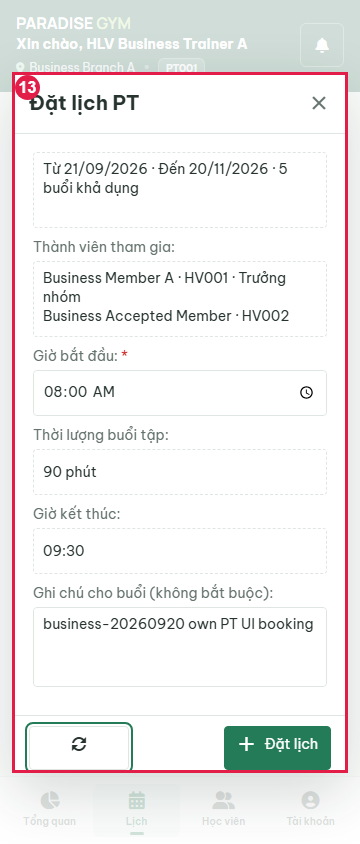

### Inspect filled booking modal at 1440px

- Action / Input: Inspect filled booking modal at 1440px
- Expected Result: Requested responsive nonoverlap: modal in viewport, content stays above action toolbar
- Actual Result: {"box":{"x":460,"y":82,"width":520,"height":737},"content":{"x":461,"y":144,"width":518,"height":617},"toolbar":{"x":461,"y":761,"width":518,"height":57}}
- Status: **PASS**

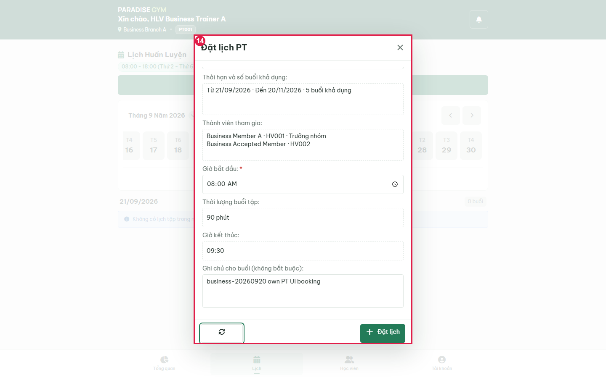

### Inspect created group booking card

- Action / Input: Inspect created group booking card
- Expected Result: PT01-US01: readonly snapshot includes leader and accepted member, excludes pending
- Actual Result: 08:00 - 09:30
90 PHÚT
Đã đặt
69ea9699-b3e9-4a6a-941d-a6b4461618a3
Business Member A
 Business PT 90
 Business Branch A
Thành viên tham gia: Business Member A · HV001; Business Accepted Member · HV002
Chưa đến giờ tập
business-20260920 own PT UI booking
- Status: **PASS**

### Inspect PT calendar at 360px

- Action / Input: Inspect PT calendar at 360px
- Expected Result: Requested responsive nonoverlap: card and fixed navigation do not intersect; no page overflow
- Actual Result: {"card":{"x":16,"y":496.390625,"width":328,"height":272.5},"nav":{"x":0,"y":776,"width":360,"height":68},"overflow":false}
- Status: **PASS**

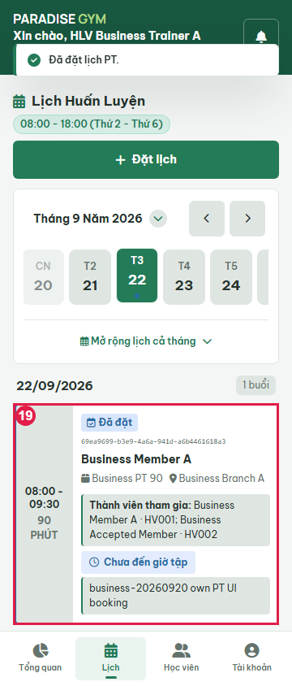

### Inspect PT calendar at 390px

- Action / Input: Inspect PT calendar at 390px
- Expected Result: Requested responsive nonoverlap: card and fixed navigation do not intersect; no page overflow
- Actual Result: {"card":{"x":16,"y":496.390625,"width":358,"height":235},"nav":{"x":0,"y":776,"width":390,"height":68},"overflow":false}
- Status: **PASS**

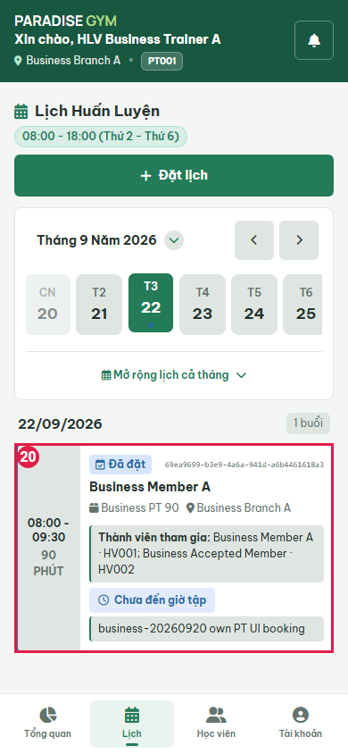

### Inspect PT calendar at 768px

- Action / Input: Inspect PT calendar at 768px
- Expected Result: Requested responsive nonoverlap: card and fixed navigation do not intersect; no page overflow
- Actual Result: {"card":{"x":20,"y":502.265625,"width":728,"height":199},"nav":{"x":0,"y":776,"width":768,"height":68},"overflow":false}
- Status: **PASS**

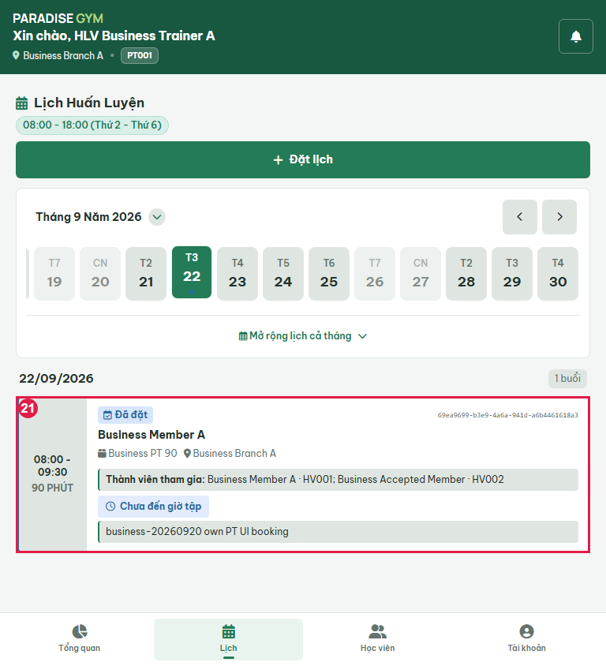

### Inspect PT calendar at 1440px

- Action / Input: Inspect PT calendar at 1440px
- Expected Result: Requested responsive nonoverlap: card and fixed navigation do not intersect; no page overflow
- Actual Result: {"card":{"x":280,"y":502.265625,"width":880,"height":199},"nav":{"x":0,"y":832,"width":1440,"height":68},"overflow":false}
- Status: **PASS**

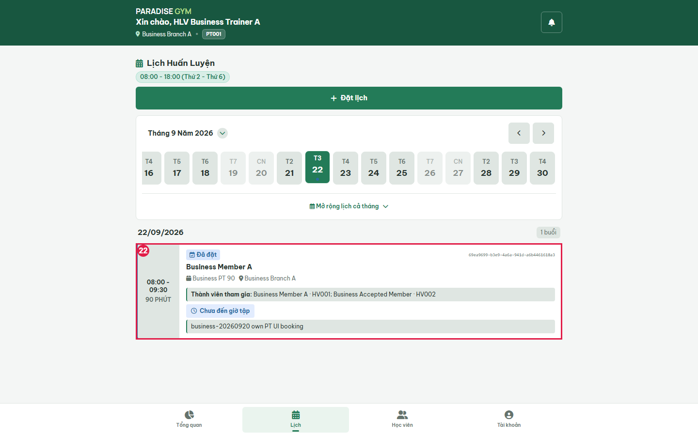

## Cross-Role / Downstream Verification

### Open authenticated member training schedule

- Action / Input: Open authenticated member training schedule
- Expected Result: Main Flow 9: same created booking visible to its member
- Actual Result: booking_id=69ea9699-b3e9-4a6a-941d-a6b4461618a3; 22/9/2026 · 08:00 - 09:30
Đã đặt

Business Branch A

PT: Business Trainer A

Business Member A · Business PT 90

Hủy lịch
Xác nhận hoàn thành
- Status: **PASS**

### Open accepted nonleader schedule for same booking

- Action / Input: Open accepted nonleader schedule for same booking
- Expected Result: PT01-US01/03: snapshot participant can view same booking, only leader may confirm or cancel
- Actual Result: Nonleader b94e30cd-63a2-4548-8462-17004bed6e25 viewing booking 69ea9699-b3e9-4a6a-941d-a6b4461618a3 has enabled actions: [{"text":"Hủy lịch","disabled":false},{"text":"Xác nhận hoàn thành","disabled":true}]; card: 22/9/2026 · 08:00 - 09:30
Đã đặt

Business Branch A

PT: Business Trainer A

Business Member A · Business PT 90

Hủy lịch
Xác nhận hoàn thành
- Status: **FAIL**

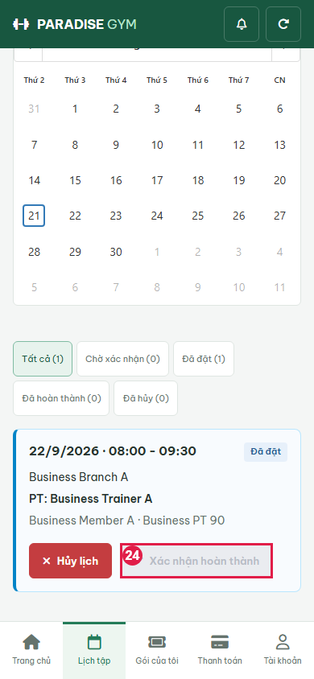

### Open same booking in receptionist schedule

- Action / Input: Open same booking in receptionist schedule
- Expected Result: Main Flow 9: same booking appears in authorized branch Web UI
- Actual Result: booking_id=69ea9699-b3e9-4a6a-941d-a6b4461618a3; Hội viên:
Business Member A (HV001)
Số điện thoại:
0909000010
PT phụ trách:
Business Trainer A
Chi nhánh:
Business Branch A
Gói PT sử dụng:
Business PT 90
Ngày tập:
22/9/2026
Khung giờ:
08:00 - 09:30
Trạng thái:
Đã đặt
PT xác nhận:
Chưa xác nhận
Hội viên xác nhận:
Chưa xác nhận
Khấu trừ buổi:
Chưa khấu trừ
Ghi chú cho buổi:
business-20260920 own PT UI booking
Buổi số:
1
Nội dung bài tập:
business-20260920 own PT UI booking
- Status: **PASS**

### Open Branch B receptionist trainer choices

- Action / Input: Open Branch B receptionist trainer choices
- Expected Result: EF-01 and branch scope: Branch B cannot see Branch A trainer/booking
- Actual Result: Branch B trainer visible; Branch A trainer absent
- Status: **PASS**

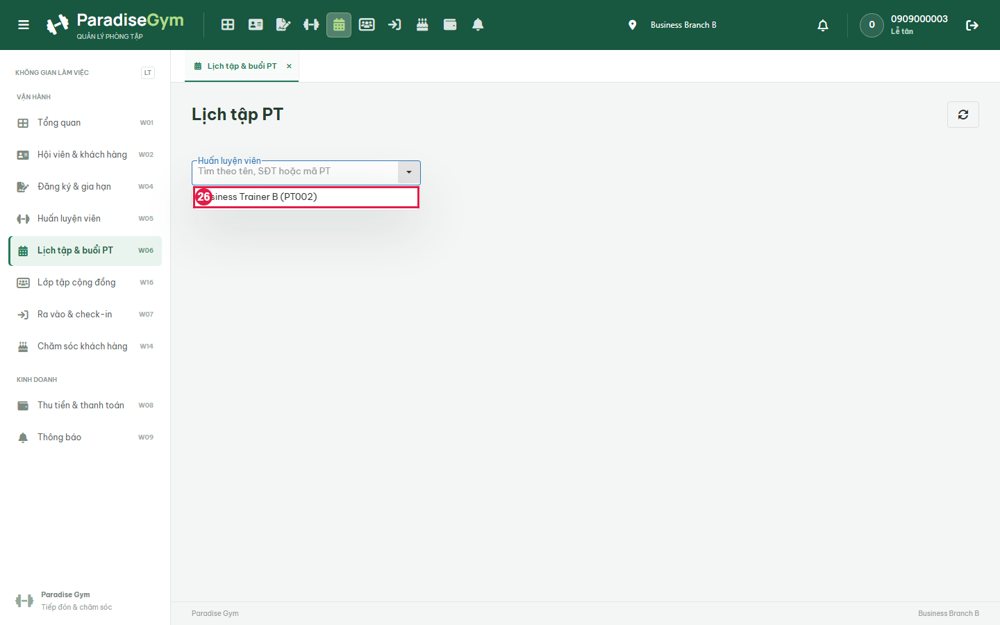

## Issues Found

- Submit while accepted participant Gym expires before booking date: false == true
- Open accepted nonleader schedule for same booking: Nonleader b94e30cd-63a2-4548-8462-17004bed6e25 viewing booking 69ea9699-b3e9-4a6a-941d-a6b4461618a3 has enabled actions: [{"text":"Hủy lịch","disabled":false},{"text":"Xác nhận hoàn thành","disabled":true}]; card: 22/9/2026 · 08:00 - 09:30
Đã đặt

Business Branch A

PT: Business Trainer A

Business Member A · Business PT 90

Hủy lịch
Xác nhận hoàn thành

## Final Result

**FAIL**. 24/26 UI steps passed. Last phase: Downstream receptionist UI. Scope is the recorded scenarios, not complete acceptance of every exception flow.

Run: node tests/e2e/pt/business-20260920.cjs

Browser page errors: []

Prior run evidence (retained before rerun):
- [2026-09-20T17-18-18-603Z](./history/2026-09-20T17-18-18-603Z/PT01-US03-test.md)

Group mode: true. Run with PT_E2E_GROUP=1 for group coverage.
