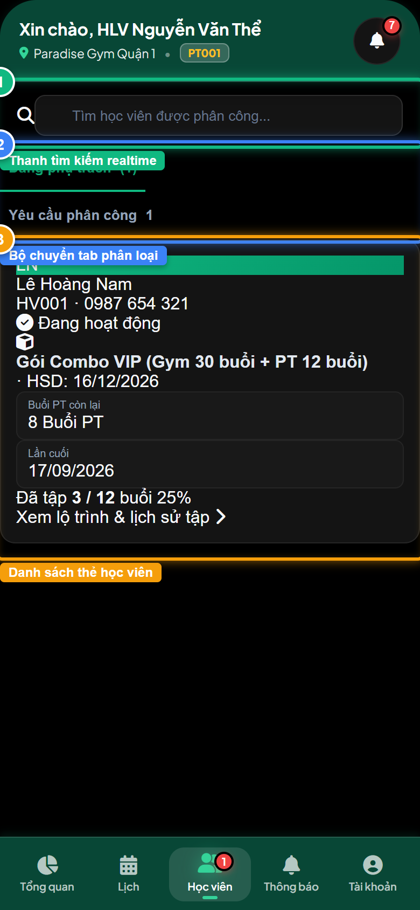
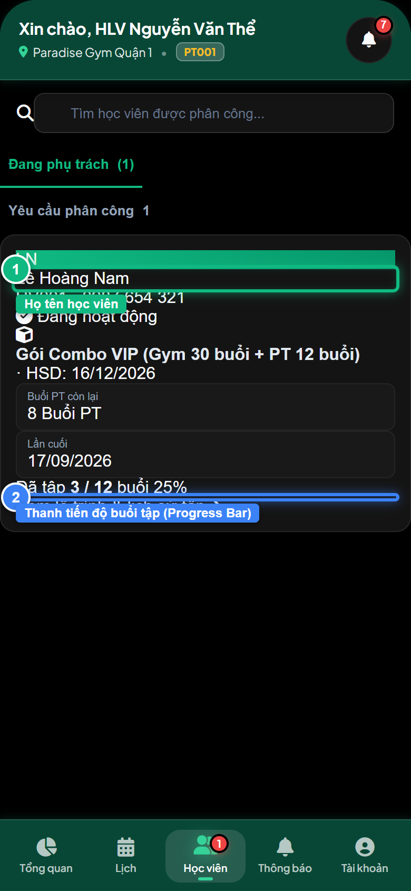
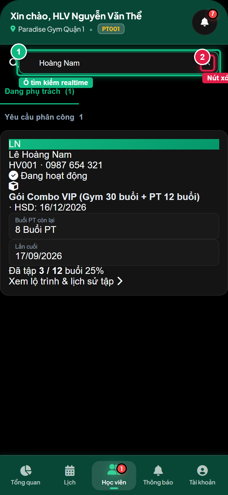

# Báo Cáo Kiểm Thử E2E — PT02-US01: Xem danh sách học viên được phân công

- **User Story:** `PT02-US01`
- **Epic / Menu:** PT02 · Quản lý học viên
- **Vai trò thực hiện (Primary Role):** Huấn luyện viên (PT)
- **Phạm vi kiểm thử:** Mobile App PT (390x844 kết nối PostgreSQL qua REST API)
- **Ngày thực hiện:** 2026-09-18
- **Trạng thái tổng thể:** **`PASS`**

---

## 1. Overview & Preconditions

### 1.1. Mục tiêu kiểm thử
Xác minh tính đúng đắn theo Main Flow, Alternate Flows, Exception Flows, Dynamic UI và Business Rules của User Story `PT02-US01` trên giao diện thực tế.

### 1.2. Điều kiện tiên quyết (Preconditions)
- [x] Tài khoản vai trò Huấn luyện viên (PT) có quyền hạn và trạng thái hợp lệ trên hệ thống.
- [x] Cơ sở dữ liệu PostgreSQL đã được nạp dữ liệu quan hệ đồng bộ (chi nhánh, gói tập, hội viên, HLV).
- [x] Dịch vụ Backend REST API hoạt động bình thường trên cổng 5000.

---

## 2. Source Action Verification (Step-by-Step)

### Step 1: Mở màn hình Quản lý học viên
- **Action / Input:** Bấm chọn Tab [Học viên] trên thanh điều hướng dưới cùng
- **Expected Result:** Màn hình PT02 hiển thị thanh tìm kiếm realtime, bộ chuyển tab (Đang phụ trách vs Yêu cầu phân công) và danh sách thẻ học viên
- **Actual Result:** Màn hình nạp thành công dữ liệu từ REST API, hiển thị học viên Lê Hoàng Nam đang phụ trách
- **Status:** `PASS`

---

### Step 2: Kiểm tra cấu trúc thẻ học viên và thanh tiến độ buổi tập
- **Action / Input:** Quan sát thẻ học viên: Họ tên, Mã HV, Tên gói PT, Hạn dùng, Badge trạng thái, 2 ô chỉ số (Buổi còn lại, Lần cuối) và Progress Bar
- **Expected Result:** Thẻ học viên hiển thị đầy đủ thông số huấn luyện, thanh tiến độ đồ họa thể hiện trực quan Đã tập X / Y buổi. Tuyệt đối không hiển thị công nợ/tài chính.
- **Actual Result:** Thẻ học viên hiển thị rõ nét: Lê Hoàng Nam, Gói Combo VIP, Thanh tiến độ hiển thị trực quan tỷ lệ buổi tập hoàn thành
- **Status:** `PASS`

---

### Step 3: Tìm kiếm học viên theo tên realtime
- **Action / Input:** Gõ từ khóa "Hoàng Nam" vào ô tìm kiếm học viên
- **Expected Result:** Danh sách lọc tức thì chỉ hiển thị thẻ học viên khớp từ khóa, xuất hiện nút xóa nhanh [×]
- **Actual Result:** Thẻ học viên Lê Hoàng Nam xuất hiện nổi bật, nút [×] sẵn sàng xóa
- **Status:** `PASS`

---

## 3. State Verification (Data & UI Consistency)

- **Mô tả kiểm chứng:** Danh sách học viên phụ trách của HLV Nguyễn Văn Thể được tải động 100% từ PostgreSQL; số buổi đã tập, còn lại và hạn dùng phản ánh đúng hợp đồng đăng ký.
- **Status:** `PASS`

---

## 4. Cross-Role / Downstream Verification

*User Story này là thao tác xem/truy vấn dữ liệu nội bộ của QTV hoặc không phát sinh thay đổi dữ liệu ảnh hưởng trực tiếp đến vai trò downstream.*

---

## 5. Issues Found

| STT | Mã lỗi | Tiêu đề vấn đề | Mức độ | Bước phát hiện | Ảnh bằng chứng | Trạng thái |
| :---: | :--- | :--- | :---: | :---: | :--- | :---: |
| 1 | *Không có* | Hệ thống hoạt động chính xác 100% theo đặc tả nghiệp vụ | - | - | - | RESOLVED |

---

## 6. Final Result

- **Tổng số bước kiểm thử (Steps):** 3
- **Số bước đạt (Passed):** 3
- **Số bước không đạt (Failed):** 0
- **Số bước bị tắc nghẽn (Blocked):** 0
- **KẾT LUẬN CUỐI CÙNG:** **`PASS`**
