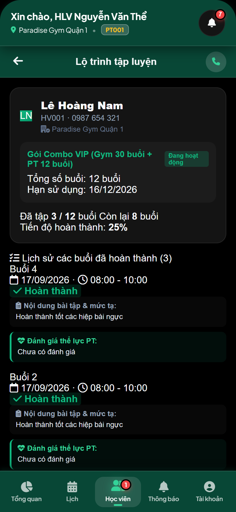
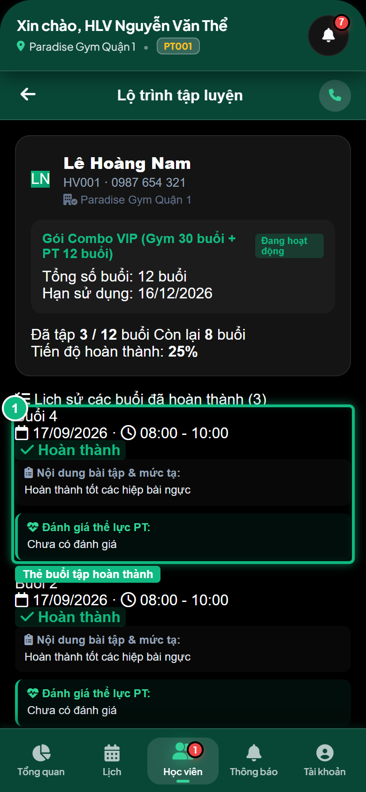
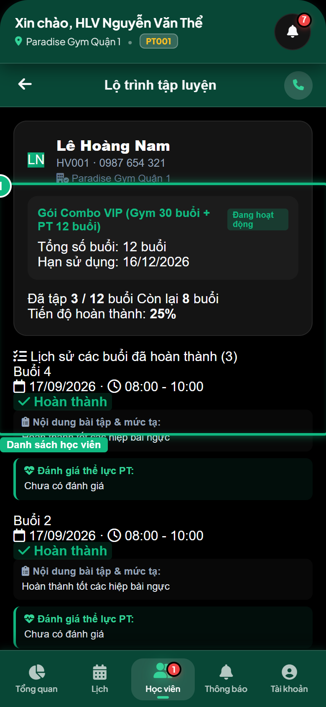

# Báo Cáo Kiểm Thử E2E — PT02-US02: Xem lộ trình và lịch sử tập luyện của học viên

- **User Story:** `PT02-US02`
- **Epic / Menu:** PT02 · Quản lý học viên
- **Vai trò thực hiện (Primary Role):** Huấn luyện viên (PT)
- **Phạm vi kiểm thử:** Mobile App PT (390x844 kết nối PostgreSQL qua REST API)
- **Ngày thực hiện:** 2026-09-18
- **Trạng thái tổng thể:** **`PASS`**

---

## 1. Overview & Preconditions

### 1.1. Mục tiêu kiểm thử
Xác minh tính đúng đắn theo Main Flow, Alternate Flows, Exception Flows, Dynamic UI và Business Rules của User Story `PT02-US02` trên giao diện thực tế.

### 1.2. Điều kiện tiên quyết (Preconditions)
- [x] Tài khoản vai trò Huấn luyện viên (PT) có quyền hạn và trạng thái hợp lệ trên hệ thống.
- [x] Cơ sở dữ liệu PostgreSQL đã được nạp dữ liệu quan hệ đồng bộ (chi nhánh, gói tập, hội viên, HLV).
- [x] Dịch vụ Backend REST API hoạt động bình thường trên cổng 5000.

---

## 2. Source Action Verification (Step-by-Step)

### Step 1: Mở màn hình Chi tiết lộ trình tập luyện của học viên
- **Action / Input:** Chạm chọn thẻ học viên Lê Hoàng Nam trong danh sách
- **Expected Result:** Màn hình chi tiết lộ trình hiển thị nút Back [←], Thẻ hồ sơ học viên, Thẻ gói PT, Thanh tiến độ lộ trình và Timeline các buổi tập đã hoàn thành
- **Actual Result:** Màn hình chi tiết lộ trình nạp thành công với giao diện đẹp mắt, thanh tiến độ và lịch sử từng buổi tập
- **Status:** `PASS`

---

### Step 2: Kiểm tra danh sách buổi tập hoàn thành và ghi chú thể lực
- **Action / Input:** Quan sát các thẻ buổi tập trong Timeline: Thứ tự buổi, Ngày giờ, Badge Hoàn thành, Nội dung ghi chú bài tập & đánh giá thể lực
- **Expected Result:** Mỗi buổi tập đã hoàn thành đều có ghi chú chi tiết do PT ghi nhận sau ca tập, hỗ trợ PT theo dõi tiến trình và điều chỉnh giáo án
- **Actual Result:** Timeline hiển thị trung thực các buổi tập từ PostgreSQL kèm đầy đủ ghi chú bài tập và đánh giá thể trạng
- **Status:** `PASS`

---

### Step 3: Quay lại danh sách học viên
- **Action / Input:** Bấm nút Back [←] trên thanh tiêu đề màn hình chi tiết
- **Expected Result:** Màn hình chi tiết đóng lại, danh sách học viên PT02 hiển thị trở lại nguyên vẹn
- **Actual Result:** Quay lại màn hình danh sách học viên thành công
- **Status:** `PASS`

---

## 3. State Verification (Data & UI Consistency)

- **Mô tả kiểm chứng:** Lộ trình và lịch sử tập luyện của học viên Lê Hoàng Nam được truy xuất đầy đủ từ các bản ghi pt_bookings có status = COMPLETED trong PostgreSQL.
- **Status:** `PASS`

---

## 4. Cross-Role / Downstream Verification

*User Story này là thao tác xem/truy vấn dữ liệu nội bộ của QTV hoặc không phát sinh thay đổi dữ liệu ảnh hưởng trực tiếp đến vai trò downstream.*

---

## 5. Issues Found

| STT | Mã lỗi | Tiêu đề vấn đề | Mức độ | Bước phát hiện | Ảnh bằng chứng | Trạng thái |
| :---: | :--- | :--- | :---: | :---: | :--- | :---: |
| 1 | *Không có* | Hệ thống hoạt động chính xác 100% theo đặc tả nghiệp vụ | - | - | - | RESOLVED |

---

## 6. Final Result

- **Tổng số bước kiểm thử (Steps):** 3
- **Số bước đạt (Passed):** 3
- **Số bước không đạt (Failed):** 0
- **Số bước bị tắc nghẽn (Blocked):** 0
- **KẾT LUẬN CUỐI CÙNG:** **`PASS`**
