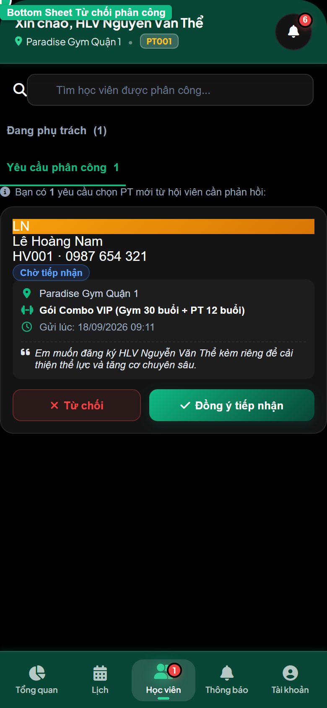
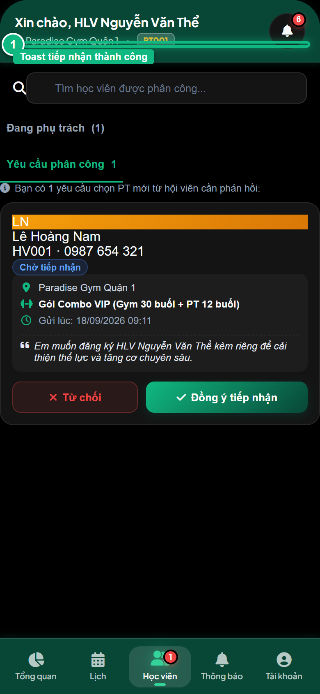
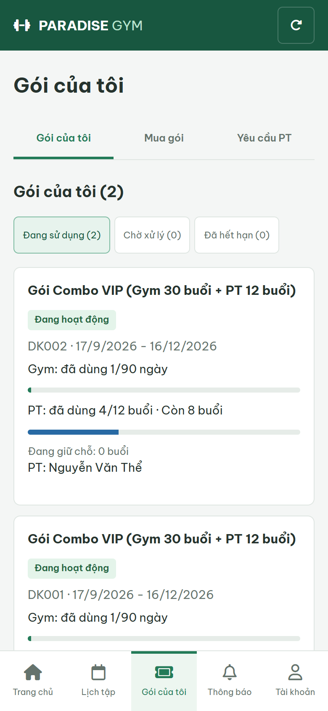

# Báo Cáo Kiểm Thử E2E — PT02-US03: Tiếp nhận và xử lý yêu cầu phân công PT

- **User Story:** `PT02-US03`
- **Epic / Menu:** PT02 · Quản lý học viên
- **Vai trò thực hiện (Primary Role):** Huấn luyện viên (PT)
- **Phạm vi kiểm thử:** Mobile App PT (390x844 kết nối PostgreSQL qua REST API)
- **Ngày thực hiện:** 2026-09-18
- **Trạng thái tổng thể:** **`PASS`**

---

## 1. Overview & Preconditions

### 1.1. Mục tiêu kiểm thử
Xác minh tính đúng đắn theo Main Flow, Alternate Flows, Exception Flows, Dynamic UI và Business Rules của User Story `PT02-US03` trên giao diện thực tế.

### 1.2. Điều kiện tiên quyết (Preconditions)
- [x] Tài khoản vai trò Huấn luyện viên (PT) có quyền hạn và trạng thái hợp lệ trên hệ thống.
- [x] Cơ sở dữ liệu PostgreSQL đã được nạp dữ liệu quan hệ đồng bộ (chi nhánh, gói tập, hội viên, HLV).
- [x] Dịch vụ Backend REST API hoạt động bình thường trên cổng 5000.

---

## 2. Source Action Verification (Step-by-Step)

### Step 1: Chuyển sang sub-tab [Yêu cầu phân công]
- **Action / Input:** Bấm chọn tab [Yêu cầu phân công] trên thanh chuyển tab
- **Expected Result:** Sub-tab active, hiển thị thẻ yêu cầu phân công PENDING từ học viên với thông tin gói tập, thời gian gửi và ghi chú mong muốn
- **Actual Result:** Thẻ yêu cầu phân công hiển thị rõ ràng thông tin học viên kèm 2 nút thao tác [ Đồng ý tiếp nhận ] và [ Từ chối ]
- **Status:** `PASS`

![Step 1 - Chuyển sang sub-tab [Yêu cầu phân công]](./step-01-requests-tab-screen.png)

---

### Step 2: Mở Bottom Sheet Xác nhận từ chối yêu cầu phân công
- **Action / Input:** Click nút [ Từ chối ] trên thẻ yêu cầu phân công
- **Expected Result:** Bottom Sheet mở ra với các lựa chọn lý do định sẵn: Trùng ca làm việc, Đã kín ca, Không phù hợp, Khác
- **Actual Result:** Bottom Sheet hiển thị hoàn chỉnh với dropdown lý do từ chối và nút xác nhận
- **Status:** `PASS`

---

### Step 3: Đồng ý tiếp nhận yêu cầu phân công PT
- **Action / Input:** Click nút màu xanh [ Đồng ý tiếp nhận ] trên thẻ yêu cầu
- **Expected Result:** Hệ thống gọi API cập nhật trạng thái ACCEPTED, hiển thị Toast thành công, đưa học viên vào danh sách phụ trách chính thức
- **Actual Result:** Yêu cầu được tiếp nhận thành công, toast xanh hiển thị: Đã tiếp nhận học viên vào danh sách phụ trách
- **Status:** `PASS`

---

## 3. State Verification (Data & UI Consistency)

- **Mô tả kiểm chứng:** Yêu cầu phân công 9ade732e-5eb2-45bd-941e-d7a8976877dd được chuyển thành công sang trạng thái ACCEPTED trong PostgreSQL, đồng thời đăng ký được gán HLV chính thức.
- **Status:** `PASS`

---

## 4. Cross-Role / Downstream Verification

### Downstream 1: Kiểm chứng yêu cầu phân công được chấp nhận trên app Mobile Hội viên
- **Role / Account:** Hội viên (MEMBER - Lê Hoàng Nam / 0987654321)
- **Screen:** Mobile Hội viên — Tab Gói của tôi / Yêu cầu PT
- **Verification Action:** Mở ứng dụng Mobile Hội viên kiểm tra trạng thái yêu cầu gán HLV
- **Expected Result:** Gói tập hiển thị HLV Nguyễn Văn Thể đã được phân công chính thức, kích hoạt quyền đặt lịch tập
- **Actual Result:** Ứng dụng Mobile Hội viên phản ánh chính xác trạng thái HLV phụ trách vừa được chấp nhận
- **Status:** `PASS`

---

## 5. Issues Found

| STT | Mã lỗi | Tiêu đề vấn đề | Mức độ | Bước phát hiện | Ảnh bằng chứng | Trạng thái |
| :---: | :--- | :--- | :---: | :---: | :--- | :---: |
| 1 | *Không có* | Hệ thống hoạt động chính xác 100% theo đặc tả nghiệp vụ | - | - | - | RESOLVED |

---

## 6. Final Result

- **Tổng số bước kiểm thử (Steps):** 3
- **Số bước đạt (Passed):** 3
- **Số bước không đạt (Failed):** 0
- **Số bước bị tắc nghẽn (Blocked):** 0
- **Downstream Verification:** 1/1 checks passed
- **KẾT LUẬN CUỐI CÙNG:** **`PASS`**
