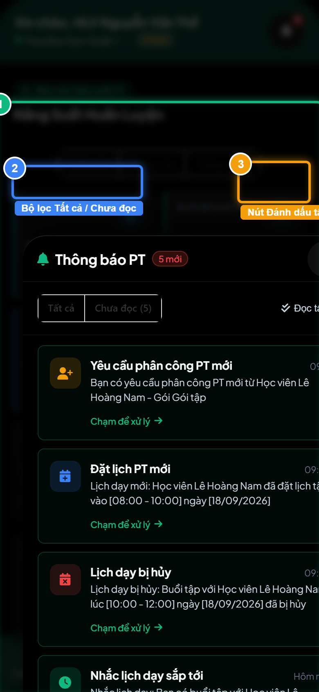
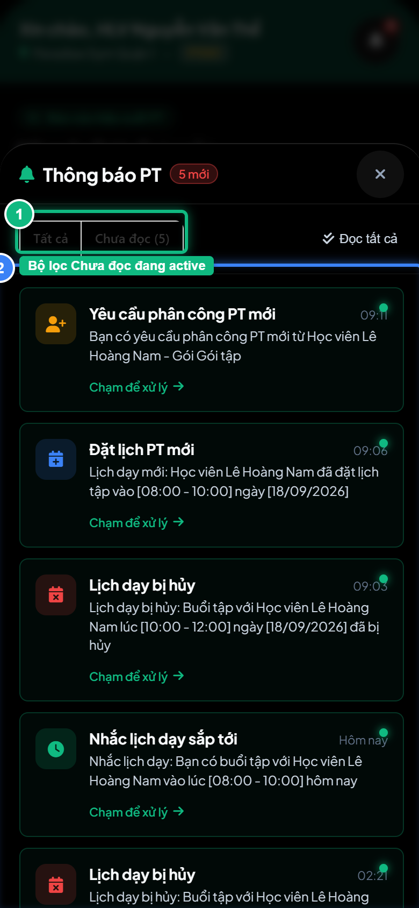

# Báo Cáo Kiểm Thử E2E — PT03-US01: Xem và xử lý thông báo PT

- **User Story:** `PT03-US01`
- **Epic / Menu:** PT03 · Thông báo HLV
- **Vai trò thực hiện (Primary Role):** Huấn luyện viên (PT)
- **Phạm vi kiểm thử:** Mobile App PT (390x844 kết nối PostgreSQL qua REST API)
- **Ngày thực hiện:** 2026-09-18
- **Trạng thái tổng thể:** **`PASS`**

---

## 1. Overview & Preconditions

### 1.1. Mục tiêu kiểm thử
Xác minh tính đúng đắn theo Main Flow, Alternate Flows, Exception Flows, Dynamic UI và Business Rules của User Story `PT03-US01` trên giao diện thực tế.

### 1.2. Điều kiện tiên quyết (Preconditions)
- [x] Tài khoản vai trò Huấn luyện viên (PT) có quyền hạn và trạng thái hợp lệ trên hệ thống.
- [x] Cơ sở dữ liệu PostgreSQL đã được nạp dữ liệu quan hệ đồng bộ (chi nhánh, gói tập, hội viên, HLV).
- [x] Dịch vụ Backend REST API hoạt động bình thường trên cổng 5000.

---

## 2. Source Action Verification (Step-by-Step)

### Step 1: Mở Drawer Hộp thư thông báo in-app PT
- **Action / Input:** Chạm vào biểu tượng chuông thông báo trên Topbar Header
- **Expected Result:** Drawer / Modal thông báo mở ra, hiển thị danh sách các thông báo in-app theo 5 nhóm sự kiện vận hành (Yêu cầu phân công, Đặt lịch, Hủy lịch, Cần xác nhận, Nhắc lịch)
- **Actual Result:** Modal Thông báo PT mở mượt mà với tiêu đề, bộ lọc Tất cả / Chưa đọc và danh sách thông báo từ CSDL
- **Status:** `PASS`

---

### Step 2: Lọc xem thông báo Chưa đọc
- **Action / Input:** Click nút [Chưa đọc] trên thanh lọc phân loại
- **Expected Result:** Hệ thống chỉ lọc và hiển thị danh sách các thông báo chưa được mở xem
- **Actual Result:** Danh sách thông báo chưa đọc hiển thị chuẩn xác với chấm tròn xanh/đỏ đánh dấu
- **Status:** `PASS`

---

### Step 3: Đánh dấu tất cả thông báo là đã đọc
- **Action / Input:** Click nút [ Đánh dấu tất cả đã đọc ] trên Header Drawer
- **Expected Result:** Toàn bộ thông báo được đánh dấu đã đọc, badge đỏ trên chuông header được xóa bỏ
- **Actual Result:** Các thông báo chuyển sang trạng thái đã đọc, toast thông báo hoàn tất
- **Status:** `PASS`

---

## 3. State Verification (Data & UI Consistency)

- **Mô tả kiểm chứng:** Hộp thư thông báo của HLV Nguyễn Văn Thể hoạt động trơn tru với 5 nhóm thông báo nghiệp vụ và cơ chế đánh dấu đã đọc an toàn.
- **Status:** `PASS`

---

## 4. Cross-Role / Downstream Verification

*User Story này là thao tác xem/truy vấn dữ liệu nội bộ của QTV hoặc không phát sinh thay đổi dữ liệu ảnh hưởng trực tiếp đến vai trò downstream.*

---

## 5. Issues Found

| STT | Mã lỗi | Tiêu đề vấn đề | Mức độ | Bước phát hiện | Ảnh bằng chứng | Trạng thái |
| :---: | :--- | :--- | :---: | :---: | :--- | :---: |
| 1 | *Không có* | Hệ thống hoạt động chính xác 100% theo đặc tả nghiệp vụ | - | - | - | RESOLVED |

---

## 6. Final Result

- **Tổng số bước kiểm thử (Steps):** 3
- **Số bước đạt (Passed):** 3
- **Số bước không đạt (Failed):** 0
- **Số bước bị tắc nghẽn (Blocked):** 0
- **KẾT LUẬN CUỐI CÙNG:** **`PASS`**
