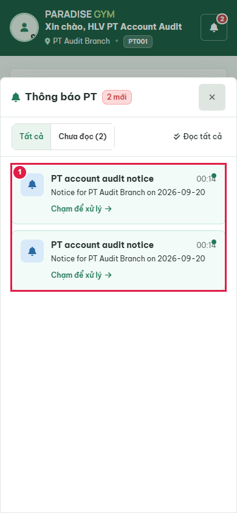
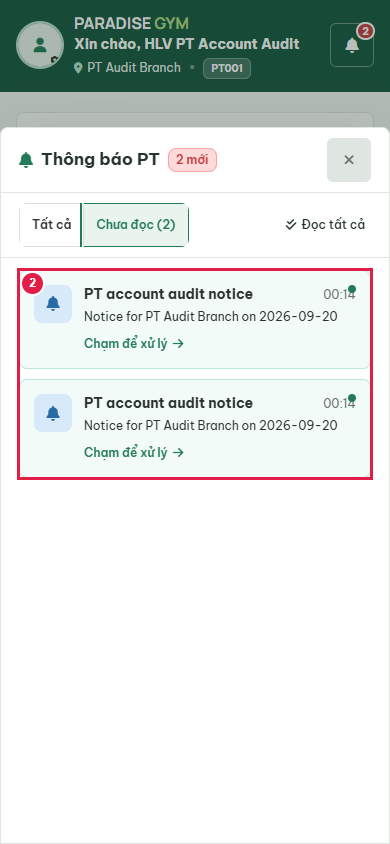
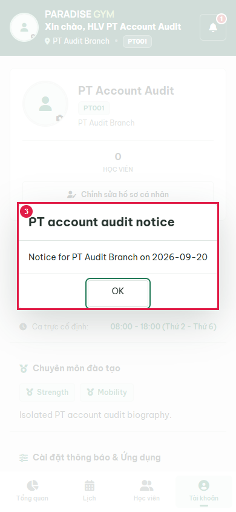
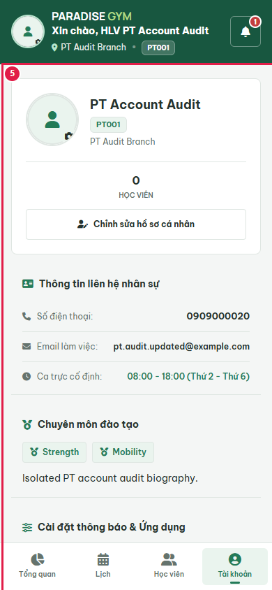
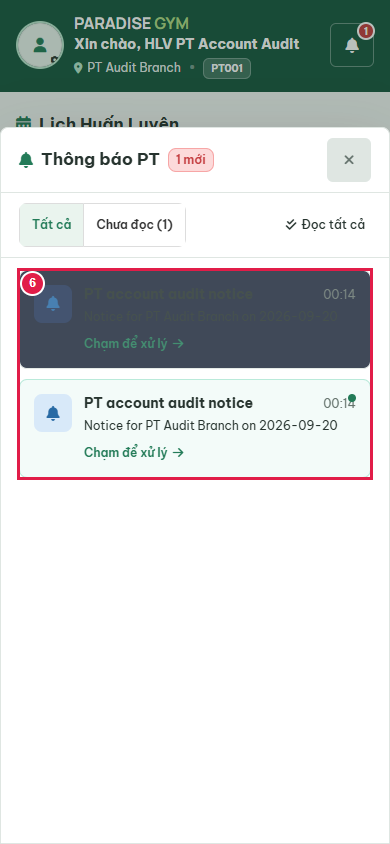

# PT03-US01 Account Business UI Audit

Date: 2026-09-20T17:16:23.244Z. Result: **FAIL** (scoped checks only).

Source: PT03-Thông báo\PT03-US01-Xem và xử lý thông báo PT.md; user-requested two-device/password regression contract.
Real Chrome 390x844, Web 1440x1000; http://localhost:3000/mobile/pt/. Database: paradise_test_21800_1789924490086. Production server code with Playwright route.continue to http://127.0.0.1:63421; no mocked responses, no writes to configured application database. Fixture notifications created through real template/send API. Profile subject: PT Account Audit / 0909000020.

## Source Action Verification

### Step 1

- Action/Input: Open notification inbox
- Expected Result: PT03-US01 list contains only persisted notifications for current account
- Actual Result: PT account audit notice
00:14
Notice for PT Audit Branch on 2026-09-20
Chạm để xử lý
PT account audit notice
00:14
Notice for PT Audit Branch on 2026-09-20
Chạm để xử lý
- Status: **PASS**

### Step 2

- Action/Input: Choose unread filter
- Expected Result: PT03-US01 AF-01: two unread server records
- Actual Result: Two unread notification rows visible
- Status: **PASS**

### Step 3

- Action/Input: Open first persisted notification
- Expected Result: PT03-US01 AF-05: real read acknowledgement then visible title/body content dialog
- Actual Result: PT account audit notice
Notice for PT Audit Branch on 2026-09-20
OK
- Status: **PASS**

### Step 4

- Action/Input: Inspect facility notification content fields
- Expected Result: PT03-US01 content dialog field table: sent timestamp from created_at is displayed
- Actual Result: No sent time in visible dialog. Actual DOM: PT account audit notice
Notice for PT Audit Branch on 2026-09-20
OK
- Status: **FAIL**

### Step 5

- Action/Input: Close facility notice content
- Expected Result: PT03-US01 content dialog specification: closing returns to notification list
- Actual Result: Dialog closed, but notification list is hidden; profile is displayed instead of the specified return to list.
- Status: **FAIL**

### Step 6

- Action/Input: Reload and reopen inbox
- Expected Result: Read state survives reload through API
- Actual Result: One read and one unread server notification
- Status: **PASS**

## State Verification

Persisted read_at for f507a39a-0938-49d6-b0b4-4e81cd3eb0b9: 2026-09-20T17:15:31.396Z

Cleanup verified: {"databaseDropped":true,"serverClosed":true,"browserClosed":true,"errors":[],"ownedUiServerClosed":true,"avatarDirectoryRemoved":true}

## Cross-Role / Downstream Verification

### Step 1

- Action/Input: Other roles
- Expected Result: Read state is private to this PT
- Actual Result: N/A: read acknowledgement changes only the current account notification.
- Status: **N/A**

## Issues Found

notification-sent-time: No sent time in visible dialog. Actual DOM: PT account audit notice
Notice for PT Audit Branch on 2026-09-20
OK

close-notification-content: Dialog closed, but notification list is hidden; profile is displayed instead of the specified return to list.

## Final Result

**FAIL**. 6 source steps, 0 downstream screenshots. Not full US certification: all operational notification event types, PT05 activation and login/2FA UI flows are outside this requested audit. Source files were not edited.

Avatar scope: real local storage upload only; no external cloud uploads. Cloud deployment/provider delivery remains unverified. OTP activation and password login used for fixture setup do not certify PT05 UI flows.
