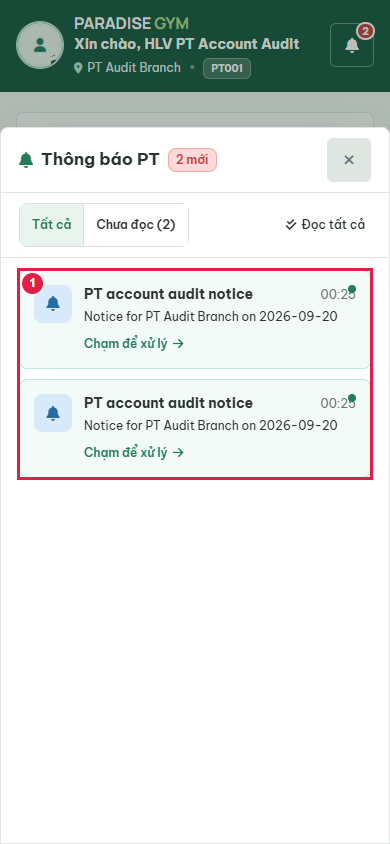
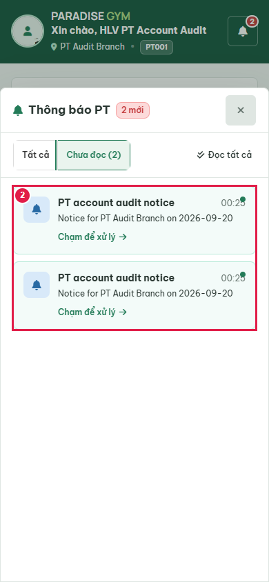
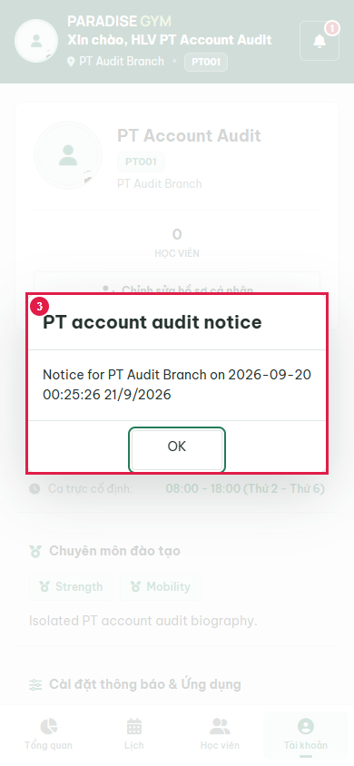
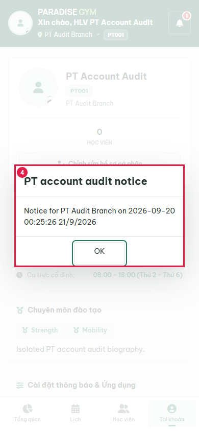
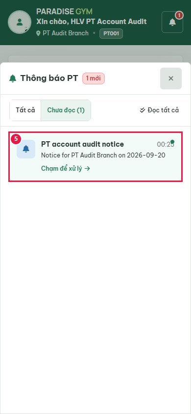
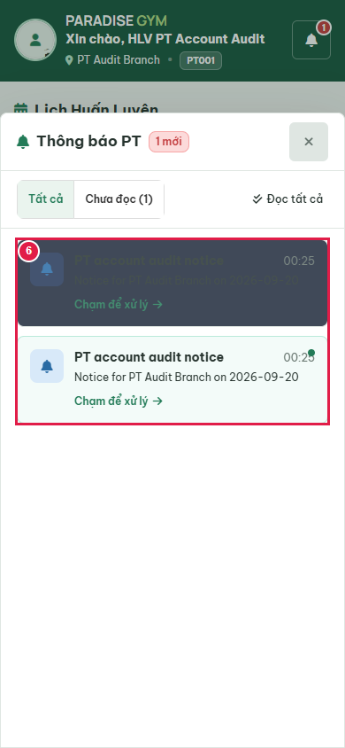
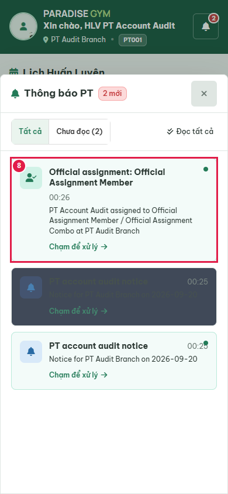
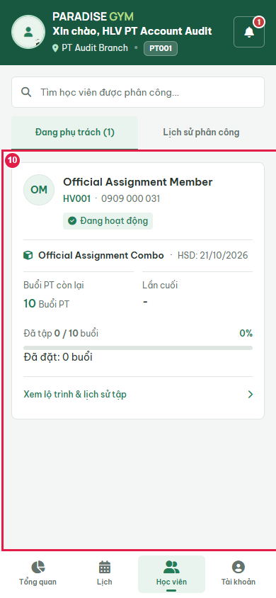
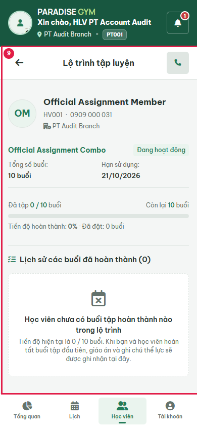

# PT03-US01 Account Business UI Audit

Date: 2026-09-20T17:27:05.646Z. Result: **PASS** (scoped checks only).

Source: PT03-Thông báo\PT03-US01-Xem và xử lý thông báo PT.md; user-requested two-device/password regression contract.
Real Chrome 390x844, Web 1440x1000; http://localhost:3000/mobile/pt/. Database: paradise_test_34212_1789925124977. Production server code with Playwright route.continue to http://127.0.0.1:55398; no mocked responses, no writes to configured application database. Fixture notifications created through real template/send API. Profile subject: PT Account Audit / 0909000020.

## Source Action Verification

### Step 1

- Action/Input: Open notification inbox
- Expected Result: PT03-US01 list contains only persisted notifications for current account
- Actual Result: PT account audit notice
00:25
Notice for PT Audit Branch on 2026-09-20
Chạm để xử lý
PT account audit notice
00:25
Notice for PT Audit Branch on 2026-09-20
Chạm để xử lý
- Status: **PASS**

### Step 2

- Action/Input: Choose unread filter
- Expected Result: PT03-US01 AF-01: two unread server records
- Actual Result: Two unread notification rows visible
- Status: **PASS**

### Step 3

- Action/Input: Open first persisted notification
- Expected Result: PT03-US01 AF-05: real read acknowledgement then visible title/body content dialog
- Actual Result: PT account audit notice
Notice for PT Audit Branch on 2026-09-20

00:25:26 21/9/2026

OK
- Status: **PASS**

### Step 4

- Action/Input: Inspect facility notification content fields
- Expected Result: PT03-US01 content dialog field table: sent timestamp from created_at is displayed
- Actual Result: PT account audit notice
Notice for PT Audit Branch on 2026-09-20

00:25:26 21/9/2026

OK
- Status: **PASS**

### Step 5

- Action/Input: Close facility notice content
- Expected Result: PT03-US01: return to inbox with unread filter retained
- Actual Result: Notification list visible; unread filter retained; only the remaining unread notification shown
- Status: **PASS**

### Step 6

- Action/Input: Reload and reopen inbox
- Expected Result: Read state survives reload through API
- Actual Result: One read and one unread server notification
- Status: **PASS**

### Step 7

- Action/Input: Open inbox containing real official-assignment event
- Expected Result: PT03-US01: own PT sees persisted assignment notification
- Actual Result: Visible notification a8b30db7-9a80-42c5-8322-602cb767b3e7, registration 03fe9107-7d65-4413-86e8-8eb8119a4516, member Official Assignment Member
- Status: **PASS**

### Step 8

- Action/Input: Return from client detail
- Expected Result: Same member remains in current PT assigned-client list
- Actual Result: OM
Official Assignment Member
HV001
·
0909 000 031
Đang hoạt động
Official Assignment Combo
·
HSD: 21/10/2026
Buổi PT còn lại
10 Buổi PT
Lần cuối
-
Đã tập 0 / 10 buổi
0%
Đã đặt: 0 buổi
Xem lộ trình & lịch sử tập
- Status: **PASS**

## State Verification

Persisted read_at for 66b2d7e8-6073-43ae-9b43-75388026371b: 2026-09-20T17:26:11.673Z

Official assignment fixture created via real member/package/registration/payment/assign-pt APIs. PT=82348a7f-1d93-4a39-8489-31aa4d74e5e5; member=a3980877-c334-4c19-a780-67ca65cb10d3; registration=03fe9107-7d65-4413-86e8-8eb8119a4516; notification=a8b30db7-9a80-42c5-8322-602cb767b3e7; event=PT_REQUEST_ACCEPTED; reference=REGISTRATION. No notification row fabricated.

Cleanup verified: {"databaseDropped":true,"serverClosed":true,"browserClosed":true,"errors":[],"ownedUiServerClosed":true,"avatarDirectoryRemoved":true}

## Cross-Role / Downstream Verification

### Step 1

- Action/Input: Other roles
- Expected Result: Read state is private to this PT
- Actual Result: N/A: read acknowledgement changes only the current account notification.
- Status: **N/A**

### Step 2

- Action/Input: Click official REGISTRATION / PT_REQUEST_ACCEPTED notification
- Expected Result: PT03-US01 Main Flow 5: open same assigned client detail, not retired request history
- Actual Result: Actual client detail: Lộ trình tập luyện
OM
Official Assignment Member
HV001
·
0909 000 031
 PT Audit Branch
Official Assignment Combo
Đang hoạt động
Tổng số buổi:
10 buổi
Hạn sử dụng:
21/10/2026
Đã tập 0 / 10 buổi
Còn lại 10 buổi
Tiến độ hoàn thành: 0% · Đã đặt: 0 buổi
Lịch sử các buổi đã hoàn thành (0)
Học viên chưa có buổi tập hoàn thành nào trong lộ trình
Tiến độ hiện tại là 0 / 10 buổi. Khi bạn và học viên hoàn tất buổi tập đầu tiên, giáo án và ghi chú thể lực sẽ được ghi nhận tại đây.; real notification read persisted; same member/registration; assignment and counters unchanged
- Status: **PASS**

## Issues Found

No failures in executed scope.

## Final Result

**PASS**. 8 source steps, 1 downstream screenshots. Not full US certification: all operational notification event types, PT05 activation and login/2FA UI flows are outside this requested audit. Source files were not edited.

Avatar scope: real local storage upload only; no external cloud uploads. Cloud deployment/provider delivery remains unverified. OTP activation and password login used for fixture setup do not certify PT05 UI flows.
