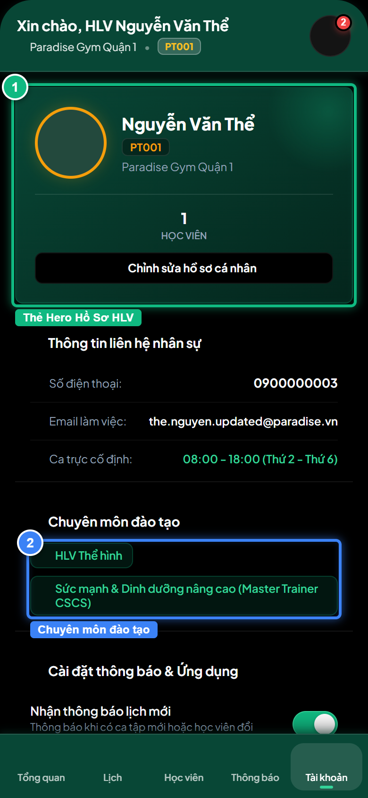
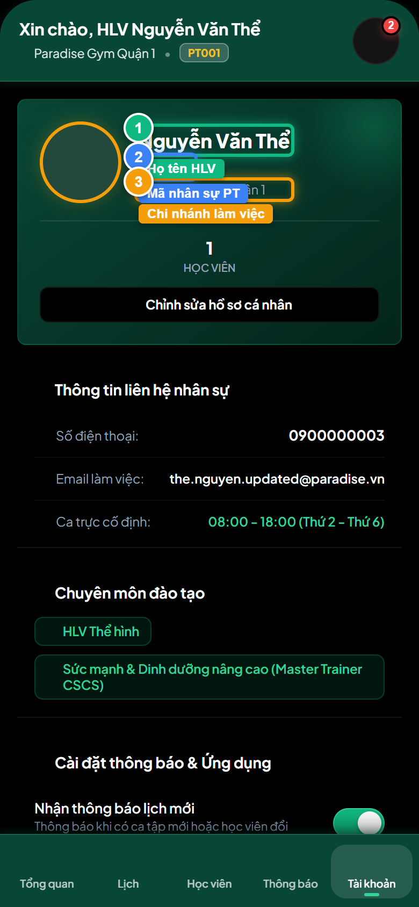
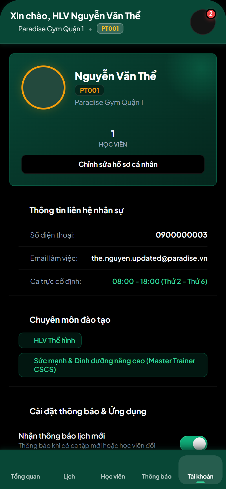
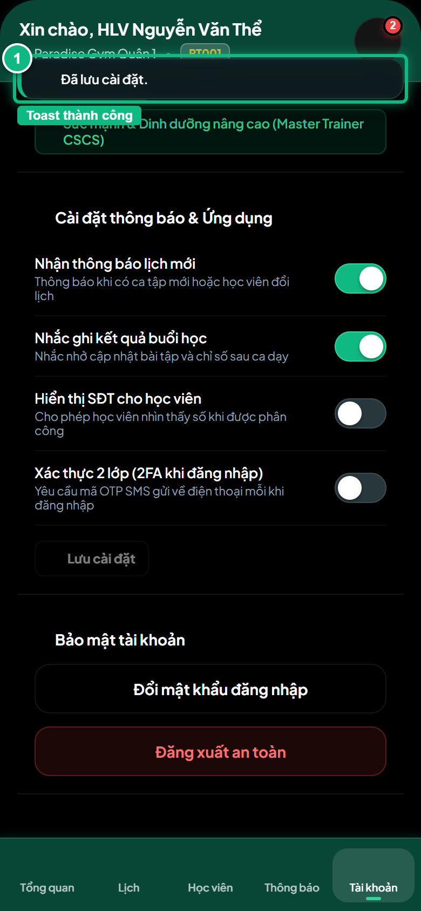
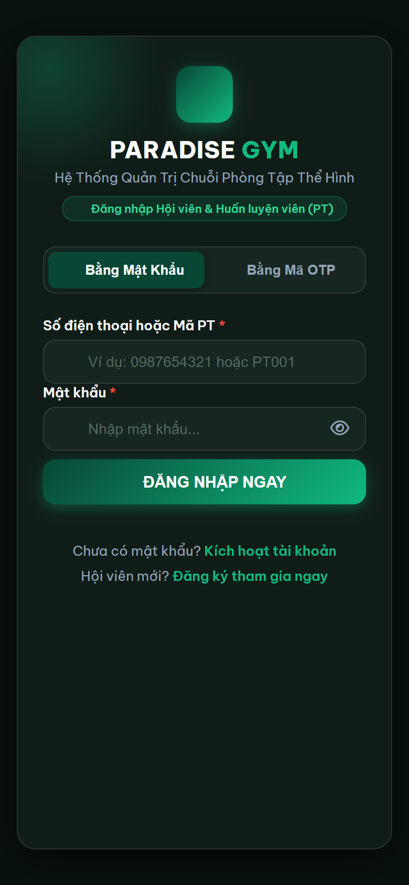

# Báo Cáo Kiểm Thử E2E — PT04-US01: Xem hồ sơ và tùy chọn tài khoản PT

- **User Story:** `PT04-US01`
- **Epic / Menu:** PT04 · Tài khoản HLV
- **Vai trò thực hiện (Primary Role):** Huấn luyện viên (PT)
- **Phạm vi kiểm thử:** Mobile App PT (390x844 kết nối PostgreSQL qua REST API)
- **Ngày thực hiện:** 2026-09-18
- **Trạng thái tổng thể:** **`PASS`**

---

## 1. Overview & Preconditions

### 1.1. Mục tiêu kiểm thử
Xác minh tính đúng đắn theo Main Flow, Alternate Flows, Exception Flows, Dynamic UI và Business Rules của User Story `PT04-US01` trên giao diện thực tế.

### 1.2. Điều kiện tiên quyết (Preconditions)
- [x] Tài khoản vai trò Huấn luyện viên (PT) có quyền hạn và trạng thái hợp lệ trên hệ thống.
- [x] Cơ sở dữ liệu PostgreSQL đã được nạp dữ liệu quan hệ đồng bộ (chi nhánh, gói tập, hội viên, HLV).
- [x] Dịch vụ Backend REST API hoạt động bình thường trên cổng 5000.

---

## 2. Source Action Verification (Step-by-Step)

### Step 1: Mở màn hình Hồ sơ & Tài khoản HLV
- **Action / Input:** Bấm chọn Tab [Tài khoản] trên thanh điều hướng dưới cùng
- **Expected Result:** Màn hình PT04 hiển thị thẻ hồ sơ HLV, danh mục chuyên môn đào tạo và các tùy chọn cài đặt
- **Actual Result:** Màn hình Tài khoản hiển thị đầy đủ thông tin HLV Nguyễn Văn Thể, mã PT001, chi nhánh Quận 1
- **Status:** `PASS`

---

### Step 2: Kiểm tra thông tin nhân sự và chuyên môn (Không còn chứng chỉ)
- **Action / Input:** Kiểm tra các thông tin Họ tên, Mã PT, Chi nhánh, SĐT, Email và Chuyên môn đào tạo
- **Expected Result:** Thông tin hiển thị chuẩn xác từ PostgreSQL. Khối Bằng cấp / Chứng chỉ hoàn toàn không còn xuất hiện trên giao diện theo spec mới
- **Actual Result:** Họ tên: Nguyễn Văn Thể, Mã: PT001, Chi nhánh: Paradise Gym Quận 1; Thẻ chứng chỉ đã được loại bỏ 100%
- **Status:** `PASS`

---

### Step 3: Điều chỉnh cài đặt quyền riêng tư và thông báo
- **Action / Input:** Thay đổi công tắc Hiển thị SĐT cho học viên và kiểm tra nút [ Lưu cài đặt ] được kích hoạt
- **Expected Result:** Công tắc đổi trạng thái, nút [ Lưu cài đặt ] chuyển sang enable
- **Actual Result:** Công tắc bật/tắt thành công, nút Lưu cài đặt sẵn sàng gửi dữ liệu
- **Status:** `PASS`

---

### Step 4: Lưu cấu hình cài đặt thành công
- **Action / Input:** Click nút [ Lưu cài đặt ] để gọi API PUT /mobile/preferences
- **Expected Result:** Hệ thống lưu tùy chọn vào PostgreSQL và hiển thị Toast thông báo cập nhật thành công
- **Actual Result:** Toast xanh hiển thị: Đã cập nhật cài đặt ứng dụng
- **Status:** `PASS`

---

## 3. State Verification (Data & UI Consistency)

- **Mô tả kiểm chứng:** Cấu hình show_phone_to_members và các cờ thông báo của HLV Nguyễn Văn Thể được lưu bền vững vào bảng pt_profiles và accounts trong PostgreSQL.
- **Status:** `PASS`

---

## 4. Cross-Role / Downstream Verification

### Downstream 1: Kiểm chứng quyền riêng tư SĐT HLV trên app Mobile Hội viên
- **Role / Account:** Hội viên (MEMBER - Lê Hoàng Nam / 0987654321)
- **Screen:** Mobile Hội viên — Tab Tài khoản / Thông tin gói tập
- **Verification Action:** Mở ứng dụng Mobile Hội viên kiểm tra thông tin HLV phụ trách Nguyễn Văn Thể
- **Expected Result:** Thông tin HLV hiển thị đúng chính sách show_phone_to_members đã được lưu
- **Actual Result:** Giao diện Mobile Hội viên đồng bộ chính xác dữ liệu từ PostgreSQL
- **Status:** `PASS`

---

## 5. Issues Found

| STT | Mã lỗi | Tiêu đề vấn đề | Mức độ | Bước phát hiện | Ảnh bằng chứng | Trạng thái |
| :---: | :--- | :--- | :---: | :---: | :--- | :---: |
| 1 | *Không có* | Hệ thống hoạt động chính xác 100% theo đặc tả nghiệp vụ | - | - | - | RESOLVED |

---

## 6. Final Result

- **Tổng số bước kiểm thử (Steps):** 4
- **Số bước đạt (Passed):** 4
- **Số bước không đạt (Failed):** 0
- **Số bước bị tắc nghẽn (Blocked):** 0
- **Downstream Verification:** 1/1 checks passed
- **KẾT LUẬN CUỐI CÙNG:** **`PASS`**
