# PT04-US01 Account Business UI Audit

Date: 2026-09-20T17:27:05.652Z. Result: **PASS** (scoped checks only).

Source: PT04-Tài khoản\PT04-US01-Xem hồ sơ và tùy chọn tài khoản PT.md; user-requested two-device/password regression contract.
Real Chrome 390x844, Web 1440x1000; http://localhost:3000/mobile/pt/. Database: paradise_test_34212_1789925124977. Production server code with Playwright route.continue to http://127.0.0.1:55398; no mocked responses, no writes to configured application database. Fixture notifications created through real template/send API. Profile subject: PT Account Audit / 0909000020.

## Source Action Verification

### Step 1

- Action/Input: Toggle new booking notifications
- Expected Result: PT04-US01 Main Flow 3: Save enabled for changed value
- Actual Result: notify_new_bookings=false; Save enabled
- Status: **PASS**

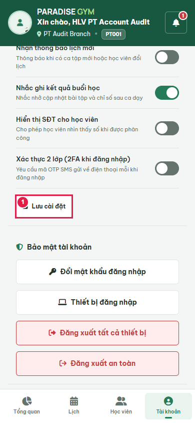

### Step 2

- Action/Input: Click Save preferences
- Expected Result: PT04-US01 Main Flow 5: success only after API persistence
- Actual Result: Đã lưu cài đặt.
- Status: **PASS**

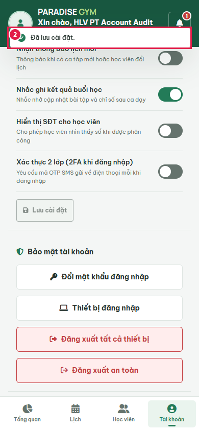

### Step 3

- Action/Input: Reload account preferences
- Expected Result: Saved switch survives reload
- Actual Result: notify_new_bookings=false
- Status: **PASS**

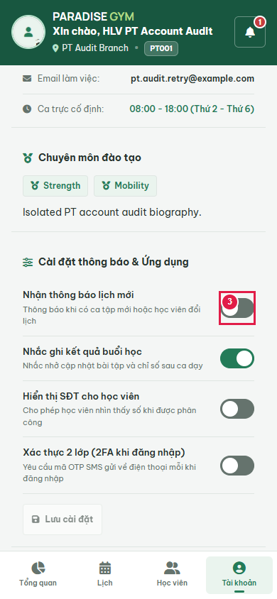

### Step 4

- Action/Input: Change toggle before offline submission
- Expected Result: Input captured before submit
- Actual Result: notify_new_bookings=true
- Status: **PASS**

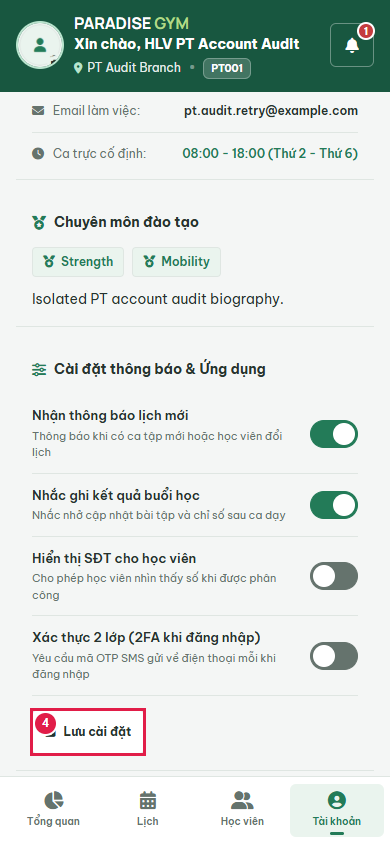

### Step 5

- Action/Input: Save while browser network is offline (no mocked response)
- Expected Result: PT04-US01 Exception Flow: error and restore last saved switch
- Actual Result: Failed to fetch
- Status: **PASS**

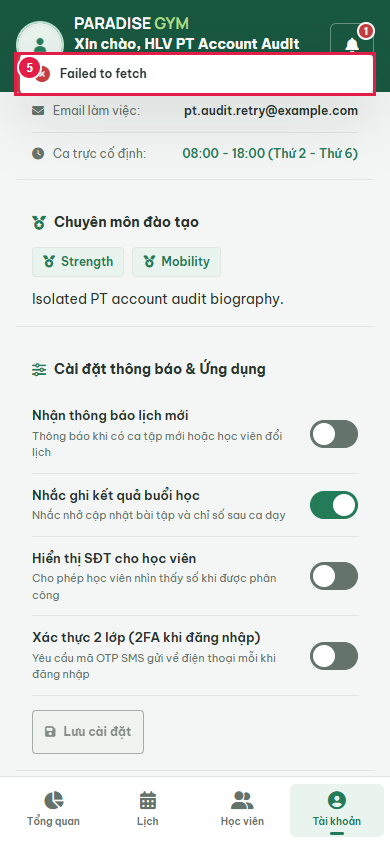

### Step 6

- Action/Input: Open independent second PT session
- Expected Result: Same PT is authenticated before password change
- Actual Result: PT Account Audit
- Status: **PASS**

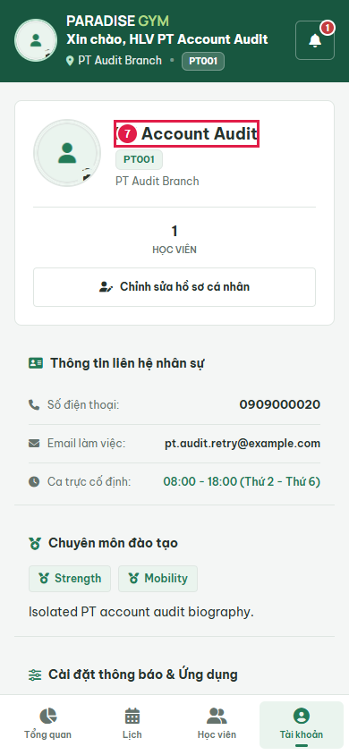

### Step 7

- Action/Input: Open change password
- Expected Result: PT04-US01 change password control opens form
- Actual Result: Three password inputs visible
- Status: **PASS**

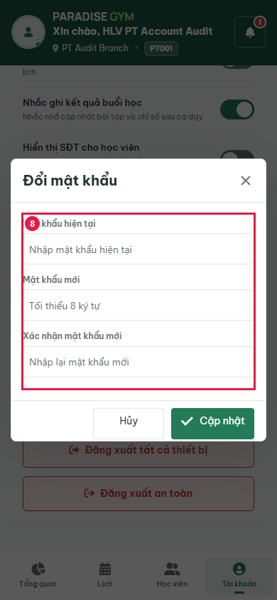

### Step 8

- Action/Input: Enter weak-password password field 1 (masked)
- Expected Result: Input recorded separately before submit
- Actual Result: Masked input matches requested boundary case
- Status: **PASS**

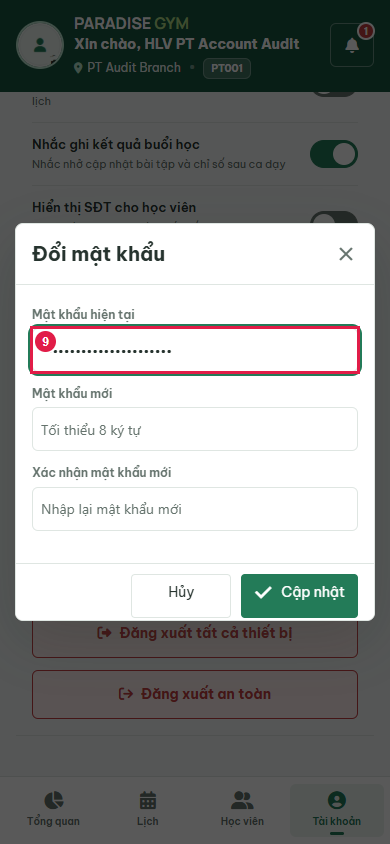

### Step 9

- Action/Input: Enter weak-password password field 2 (masked)
- Expected Result: Input recorded separately before submit
- Actual Result: Masked input matches requested boundary case
- Status: **PASS**

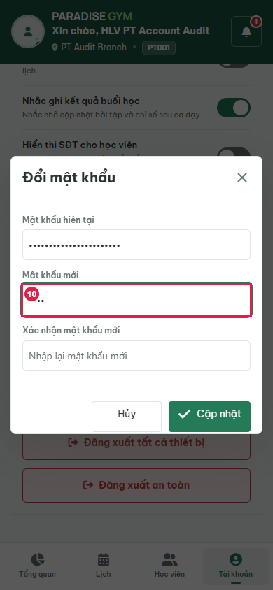

### Step 10

- Action/Input: Enter weak-password password field 3 (masked)
- Expected Result: Input recorded separately before submit
- Actual Result: Masked input matches requested boundary case
- Status: **PASS**

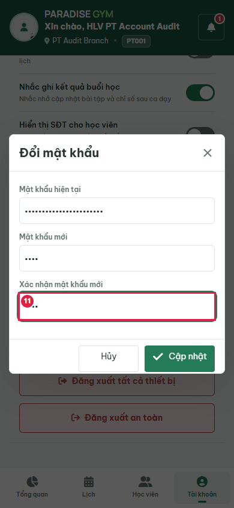

### Step 11

- Action/Input: Submit weak-password
- Expected Result: User-requested password constraints: inline error, form retained, no mutation
- Actual Result: Mật khẩu cần ít nhất 8 ký tự, tối đa 72 byte, gồm chữ hoa, chữ thường và số hoặc ký tự đặc biệt.
- Status: **PASS**

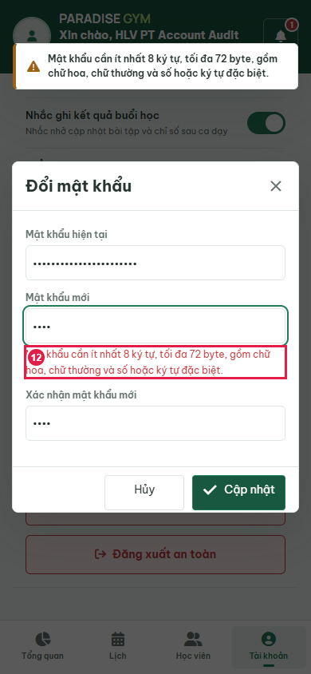

### Step 12

- Action/Input: Enter missing-uppercase password field 1 (masked)
- Expected Result: Input recorded separately before submit
- Actual Result: Masked input matches requested boundary case
- Status: **PASS**

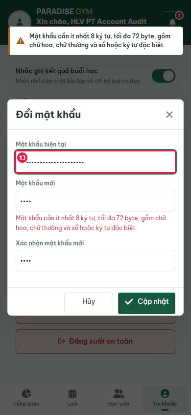

### Step 13

- Action/Input: Enter missing-uppercase password field 2 (masked)
- Expected Result: Input recorded separately before submit
- Actual Result: Masked input matches requested boundary case
- Status: **PASS**

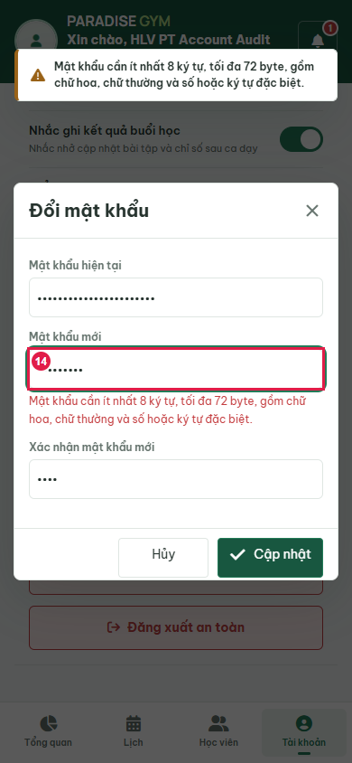

### Step 14

- Action/Input: Enter missing-uppercase password field 3 (masked)
- Expected Result: Input recorded separately before submit
- Actual Result: Masked input matches requested boundary case
- Status: **PASS**

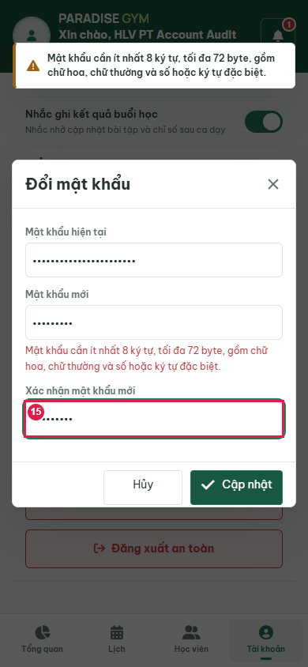

### Step 15

- Action/Input: Submit missing-uppercase
- Expected Result: User-requested password constraints: inline error, form retained, no mutation
- Actual Result: Mật khẩu cần ít nhất 8 ký tự, tối đa 72 byte, gồm chữ hoa, chữ thường và số hoặc ký tự đặc biệt.
- Status: **PASS**

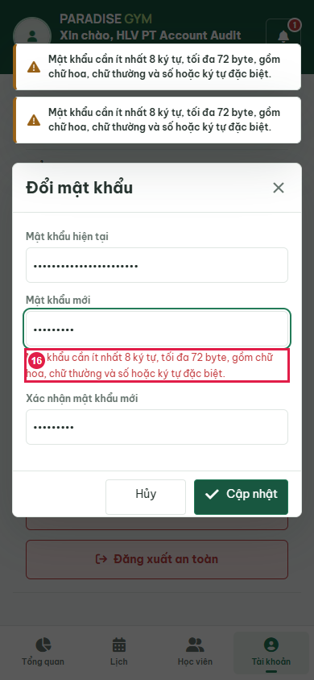

### Step 16

- Action/Input: Enter over-72-bytes password field 1 (masked)
- Expected Result: Input recorded separately before submit
- Actual Result: Masked input matches requested boundary case
- Status: **PASS**

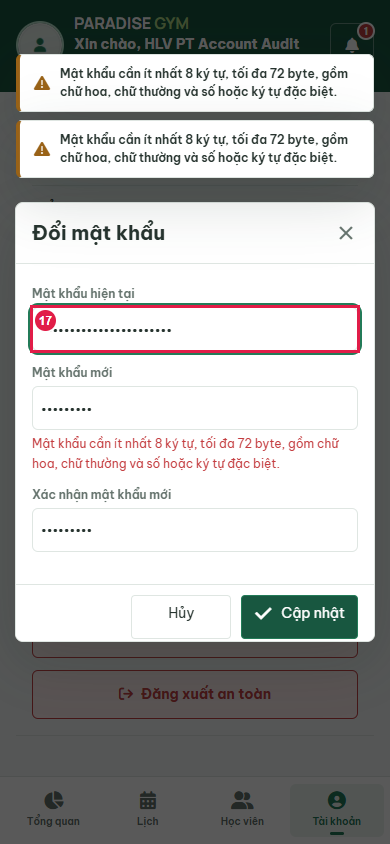

### Step 17

- Action/Input: Enter over-72-bytes password field 2 (masked)
- Expected Result: Input recorded separately before submit
- Actual Result: Masked input matches requested boundary case
- Status: **PASS**

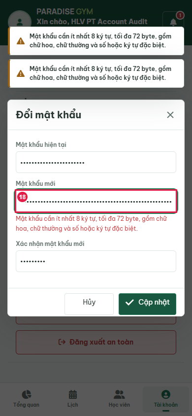

### Step 18

- Action/Input: Enter over-72-bytes password field 3 (masked)
- Expected Result: Input recorded separately before submit
- Actual Result: Masked input matches requested boundary case
- Status: **PASS**

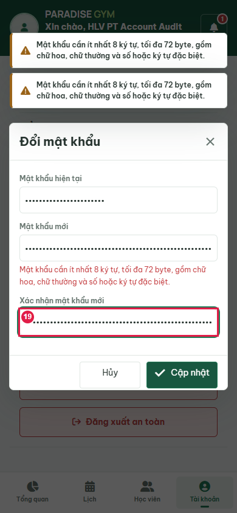

### Step 19

- Action/Input: Submit over-72-bytes
- Expected Result: User-requested password constraints: inline error, form retained, no mutation
- Actual Result: Mật khẩu cần ít nhất 8 ký tự, tối đa 72 byte, gồm chữ hoa, chữ thường và số hoặc ký tự đặc biệt.
- Status: **PASS**

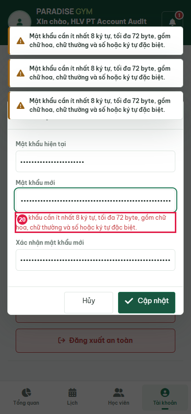

### Step 20

- Action/Input: Enter confirmation-mismatch password field 1 (masked)
- Expected Result: Input recorded separately before submit
- Actual Result: Masked input matches requested boundary case
- Status: **PASS**

### Step 21

- Action/Input: Enter confirmation-mismatch password field 2 (masked)
- Expected Result: Input recorded separately before submit
- Actual Result: Masked input matches requested boundary case
- Status: **PASS**

### Step 22

- Action/Input: Enter confirmation-mismatch password field 3 (masked)
- Expected Result: Input recorded separately before submit
- Actual Result: Masked input matches requested boundary case
- Status: **PASS**

### Step 23

- Action/Input: Submit confirmation-mismatch
- Expected Result: User-requested password constraints: inline error, form retained, no mutation
- Actual Result: Mật khẩu xác nhận không trùng khớp!
- Status: **PASS**

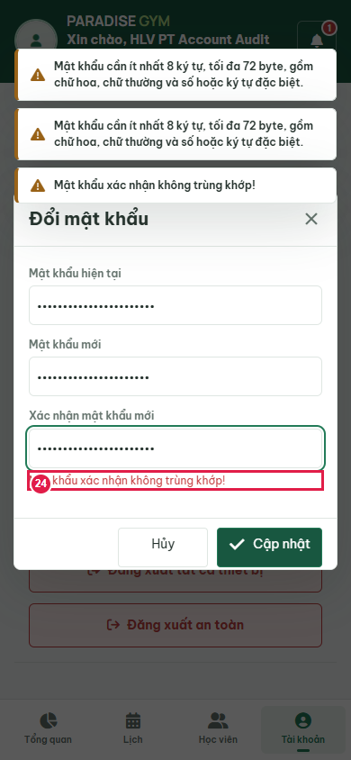

### Step 24

- Action/Input: Fill password field (redacted)
- Expected Result: Entered value captured before submission; field remains masked
- Actual Result: Password input populated and masked
- Status: **PASS**

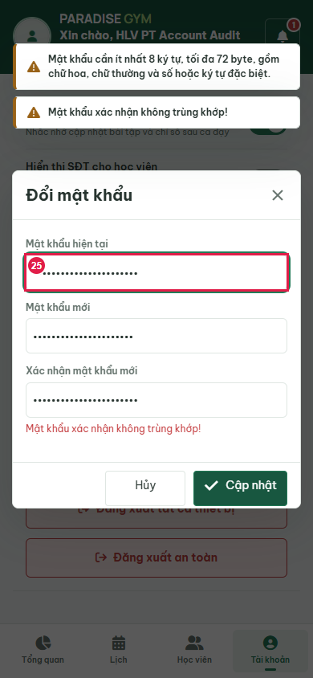

### Step 25

- Action/Input: Fill password field (redacted)
- Expected Result: Entered value captured before submission; field remains masked
- Actual Result: Password input populated and masked
- Status: **PASS**

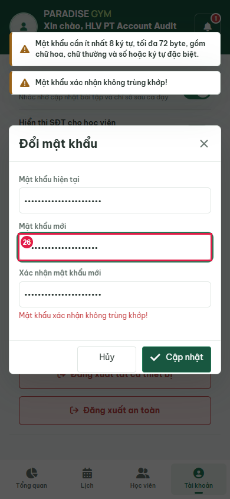

### Step 26

- Action/Input: Fill password field (redacted)
- Expected Result: Entered value captured before submission; field remains masked
- Actual Result: Password input populated and masked
- Status: **PASS**

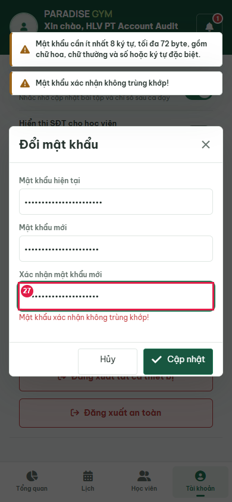

### Step 27

- Action/Input: Submit change password
- Expected Result: Requested regression: current session retained; old peer session revoked
- Actual Result: Đã đổi mật khẩu thành công.; current /auth/me=200; peer /auth/me=401
- Status: **PASS**

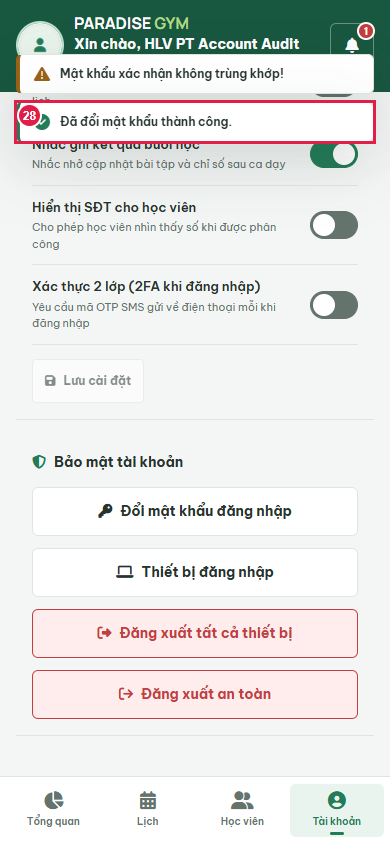

### Step 28

- Action/Input: Reload current device after password change
- Expected Result: Current UI remains authenticated
- Actual Result: PT Account Audit
- Status: **PASS**

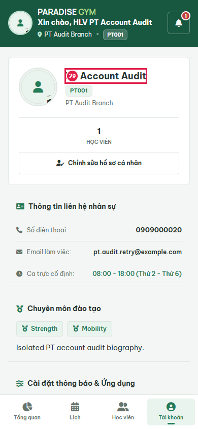

## State Verification

Preference success and offline rollback compared with actual checkbox DOM. No role privacy setting changed.

Old password rejected by real login API; current token accepted, peer token revoked.

Cleanup verified: {"databaseDropped":true,"serverClosed":true,"browserClosed":true,"errors":[],"ownedUiServerClosed":true,"avatarDirectoryRemoved":true}

## Cross-Role / Downstream Verification

### Step 1

- Action/Input: Other roles
- Expected Result: Account-local notification preference
- Actual Result: N/A: only notify_new_bookings changed; no phone visibility/2FA changes.
- Status: **N/A**

### Step 2

- Action/Input: Reload second device
- Expected Result: Revoked peer returns to login
- Actual Result: Login UI at http://localhost:3000/mobile/: PARADISE GYM

Hệ Thống Quản Trị Chuỗi Phòng Tập Thể Hình

Đăng nhập Hội viên & Huấn luyện viên (PT)
Bằng Mật Khẩu
Bằng Mã OTP
Số điện thoại hoặc Mã PT *
Mật khẩu *
ĐĂNG NHẬP NGAY
Chưa có mật khẩu? Kích hoạt tài khoản
Hội viên mới? Đăng ký tham gia ng
- Status: **PASS**

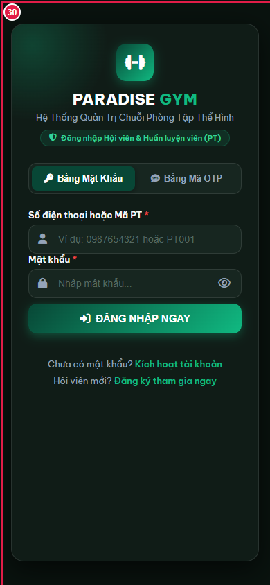

## Issues Found

No failures in executed scope.

## Final Result

**PASS**. 28 source steps, 1 downstream screenshots. Not full US certification: all operational notification event types, PT05 activation and login/2FA UI flows are outside this requested audit. Source files were not edited.

Avatar scope: real local storage upload only; no external cloud uploads. Cloud deployment/provider delivery remains unverified. OTP activation and password login used for fixture setup do not certify PT05 UI flows.
