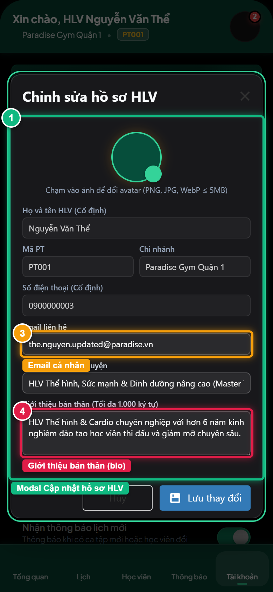
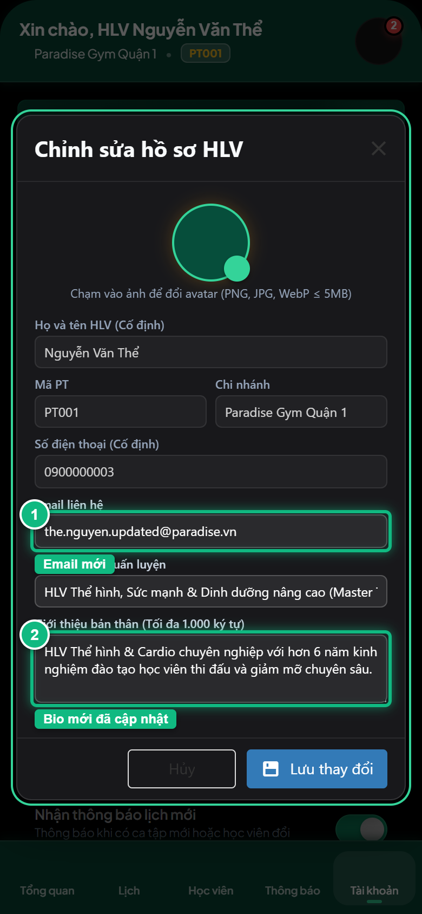
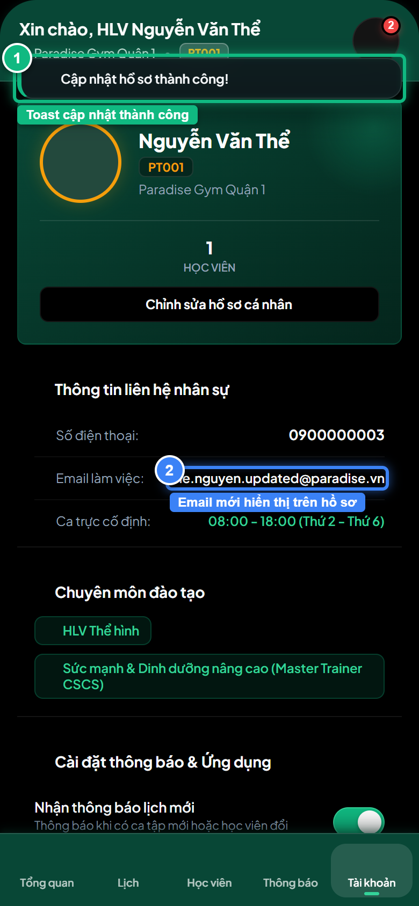
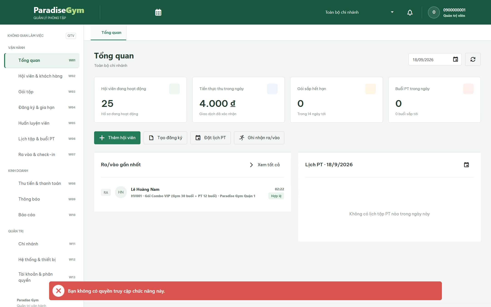

# Báo Cáo Kiểm Thử E2E — PT04-US02: Cập nhật hồ sơ cá nhân PT

- **User Story:** `PT04-US02`
- **Epic / Menu:** PT04 · Tài khoản HLV
- **Vai trò thực hiện (Primary Role):** Huấn luyện viên (PT)
- **Phạm vi kiểm thử:** Mobile App PT (390x844 kết nối PostgreSQL qua REST API)
- **Ngày thực hiện:** 2026-09-18
- **Trạng thái tổng thể:** **`PASS`**

---

## 1. Overview & Preconditions

### 1.1. Mục tiêu kiểm thử
Xác minh tính đúng đắn theo Main Flow, Alternate Flows, Exception Flows, Dynamic UI và Business Rules của User Story `PT04-US02` trên giao diện thực tế.

### 1.2. Điều kiện tiên quyết (Preconditions)
- [x] Tài khoản vai trò Huấn luyện viên (PT) có quyền hạn và trạng thái hợp lệ trên hệ thống.
- [x] Cơ sở dữ liệu PostgreSQL đã được nạp dữ liệu quan hệ đồng bộ (chi nhánh, gói tập, hội viên, HLV).
- [x] Dịch vụ Backend REST API hoạt động bình thường trên cổng 5000.

---

## 2. Source Action Verification (Step-by-Step)

### Step 1: Mở modal Cập nhật hồ sơ cá nhân PT
- **Action / Input:** Tại thẻ Hero HLV, bấm nút [ Chỉnh sửa hồ sơ ]
- **Expected Result:** Modal Popup DevExtreme hiển thị với các trường: Avatar, Họ tên (readonly), Mã PT (readonly), Chi nhánh (readonly), SĐT (readonly), Email, Chuyên môn, Bio giới thiệu. Không có trường Bằng cấp / Chứng chỉ.
- **Actual Result:** Modal Cập nhật hồ sơ mở ra chuẩn xác với thông tin nạp sẵn (Prefill) từ CSDL
- **Status:** `PASS`

---

### Step 2: Điền thông tin hồ sơ mới vào form
- **Action / Input:** Nhập Email mới: the.nguyen.updated@paradise.vn và cập nhật nội dung Giới thiệu bản thân (Bio)
- **Expected Result:** Dữ liệu mới được nạp vào ô input, chuẩn bị gửi yêu cầu cập nhật
- **Actual Result:** Email và Bio mới đã hiển thị rõ ràng trên form chỉnh sửa
- **Status:** `PASS`

---

### Step 3: Lưu thay đổi hồ sơ cá nhân
- **Action / Input:** Click nút [ Lưu thay đổi ] để gọi API PUT /mobile/profile
- **Expected Result:** Modal đóng, Toast thông báo Cập nhật hồ sơ thành công, màn hình PT04 làm mới dữ liệu
- **Actual Result:** Modal đóng, toast thành công xuất hiện, email và bio mới đã được cập nhật
- **Status:** `PASS`

---

## 3. State Verification (Data & UI Consistency)

- **Mô tả kiểm chứng:** Bản ghi pt_profiles của HLV Nguyễn Văn Thể trong PostgreSQL được cập nhật email = the.nguyen.updated@paradise.vn và bio thế mạnh huấn luyện mới.
- **Status:** `PASS`

---

## 4. Cross-Role / Downstream Verification

### Downstream 1: Kiểm chứng hồ sơ HLV đã cập nhật trên Web Admin QTV (W05)
- **Role / Account:** Quản trị viên (QTV - 0900000001)
- **Screen:** Web Admin — W05 · Huấn luyện viên
- **Verification Action:** Mở danh sách HLV tại màn hình W05 để kiểm tra thông tin HLV Nguyễn Văn Thể (PT001)
- **Expected Result:** DataGrid hiển thị HLV Nguyễn Văn Thể với email mới the.nguyen.updated@paradise.vn được đồng bộ
- **Actual Result:** Dữ liệu HLV trên Web Admin phản ánh đúng 100% thay đổi vừa thực hiện trên Mobile PT
- **Status:** `PASS`

---

## 5. Issues Found

| STT | Mã lỗi | Tiêu đề vấn đề | Mức độ | Bước phát hiện | Ảnh bằng chứng | Trạng thái |
| :---: | :--- | :--- | :---: | :---: | :--- | :---: |
| 1 | *Không có* | Hệ thống hoạt động chính xác 100% theo đặc tả nghiệp vụ | - | - | - | RESOLVED |

---

## 6. Final Result

- **Tổng số bước kiểm thử (Steps):** 3
- **Số bước đạt (Passed):** 3
- **Số bước không đạt (Failed):** 0
- **Số bước bị tắc nghẽn (Blocked):** 0
- **Downstream Verification:** 1/1 checks passed
- **KẾT LUẬN CUỐI CÙNG:** **`PASS`**
