# PT04-US02 Account Business UI Audit

Date: 2026-09-20T17:16:23.224Z. Result: **PASS** (scoped checks only).

Source: PT04-Tài khoản\PT04-US02-Cập nhật hồ sơ cá nhân PT.md; user-requested two-device/password regression contract.
Real Chrome 390x844, Web 1440x1000; http://localhost:3000/mobile/pt/. Database: paradise_test_21800_1789924490086. Production server code with Playwright route.continue to http://127.0.0.1:63421; no mocked responses, no writes to configured application database. Fixture notifications created through real template/send API. Profile subject: PT Account Audit / 0909000020.

## Source Action Verification

### Step 1

- Action/Input: Open PT04 account
- Expected Result: Own PT identity from API
- Actual Result: PT Account Audit
- Status: **PASS**

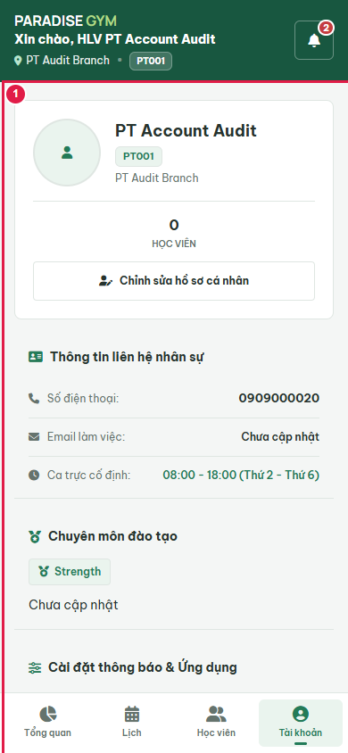

### Step 2

- Action/Input: Click edit profile
- Expected Result: PT04-US02 Main Flow 2: prefilled fields and four immutable personnel fields
- Actual Result: Visible editor; four readonly personnel fields
- Status: **PASS**

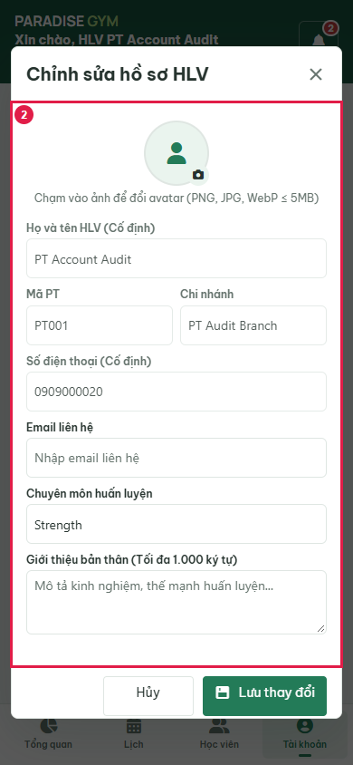

### Step 3

- Action/Input: Enter invalid-email
- Expected Result: Input captured before submit
- Actual Result: invalid-email
- Status: **PASS**

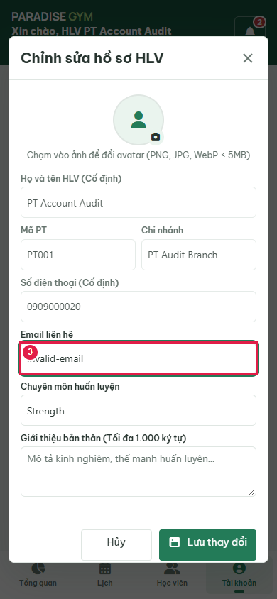

### Step 4

- Action/Input: Submit invalid email
- Expected Result: PT04-US02 EF-02: inline invalid email rejected; editor retained
- Actual Result: Email liên hệ không hợp lệ hoặc vượt quá 150 ký tự.
- Status: **PASS**

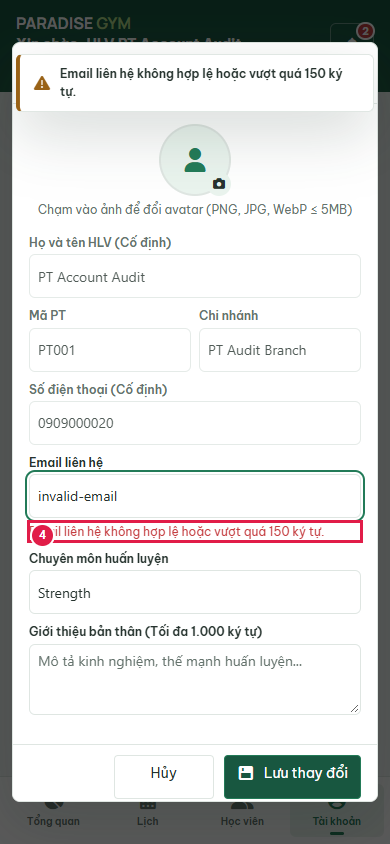

### Step 5

- Action/Input: Enter pt.audit.updated@example.com
- Expected Result: PT04-US02 Main Flow 3: editable field retains input
- Actual Result: pt.audit.updated@example.com
- Status: **PASS**

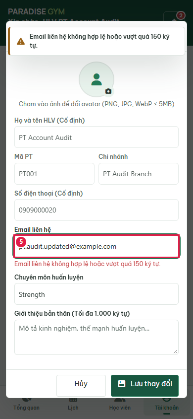

### Step 6

- Action/Input: Enter Strength, Mobility
- Expected Result: PT04-US02 Main Flow 3: editable field retains input
- Actual Result: Strength, Mobility
- Status: **PASS**

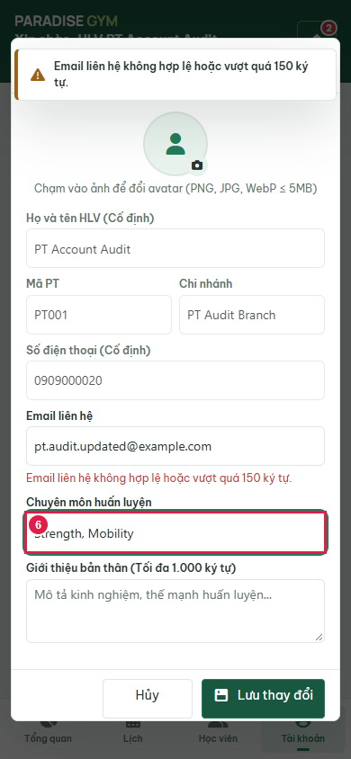

### Step 7

- Action/Input: Enter Isolated PT account audit biography.
- Expected Result: PT04-US02 Main Flow 3: editable field retains input
- Actual Result: Isolated PT account audit biography.
- Status: **PASS**

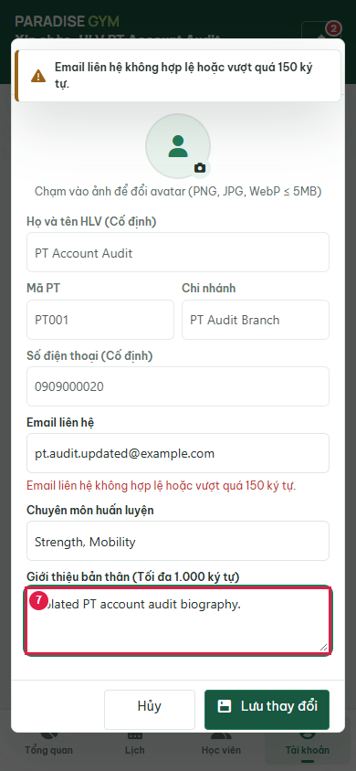

### Step 8

- Action/Input: Save valid profile
- Expected Result: PT04-US02 Main Flow 6-7: persisted profile and editor closed
- Actual Result: pt.audit.updated@example.com
- Status: **PASS**

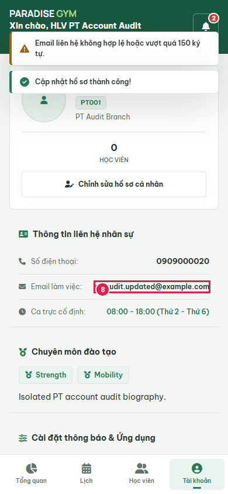

### Step 9

- Action/Input: Reload and open account
- Expected Result: Saved email survives reload
- Actual Result: pt.audit.updated@example.com
- Status: **PASS**

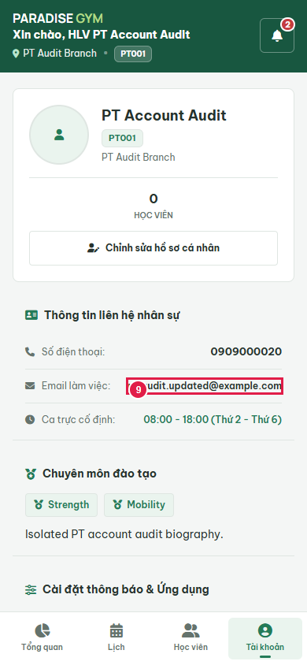

### Step 10

- Action/Input: Open avatar editor
- Expected Result: PT04-US02 editable avatar picker visible
- Actual Result: Avatar picker visible
- Status: **PASS**

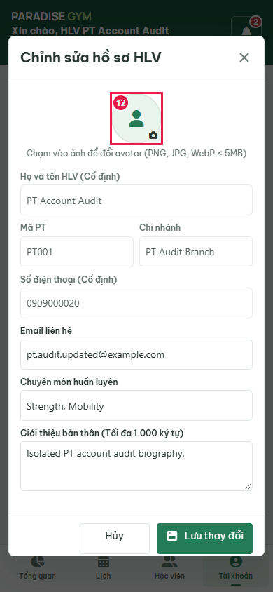

### Step 11

- Action/Input: Choose invalid-type.txt (12 bytes)
- Expected Result: PT04-US02 EF-01: visible rejection; no upload or pending file
- Actual Result: Ảnh đại diện phải thuộc định dạng PNG, JPEG hoặc WebP.
- Status: **PASS**

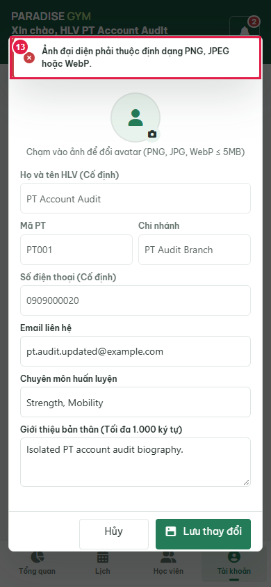

### Step 12

- Action/Input: Choose oversize.png (5242881 bytes)
- Expected Result: PT04-US02 EF-01: visible rejection; no upload or pending file
- Actual Result: Ảnh đại diện phải có dung lượng tối đa 5MB.
- Status: **PASS**

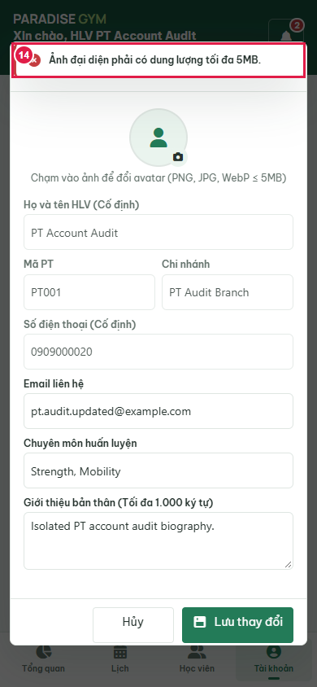

### Step 13

- Action/Input: Choose valid PNG before Save
- Expected Result: PT04-US02: selected bitmap renders in preview before submit
- Actual Result: PNG preview naturalWidth=72
- Status: **PASS**

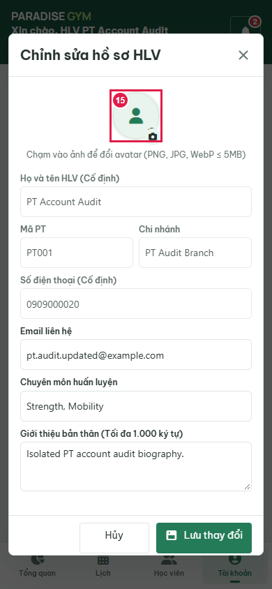

### Step 14

- Action/Input: Save avatar via production upload API
- Expected Result: PT04-US02: persisted avatar renders from isolated local storage
- Actual Result: Rendered image naturalWidth=72; stored bytes and account URL match
- Status: **PASS**

### Step 15

- Action/Input: Reload PT avatar
- Expected Result: Saved bitmap survives reload
- Actual Result: Same stored URL renders after reload
- Status: **PASS**

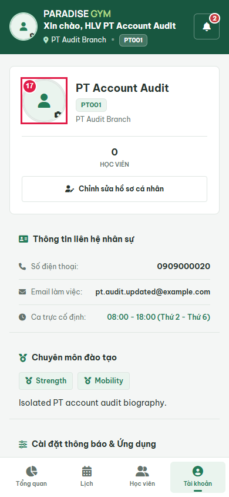

## State Verification

{"email":"pt.audit.updated@example.com","specialties":"Strength, Mobility","bio":"Isolated PT account audit biography."}

Cleanup verified: {"databaseDropped":true,"serverClosed":true,"browserClosed":true,"errors":[],"ownedUiServerClosed":true,"avatarDirectoryRemoved":true}

## Cross-Role / Downstream Verification

### Step 1

- Action/Input: Read-only QTV trainer list, same PT
- Expected Result: Updated email belongs to same PT phone and code
- Actual Result: Mã PT	
Họ và tên	
Số điện thoại	
Email	
Chi nhánh phục vụ	
Chuyên môn / Ghi chú	
Trạng thái	Thao tác
PT001	
AA
PT Account Audit
	0909000020	pt.audit.updated@example.com	PT Audit Branch	Strength, Mobility	Đang hoạt động	   
102050
Trang 1 của 1 (1 mục)1
- Status: **PASS**

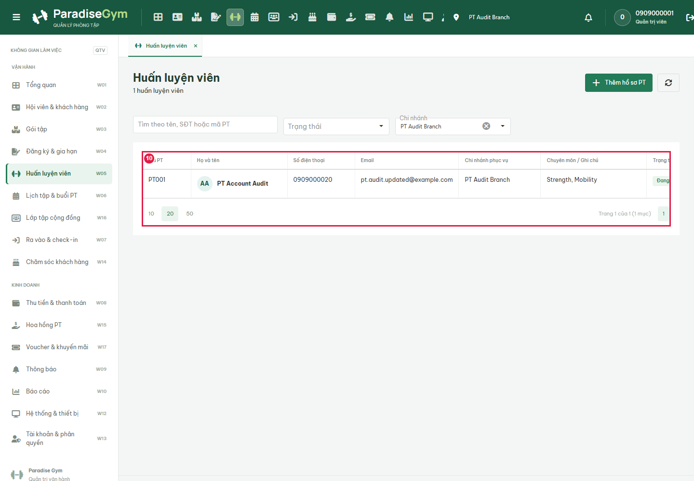

### Step 2

- Action/Input: Open same PT read-only detail
- Expected Result: PT04-US02 persisted contact and specialty visible on Web
- Actual Result: AA
PT Account Audit
Đang hoạt động
Chưa có ảnh chân dung
Họ và tên:
PT Account Audit
Mã PT:
PT001
Số điện thoại:
0909000020
Email:
pt.audit.updated@example.com
Chi nhánh phục vụ:
PT Audit Branch
Trạng thái:
Đang hoạt động
Chuyên môn / Ghi chú:
Strength, Mobility
- Status: **PASS**

### Step 3

- Action/Input: Open same PT detail on Web
- Expected Result: Same PT phone and uploaded avatar rendered downstream
- Actual Result: Same PT 3f0589ed-a556-43a8-952c-0c3da2107f42; same avatar URL and decoded image
- Status: **PASS**

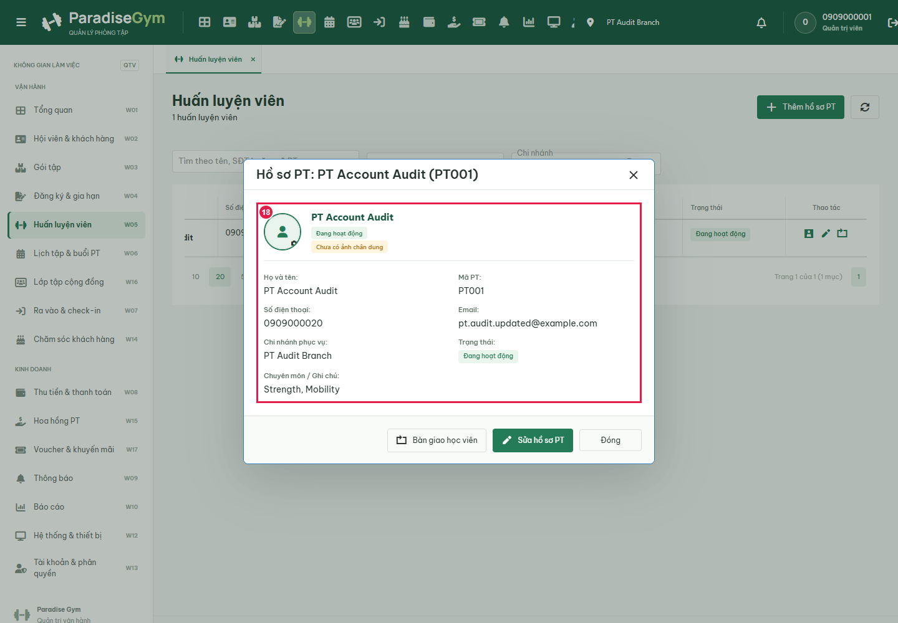

## Issues Found

No failures in executed scope.

## Final Result

**PASS**. 15 source steps, 3 downstream screenshots. Not full US certification: all operational notification event types, PT05 activation and login/2FA UI flows are outside this requested audit. Source files were not edited.

Avatar scope: real local storage upload only; no external cloud uploads. Cloud deployment/provider delivery remains unverified. OTP activation and password login used for fixture setup do not certify PT05 UI flows.
