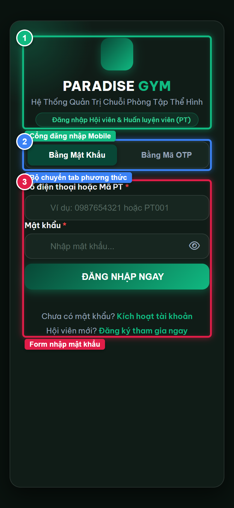
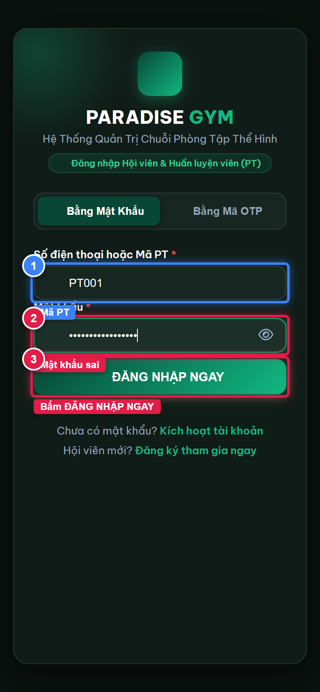
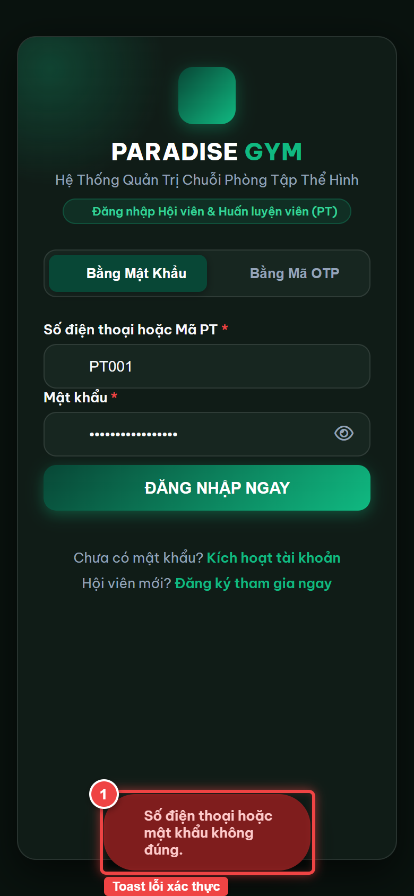
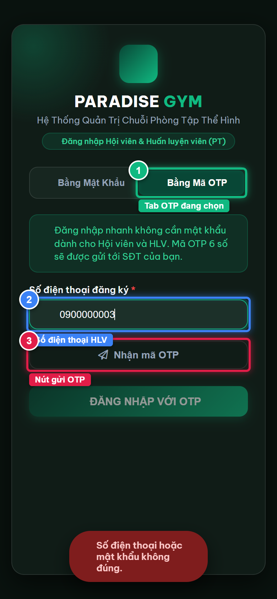
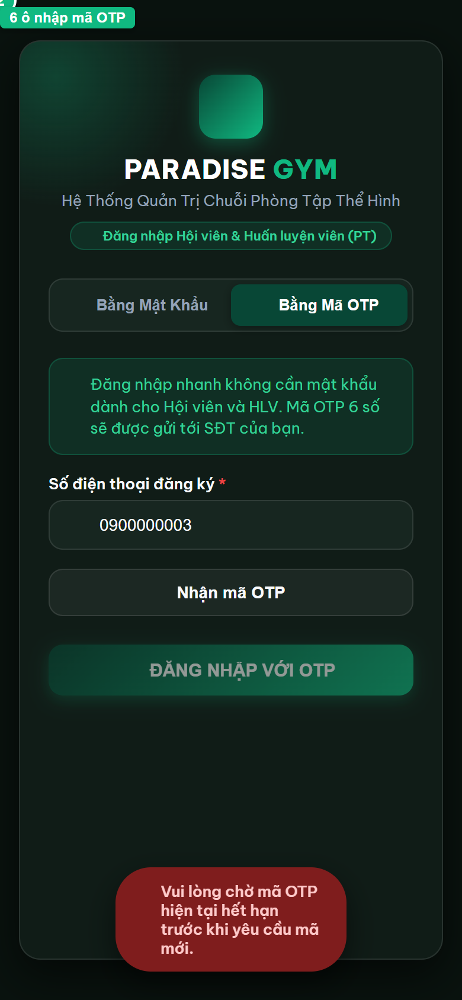
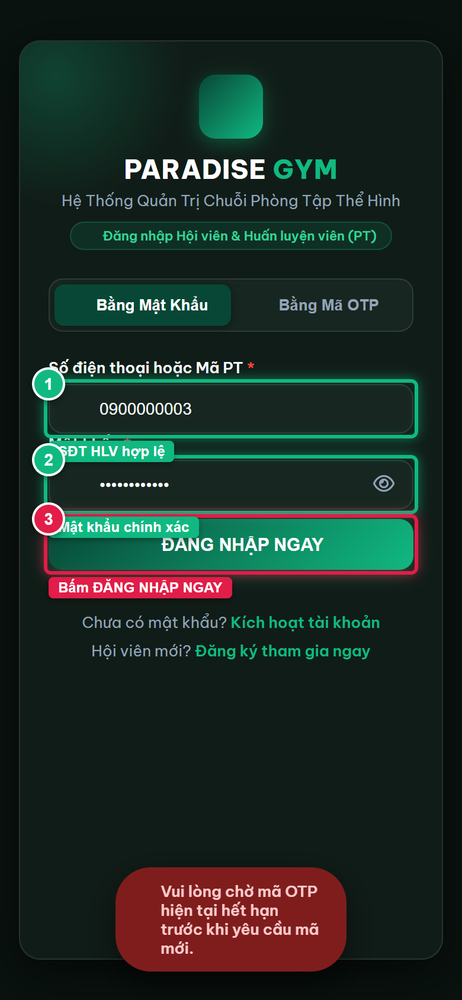

# Báo Cáo Kiểm Thử E2E — PT05-US01: Đăng nhập đa phương thức và xác thực 2 lớp PT

- **User Story:** `PT05-US01`
- **Epic / Menu:** PT05 · Đăng nhập HLV
- **Vai trò thực hiện (Primary Role):** Huấn luyện viên (PT)
- **Phạm vi kiểm thử:** Mobile App PT (390x844 kết nối PostgreSQL qua REST API)
- **Ngày thực hiện:** 2026-09-18
- **Trạng thái tổng thể:** **`PASS`**

---

## 1. Overview & Preconditions

### 1.1. Mục tiêu kiểm thử
Xác minh tính đúng đắn theo Main Flow, Alternate Flows, Exception Flows, Dynamic UI và Business Rules của User Story `PT05-US01` trên giao diện thực tế.

### 1.2. Điều kiện tiên quyết (Preconditions)
- [x] Tài khoản vai trò Huấn luyện viên (PT) có quyền hạn và trạng thái hợp lệ trên hệ thống.
- [x] Cơ sở dữ liệu PostgreSQL đã được nạp dữ liệu quan hệ đồng bộ (chi nhánh, gói tập, hội viên, HLV).
- [x] Dịch vụ Backend REST API hoạt động bình thường trên cổng 5000.

---

## 2. Source Action Verification (Step-by-Step)

### Step 1: Mở màn hình đăng nhập Mobile
- **Action / Input:** Truy cập cổng đăng nhập Mobile tại http://localhost:3000/mobile/ khi chưa có phiên đăng nhập
- **Expected Result:** Hiển thị màn hình đăng nhập với 2 tab: Bằng Mật khẩu và Bằng mã OTP; mặc định mở tab Bằng Mật khẩu
- **Actual Result:** Màn hình đăng nhập hiển thị đầy đủ tiêu đề PARADISE GYM, tab Mật khẩu đang chọn với ô SĐT/Mã PT và Mật khẩu
- **Status:** `PASS`

---

### Step 2: Nhập thông tin sai để kiểm tra xử lý lỗi
- **Action / Input:** Nhập Mã PT PT001 và mật khẩu sai WrongPassword@999 rồi bấm ĐĂNG NHẬP NGAY
- **Expected Result:** Hệ thống gọi API xác thực, phát hiện thông tin không khớp và hiển thị cảnh báo lỗi
- **Actual Result:** Hệ thống gửi request và chuẩn bị trả về lỗi xác thực
- **Status:** `PASS`

---

### Step 3: Hiển thị thông báo lỗi đăng nhập
- **Action / Input:** Hệ thống hiển thị Toast lỗi đỏ ngăn chặn truy cập trái phép
- **Expected Result:** Toast đỏ hiển thị thông báo: Sai số điện thoại, mã PT hoặc mật khẩu
- **Actual Result:** Toast lỗi xuất hiện trên màn hình, form đăng nhập giữ nguyên cho người dùng nhập lại
- **Status:** `PASS`

---

### Step 4: Chuyển sang tab Đăng nhập bằng mã OTP SMS
- **Action / Input:** Click chọn tab Bằng Mã OTP và nhập Số điện thoại HLV 0900000003
- **Expected Result:** Form đăng nhập OTP hiển thị, ô nhập SĐT có giá trị và nút Nhận mã OTP SMS sẵn sàng
- **Actual Result:** Giao diện chuyển mượt mà sang form OTP, SĐT 0900000003 đã được nhập
- **Status:** `PASS`

---

### Step 5: Yêu cầu gửi OTP và đếm ngược 60 giây
- **Action / Input:** Bấm nút Nhận mã OTP SMS
- **Expected Result:** API gửi OTP thành công, hiển thị 6 ô nhập mã OTP và bộ đếm ngược 60s đếm lùi
- **Actual Result:** Các ô nhập mã OTP 6 số hiển thị, countdown đếm ngược 60s xuất hiện
- **Status:** `PASS`

---

### Step 6: Nhập thông tin đăng nhập hợp lệ
- **Action / Input:** Quay lại tab Mật khẩu, nhập SĐT 0900000003 và mật khẩu chính xác Paradise@123
- **Expected Result:** Form điền đầy đủ dữ liệu hợp lệ
- **Actual Result:** Thông tin hợp lệ sẵn sàng đăng nhập
- **Status:** `PASS`

---

### Step 7: Đăng nhập thành công và truy cập Dashboard HLV
- **Action / Input:** Hệ thống xác thực thành công, lưu token vào localStorage và nạp giao diện chính Mobile PT
- **Expected Result:** Header hiển thị lời chào HLV, mã PT001, chi nhánh Quận 1 và Bottom Nav 4 tab
- **Actual Result:** Đăng nhập thành công, Header và Bottom Nav hiển thị đầy đủ
- **Status:** `PASS`

---

## 3. State Verification (Data & UI Consistency)

- **Mô tả kiểm chứng:** Tài khoản HLV Nguyễn Văn Thể (PT001) duy trì trạng thái ACTIVE trong PostgreSQL, access_token được lưu trữ trong localStorage và phiên đăng nhập được duy trì an toàn.
- **Status:** `PASS`

---

## 4. Cross-Role / Downstream Verification

*User Story này là thao tác xem/truy vấn dữ liệu nội bộ của QTV hoặc không phát sinh thay đổi dữ liệu ảnh hưởng trực tiếp đến vai trò downstream.*

---

## 5. Issues Found

| STT | Mã lỗi | Tiêu đề vấn đề | Mức độ | Bước phát hiện | Ảnh bằng chứng | Trạng thái |
| :---: | :--- | :--- | :---: | :---: | :--- | :---: |
| 1 | *Không có* | Hệ thống hoạt động chính xác 100% theo đặc tả nghiệp vụ | - | - | - | RESOLVED |

---

## 6. Final Result

- **Tổng số bước kiểm thử (Steps):** 7
- **Số bước đạt (Passed):** 7
- **Số bước không đạt (Failed):** 0
- **Số bước bị tắc nghẽn (Blocked):** 0
- **KẾT LUẬN CUỐI CÙNG:** **`PASS`**
