# PT05-US01 - Actual auth UI business E2E

Result: **FAIL**. Run: 2026-09-20T17:28:34.627Z.

Sources: current docs/user-stories/pt/PT05-Dang nhap/PT05-US01 (Main Flow, input fields, AF-04); docs/product-spec.md PT navigation/integration rules.

Database: paradise_auth_test_10352_1789925281688; UI: http://127.0.0.1:52551; isolated API: http://127.0.0.1:52550/api/v1. Real API/SQL fixtures; browser auth performed through actual forms, with no injected PT tokens or mocked responses. All migrations applied; manifest in results.json. Development OTP only; **no production SMS delivery tested or claimed**. Separate ephemeral static server serves this checkout without touching the shared server.

## Source Action Verification

### Enter login-pt-code

Expected: US input field retains entered value before submission

Actual: PT001

Status: **PASS**

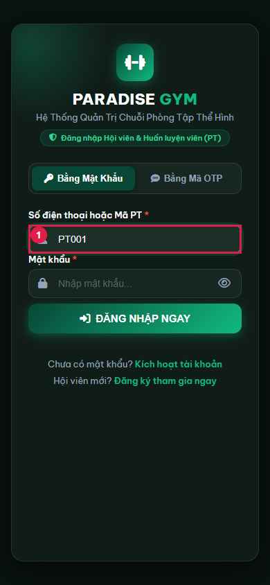

### Enter invalid-password

Expected: US input field retains entered value before submission

Actual: Password input filled (value not logged)

Status: **PASS**

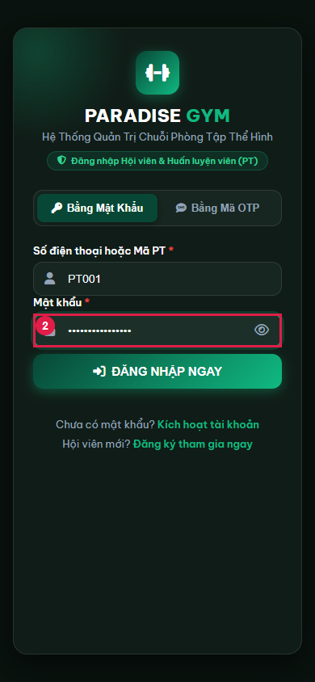

### Reject invalid-password

Expected: PT05 AF-04: invalid credential shows error, no session, retry remains available

Actual: {"status":401,"code":"INVALID_CREDENTIALS","message":"Số điện thoại hoặc mật khẩu không đúng.","failedAttempts":1,"sessionAbsent":true}

Status: **PASS**

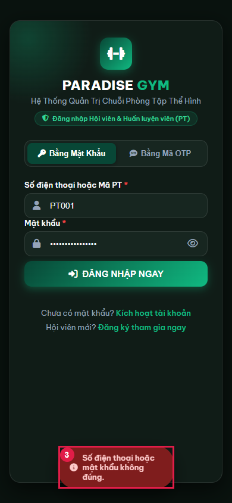

### Enter valid-password

Expected: US input field retains entered value before submission

Actual: Password input filled (value not logged)

Status: **PASS**

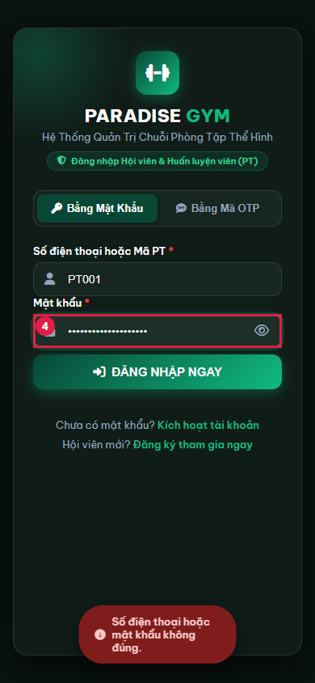

### Switch to OTP login

Expected: US01 Trigger fields: phone visible, password hidden; OTP boxes hidden until request

Actual: OTP mode conditional fields correct

Status: **PASS**

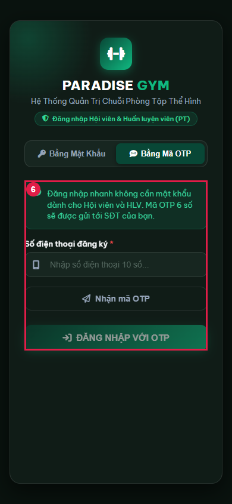

### Enter otp-login-phone

Expected: US input field retains entered value before submission

Actual: 0909210020

Status: **PASS**

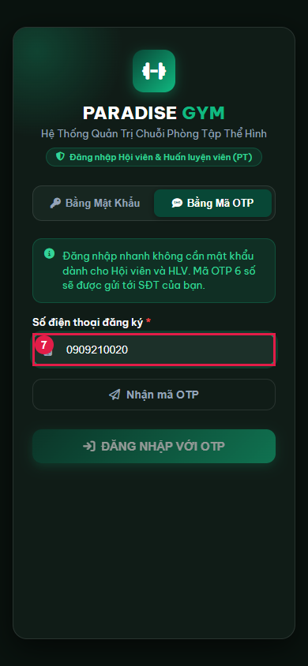

### Request login OTP

Expected: US01: real development challenge, 60-second TTL and six input boxes

Actual: {"delivery":"DEVELOPMENT_ONLY","ttl":60}

Status: **PASS**

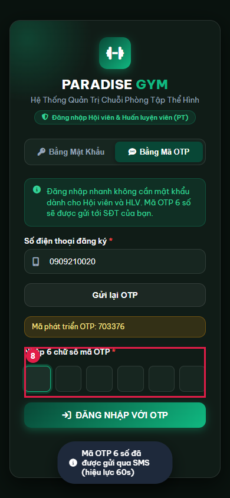

### Enter invalid-login-otp

Expected: Six OTP digits entered before submit

Actual: Six test OTP digits entered; value excluded from JSON

Status: **PASS**

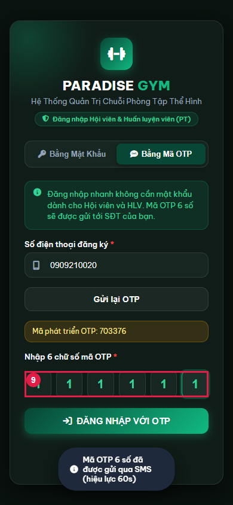

### Reject invalid-login-otp

Expected: PT05 AF-04: invalid credential shows error, no session, retry remains available

Actual: {"status":400,"code":"OTP_INVALID","message":"Mã OTP không đúng hoặc đã hết hạn.","failedAttempts":1,"sessionAbsent":true}

Status: **PASS**

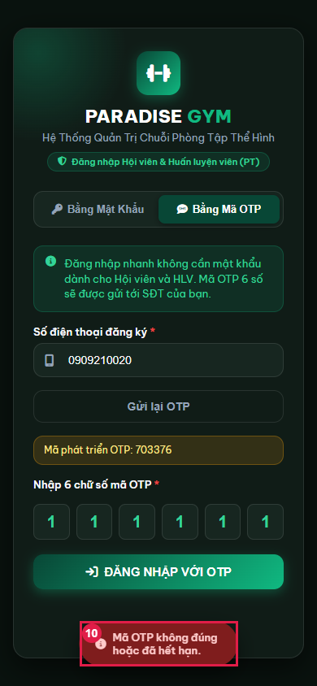

### Enter valid-login-otp

Expected: Six OTP digits entered before submit

Actual: Six test OTP digits entered; value excluded from JSON

Status: **PASS**

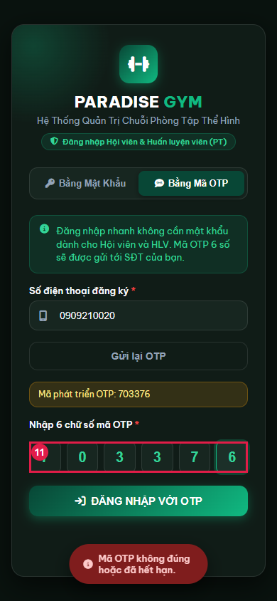

### Enter 2fa-pt-code

Expected: US input field retains entered value before submission

Actual: PT001

Status: **PASS**

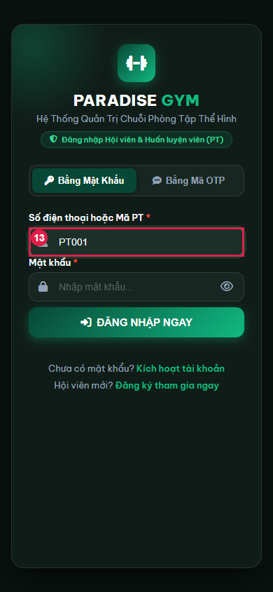

### Enter 2fa-password

Expected: US input field retains entered value before submission

Actual: Password input filled (value not logged)

Status: **PASS**

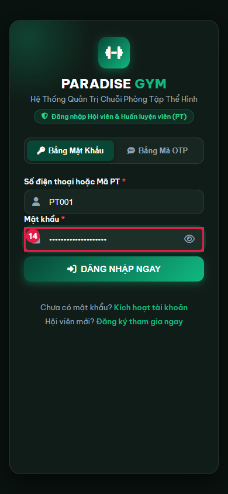

### Submit valid password with 2FA enabled

Expected: US01 Main Flow 5: challenge shown; no full session before second factor

Actual: {"requires2fa":true,"delivery":"DEVELOPMENT_ONLY","ttl":60,"maskedPhone":"090****020","sessionAbsent":true}

Status: **PASS**

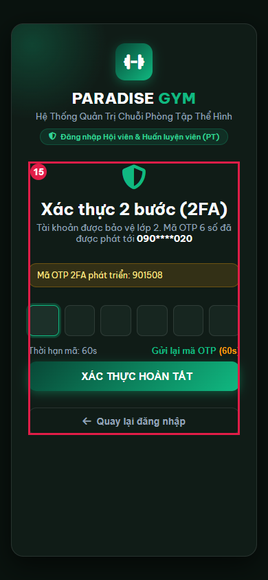

### Enter invalid-2fa-otp

Expected: Six OTP digits entered before submit

Actual: Six test OTP digits entered; value excluded from JSON

Status: **PASS**

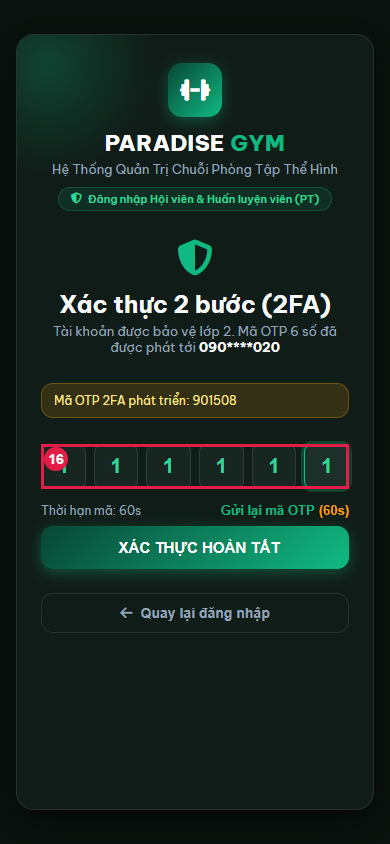

### Reject invalid-2fa-otp

Expected: PT05 AF-04: invalid credential shows error, no session, retry remains available

Actual: {"status":400,"code":"OTP_INVALID","message":"Mã OTP không đúng hoặc đã hết hạn.","failedAttempts":1,"sessionAbsent":true}

Status: **PASS**

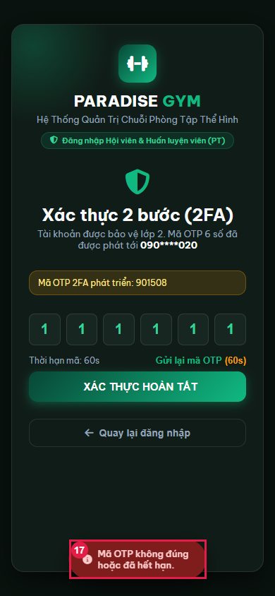

### Enter valid-2fa-otp

Expected: Six OTP digits entered before submit

Actual: Six test OTP digits entered; value excluded from JSON

Status: **PASS**

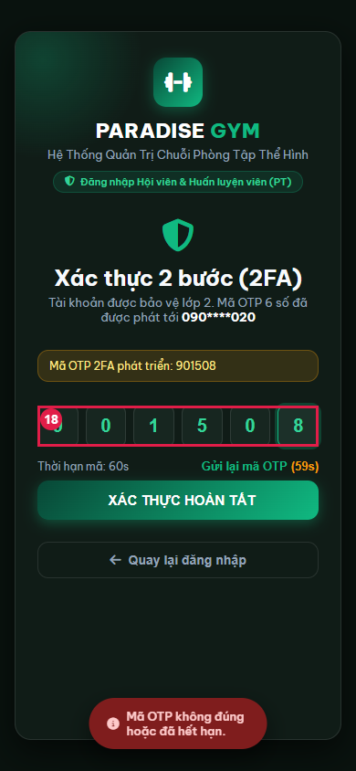

## State Verification

- **PASS** password-login real session: {"accountId":"9ae7d350-414f-4cdc-979b-4cacbdf805f8","trainerId":"3f8eb291-c106-483a-a1e8-d39c1a629b6e","httpStatus":200}
- **PASS** otp-login real session: {"accountId":"9ae7d350-414f-4cdc-979b-4cacbdf805f8","trainerId":"3f8eb291-c106-483a-a1e8-d39c1a629b6e","httpStatus":200}
- **PASS** 2FA prerequisite: "Enabled on the same activated account in disposable DB only; no existing sessions injected into new browser context."
- **PASS** 2fa-login real session: {"accountId":"9ae7d350-414f-4cdc-979b-4cacbdf805f8","trainerId":"3f8eb291-c106-483a-a1e8-d39c1a629b6e","httpStatus":200}

## Cross-Role / Downstream Verification

### password-login: authenticated PT destination

Expected: PT05 Main Flow: valid session for same trainer opens PT06 overview

Actual: Authenticated correctly but landed on schedule; US requires PT06 overview
+ actual - expected

+ 'schedule'
- 'overview'

Status: **FAIL**

### otp-login: authenticated PT destination

Expected: PT05 Main Flow: valid session for same trainer opens PT06 overview

Actual: Authenticated correctly but landed on schedule; US requires PT06 overview
+ actual - expected

+ 'schedule'
- 'overview'

Status: **FAIL**

### 2fa-login: authenticated PT destination

Expected: PT05 Main Flow: valid session for same trainer opens PT06 overview

Actual: Authenticated correctly but landed on schedule; US requires PT06 overview
+ actual - expected

+ 'schedule'
- 'overview'

Status: **FAIL**

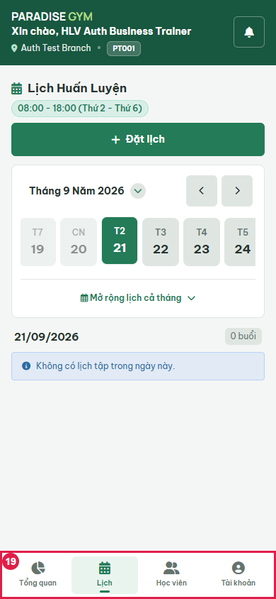

Auth affects this same PT account; destination UI and real session identity checked. No member or financial entity is changed.

## Issues Found

- password-login: authenticated PT destination: Authenticated correctly but landed on schedule; US requires PT06 overview
+ actual - expected

+ 'schedule'
- 'overview'

- otp-login: authenticated PT destination: Authenticated correctly but landed on schedule; US requires PT06 overview
+ actual - expected

+ 'schedule'
- 'overview'

- 2fa-login: authenticated PT destination: Authenticated correctly but landed on schedule; US requires PT06 overview
+ actual - expected

+ 'schedule'
- 'overview'

## Final Result

**FAIL**; 16/19 recorded steps passed. Blocked scenarios: none.

Scope excludes production SMS, provider delivery, trusted-device detection, full resend-limit/expiry/5-attempt lockout coverage. No source fixes.

Cleanup: {"browserClosed":true,"serverClosed":true,"uiClosed":true,"databaseDropped":true,"errors":[]}

Prior evidence: none.
