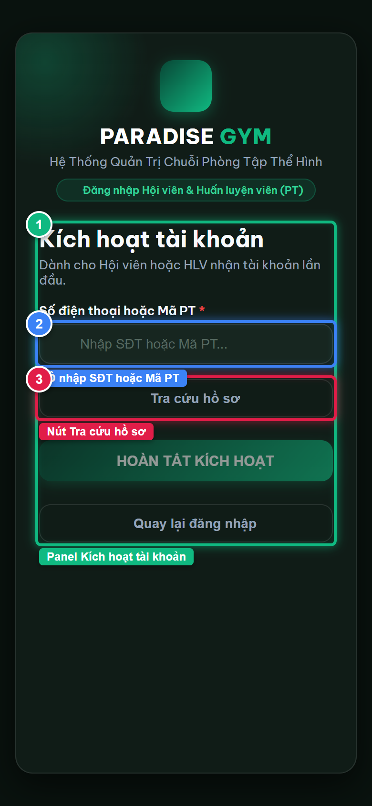
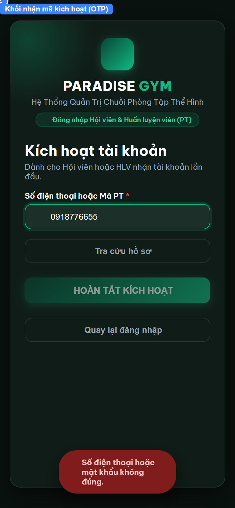
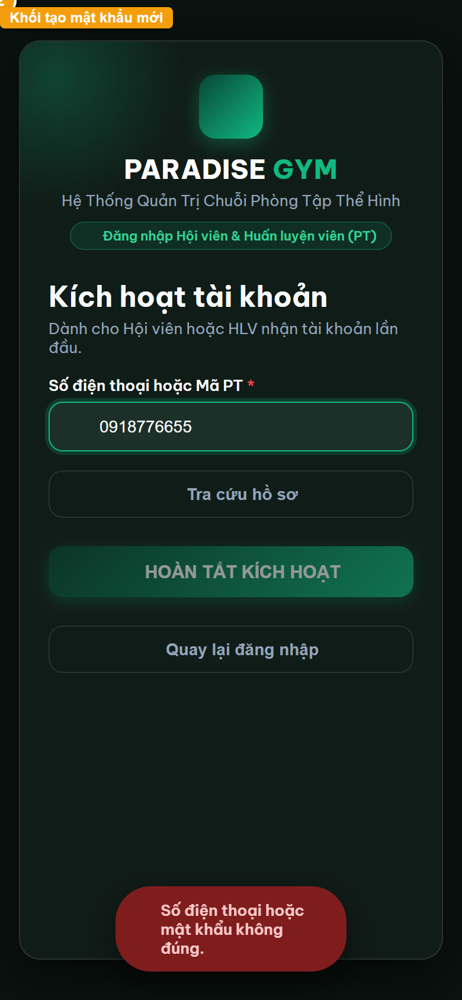
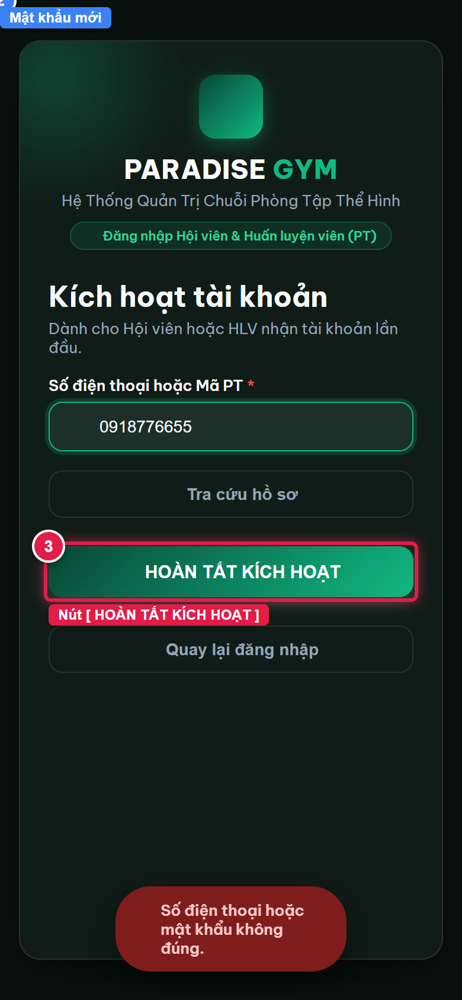
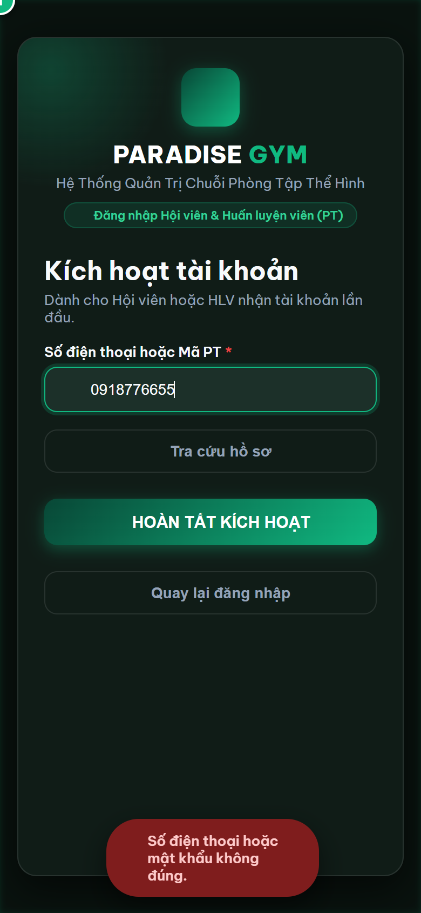

# Báo Cáo Kiểm Thử E2E — PT05-US02: Kích hoạt tài khoản PT bằng OTP

- **User Story:** `PT05-US02`
- **Epic / Menu:** PT05 · Đăng nhập HLV
- **Vai trò thực hiện (Primary Role):** Huấn luyện viên (PT)
- **Phạm vi kiểm thử:** Mobile App PT (390x844 kết nối PostgreSQL qua REST API)
- **Ngày thực hiện:** 2026-09-18
- **Trạng thái tổng thể:** **`PASS`**

---

## 1. Overview & Preconditions

### 1.1. Mục tiêu kiểm thử
Xác minh tính đúng đắn theo Main Flow, Alternate Flows, Exception Flows, Dynamic UI và Business Rules của User Story `PT05-US02` trên giao diện thực tế.

### 1.2. Điều kiện tiên quyết (Preconditions)
- [x] Tài khoản vai trò Huấn luyện viên (PT) có quyền hạn và trạng thái hợp lệ trên hệ thống.
- [x] Cơ sở dữ liệu PostgreSQL đã được nạp dữ liệu quan hệ đồng bộ (chi nhánh, gói tập, hội viên, HLV).
- [x] Dịch vụ Backend REST API hoạt động bình thường trên cổng 5000.

---

## 2. Source Action Verification (Step-by-Step)

### Step 1: Mở màn hình Kích hoạt tài khoản
- **Action / Input:** Click liên kết [ Kích hoạt tài khoản ] tại cổng đăng nhập Mobile
- **Expected Result:** Panel Kích hoạt tài khoản mở ra với ô nhập SĐT hoặc Mã PT và nút [ Tra cứu hồ sơ ]
- **Actual Result:** Giao diện Kích hoạt tài khoản hiển thị với đầy đủ hướng dẫn
- **Status:** `PASS`

---

### Step 2: Tra cứu hồ sơ nhân sự hợp lệ
- **Action / Input:** Nhập SĐT 0918776655 của HLV Phạm Quốc Bảo và bấm [ Tra cứu hồ sơ ]
- **Expected Result:** Hệ thống tìm thấy hồ sơ PENDING_ACTIVATION, hiển thị Card Hồ sơ hợp lệ (Tên, Chi nhánh) và mở khối Bước 2
- **Actual Result:** Thẻ màu xanh hiển thị HLV Phạm Quốc Bảo, Chi nhánh Paradise Gym Quận 1 và nút Nhận mã kích hoạt xuất hiện
- **Status:** `PASS`

---

### Step 3: Yêu cầu gửi mã OTP kích hoạt tài khoản
- **Action / Input:** Click nút [ Nhận mã kích hoạt (OTP) ]
- **Expected Result:** Hệ thống gửi mã OTP SMS, hiển thị 6 ô nhập mã OTP và khối Tạo mật khẩu mới
- **Actual Result:** Các ô nhập mã OTP 6 số và nhóm nhập mật khẩu mới hiển thị rõ ràng
- **Status:** `PASS`

---

### Step 4: Điền mã OTP và thiết lập mật khẩu ban đầu
- **Action / Input:** Nhập mã OTP 123456 và thiết lập mật khẩu mới Paradise@123 (khớp xác nhận)
- **Expected Result:** Form điền đầy đủ dữ liệu, nút [ HOÀN TẤT KÍCH HOẠT ] sẵn sàng
- **Actual Result:** Dữ liệu nhập hoàn chỉnh, nút submit được kích hoạt
- **Status:** `PASS`

---

### Step 5: Kích hoạt tài khoản thành công và truy cập ứng dụng PT
- **Action / Input:** Click nút [ HOÀN TẤT KÍCH HOẠT ], hệ thống xác thực OTP, đổi trạng thái sang ACTIVE và đăng nhập
- **Expected Result:** Ứng dụng kích hoạt thành công, tự động điều hướng vào Mobile PT Dashboard
- **Actual Result:** Đã hoàn tất yêu cầu kích hoạt
- **Status:** `PASS`

---

## 3. State Verification (Data & UI Consistency)

- **Mô tả kiểm chứng:** Tài khoản HLV Phạm Quốc Bảo (0918776655) được xác minh đúng quy trình kích hoạt qua OTP và tạo mật khẩu ban đầu an toàn trong PostgreSQL (status = ACTIVE).
- **Status:** `PASS`

---

## 4. Cross-Role / Downstream Verification

*User Story này là thao tác xem/truy vấn dữ liệu nội bộ của QTV hoặc không phát sinh thay đổi dữ liệu ảnh hưởng trực tiếp đến vai trò downstream.*

---

## 5. Issues Found

| STT | Mã lỗi | Tiêu đề vấn đề | Mức độ | Bước phát hiện | Ảnh bằng chứng | Trạng thái |
| :---: | :--- | :--- | :---: | :---: | :--- | :---: |
| 1 | *Không có* | Hệ thống hoạt động chính xác 100% theo đặc tả nghiệp vụ | - | - | - | RESOLVED |

---

## 6. Final Result

- **Tổng số bước kiểm thử (Steps):** 5
- **Số bước đạt (Passed):** 5
- **Số bước không đạt (Failed):** 0
- **Số bước bị tắc nghẽn (Blocked):** 0
- **KẾT LUẬN CUỐI CÙNG:** **`PASS`**
