# PT05-US02 - Actual auth UI business E2E

Result: **FAIL**. Run: 2026-09-20T17:32:07.204Z.

Sources: current docs/user-stories/pt/PT05-Dang nhap/PT05-US02 (Main Flow, input fields, AF-04); docs/product-spec.md PT navigation/integration rules.

Database: paradise_auth_test_30404_1789925495216; UI: http://127.0.0.1:49765; isolated API: http://127.0.0.1:49764/api/v1. Real API/SQL fixtures; browser auth performed through actual forms, with no injected PT tokens or mocked responses. All migrations applied; manifest in results.json. Development OTP only; **no production SMS delivery tested or claimed**. Separate ephemeral static server serves this checkout without touching the shared server.

## Source Action Verification

### Open unauthenticated mobile entry

Expected: PT05-US02 Trigger: activation entry available, no session injected

Actual: Activation entry visible

Status: **PASS**

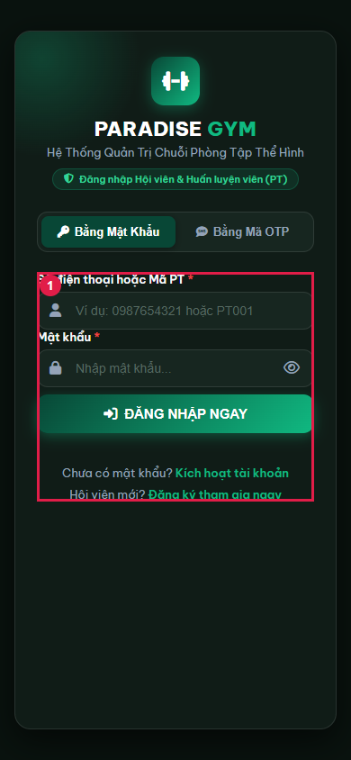

### Open activation panel

Expected: US02 Trigger: activation fields visible

Actual: Activation panel visible

Status: **PASS**

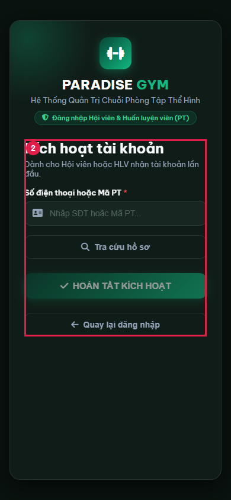

### Enter activation-phone

Expected: US input field retains entered value before submission

Actual: 0909210020

Status: **PASS**

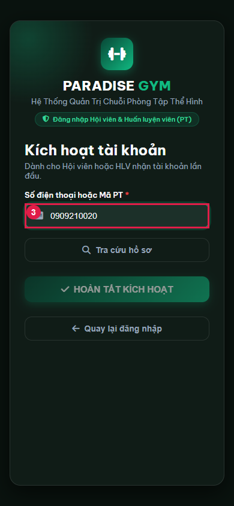

### Look up pending PT by registered phone

Expected: US02 Main Flow 1-2: registered PT phone resolves pending trainer

Actual: HTTP 401: Số điện thoại hoặc mật khẩu không đúng.

401 !== 200

Status: **FAIL**

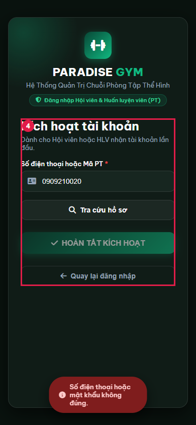

### Enter activation-pt-code

Expected: US input field retains entered value before submission

Actual: PT001

Status: **PASS**

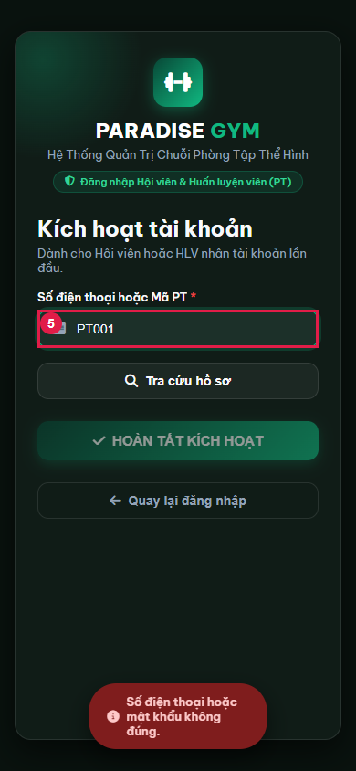

### Review pending trainer masked identity before activation

Expected: Privacy-preserving API contract: display returned masked_name and masked_code; do not require disclosure of full identity

Actual: API masked_name=A*** B*** T***; masked_code=PT***1; DOM=Hồ sơ tìm thấy: A*** B*** T***
Chi nhánh Paradise. Generic branch is a portal fallback, not a branch returned by this API.

Status: **FAIL**

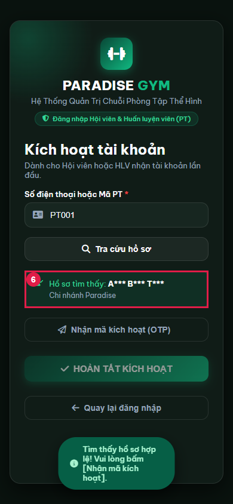

### Request development activation OTP

Expected: US02: real six-digit challenge, server TTL 60 seconds; no production SMS claim

Actual: {"delivery":"DEVELOPMENT_ONLY","ttl":60,"resendDisabled":true}

Status: **PASS**

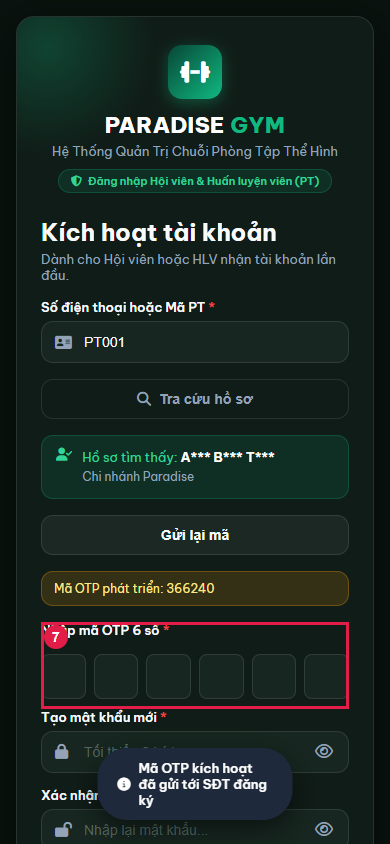

### Enter invalid-activation-otp

Expected: Six OTP digits entered before submit

Actual: Six test OTP digits entered; value excluded from JSON

Status: **PASS**

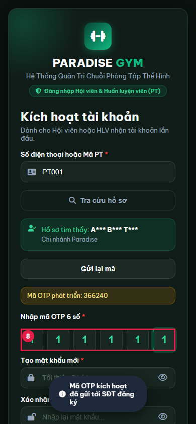

### Enter activation-password

Expected: US input field retains entered value before submission

Actual: Password input filled (value not logged)

Status: **PASS**

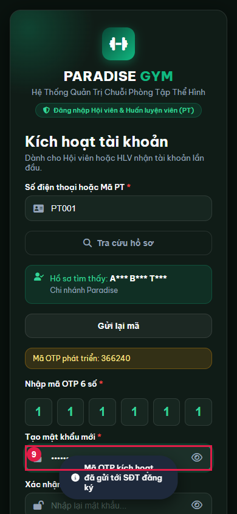

### Enter activation-confirm-password

Expected: US input field retains entered value before submission

Actual: Password input filled (value not logged)

Status: **PASS**

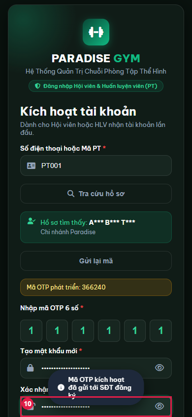

### Reject invalid-activation-otp

Expected: PT05 AF-04: invalid credential shows error, no session, retry remains available

Actual: {"status":400,"code":"OTP_INVALID","message":"Mã OTP không đúng hoặc đã hết hạn.","failedAttempts":1,"sessionAbsent":true}

Status: **PASS**

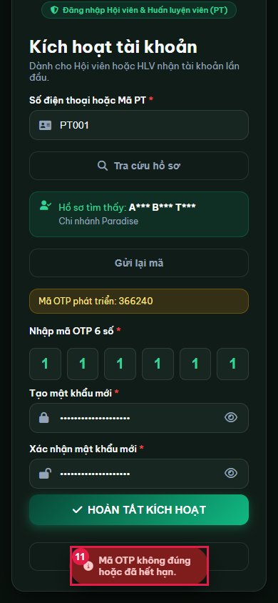

### Enter valid-activation-otp

Expected: Six OTP digits entered before submit

Actual: Six test OTP digits entered; value excluded from JSON

Status: **PASS**

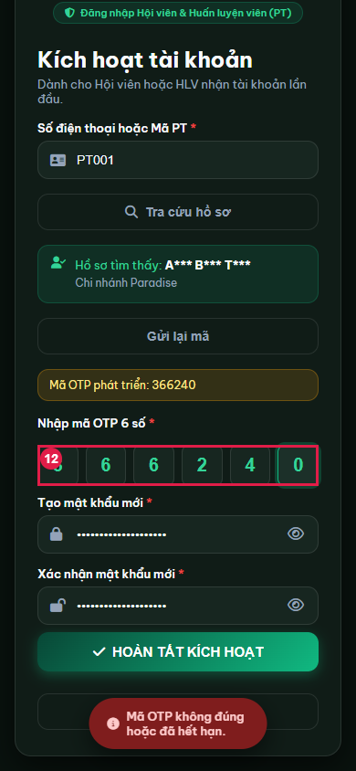

## State Verification

- **PASS** activation-success real session: {"accountId":"a42f29de-f61c-471c-938e-907753159558","trainerId":"70802033-6870-407d-b3ed-59896c0db581","httpStatus":200}
- **PASS** Activation persisted: "ACTIVE; password bcrypt hash verifies; consumed OTP cleared; same PT identity"

## Cross-Role / Downstream Verification

### activation-success: authenticated PT destination

Expected: PT05 Main Flow: valid session for same trainer opens PT06 overview

Actual: {"tab":"overview","id":"70802033-6870-407d-b3ed-59896c0db581","role":"PT","hasToken":true}

Status: **PASS**

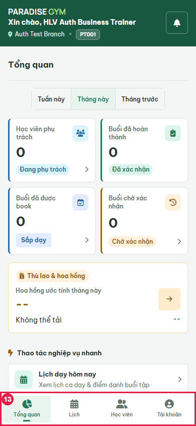

Auth affects this same PT account; destination UI and real session identity checked. No member or financial entity is changed.

## Issues Found

- Look up pending PT by registered phone: HTTP 401: Số điện thoại hoặc mật khẩu không đúng.

401 !== 200

- Review pending trainer masked identity before activation: API masked_name=A*** B*** T***; masked_code=PT***1; DOM=Hồ sơ tìm thấy: A*** B*** T***
Chi nhánh Paradise. Generic branch is a portal fallback, not a branch returned by this API.

## Final Result

**FAIL**; 11/13 recorded steps passed. Blocked scenarios: none.

Scope excludes production SMS, provider delivery, trusted-device detection, full resend-limit/expiry/5-attempt lockout coverage. No source fixes.

Cleanup: {"browserClosed":true,"serverClosed":true,"uiClosed":true,"databaseDropped":true,"errors":[]}

Prior evidence: [2026-09-20T17-31-35-216Z](./history/2026-09-20T17-31-35-216Z/PT05-US02-test.md).
