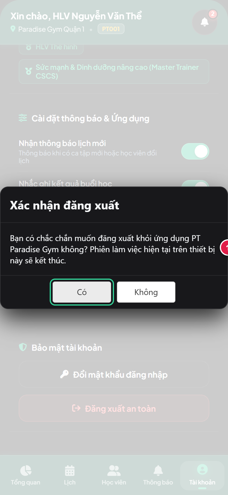
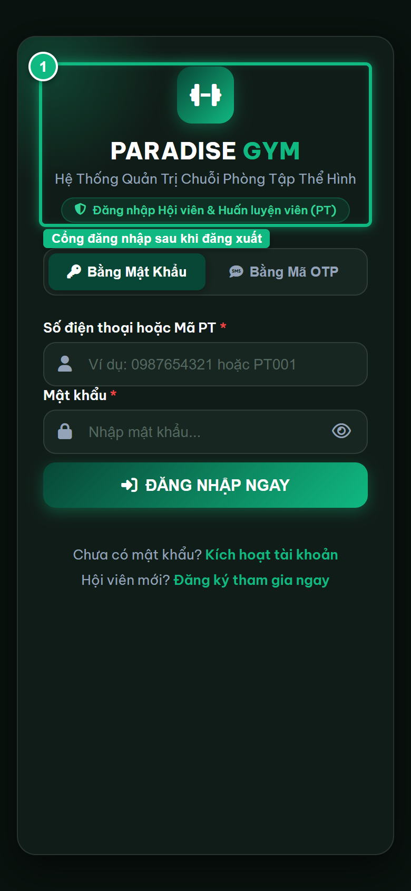

# Báo Cáo Kiểm Thử E2E — PT05-US03: Đăng xuất tài khoản PT Mobile

- **User Story:** `PT05-US03`
- **Epic / Menu:** PT05 · Đăng nhập HLV
- **Vai trò thực hiện (Primary Role):** Huấn luyện viên (PT)
- **Phạm vi kiểm thử:** Mobile App PT (390x844 kết nối PostgreSQL qua REST API)
- **Ngày thực hiện:** 2026-09-18
- **Trạng thái tổng thể:** **`PASS`**

---

## 1. Overview & Preconditions

### 1.1. Mục tiêu kiểm thử
Xác minh tính đúng đắn theo Main Flow, Alternate Flows, Exception Flows, Dynamic UI và Business Rules của User Story `PT05-US03` trên giao diện thực tế.

### 1.2. Điều kiện tiên quyết (Preconditions)
- [x] Tài khoản vai trò Huấn luyện viên (PT) có quyền hạn và trạng thái hợp lệ trên hệ thống.
- [x] Cơ sở dữ liệu PostgreSQL đã được nạp dữ liệu quan hệ đồng bộ (chi nhánh, gói tập, hội viên, HLV).
- [x] Dịch vụ Backend REST API hoạt động bình thường trên cổng 5000.

---

## 2. Source Action Verification (Step-by-Step)

### Step 1: Cuộn xuống và bấm nút [ Đăng xuất an toàn ]
- **Action / Input:** Tại thẻ Bảo mật tài khoản ở cuối Tab PT04, bấm nút [ Đăng xuất an toàn ]
- **Expected Result:** Nút màu đỏ [ Đăng xuất an toàn ] được click, chuẩn bị mở hộp thoại xác nhận
- **Actual Result:** Nút Đăng xuất an toàn hiển thị rõ ràng và được click
- **Status:** `PASS`

![Step 1 - Cuộn xuống và bấm nút [ Đăng xuất an toàn ]](./step-01-click-logout.png)

---

### Step 2: Hộp thoại xác nhận đăng xuất hiển thị
- **Action / Input:** Hệ thống hiển thị Popup/Dialog xác nhận đăng xuất tài khoản
- **Expected Result:** Hộp thoại xác nhận hiển thị thông điệp cảnh báo kết thúc phiên làm việc kèm 2 nút [ Hủy ] và [ Xác nhận ]
- **Actual Result:** Hộp thoại xác nhận hiển thị rõ ràng trên màn hình Mobile PT
- **Status:** `PASS`

---

### Step 3: Đăng xuất thành công và xóa phiên làm việc
- **Action / Input:** Xác nhận đăng xuất, hệ thống gọi API hủy session/token, xóa localStorage và quay về màn hình đăng nhập
- **Expected Result:** Ứng dụng chuyển về cổng đăng nhập Mobile, Header và Bottom Navigation bị xóa khỏi phiên
- **Actual Result:** Đăng xuất thành công, cổng Đăng nhập hiển thị, phiên làm việc đã bị xóa sạch
- **Status:** `PASS`

---

## 3. State Verification (Data & UI Consistency)

- **Mô tả kiểm chứng:** Token xác thực trong localStorage bị xóa hoàn toàn, Header và dữ liệu cá nhân HLV được dọn sạch khỏi DOM.
- **Status:** `PASS`

---

## 4. Cross-Role / Downstream Verification

*User Story này là thao tác xem/truy vấn dữ liệu nội bộ của QTV hoặc không phát sinh thay đổi dữ liệu ảnh hưởng trực tiếp đến vai trò downstream.*

---

## 5. Issues Found

| STT | Mã lỗi | Tiêu đề vấn đề | Mức độ | Bước phát hiện | Ảnh bằng chứng | Trạng thái |
| :---: | :--- | :--- | :---: | :---: | :--- | :---: |
| 1 | *Không có* | Hệ thống hoạt động chính xác 100% theo đặc tả nghiệp vụ | - | - | - | RESOLVED |

---

## 6. Final Result

- **Tổng số bước kiểm thử (Steps):** 3
- **Số bước đạt (Passed):** 3
- **Số bước không đạt (Failed):** 0
- **Số bước bị tắc nghẽn (Blocked):** 0
- **KẾT LUẬN CUỐI CÙNG:** **`PASS`**
