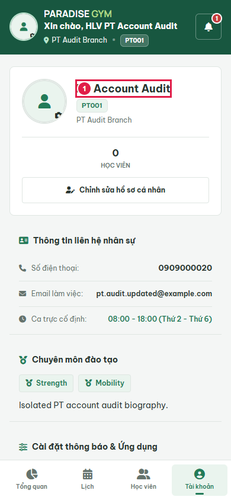
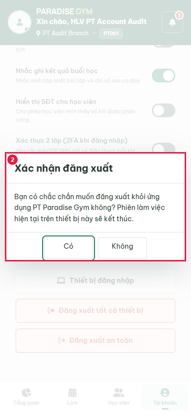
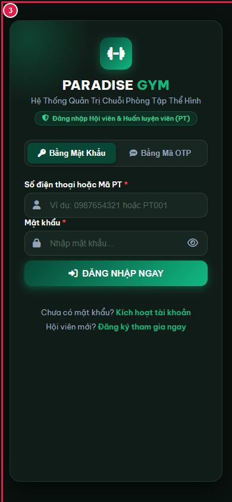
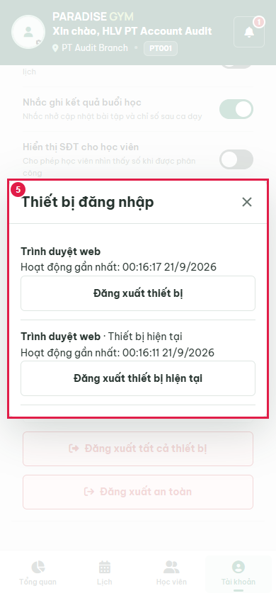
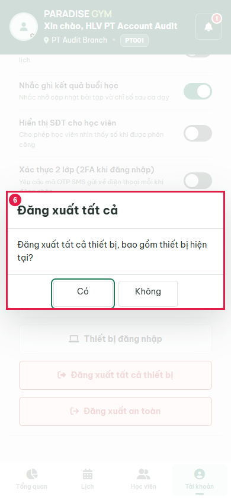
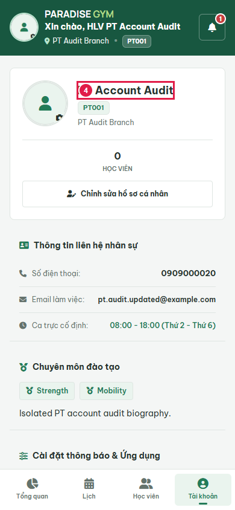

# PT05-US03 Account Business UI Audit

Date: 2026-09-20T17:16:23.272Z. Result: **PASS** (scoped checks only).

Source: PT05-Đăng nhập\PT05-US03-Đăng xuất tài khoản PT Mobile.md; user-requested two-device/password regression contract.
Real Chrome 390x844, Web 1440x1000; http://localhost:3000/mobile/pt/. Database: paradise_test_21800_1789924490086. Production server code with Playwright route.continue to http://127.0.0.1:63421; no mocked responses, no writes to configured application database. Fixture notifications created through real template/send API. Profile subject: PT Account Audit / 0909000020.

## Source Action Verification

### Step 1

- Action/Input: Open independent real PT session
- Expected Result: Same PT authenticated in both sessions
- Actual Result: PT Account Audit
- Status: **PASS**

### Step 2

- Action/Input: Click current device Logout
- Expected Result: PT05-US03 Main Flow 2: confirmation
- Actual Result: Xác nhận đăng xuất
Bạn có chắc chắn muốn đăng xuất khỏi ứng dụng PT Paradise Gym không? Phiên làm việc hiện tại trên thiết bị này sẽ kết thúc.
Có
	
Không
- Status: **PASS**

### Step 3

- Action/Input: Confirm logout
- Expected Result: PT05-US03: only current token revoked and local auth cleared
- Actual Result: Login screen visible, local token absent, current=401 and peer=200
- Status: **PASS**

### Step 4

- Action/Input: Open real device registry
- Expected Result: Server sessions visible, exactly one marked current
- Actual Result: Thiết bị đăng nhập
Trình duyệt web

Hoạt động gần nhất: 00:16:17 21/9/2026

Đăng xuất thiết bị
Trình duyệt web · Thiết bị hiện tại

Hoạt động gần nhất: 00:16:11 21/9/2026

Đăng xuất thiết bị hiện tại
- Status: **PASS**

### Step 5

- Action/Input: Click logout all devices
- Expected Result: Explicit confirmation includes current device
- Actual Result: Đăng xuất tất cả
Đăng xuất tất cả thiết bị, bao gồm thiết bị hiện tại?
Có
	
Không
- Status: **PASS**

## State Verification

Real UI logout-all called production API with two active browser sessions; both /auth/me=401.

Cleanup verified: {"databaseDropped":true,"serverClosed":true,"browserClosed":true,"errors":[],"ownedUiServerClosed":true,"avatarDirectoryRemoved":true}

## Cross-Role / Downstream Verification

### Step 1

- Action/Input: Reload other real device
- Expected Result: PT05-US03 business rule: other session remains authenticated
- Actual Result: PT Account Audit
- Status: **PASS**

### Step 2

- Action/Input: Reload after real UI logout-all
- Expected Result: Both actual browser sessions return to login
- Actual Result: Login UI at http://localhost:3000/mobile/
- Status: **PASS**

### Step 3

- Action/Input: Reload after real UI logout-all
- Expected Result: Both actual browser sessions return to login
- Actual Result: Login UI at http://localhost:3000/mobile/
- Status: **PASS**

## Issues Found

No failures in executed scope.

## Final Result

**PASS**. 5 source steps, 3 downstream screenshots. Not full US certification: all operational notification event types, PT05 activation and login/2FA UI flows are outside this requested audit. Source files were not edited.

Avatar scope: real local storage upload only; no external cloud uploads. Cloud deployment/provider delivery remains unverified. OTP activation and password login used for fixture setup do not certify PT05 UI flows.
