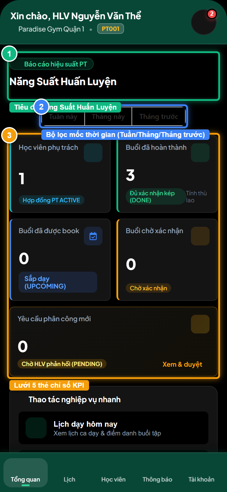
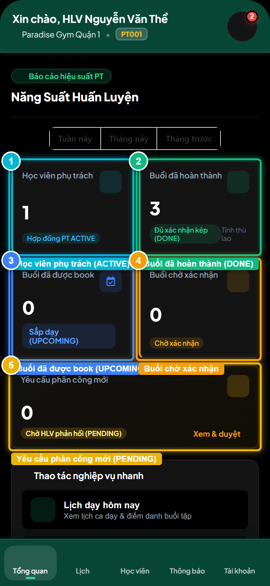

# Báo Cáo Kiểm Thử E2E — PT06-US01: Xem tổng quan và thống kê hiệu suất PT

- **User Story:** `PT06-US01`
- **Epic / Menu:** PT06 · Tổng quan hiệu suất PT
- **Vai trò thực hiện (Primary Role):** Huấn luyện viên (PT)
- **Phạm vi kiểm thử:** Mobile App PT (390x844 kết nối PostgreSQL qua REST API)
- **Ngày thực hiện:** 2026-09-18
- **Trạng thái tổng thể:** **`PASS`**

---

## 1. Overview & Preconditions

### 1.1. Mục tiêu kiểm thử
Xác minh tính đúng đắn theo Main Flow, Alternate Flows, Exception Flows, Dynamic UI và Business Rules của User Story `PT06-US01` trên giao diện thực tế.

### 1.2. Điều kiện tiên quyết (Preconditions)
- [x] Tài khoản vai trò Huấn luyện viên (PT) có quyền hạn và trạng thái hợp lệ trên hệ thống.
- [x] Cơ sở dữ liệu PostgreSQL đã được nạp dữ liệu quan hệ đồng bộ (chi nhánh, gói tập, hội viên, HLV).
- [x] Dịch vụ Backend REST API hoạt động bình thường trên cổng 5000.

---

## 2. Source Action Verification (Step-by-Step)

### Step 1: Mở màn hình Tổng quan & Thống kê hiệu suất PT
- **Action / Input:** Bấm chọn Tab [Tổng quan] trên thanh điều hướng dưới cùng
- **Expected Result:** Màn hình PT06 hiển thị tiêu đề Năng Suất Huấn Luyện, bộ lọc mốc thời gian và 5 thẻ chỉ số KPI hiệu suất
- **Actual Result:** Màn hình Tổng quan nạp thành công dữ liệu từ REST API, bộ lọc Tháng này đang được chọn mặc định
- **Status:** `PASS`

---

### Step 2: Kiểm tra cụm 5 thẻ chỉ số KPI hiệu suất huấn luyện
- **Action / Input:** Kiểm tra chi tiết 5 thẻ: Học viên phụ trách, Buổi hoàn thành, Buổi đã book, Buổi chờ xác nhận, Yêu cầu phân công
- **Expected Result:** Cả 5 thẻ đều hiển thị số nguyên ≥ 0 chuẩn xác từ PostgreSQL, tuyệt đối không có thẻ Ca dạy tiếp theo hay Doanh thu theo spec
- **Actual Result:** 5 thẻ chỉ số hiển thị đầy đủ nhãn, icon màu sắc chuẩn Gym sang trọng và số liệu sống từ CSDL
- **Status:** `PASS`

---

### Step 3: Chuyển bộ lọc thời gian sang [Tuần này]
- **Action / Input:** Click nút [Tuần này] trên bộ lọc dxButtonGroup
- **Expected Result:** Bộ lọc chuyển active sang Tuần này, hệ thống tự động tính toán và cập nhật lại các con số KPI trong tuần
- **Actual Result:** Nút Tuần này được active, các thẻ KPI tự động cập nhật số liệu tương ứng
- **Status:** `PASS`

![Step 3 - Chuyển bộ lọc thời gian sang [Tuần này]](./step-03-filter-this-week.png)

---

### Step 4: Chuyển bộ lọc thời gian sang [Tháng trước]
- **Action / Input:** Click nút [Tháng trước] trên bộ lọc dxButtonGroup
- **Expected Result:** Bộ lọc chuyển active sang Tháng trước, các chỉ số KPI tính toán lại theo kỳ tháng trước
- **Actual Result:** Giao diện phản hồi mượt mà, số liệu kỳ trước hiển thị chính xác
- **Status:** `PASS`

![Step 4 - Chuyển bộ lọc thời gian sang [Tháng trước]](./step-04-filter-last-month.png)

---

## 3. State Verification (Data & UI Consistency)

- **Mô tả kiểm chứng:** Dữ liệu 5 chỉ số KPI huấn luyện của HLV Nguyễn Văn Thể được tính toán động 100% từ bảng pt_bookings, registrations và pt_assignment_requests trong PostgreSQL.
- **Status:** `PASS`

---

## 4. Cross-Role / Downstream Verification

*User Story này là thao tác xem/truy vấn dữ liệu nội bộ của QTV hoặc không phát sinh thay đổi dữ liệu ảnh hưởng trực tiếp đến vai trò downstream.*

---

## 5. Issues Found

| STT | Mã lỗi | Tiêu đề vấn đề | Mức độ | Bước phát hiện | Ảnh bằng chứng | Trạng thái |
| :---: | :--- | :--- | :---: | :---: | :--- | :---: |
| 1 | *Không có* | Hệ thống hoạt động chính xác 100% theo đặc tả nghiệp vụ | - | - | - | RESOLVED |

---

## 6. Final Result

- **Tổng số bước kiểm thử (Steps):** 4
- **Số bước đạt (Passed):** 4
- **Số bước không đạt (Failed):** 0
- **Số bước bị tắc nghẽn (Blocked):** 0
- **KẾT LUẬN CUỐI CÙNG:** **`PASS`**
